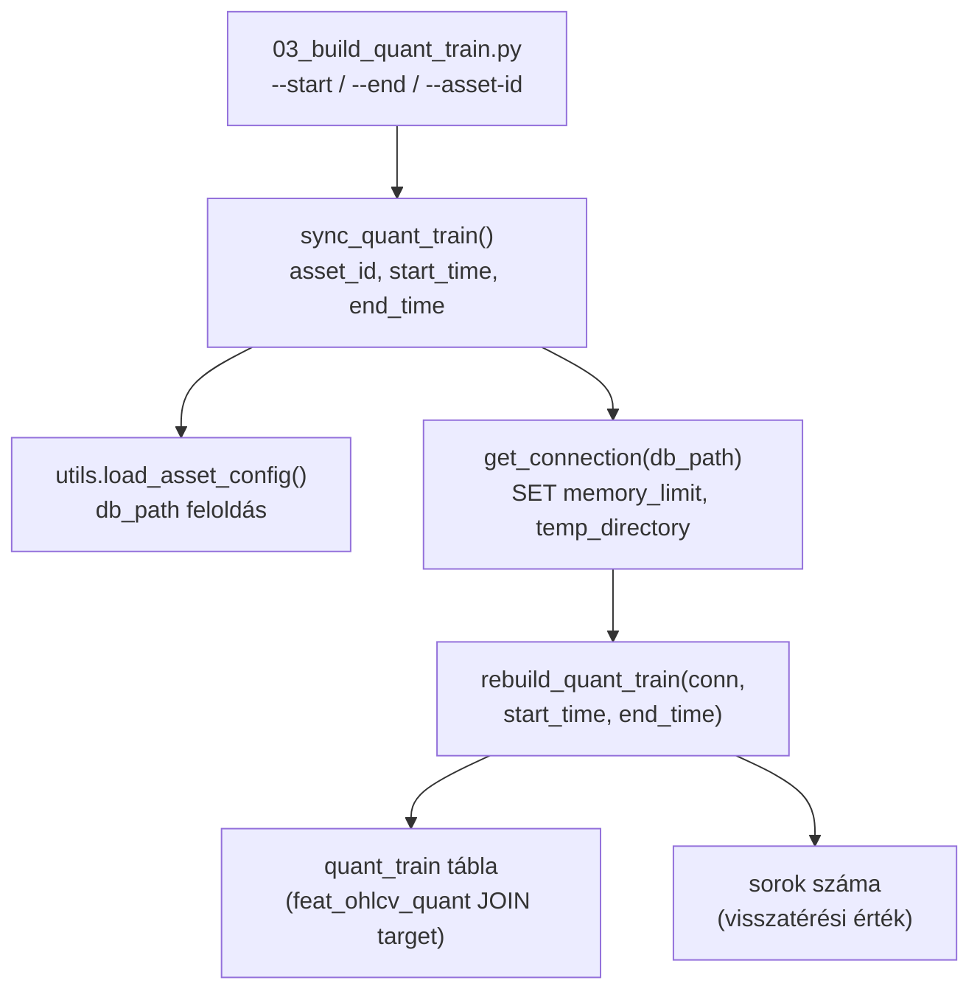
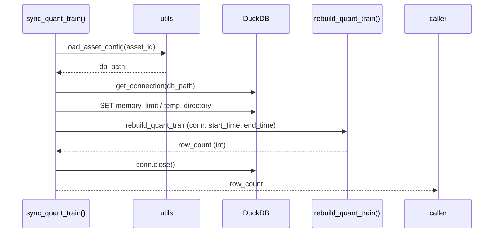

# sync_quant_train.py — quant_train Rebuild Wrapper

`src/data_handling/sync_tables/sync_quant_train.py`

Asset-szintű wrapper a `quant_train` tábla újraépítéséhez. Betölti az asset configot,
megnyitja a DuckDB connectiont, és meghívja a `rebuild_quant_train` store-szintű függvényt.

> Módszertani háttér (quant_train tábla szerepe, NULL policy, rebuild szemantika):
> → [`../methodology_doc/4000_quant_train.md`](../methodology_doc/4000_quant_train.md)
> Tábla-szintű leírás (séma, mód, CLI): → [`4100_quant_train.md`](4100_quant_train.md)

---

## Overview



---

## `sync_quant_train(asset_id, start_time, end_time)`

**Célja:** A `quant_train` tábla újraépítése az asset konfigurált DuckDB-jéből.

| Paraméter | Típus | Alap | Leírás |
|-----------|-------|------|--------|
| `asset_id` | `str \| None` | `None` | Asset kulcs a `config/assets.json`-ból; `None` = default asset |
| `start_time` | `str \| None` | `None` | Range rebuild alsó határ, inclusive (`YYYY-MM-DD HH:MM:SS`). `None` = full rebuild |
| `end_time` | `str \| None` | `None` | Range rebuild felső határ, inclusive. `None` = full rebuild |

**Visszatérési érték:** `int` — a `quant_train` tábla sorainak száma a rebuild után.

**Rebuild szemantika:**
- Ha `start_time` és `end_time` is `None`: **full rebuild** (`CREATE OR REPLACE TABLE`)
- Ha bármelyik megvan: **range rebuild** (`DELETE + INSERT` a megadott ablakra)

**Memory konfiguráció:**
- `SET memory_limit='10GB'` — nagy join-ok kezeléséhez
- `SET temp_directory = <db könyvtár>/tmp` — spill-to-disk helye



---

## CLI belépési pont

A `sync_quant_train` direkt hívója a `03_build_quant_train.py`:

```powershell
# Full rebuild
uv run python src/data_handling/03_build_quant_train.py

# Range rebuild
uv run python src/data_handling/03_build_quant_train.py \
    --start "2024-01-01 00:00:00" --end "2024-12-31 23:59:00"

# Explicit asset
uv run python src/data_handling/03_build_quant_train.py --asset-id solusdt
```

---

## Kapcsolódó dokumentumok

- [`4100_quant_train.md`](4100_quant_train.md) — `quant_train` tábla séma, rebuild szemantika részletesen
- [`1110_duckdb_store.md`](1110_duckdb_store.md) — `rebuild_quant_train` store implementáció
- [`2100_sync_features.md`](2100_sync_features.md) — `feat_ohlcv_quant` forrás tábla
- [`3100_sync_targets.md`](3100_sync_targets.md) — `target` forrás tábla
- [`../methodology_doc/4000_quant_train.md`](../methodology_doc/4000_quant_train.md) — módszertani háttér
