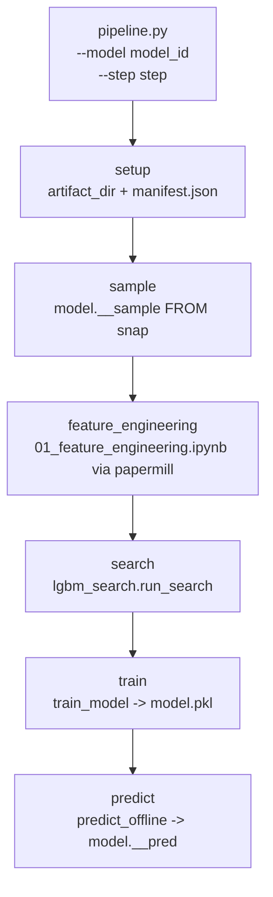
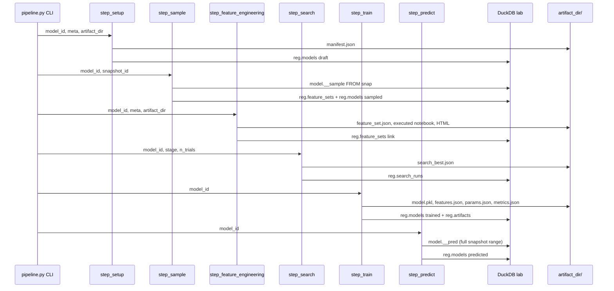

# 5050 — Pipeline Orchestrátor

`src/modeling/pipeline.py`

A `pipeline.py` a modell fejlesztési pipeline belépési pontja. Egyetlen CLI paranccsal
futtatja az összes lépést sorban, vagy egy kiválasztott lépést önállóan.

> Metodológiai háttér:
> - [5000_modelling.md](../methodology_doc/5000_modelling.md) — modellezési pipeline overview
> - [5400_feature_engineering.md](../methodology_doc/5400_feature_engineering.md) — feature engineering módszertan
> - [5500_sampling.md](../methodology_doc/5500_sampling.md) — sampling módszertan
> - [5600_model_training.md](../methodology_doc/5600_model_training.md) — training módszertan

Részletes kód-referencia (step implementációk, predict, provenance):
→ [5530_pipeline_predict_provenance.md](5530_pipeline_predict_provenance.md)

---

## Overview



---

## CLI Reference

```bash
# Összes lépés sorban
uv run python src/modeling/pipeline.py --model <model_id>

# Egyetlen lépés
uv run python src/modeling/pipeline.py --model <model_id> --step <step>

# Search step — stage és trial count megadásával
uv run python src/modeling/pipeline.py --model <model_id> --step search --stage explore --n-trials 60

# Sample step — snapshot override
uv run python src/modeling/pipeline.py --model <model_id> --step sample --snapshot <snapshot_id>
```

### CLI argumentumok

| Argumentum | Default | Leírás |
|------------|---------|--------|
| `--model` | kötelező | Modell ID a `config/models.json`-ból |
| `--step` | `None` (összes) | Egyetlen step futtatása: `setup`, `sample`, `feature_engineering`, `search`, `train`, `predict` |
| `--stage` | `None` | Search stage: `smoke`, `explore`, `refine` (csak `search` stepnél) |
| `--n-trials` | `100` | Max Optuna trial (csak `search` stepnél) |
| `--timeout-hours` | `None` | Falióra korlát órában (csak `search` stepnél) |
| `--fold-limit` | `None` | Fold limit (search stepnél, stage default-ot felülírja) |
| `--snapshot` | `None` | Snapshot ID override (sample és feature_engineering stepnél) |

---

## Lépések

| Lépés | Modul | Input | Output |
|-------|-------|-------|--------|
| `setup` | `pipeline.step_setup` | `config/models.json` meta | `artifact_dir/manifest.json`; `reg.models` draft sor |
| `sample` | `modeling.sampling.create_model_sample` | `snap."<snapshot_id>"` + `config/models.json` sampling config | `model."<model_id>__sample"` DuckDB tábla; `reg.feature_sets` bejegyzés |
| `feature_engineering` | `01_feature_engineering.ipynb` (papermill) | `snap ⋈ model.__sample` | `artifact_dir/feature_engineering/feature_set.json`; executed notebook + HTML |
| `search` | `modeling.search.lgbm_search.run_search` | `model.__sample` + `feature_set.json` | `artifact_dir/search/search_best.json`; `reg.search_runs` bejegyzés |
| `train` | `modeling.training.train.train_model` | `search_best.json` + `feature_set.json` + `snap ⋈ model.__sample` | `artifact_dir/model.pkl`, `features.json`, `params.json`, `metrics.json` |
| `predict` | `modeling.predict.predict_offline` | `model.pkl` + `features.json` + `snap."<snapshot_id>"` (teljes range) | `model."<model_id>__pred"` DuckDB tábla; `reg.models` status → `predicted` |



---

## Manifest státusz

A `manifest.json` `pipeline_status` mezője minden lépés után frissül:

`setup` → `sample_done` → `feature_engineering_done` → `search_done` → `train_done` → `predict_done`

---

## Kapcsolódó dokumentumok

| Fájl | Tartalom |
|------|----------|
| [5530_pipeline_predict_provenance.md](5530_pipeline_predict_provenance.md) | Pipeline step implementációk, predict, provenance részletes kód-ref |
| [5510_training.md](5510_training.md) | `train_model()` és training submodule kód-ref |
| [5520_search.md](5520_search.md) | Hyperparameter search kód-ref |
| [5300_create_sample.md](5300_create_sample.md) | `create_model_sample` snap-natív sampling kód-ref |
