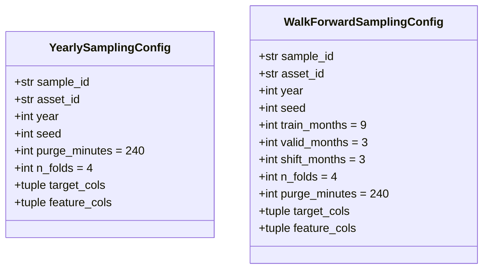

# 5100 — Sampling Config Dataclasses

Két immutable frozen dataclass az összes paraméterhez, amelyet a sampling pipeline
igényel. Forrás: [sampling/config.py](../../src/modeling/sampling/config.py)

Metodológiai háttér: [5400_sampling.md](../methodology_doc/5400_sampling.md) | [5010_sampling_yearly.md](../methodology_doc/5010_sampling_yearly.md)

---

## Overview



---

## `YearlySamplingConfig`

Az aktív sampling konfiguráció. Egy naptári évet fed le; a validáció random weekly
fold hozzárendeléssel (`assign_fold_ids`) történik.

| Mező | Típus | Default | Leírás |
|------|-------|---------|--------|
| `sample_id` | `str` | — | Egyedi azonosító; ez lesz a `samples/` alkönyvtár neve |
| `asset_id` | `str` | — | Asset kulcs a `config/assets.json`-ból (pl. `solusdt`) |
| `year` | `int` | — | Naptári év, amelyből a sample készül (pl. `2021`) |
| `seed` | `int` | — | Véletlenszám-generátor seedje; minden óra- és hétválasztás ebből származik |
| `purge_minutes` | `int` | `240` | Purge zóna szélessége percben minden validációs hét határán |
| `n_folds` | `int` | `4` | Walk-forward fold-ok száma (alapértelmezett: 4) |
| `target_cols` | `tuple[str, ...]` | `("long_mfe_fw60", "short_mfe_fw60")` | Target oszlopok a sample_train_valid.parquet-be |
| `feature_cols` | `tuple[str, ...]` | `()` | Feature oszlopok; üres tuple = minden `feat_*` auto-discovery futásidőben |

### `purge_minutes` default indoklása

A `feat_ohlcv_quant`-ban a leghosszabb rolling ablak 140 bar (= 140 perc 1m chart-on).
A 240 perces default ~71%-os biztonsági margót ad, hogy a jövőbeli feature-bővítések
is biztonságban legyenek purge csökkentés nélkül.

### `feature_cols` üres tuple szemantikája

Ha `feature_cols` üres, a `create_yearly_sample` orchestrator futásidőben felfedezi
az összes `feat_*` oszlopot a `quant_train` sémájából — ez az ajánlott működési mód.
Explicit lista csak akkor szükséges, ha feature-szelekcióval korlátozott sample kell.

### Példa inicializálás

```python
from modeling.sampling.config import YearlySamplingConfig

config = YearlySamplingConfig(
    sample_id = "solusdt_fw60_yearly_2021",
    asset_id  = "solusdt",
    year      = 2021,
    seed      = 42 + 2021,   # 2063
)
```

A `frozen=True` miatt a dataclass példányosítás után nem módosítható — minden
paraméter-változtatáshoz új `YearlySamplingConfig` példányt kell létrehozni.

---

## `WalkForwardSamplingConfig`

Walk-forward CV sampling konfigurációja. Az első validációs ablak az anchor év
októberétől indul, és `n_folds × shift_months` hónapig terjed előre.

| Mező | Típus | Default | Leírás |
|------|-------|---------|--------|
| `sample_id` | `str` | — | Egyedi azonosító |
| `asset_id` | `str` | — | Asset kulcs |
| `year` | `int` | — | Anchor naptári év (pl. `2021`); első valid ablak `year-10-01`-től |
| `seed` | `int` | — | Véletlenszám seed az órakiválasztáshoz |
| `train_months` | `int` | `9` | Training ablak hossza hónapban |
| `valid_months` | `int` | `3` | Validációs ablak hossza hónapban |
| `shift_months` | `int` | `3` | Eltolás egymást követő fold-ok között hónapban |
| `n_folds` | `int` | `4` | Generálandó fold-ok száma |
| `purge_minutes` | `int` | `240` | Purge gap minden fold határán percben |
| `target_cols` | `tuple[str, ...]` | `("long_mfe_fw60", "short_mfe_fw60")` | Target oszlopok |
| `feature_cols` | `tuple[str, ...]` | `()` | Feature oszlopok; üres = minden `feat_*` |

---

## Kapcsolódó fájlok

| Fájl | Tartalom |
|------|----------|
| [5010_sampling_yearly.md](../methodology_doc/5010_sampling_yearly.md) | Yearly sampling teljes metodológiája |
| [5400_sampling.md](../methodology_doc/5400_sampling.md) | Sampling metodológiai háttér |
| [5300_create_sample.md](5300_create_sample.md) | create_yearly_sample orchestrator és CLI |
