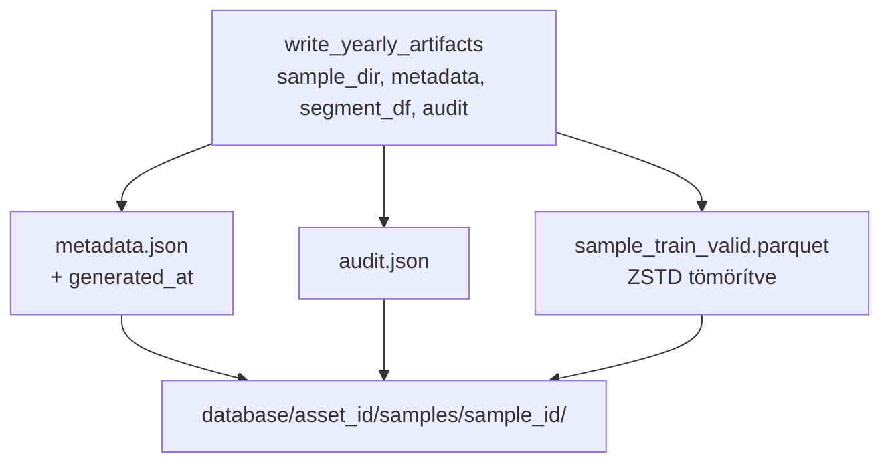

# 5200 — Sampling Artifacts

Artifact IO modul: yearly formátumhoz `write_yearly_artifacts` / `load_yearly_sample`;
legacy expanding-window formátumhoz `write_sample_artifacts` / `load_sample_definition`
(visszafele kompatibilitás). Forrás: [sampling/artifacts.py](../../src/modeling/sampling/artifacts.py)

Metodológiai háttér: [5400_sampling.md](../methodology_doc/5400_sampling.md)

---

## Yearly formátum (aktív)

### `write_yearly_artifacts()`

Kiírja a sample könyvtárba: `metadata.json`, `audit.json`, `sample_train_valid.parquet`.
Automatikusan létrehozza a könyvtárat ha nem létezik.



| Paraméter | Típus | Leírás |
|-----------|-------|--------|
| `sample_dir` | `Path` | Célkönyvtár (létrehozza ha nincs) |
| `metadata` | `dict` | Sample metadata (sample_id, year, seed, selected_valid_weeks, row_counts, …) |
| `segment_df` | `pl.DataFrame` | Polars DataFrame open_time + target oszlopok + `segment` + `fold_id` |
| `audit` | `dict` | Forrásadat minőségi metrikák (missing_hours, actual_hourly_rows, …) |

**`generated_at` injektálás:** automatikusan bekerül az aktuális UTC ISO timestamp.

---

### `load_yearly_sample()`

Beolvassa a `metadata.json`-t és ellenőrzi, hogy a `sample_train_valid.parquet` létezik.

```python
sample = load_yearly_sample("database/solusdt/samples/solusdt_fw60_yearly_2021")
# sample["sample_parquet_path"] → "database/.../sample_train_valid.parquet"
```

**Raises:** `FileNotFoundError` ha `metadata.json` vagy `sample_train_valid.parquet` hiányzik.

---

## Artifact fájlok sémája

### `metadata.json`

```json
{
  "sample_id"           : "solusdt_fw60_yearly_2021",
  "asset_id"            : "solusdt",
  "year"                : 2021,
  "seed"                : 2063,
  "purge_minutes"       : 240,
  "target_cols"         : ["long_mfe_fw60", "short_mfe_fw60"],
  "feature_cols"        : ["feat_rsi_14", "feat_vol_200"],
  "selected_valid_weeks": [
    {"start": "2021-01-04", "end": "2021-01-10"},
    "..."
  ],
  "row_counts"          : {"train": 7012, "valid": 2016, "purge": 96},
  "generated_at"        : "2025-06-01T10:00:00+00:00"
}
```

### `audit.json`

```json
{
  "total_quant_train_rows_in_year": 525600,
  "source_rows_with_valid_targets": 525480,
  "expected_hours"                : 8760,
  "actual_hourly_rows"            : 8760,
  "missing_hours"                 : 0
}
```

### `sample_train_valid.parquet`

> **Megjegyzés:** Ez a **yearly parquet (legacy)** formátum sémája. Az aktív pipeline
> `model."<model_id>__sample"` DuckDB táblájában nincs `feat_*` — azok a snapshotban
> maradnak. Csak `open_time`, target és `fold_id` kerül a sample táblába.

| Oszlop | Típus | Leírás |
|--------|-------|--------|
| `open_time` | `Datetime` | Timestamp (UTC) |
| `feat_*` | `Float64` | Kvantitatív feature-ök (csak yearly legacy parquetben) |
| `long_mfe_fw60` | `Float64` | Long target |
| `short_mfe_fw60` | `Float64` | Short target |
| `segment` | `Utf8` | `train` / `valid` / `purge` |
| `fold_id` | `Int16` (nullable) | Validációs hét indexe (0-based); train sorokra null |

---

## Legacy formátum (expanding window — archív)

A `write_sample_artifacts` / `load_sample_definition` / `validate_sample_definition`
funkciók az expanding window CV sample formátumhoz tartoznak. Ezek csak visszafele
kompatibilitás miatt maradnak a kódban — új munkában ne használd.

| Fájl | Leírás |
|------|--------|
| `metadata.json` | Expanding window paraméterek (min_train_days, valid_days, …) |
| `folds.json` | `{"folds": [...], "test": {...}}` — fold határok |
| `audit.json` | Feature table audit (data_start_safe, data_end_safe, gap_count, …) |

---

## Kapcsolódó fájlok

| Fájl | Tartalom |
|------|----------|
| [5010_sampling_yearly.md](../methodology_doc/5010_sampling_yearly.md) | Yearly sampling teljes metodológiája |
| [5100_sampling_config.md](5100_sampling_config.md) | YearlySamplingConfig dataclass |
| [5300_create_sample.md](5300_create_sample.md) | create_yearly_sample (legacy) + create_model_sample (aktív) |
