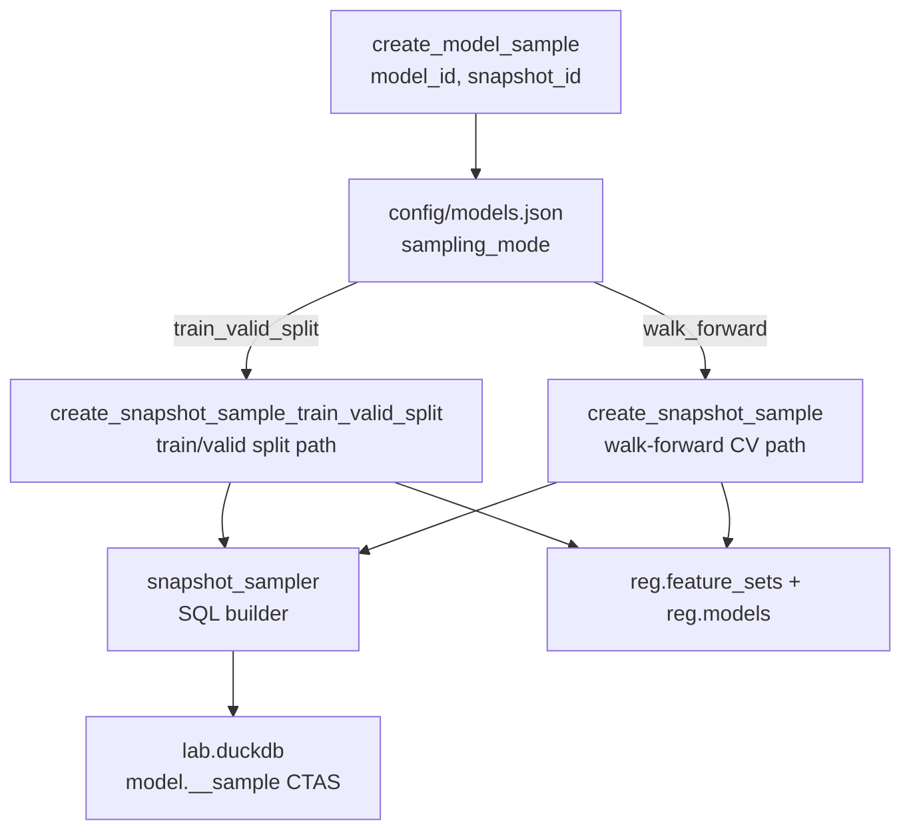
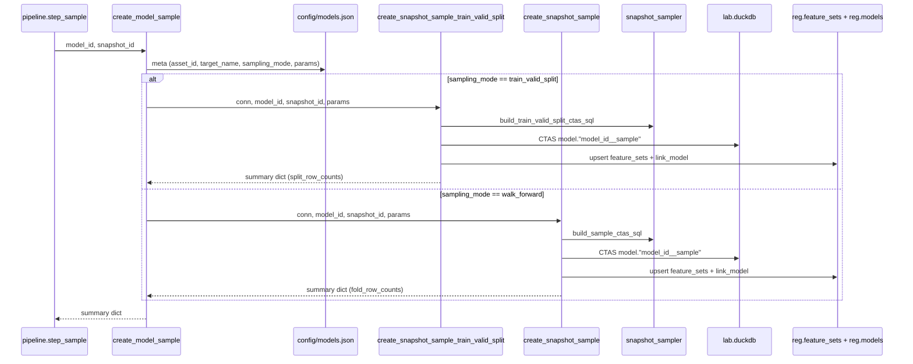
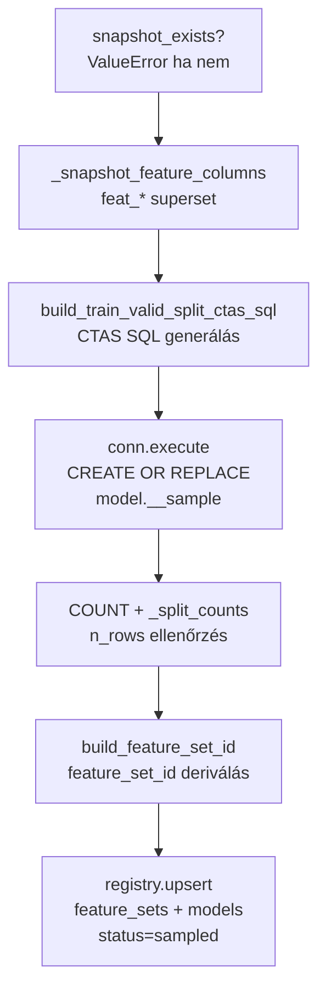
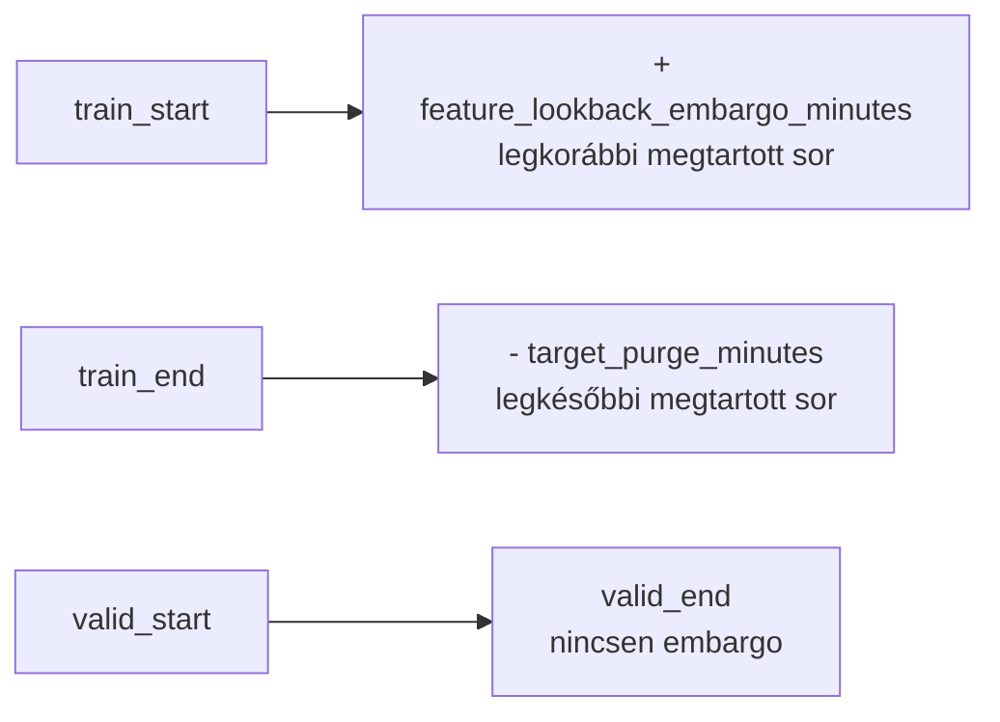

# 5300 — Sampling Orchestratorok: create_model_sample

A `src/modeling/sampling/create_sample.py` valósítja meg a snapshot-native sampling
path orchestrátorát. Két sampling mode támogatott: **`train_valid_split`** (aktív,
champion modellek) és **`walk_forward`** (legacy CV, megtartva visszafelé-kompatibilitáshoz).

| Mode | Output oszlop | Mikor aktív |
|------|---------------|-------------|
| `train_valid_split` | `split` TINYINT (0=train, 1=valid) | Champion modellek (`config/models.json`) |
| `walk_forward` | `fold_id` TINYINT (0=train-only, 1..n=valid fold) | Legacy CV modellek |

Forrás:
- [sampling/create_sample.py](../../src/modeling/sampling/create_sample.py)
- [sampling/snapshot_sampler.py](../../src/modeling/sampling/snapshot_sampler.py)
- [sampling/config.py](../../src/modeling/sampling/config.py)

→ _doc_/methodology_doc/5400_sampling.md

---

## Overview



A kimenet mindkét esetben: `model."<model_id>__sample"` DuckDB tábla —
`open_time` + target oszlop(ok) + split indicator (`split` vagy `fold_id`).
A `feat_*` oszlopok a snapshotban maradnak, downstream lépések
`snap."<snapshot_id>" ⋈ model."<model_id>__sample"` JOIN-nal dolgoznak.

---

## `create_model_sample(model_id, snapshot_id)`

Config-vezérelt belépési pont. Feloldja a modell paramétereit (`config/models.json`),
megnyitja a lab connectiont, majd `sampling_mode` alapján delegál.

| Paraméter | Típus | Leírás |
|-----------|-------|--------|
| `model_id` | `str` | Modell kulcs a `config/models.json`-ból |
| `snapshot_id` | `str` | Immutable snapshot id (`snap."<id>"`) |

**Visszatérés:** Summary dict — tartalom mode szerint változik (lásd delegált függvényeknél).

**Raises:** `ValueError` ha a modell ismeretlen, a snapshot nem létezik, üres a sample,
vagy ismeretlen `sampling_mode`.



---

## `create_snapshot_sample_train_valid_split(conn, model_id, snapshot_id, ...)` [aktív]

Train/valid split orchestrator. Egyetlen kronológiai felosztás: train és valid
időablak, embargo szabályokkal a train oldalon.



| Paraméter | Típus | Default | Leírás |
|-----------|-------|---------|--------|
| `conn` | `DuckDBPyConnection` | — | Nyitott lab connection |
| `model_id` | `str` | — | Owning model id (tábla token + reg link) |
| `snapshot_id` | `str` | — | Immutable forrás snapshot |
| `asset_id` | `str` | — | Asset kulcs (feature_set_id és reg linkekhez) |
| `target_cols` | `list[str]` | — | Target oszlop(ok) a samplebe |
| `horizon` | `int` | `60` | Forward-window bar count (feature_set_id token) |
| `direction` | `str` | `"l"` | `l`/`s`/`combo` (feature_set_id token) |
| `seed` | `int` | `42` | Reproducibility seed per-hour pickhoz |
| `train_start` | `str` | `"2021-01-01"` | Train ablak kezdete (YYYY-MM-DD, inclusive) |
| `train_end` | `str` | `"2025-04-30"` | Train ablak vége (YYYY-MM-DD, inclusive) |
| `valid_start` | `str` | `"2025-05-01"` | Valid ablak kezdete (YYYY-MM-DD, inclusive) |
| `valid_end` | `str` | `"2026-05-31"` | Valid ablak vége (YYYY-MM-DD, inclusive) |
| `feature_lookback_embargo_minutes` | `int` | `240` | Train elejéről kizárt percek (feature warmup) |
| `target_purge_minutes` | `int` | `60` | Train végéről kizárt percek (target leak megelőzés) |
| `selected_cols` | `list[str] \| None` | `None` | Logikai feature_set; None = összes feat_* |

**Visszatérési kulcsok:**

| Kulcs | Típus | Leírás |
|-------|-------|--------|
| `model_id` | `str` | Modell azonosító |
| `snapshot_id` | `str` | Forrás snapshot |
| `sample_table` | `str` | `model."<model_id>__sample"` FQN |
| `n_rows` | `int` | Összes sample sor |
| `split_row_counts` | `dict[str, int]` | Per-split sorok (`{"0": n, "1": n}`) |
| `feature_set_id` | `str` | Regisztrált `feature_set_id` |
| `n_input` | `int` | Snapshot feat_* oszlopok száma |
| `n_selected` | `int` | Kiválasztott feature-ök száma |

---

## `TrainValidSplitConfig` — immutable konfiguráció

`src/modeling/sampling/config.py` — fagyasztott dataclass a train/valid split
paramétereihez. A `create_model_sample` a `config/models.json` `sampling` szekciójából
olvassa a paramétereket, nem kötelező a dataclass explicit példányosítása.

| Mező | Típus | Default | Leírás |
|------|-------|---------|--------|
| `sample_id` | `str` | — | Egyedi azonosító |
| `asset_id` | `str` | — | Asset kulcs |
| `train_start` | `str` | — | Train ablak első napja (YYYY-MM-DD, inclusive) |
| `train_end` | `str` | — | Train ablak utolsó napja (YYYY-MM-DD, inclusive) |
| `valid_start` | `str` | — | Valid ablak első napja (YYYY-MM-DD, inclusive) |
| `valid_end` | `str` | — | Valid ablak utolsó napja (YYYY-MM-DD, inclusive) |
| `seed` | `int` | `42` | Véletlenszám seed per-hour row selectionhoz |
| `feature_lookback_embargo_minutes` | `int` | `240` | Train elejéről kizárt percek |
| `target_purge_minutes` | `int` | `60` | Train végéről kizárt percek |
| `target_cols` | `tuple[str, ...]` | `("long_mfe_fw60", "short_mfe_fw60")` | Target oszlopok |

---

## SQL logika — `build_train_valid_split_select_sql`

`src/modeling/sampling/snapshot_sampler.py` — IO-free SQL builder.

### Két embargo szabály (csak train oldalon)



1. **Feature lookback embargo** (`feature_lookback_embargo_minutes = 240`): a train
   ablak első N perce kizárva — garantálja, hogy minden megtartott sornak teljes
   feature lookback ablaka legyen a snapshot start előtt.
2. **Target purge** (`target_purge_minutes = 60`): a train ablak utolsó N perce
   kizárva — ezeknek a soroknak a target értéke a valid periódusban lévő árból
   számítódik, így data leak megelőzés.

**Valid oldalon nincs embargo** — a valid feature-számítás visszanéz a train
történelembe, ami korrekt és elvárt viselkedés.

### QUALIFY ROW_NUMBER (hourly select)

```sql
QUALIFY ROW_NUMBER() OVER (
    PARTITION BY date_trunc('hour', open_time)
    ORDER BY hash(CAST(epoch_ms(open_time) AS BIGINT) + {seed}), open_time
) = 1
```

Minden órablokkból pontosan egy sor kerül a samplebe. A `hash(epoch_ms + seed)` content-addressed
determinizmust biztosít: azonos snapshot + seed → bit-azonos tábla (`CREATE OR REPLACE`).

### `split` indicator oszlop

```sql
CAST(CASE
    WHEN CAST(open_time AS DATE) BETWEEN DATE '{valid_start}' AND DATE '{valid_end}'
        THEN 1
    ELSE 0
END AS TINYINT) AS split
```

| Érték | Jelentés |
|-------|----------|
| `0` | Train sor |
| `1` | Valid sor |

Az output tábla sémája: `open_time`, target oszlop(ok), `split TINYINT`.

---

## `create_snapshot_sample(conn, model_id, snapshot_id, ...)` [walk-forward, legacy]

> **Megjegyzés:** Ez a függvény a **walk-forward CV path** — az aktív champion
> modellek a `create_snapshot_sample_train_valid_split`-et használják. Ez a leírás
> visszafelé-kompatibilitás célját szolgálja.

Walk-forward CV orchestrator. A `generate_walk_forward_folds` + `build_sample_ctas_sql`
kombinációval generál `fold_id` TINYINT oszlopot (0 = train-only, 1..n = valid fold).

| Paraméter | Típus | Default | Leírás |
|-----------|-------|---------|--------|
| `train_months` | `int` | `9` | Walk-forward train ablak hossza hónapban |
| `valid_months` | `int` | `3` | Walk-forward valid ablak hossza hónapban |
| `shift_months` | `int` | `3` | Fold eltolás hónapban |
| `n_folds` | `int` | `4` | Fold-ok száma |
| `purge_minutes` | `int` | `240` | Purge zóna percben fold határon |

**I5 garantálva:** A `fold_id` INT8 oszlop minden sorban jelen van.

---

## Kapcsolódó fájlok

| Fájl | Tartalom |
|------|----------|
| [5400_sampling.md](../methodology_doc/5400_sampling.md) | Sampling metodológiai háttér |
| [5100_sampling_config.md](5100_sampling_config.md) | TrainValidSplitConfig / WalkForwardSamplingConfig |
| [5530_pipeline_predict_provenance.md](5530_pipeline_predict_provenance.md) | Pipeline orchestrator (step_sample hívja ezt) |
| [1510_registry_code.md](1510_registry_code.md) | registry.upsert — reg.feature_sets és reg.models írás |
