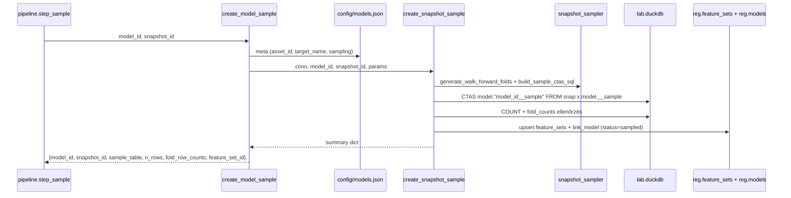
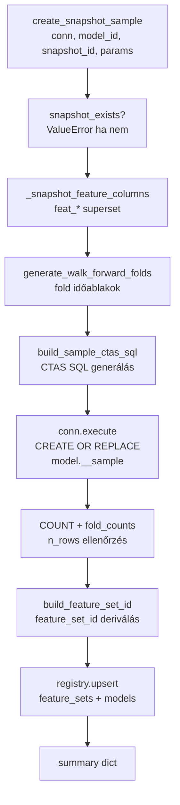
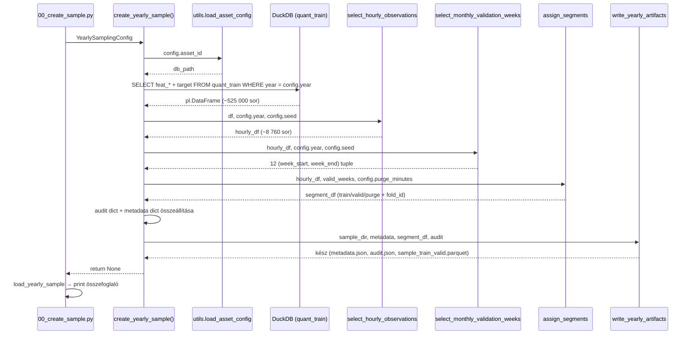

# 5300 — Sampling Orchestratorok: create_model_sample és create_yearly_sample

Két sampling path él a kódbázisban, különböző kimeneti formátummal:

| Path | Függvény | Kimenet | Mikor |
|------|----------|---------|-------|
| **Aktív** — snap-native | `create_model_sample` | `model."<id>__sample"` DuckDB tábla | `pipeline.py step_sample` |
| **Legacy** — Polars/parquet | `create_yearly_sample` | `sample_train_valid.parquet` + JSON | `00_create_sample.py` standalone |

Az aktív pipeline mindig a snap-native path-ot használja. A yearly parquet path
visszafele-kompatibilitás és legacy audit célokat szolgál.

Forrás:
- [sampling/create_sample.py](../../src/modeling/sampling/create_sample.py)
- [00_create_sample.py](../../src/modeling/00_create_sample.py)

Metodológiai háttér: [5400_sampling.md](../methodology_doc/5400_sampling.md) | [5010_sampling_yearly.md](../methodology_doc/5010_sampling_yearly.md)

---

## Snap-native path (aktív — pipeline.py)

### `create_model_sample(model_id, snapshot_id)`

Config-vezérelt belépési pont. Feloldja a modell paramétereit (`config/models.json`),
megnyitja a lab connectiont, majd delegál a `create_snapshot_sample`-nek.



| Visszatérési kulcs | Típus | Leírás |
|-------------------|-------|--------|
| `model_id` | `str` | Modell azonosító |
| `snapshot_id` | `str` | Forrás snapshot |
| `sample_table` | `str` | `model."<model_id>__sample"` tábla FQN |
| `n_rows` | `int` | Sample sorok száma |
| `fold_row_counts` | `dict[str, int]` | Per-fold sorok (`{"0": n, "1": n, ...}`) |
| `feature_set_id` | `str` | Regisztrált `feature_set_id` |
| `n_input` | `int` | Snapshot `feat_*` oszlopok száma (logikai szuperset) |
| `n_selected` | `int` | Kiválasztott feature-ök száma (logikai selection) |

**Raises:** `ValueError` ha a modell ismeretlen, a snapshot nem létezik, vagy a sample üres.

---

### `create_snapshot_sample(conn, model_id, snapshot_id, ...)`

Alacsony szintű orchestrator: nyers conn-on fut, IO-free SQL builder-t (`snapshot_sampler`)
hív, majd elvégzi a DuckDB végrehajtást és a registry írást.



A CTAS SQL az `hourly select + fold_id CASE` egyetlen lépésben, determinisztikusan
— azonos snapshot + seed + fold paraméterek → bit-azonos `model.__sample` tábla.

**I5 garantálva:** A `fold_id` INT8 oszlop minden sorban jelen van (0 = train-only, 1..n = valid fold).

---

## Yearly parquet path (legacy — 00_create_sample.py)

### Overview



---

## `create_yearly_sample(config)` (legacy)

> **Megjegyzés:** Ez a függvény a **legacy Polars/parquet path** — az aktív pipeline
> a `create_model_sample` snap-native path-ot használja. Ez a leírás visszafele-
> kompatibilitás és audit célokat szolgál.

| Paraméter | Típus | Leírás |
|-----------|-------|--------|
| `config` | `YearlySamplingConfig` | Frozen dataclass az összes paraméterrel |

### Lépések

1. **Útvonalak feloldása** — `utils.load_asset_config(asset_id)` → `db_path`; `sample_dir` = `database/<asset_id>/samples/<sample_id>/`
2. **DB betöltés** — `live.quant_train`-ből év-szűrt sorok, NULL target sorok kizárva
3. **Feature column feloldás** — `config.feature_cols` ha nem üres; különben auto-discovery minden `feat_*` oszlop
4. **Óránkénti kiválasztás** — `select_hourly_observations` → ~8 760 sor/év
5. **Validációs hetek** — `select_monthly_validation_weeks` → 12 hét (mind a 12 hónapból)
6. **Szegmens hozzárendelés** — `assign_segments` → `train` / `valid` / `purge` + `fold_id`
7. **Audit** — `missing_hours`, `actual_hourly_rows`, `total_quant_train_rows_in_year`
8. **Kiírás** — `write_yearly_artifacts` → `metadata.json`, `audit.json`, `sample_train_valid.parquet`

**Raises:**
- `ValueError` ha a `quant_train`-nek nincs sora érvényes targettel az adott évre
- `RuntimeError` ha a `quant_train` tábla nem létezik

---

## CLI — `00_create_sample.py`

### Argumentumok

| Argument | Kötelező | Default | Leírás |
|----------|----------|---------|--------|
| `--year` | igen | — | Naptári év (pl. `2021`) |
| `--asset-id` | igen | — | Asset kulcs (`config/assets.json`-ból) |
| `--seed` | nem | `42 + year` | Véletlenszám seed |

### Példa CLI hívás

```bash
uv run python src/modeling/00_create_sample.py --year 2021 --asset-id solusdt
uv run python src/modeling/00_create_sample.py --year 2022 --asset-id solusdt --seed 100
```

### Output summary

Sikeres futás után a CLI összefoglalót nyomtat:

```
OK: Sample created at database/solusdt/samples/solusdt_fw60_yearly_2021
    year         = 2021
    seed         = 2063
    valid_weeks  = 12
    feature_cols = 208
    total_rows   = 9124
      train      = 7012
      valid      = 2016
      purge      = 96
```

---

## Miért csak az orchestratorban van `utils` import?

Az `yearly_sampler` és `artifacts` modulok szándékosan projekt-agnosztikusak —
tesztelhetők és újrafelhasználhatók projekt kontextus nélkül. Csak az orchestrator
ismeri a projekt-specifikus path-konvenciókat és config formátumot.

---

## Kapcsolódó fájlok

| Fájl | Tartalom |
|------|----------|
| [5010_sampling_yearly.md](../methodology_doc/5010_sampling_yearly.md) | Yearly sampling teljes metodológiája |
| [5400_sampling.md](../methodology_doc/5400_sampling.md) | Sampling metodológiai háttér |
| [5100_sampling_config.md](5100_sampling_config.md) | YearlySamplingConfig / WalkForwardSamplingConfig |
| [5200_sampling_artifacts.md](5200_sampling_artifacts.md) | write_yearly_artifacts / load_yearly_sample (legacy) |
| [5530_pipeline_predict_provenance.md](5530_pipeline_predict_provenance.md) | Pipeline orchestrator kód-ref (step_sample hívja ezt) |
| [1510_registry_code.md](1510_registry_code.md) | registry.upsert — reg.feature_sets és reg.models írás |
