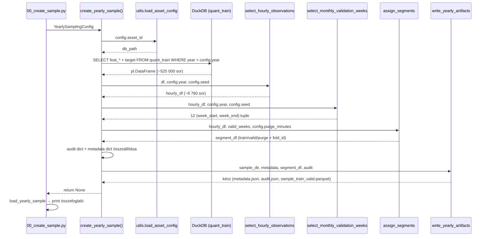

# 5300 — create_yearly_sample Orchestrator és CLI

A sampling orchestrator összefogja a DB load → hourly select → segment assign → write
lépéseket egyetlen `create_yearly_sample(config)` hívásba. Csak ez a modul importálja
a `utils`-t és DuckDB-t — az altmodulok (yearly_sampler, artifacts) projekt-agnosztikusak.

Forrás:
- [sampling/create_sample.py](../src/modeling/sampling/create_sample.py)
- [00_create_sample.py](../src/modeling/00_create_sample.py)

---

## Overview



---

## `create_yearly_sample(config)`

| Paraméter | Típus | Leírás |
|-----------|-------|--------|
| `config` | `YearlySamplingConfig` | Frozen dataclass az összes paraméterrel |

### Lépések

1. **Útvonalak feloldása** — `utils.load_asset_config(asset_id)` → `db_path`; `sample_dir` = `database/<asset_id>/samples/<sample_id>/`
2. **DB betöltés** — `quant_train`-ből év-szűrt sorok, NULL target sorok kizárva
3. **Feature column feloldás** — `config.feature_cols` ha nem üres; különben auto-discovery minden `feat_*` oszlop
4. **Óránkénti kiválasztás** — `select_hourly_observations` → ~8 760 sor/év
5. **Validációs hetek** — `select_monthly_validation_weeks` → 12 hét (mind a 12 hónapból)
6. **Szegmens hozzárendelés** — `assign_segments` → `train` / `valid` / `purge` + `fold_id`
7. **Audit** — `missing_hours`, `actual_hourly_rows`, `total_quant_train_rows_in_year`
8. **Kiírás** — `write_yearly_artifacts` → `metadata.json`, `audit.json`, `sample_train_valid.parquet`

**Raises:**
- `ValueError` ha a `quant_train`-nek nincs sora érvényes targettel az adott évre
- `RuntimeError` ha a `quant_train` tábla nem létezik

---

## CLI — `00_create_sample.py`

### Argumentumok

| Argument | Kötelező | Default | Leírás |
|----------|----------|---------|--------|
| `--year` | igen | — | Naptári év (pl. `2021`) |
| `--asset-id` | igen | — | Asset kulcs (`config/assets.json`-ból) |
| `--seed` | nem | `42 + year` | Véletlenszám seed |

### Példa CLI hívás

```bash
uv run python src/modeling/00_create_sample.py --year 2021 --asset-id solusdt
uv run python src/modeling/00_create_sample.py --year 2022 --asset-id solusdt --seed 100
```

### Output summary

Sikeres futás után a CLI összefoglalót nyomtat:

```
OK: Sample created at database/solusdt/samples/solusdt_fw60_yearly_2021
    year         = 2021
    seed         = 2063
    valid_weeks  = 12
    feature_cols = 208
    total_rows   = 9124
      train      = 7012
      valid      = 2016
      purge      = 96
```

---

## Miért csak az orchestratorban van `utils` import?

Az `yearly_sampler` és `artifacts` modulok szándékosan projekt-agnosztikusak —
tesztelhetők és újrafelhasználhatók projekt kontextus nélkül. Csak az orchestrator
ismeri a projekt-specifikus path-konvenciókat és config formátumot.

---

## Kapcsolódó fájlok

| Fájl | Tartalom |
|------|----------|
| [5010_sampling_yearly.md](../methodology_doc/5010_sampling_yearly.md) | Yearly sampling teljes metodológiája |
| [5100_sampling_config.md](5100_sampling_config.md) | YearlySamplingConfig dataclass |
| [5200_sampling_artifacts.md](5200_sampling_artifacts.md) | write_yearly_artifacts / load_yearly_sample |
