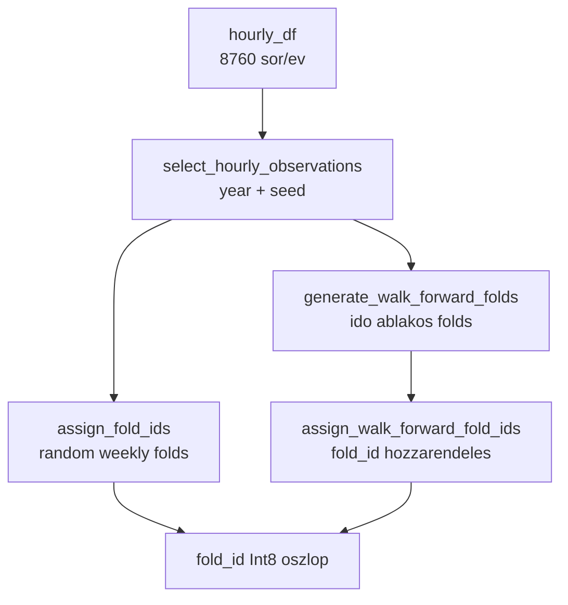
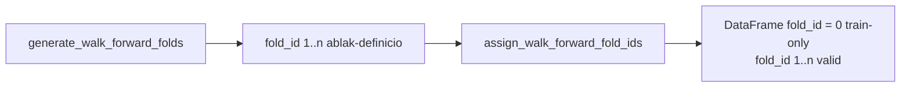
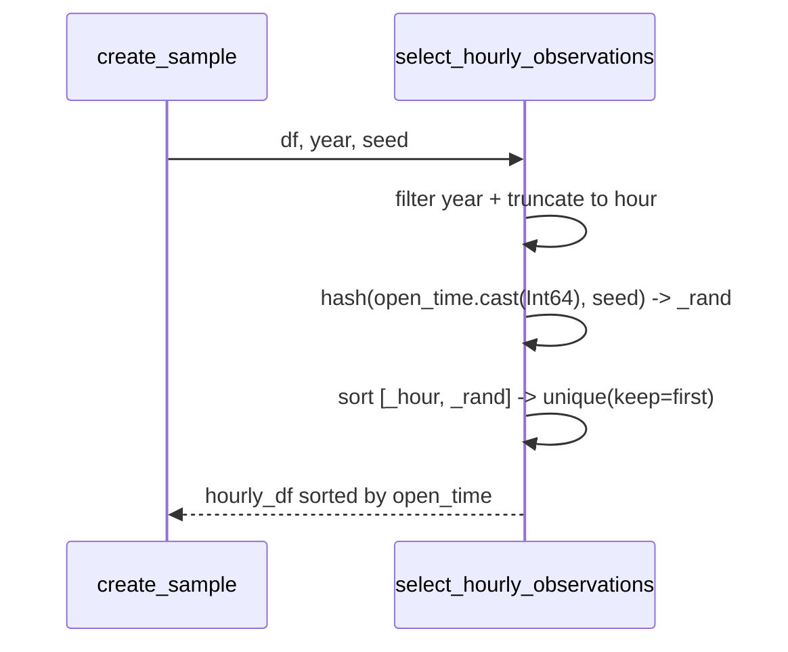
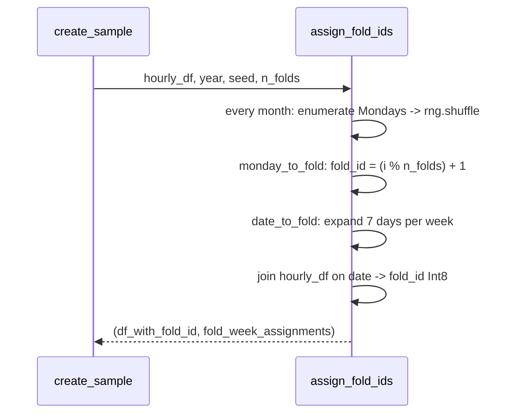
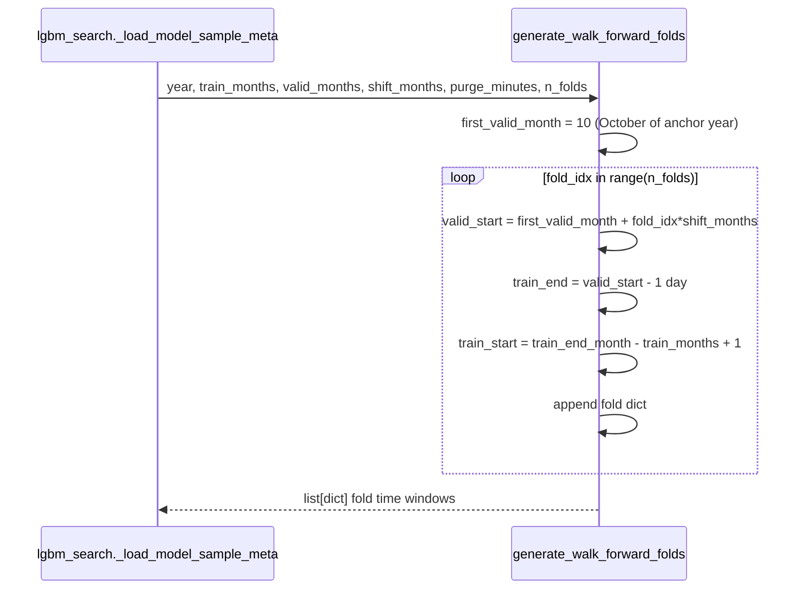
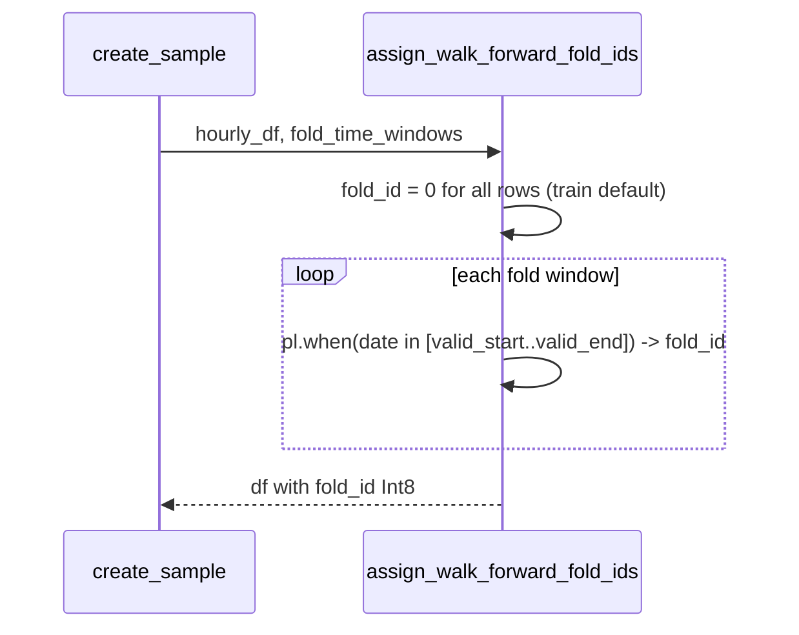

# 5410 — Yearly Sampler: Fold Assignment and Walk-Forward Folds

Pure function modul — nincs IO, nincs adatbázis-hozzáférés, nincs projekt-import.
Tartalmazza az órakiválasztás utáni fold hozzárendelési logikát (yearly random weekly
és walk-forward időablakok).

Forrás: [sampling/yearly_sampler.py](../../src/modeling/sampling/yearly_sampler.py)

Metodológiai háttér: [5400_sampling.md](../methodology_doc/5400_sampling.md) | [5010_sampling_yearly.md](../methodology_doc/5010_sampling_yearly.md)

---

## Overview

---

## Functions

### `select_hourly_observations(df, year, seed)`

Pontosan egy véletlenszerű percet választ ki minden naptári óra-nyíláshoz az adott
évre. A kiválasztás hash-alapú és reprodukálható: ugyanaz a `df + year + seed`
kombiné → ugyanaz az output, az input sor sorrendjétől függetlenül.

| Paraméter | Típus | Leírás |
|-----------|-------|--------|
| `df` | `pl.DataFrame` | `open_time` Datetime oszlopot tartalmazó DataFrame payload oszlopokkal |
| `year` | `int` | Szűrési naptári év |
| `seed` | `int` | Reprodukálhatósági seed |

Returns: `pl.DataFrame` — legfeljebb 8760 / 8784 sor (egy/óra az adott évben).

---

### `assign_fold_ids(hourly_df, year, seed, n_folds=4)`

Minden hétfőtől induló hetet random módon oszt el a `n_folds` fold valamelyikébe,
havonként. A hetek belül hónaponként lesznek keverve (`rng.shuffle`) a seed alapján.
Hét-szintű hozzárendelés: a hét minden napja (hétfőtől vasárnapig) azonos `fold_id`-t
kap.

| Paraméter | Típus | Leírás |
|-----------|-------|--------|
| `hourly_df` | `pl.DataFrame` | `select_hourly_observations` kimenete |
| `year` | `int` | Naptári év |
| `seed` | `int` | Reprodukálhatósági seed |
| `n_folds` | `int` | Fold-ok száma (default: 4) |

Returns: `tuple[pl.DataFrame, dict[int, list[dict[str, str]]]]`
- `df_with_fold_id`: `fold_id` Int8 oszloppal kibővített DataFrame
- `fold_week_assignments`: `{1: [{"start": "YYYY-MM-DD", "end": "YYYY-MM-DD"}, ...], ...}`

**Megjegyzés:** Az olyan napok, amelyek nem esnek hétfőtől kezdődő hétbe (pl.
lecsúszott January napok), `fill_null(1)` alapján az 1. fold-ba kerülnek.

---

### `generate_walk_forward_folds(year, train_months, valid_months, shift_months, purge_minutes, n_folds)`

Walk-forward CV fold időablakokat generál az anchor évhez. Az első fold validációs
ablaka `year-10-01`-en kezdődik; minden következő fold `shift_months`-szal tolódik.
A training ablak `train_months` hosszú és közvetlenül megelőzi a validációs ablakot.

| Paraméter | Típus | Default | Leírás |
|-----------|-------|---------|--------|
| `year` | `int` | — | Anchor naptári év (pl. `2021`) |
| `train_months` | `int` | `9` | Training ablak hossza hónapban |
| `valid_months` | `int` | `3` | Validációs ablak hossza hónapban |
| `shift_months` | `int` | `3` | Eltolás egymást követő fold-ok között hónapban |
| `purge_minutes` | `int` | `240` | Percben kizárt zóna (metadata mezőként tárolva) |
| `n_folds` | `int` | `4` | Generálandó fold-ok száma |

Returns: `list[dict]` — minden elem `fold_id`, `train_start`, `train_end`,
`valid_start`, `valid_end` mezőket tartalmaz (`YYYY-MM-DD` stringként).

### Fold példa (year=2021, n_folds=4)

| fold_id | train_start | train_end | valid_start | valid_end |
|---------|-------------|-----------|-------------|-----------|
| 1 | 2021-01-01 | 2021-09-30 | 2021-10-01 | 2021-12-31 |
| 2 | 2021-04-01 | 2021-12-31 | 2022-01-01 | 2022-03-31 |
| 3 | 2021-07-01 | 2022-03-31 | 2022-04-01 | 2022-06-30 |
| 4 | 2021-10-01 | 2022-06-30 | 2022-07-01 | 2022-09-30 |

---

### `assign_walk_forward_fold_ids(hourly_df, fold_time_windows)`

Minden sort besorol a megfelelő fold validációs ablakába a `generate_walk_forward_folds`
kimenete alapján. A validációs ablakba nem eső sorok `fold_id = 0`-t kapnak (train-only).

| Paraméter | Típus | Leírás |
|-----------|-------|--------|
| `hourly_df` | `pl.DataFrame` | `open_time` oszlopot tartalmazó DataFrame |
| `fold_time_windows` | `list[dict]` | `generate_walk_forward_folds()` kimenete |

Returns: `pl.DataFrame` — `fold_id` Int8 oszloppal kibővítve (`0` = train, `1..n` = valid).

---

## Kapcsolódó fájlok

| Fájl | Tartalom |
|------|----------|
| [5010_sampling_yearly.md](../methodology_doc/5010_sampling_yearly.md) | Yearly sampling teljes metodológiája |
| [5400_sampling.md](../methodology_doc/5400_sampling.md) | Sampling metodológiai háttér |
| [5100_sampling_config.md](5100_sampling_config.md) | YearlySamplingConfig / WalkForwardSamplingConfig |
| [5200_sampling_artifacts.md](5200_sampling_artifacts.md) | write_yearly_artifacts / load_yearly_sample |
