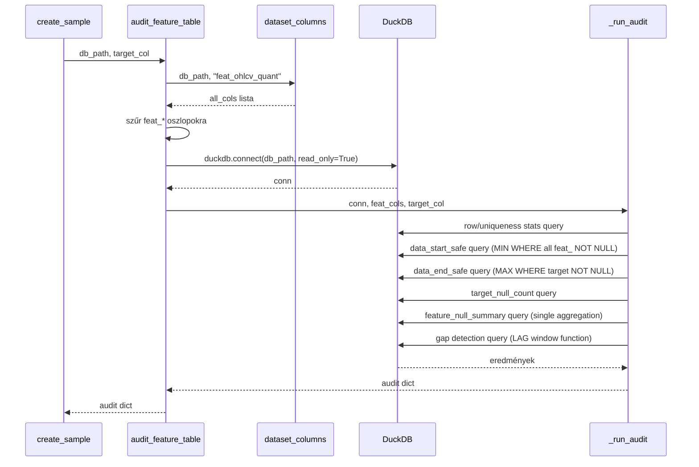

# 5420 — Feature Table Audit

A feature tábla auditor meghatározza a biztonságos adathatárokat és minőségi
metrikákat a `feat_ohlcv_quant` és `target` táblákra. Csak read-only DuckDB
lekérdezéseket futtat — nincs Polars, nincs pandas.
Forrás: [sampling/audit.py](../../src/modeling/sampling/audit.py)

Metodológiai háttér: [5400_sampling.md](../methodology_doc/5400_sampling.md)

---

## Overview



---

## `audit_feature_table(db_path, target_col)`

Auditálja a `feat_ohlcv_quant` és `target` táblákat a biztonságos sampling határok
meghatározásához.

| Paraméter | Típus | Leírás |
|-----------|-------|--------|
| `db_path` | `str` | Abszolút útvonal az asset `.duckdb` fájlhoz |
| `target_col` | `str` | Target oszlop neve (pl. `long_mfe_fw60`) |

### Return dict

| Kulcs | Típus | Leírás |
|-------|-------|--------|
| `data_start_safe` | `str \| None` | Első `open_time` ahol az összes `feat_*` oszlop NOT NULL |
| `data_end_safe` | `str \| None` | Utolsó `open_time` ahol a `target_col` NOT NULL |
| `row_count` | `int` | Összes sor a `feat_ohlcv_quant`-ban |
| `unique_timestamps` | `int` | Egyedi `open_time` értékek száma |
| `duplicate_count` | `int` | `row_count - unique_timestamps` |
| `target_null_count` | `int` | Sorok száma ahol `target_col IS NULL` |
| `feature_null_summary` | `dict[str, float]` | Null-arány minden `feat_*` oszlopra |
| `gap_count` | `int` | 1 percnél nagyobb időbeli ugrások száma |
| `gap_minutes_total` | `int` | Összes hiányzó perc az ugrások felett |

### `data_start_safe` és `data_end_safe` — miért fontosak

- **`data_start_safe`**: az első perc ahol az összes feature NOT NULL. A gördülő
  ablakos feature-ök (pl. 200-perces moving average) `min_periods` hosszú
  null-periódussal indulnak — ezeket ki kell zárni a training-ből.

- **`data_end_safe`**: az utolsó perc ahol a target NOT NULL. A `fw60` target az
  utolsó 60 percben szükségszerűen NULL (nincs elég jövőbeli adat) — ez jelzi
  a tényleges adatvégét.

---

## `_run_audit()` — belső függvény

Nem publikus, de a logika megértéséhez fontos. Egyetlen nyílt connection-ön fut
minden SQL lekérdezést.

### Gap detection SQL

```sql
WITH lagged AS (
    SELECT
        open_time,
        LAG(open_time) OVER (ORDER BY open_time) AS prev_time
    FROM feat_ohlcv_quant
)
SELECT
    COUNT(*) AS gap_count,
    COALESCE(SUM(DATEDIFF('minute', prev_time, open_time) - 1), 0) AS gap_minutes_total
FROM lagged
WHERE prev_time IS NOT NULL
  AND DATEDIFF('minute', prev_time, open_time) > 1
```

A LAG window function minden sorhoz meghatározza az előző `open_time`-ot. A `WHERE`
feltétel szűri ki azokat a sorpárokat ahol a különbség > 1 perc — ezek a hiányzó
1-perces gyertyák. A `SUM(diff - 1)` adja a ténylegesen hiányzó percek számát.

### ValueError feltétel

Ha a `feat_ohlcv_quant` táblában nincs egyetlen `feat_*` oszlop sem:
```
ValueError: No feat_* columns found in feat_ohlcv_quant: <db_path>
```
