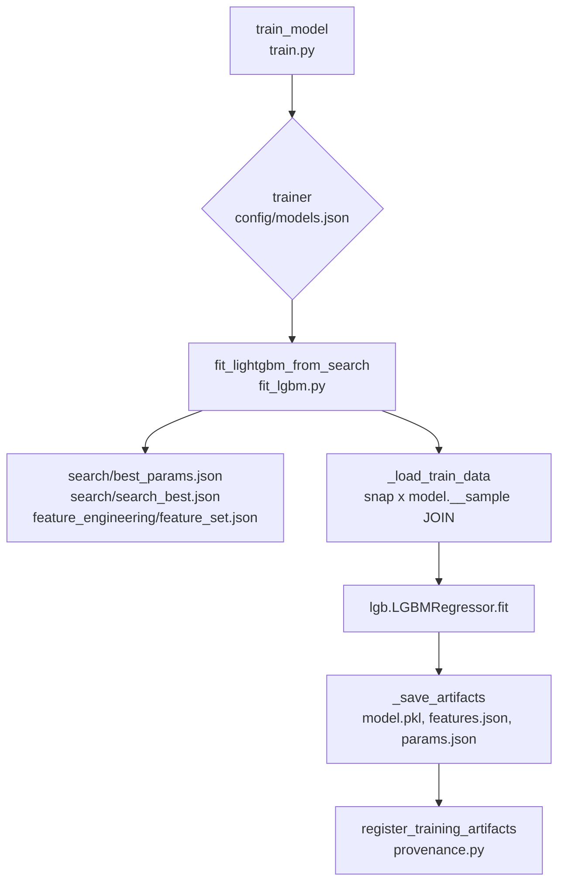
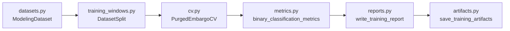
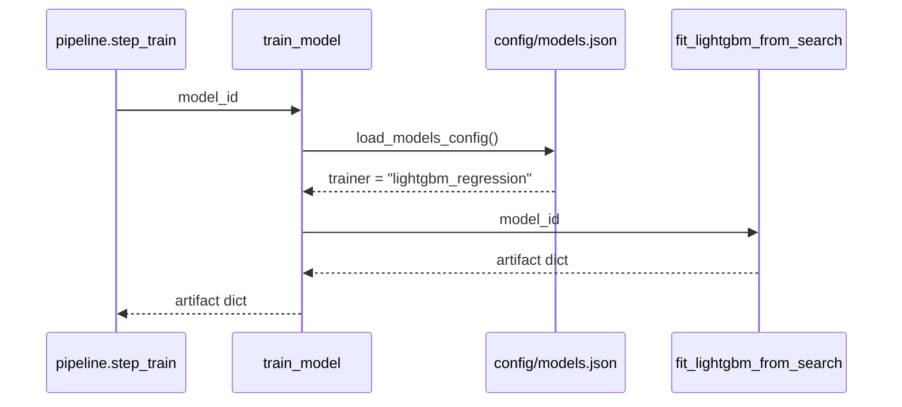
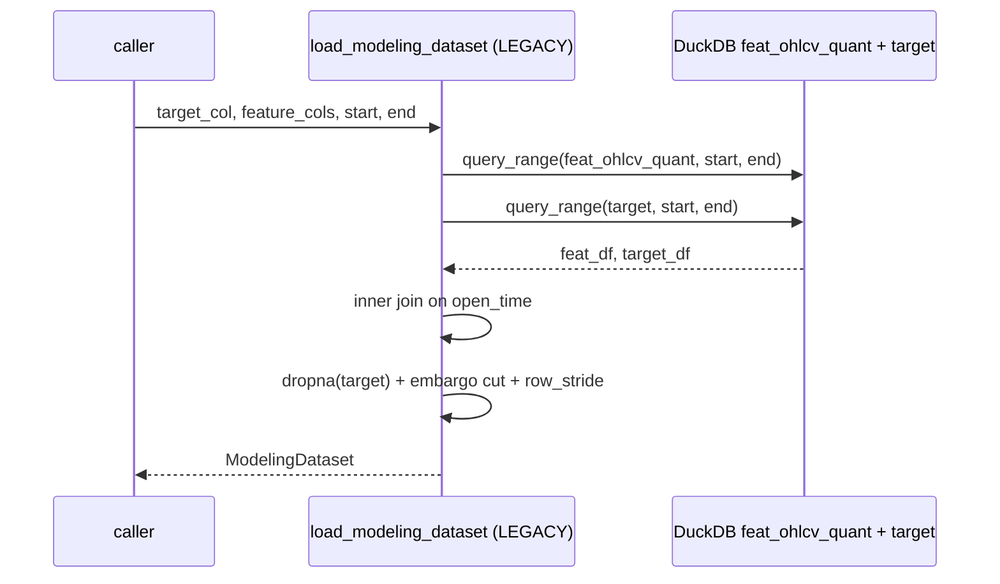
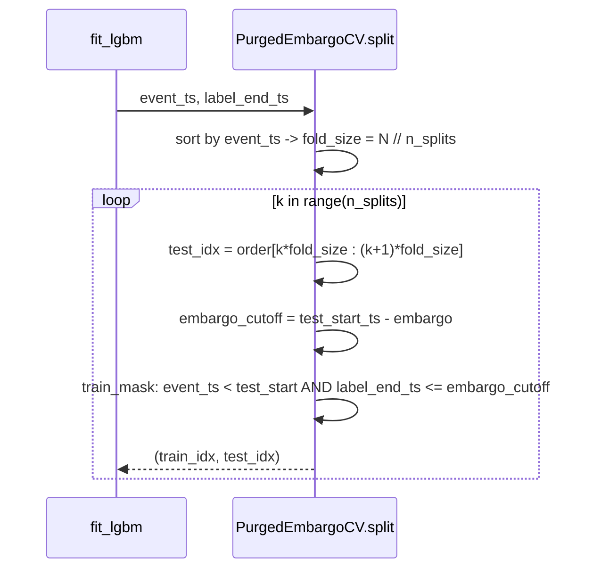
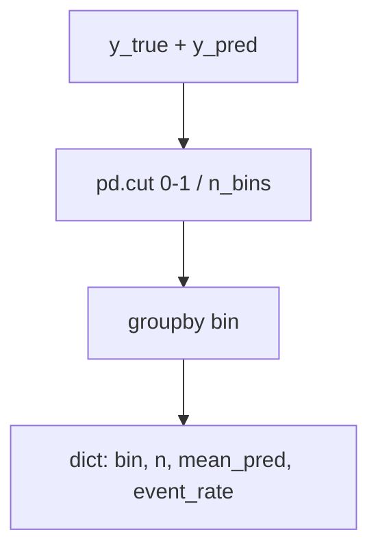
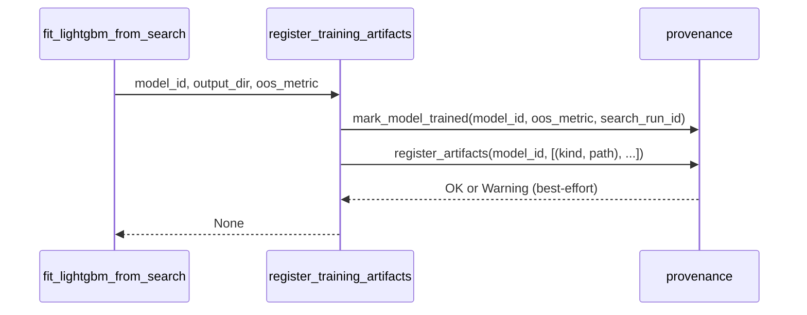
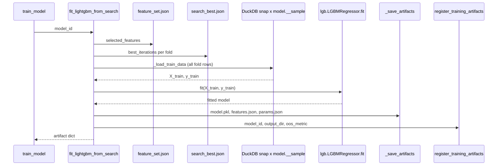

# 5510 — Training Submodule

A `src/modeling/training/` csomag a végső modell illesztéséhez és értékeléséhez
szükséges összes komponenst tartalmazza: adatbetöltés, CV séma, metrikák,
artifact-mentés, HTML riport és LightGBM fit implementáció.

Forrás: `src/modeling/training/` — train.py, datasets.py, cv.py, metrics.py,
training_windows.py, artifacts.py, reports.py, fit_lgbm.py

Metodológiai háttér: [5600_model_training.md](../methodology_doc/5600_model_training.md)

---

## Overview

---

## `train.py` — Dispatcher

### `train_model(model_id)`

Betölti a `config/models.json`-ból a modell `trainer` mezőjét, és a megfelelő
trainer implementációhoz delegál. Jelenleg csak `lightgbm_regression` támogatott.

| Paraméter | Típus | Leírás |
|-----------|-------|--------|
| `model_id` | `str` | Modell kulcs a `config/models.json`-ból |

Returns: `dict` — legalább `model_id`, `n_estimators`, `n_features`,
`selected_features`, `artifact_dir` mezőkkel.

Raises: `ValueError` ha `model_id` nem található vagy a trainer nem támogatott.

---

## `datasets.py` — Adat betöltés

### `ModelingDataset` (frozen dataclass)

Tartalmazza az illesztéshez szükséges feature + target mátrixot, azonos indexszel.

| Mező | Típus | Leírás |
|------|-------|--------|
| `open_time` | `pd.Series` | Timestamp sorozat |
| `X` | `pd.DataFrame` | Feature mátrix |
| `y` | `pd.Series` | Target sorozat |
| `target_col` | `str` | Target oszlop neve |
| `feature_cols` | `list[str]` | Feature oszlopok listája |

`to_frame() -> pd.DataFrame` — open_time + target + feature-ök egyetlen DataFrame-ben.

### `load_modeling_dataset(...)` — LEGACY

> **LEGACY path:** Ez a függvény a `feat_ohlcv_quant` + `target` táblákból olvas
> (nem snapshot-native). Az aktív `pipeline.py` **nem hívja** ezt a search/train
> lépéseknél — azok a `snap ⋈ model.__sample` JOIN-t használják közvetlenül
> (lásd `lgbm_search._load_search_dataset` és `fit_lgbm._load_train_data`).
> Ez a függvény deprecated-nek tekinthető; a t43 task auditálja a szükségességét.

Betölti a `feat_ohlcv_quant` (feature-ök) és `target` (label-ek) táblákat,
`open_time`-on inner join-nal összekapcsolja, és `ModelingDataset`-ként adja vissza.

| Paraméter | Típus | Default | Leírás |
|-----------|-------|---------|--------|
| `target_col` | `str` | — | Target oszlop neve (pl. `long_mfe_fw60`) |
| `feature_cols` | `list[str] \| None` | `None` | Feature oszlopok; `None` = minden `feat_*` |
| `start` | `str \| None` | `None` | Időbeli alsó határ (inkluzív), `YYYY-MM-DD HH:MM:SS` |
| `end` | `str \| None` | `None` | Időbeli felső határ (inkluzív) |
| `embargo_minutes` | `int` | `0` | Levágjuk az utolsó N percet (forward-leakage elkerülése) |
| `row_stride` | `int` | `1` | Minden N-edik sort vesz (1 = minden sor) |
| `dropna_features` | `bool` | `False` | Null feature-t tartalmazó sorok kizárása |
| `db_path` | `str \| None` | `None` | `.duckdb` útvonal override; `None` = asset config |
| `asset_id` | `str \| None` | `None` | Asset kulcs |

Returns: `ModelingDataset` — üres DataFrame-ekkel tér vissza ha nincs találat.

Raises: `ValueError` — ha `target_col` / feature-ök hiányzanak, vagy `row_stride < 1`.

---

## `cv.py` — Walk-forward CV séma

### `PurgedEmbargoCV` (dataclass)

Pénzügyi idősorokhoz való walk-forward CV implementáció: purging eltávolítja azokat
a training sorokat, amelyek forward label horizontja átfedi a teszt periódust;
embargo buffer gap csökkenti a rövid távú autokorreláció szivárgást.

| Mező | Típus | Default | Leírás |
|------|-------|---------|--------|
| `n_splits` | `int` | `5` | Teszt fold-ok száma |
| `embargo` | `pd.Timedelta` | `2D` | Minimális gap az utolsó training label vége és az első teszt esemény között |

### `split(event_ts, label_end_ts)`

Yield-el `(train_idx, test_idx)` integer index tömb párokat minden fold-ra.
Fold-ok nem átfedők, egyforma méretűek, forward-only időablakok.

| Paraméter | Típus | Leírás |
|-----------|-------|--------|
| `event_ts` | `pd.Series` | Esemény timestamp-ek (`open_time`), N hosszú |
| `label_end_ts` | `pd.Series` | Label vége timestamp-ek, azonos index |

Yields: `tuple[np.ndarray, np.ndarray]` — iloc-alapú integer pozíció tömbök.

---

## `training_windows.py` — Ablak szeletelés

Perzisztált fold definíciók szerint szeleteli a `ModelingDataset`-et.
Nincs IO, nincs adatbázis.

### `DatasetSplit` (frozen dataclass)

| Mező | Típus |
|------|-------|
| `X_train` | `pd.DataFrame` |
| `y_train` | `pd.Series` |
| `X_eval` | `pd.DataFrame` |
| `y_eval` | `pd.Series` |

### `fold_split(dataset, fold)`

Egy CV fold train/valid mátrixát adja vissza az adott fold dict (`train_start`,
`train_end`, `valid_start`, `valid_end`) alapján.

| Paraméter | Típus | Leírás |
|-----------|-------|--------|
| `dataset` | `ModelingDataset` | Teljes dataset |
| `fold` | `dict` | Fold határok (`train_start`, `train_end`, `valid_start`, `valid_end`) |

Returns: `DatasetSplit`

### `final_train_test_split(dataset, sample)`

A `test.start` / `test.end` alapján elválasztja a pre-test training adatokat és a
végső holdout test adatokat.

| Paraméter | Típus | Leírás |
|-----------|-------|--------|
| `dataset` | `ModelingDataset` | Teljes dataset |
| `sample` | `dict` | `{"test": {"start": ..., "end": ...}}` struktúrájú dict |

Returns: `DatasetSplit`

### `fold_sample_size_row(fold, split)`

CSV/riport célú sor dict-et ad vissza a fold metaadataival és minta méretekkel.

Returns: `dict` — `fold`, `train_start`, `train_end`, `valid_start`, `valid_end`,
`train_n`, `train_positive_rate`, `valid_n`, `valid_positive_rate`.

### `between(series, start, end)`

Inkluzív timestamp maszk. `pd.Series` of bool.

---

## `metrics.py` — Bináris osztályozási metrikák

### `binary_classification_metrics(y_true, y_pred, lift_percentiles, calibration_bins)`

Egységes metrika dict-et számít bináris tények és becsült valószínűségek alapján.
Nullákat kizárja, clip-eli a predikciót `[1e-15, 1-1e-15]` tartományra.

| Paraméter | Típus | Default | Leírás |
|-----------|-------|---------|--------|
| `y_true` | array-like | — | Bináris ground truth |
| `y_pred` | array-like | — | Becsült valószínűségek |
| `lift_percentiles` | `tuple[float, ...]` | `(0.01, 0.05, 0.10)` | Top-N% lift számítás határai |
| `calibration_bins` | `int` | `10` | Kalibrációs bin-ek száma |

Returns: `dict` — `n`, `positive_count`, `negative_count`, `positive_rate`,
`roc_auc`, `pr_auc`, `log_loss`, `brier_score`, `lift` (dict), `calibration` (list[dict]).

Raises: `ValueError` ha a minta üres a nullák kizárása után.

### `lift_at_percentiles(y_true, y_pred, percentiles)`

Top-N%-os predikciók event-rate lift-jét számítja a baseline-hoz képest.

Returns: `dict` — pl. `{"top_5pct": {"top_n": 42, "event_rate": 0.35, "lift": 2.1}, ...}`

### `calibration_table(y_true, y_pred, n_bins)`

Átlagos predikált valószínűséget és tényleges event-rate-t hasonlít össze
egyenlő-szélességű bin-ekben (0–1 tartomány lineárisan felosztva).

Returns: `list[dict]` — `bin`, `n`, `mean_pred`, `event_rate` mezőkkel.

---

## `artifacts.py` — Artifact mentés és regisztrálás

### `save_training_artifacts(output_dir, model, feature_cols, cv_df, artifacts, ...)`

Standard training artifact-okat ment el a `models/<model_id>/` alkönyvtárba:
`model.pkl`, `features.json`, `metrics.json`, `cv_results.csv`; opcionálisan
`params.json` és `validation_predictions.csv`.

| Paraméter | Típus | Leírás |
|-----------|-------|--------|
| `output_dir` | `str \| Path` | Célkönyvtár |
| `model` | `Any` | Illesztett modell objektum (pickle-elhető) |
| `feature_cols` | `list[str]` | Input feature-ök listája |
| `cv_df` | `pd.DataFrame` | CV eredmények DataFrame |
| `artifacts` | `dict` | Metrics + meta dict |
| `selected_features` | `list[str] \| None` | FE által kiválasztott feature-ök (opcionális) |
| `model_params` | `dict \| None` | Modell hyperparaméterek (opcionális) |
| `validation_predictions_df` | `pd.DataFrame \| None` | Best-param valid predikciók (opcionális) |

### `register_training_artifacts(model_id, output_dir, oos_metric, search_run_id, asset_id)`

Best-effort provenance: beírja a training artifact file path-okat `reg.artifacts`-ba
és a modellt `trained`-nek jelöli `reg.models`-ben. Hiba esetén csak warning logot
ír — a disk-en lévő artifact fájlok maradnak az igazság forrása.

| Paraméter | Típus | Leírás |
|-----------|-------|--------|
| `model_id` | `str` | Modell kulcs |
| `output_dir` | `str \| Path` | Artifact könyvtár |
| `oos_metric` | `float \| None` | Out-of-sample objektív |
| `search_run_id` | `str \| None` | Search run link (auto-resolve ha None) |
| `asset_id` | `str \| None` | Asset kulcs |

**Standard artifact fájlok (`TRAINING_ARTIFACT_FILES`):**

| Kind | Fájlnév |
|------|---------|
| `model_pkl` | `model.pkl` |
| `features` | `features.json` |
| `params` | `params.json` |
| `metrics` | `metrics.json` |
| `cv_results` | `cv_results.csv` |

---

## `reports.py` — HTML riport generálás

### `write_training_report(output_dir, model_id, target_col, sample, cv_df, ...)`

Standalone HTML riportot épít a standard training artifact-okból:
`report.html` → `output_dir/report.html`.

Tartalmaz: sample méret tábla, train/CV metrika plot (ROC AUC, PR AUC, Brier),
CV összefoglaló tábla, best-param CV teljesítmény, validáció kalibrációs szekció,
végső teljesítmény, feature fontossági tábla.

| Paraméter | Típus | Leírás |
|-----------|-------|--------|
| `output_dir` | `str \| Path` | Célkönyvtár |
| `model_id` | `str` | Modell azonosító |
| `target_col` | `str` | Target neve |
| `sample` | `dict` | Sample metadata dict (sample_id stb.) |
| `cv_df` | `pd.DataFrame` | Per-fold CV eredmények |
| `sample_sizes` | `list[dict]` | Fold méret metaadatok |
| `artifacts` | `dict` | Training artifacts dict |
| `tuning_param` | `str` | Hangolt paraméter neve (x-tengely) |
| `tuning_label` | `str` | Emberi-olvasható label a plothoz |
| `feature_rows` | `list[dict]` | Feature fontossági sorok |
| `feature_table_title` | `str` | Feature tábla fejléce |
| `tuning_xscale` | `str` | `"linear"` vagy `"log"` (default `"linear"`) |
| `auxiliary_columns` | `dict[str, str] \| None` | Extra CV oszlopok és aggregációs módszerük |

### `cv_summary(cv_df, tuning_param, auxiliary_columns)`

Fold-onkénti CV eredményeket aggregál egy hangolási paraméter szerint.
Returns: `pd.DataFrame` — átlagolt train/valid metrikák paraméterértékenként.

### `validation_calibration_summary(predictions_df, n_bins)`

Equal-count probability bin-ekre osztja a validációs predikciókat, és összehasonlítja
az átlagos predikált valószínűséget a realizált target rate-tel.

Requires: `validation_predictions.csv` az output_dir-ben (`y_true`, `y_pred` oszlopok).

Returns: `pd.DataFrame` — `bin`, `n`, `pred_min`, `pred_max`, `pred_mean`,
`target_rate`, `baseline_target_rate`, `lift`.

---

## `fit_lgbm.py` — LightGBM Final Fit

### `fit_lightgbm_from_search(model_id)`

A search artifact-okból (best_params + search_best + feature_set) olvas, majd a
snap ⋈ model.__sample JOIN-on keresztül betölti a training adatot, és egyetlen
végső LightGBM modellt illeszt (nincs CV sweep).

Az `n_estimators` = round(mean(fold best_iterations) × 1.1).

| Paraméter | Típus | Leírás |
|-----------|-------|--------|
| `model_id` | `str` | Modell kulcs a `config/models.json`-ból |

Returns: `dict` — `model_id`, `n_estimators`, `n_features`, `selected_features`,
`artifact_dir`.

**Fixált LightGBM paraméterek** (nem hangolhatók):

| Paraméter | Érték |
|-----------|-------|
| `objective` | `"regression"` |
| `boosting_type` | `"gbdt"` |
| `metric` | `"rmse"` |
| `subsample_freq` | `1` |
| `force_col_wise` | `True` |
| `verbosity` | `-1` |
| `n_jobs` | `4` |

**Megjegyzés:** Az offline predikció elkülönített lépés (`modeling.predict.predict_offline`) —
a `fit` lépés nem írja a snapshot-ot (t315 architektura).

---

## Kapcsolódó fájlok

| Fájl | Tartalom |
|------|----------|
| [5600_model_training.md](../methodology_doc/5600_model_training.md) | Training metodológia |
| [5520_search.md](5520_search.md) | Hyperparameter search kód-ref |
| [5530_pipeline_predict_provenance.md](5530_pipeline_predict_provenance.md) | Pipeline, predict, provenance kód-ref |
