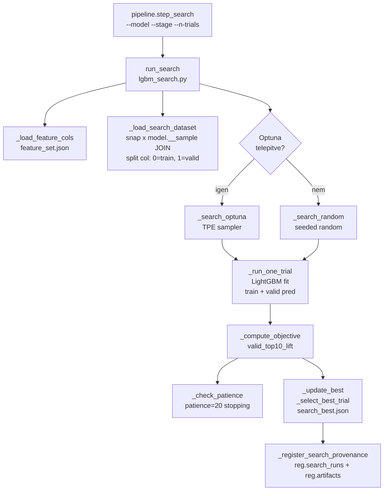
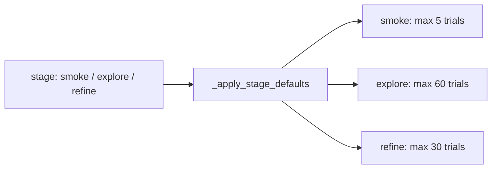
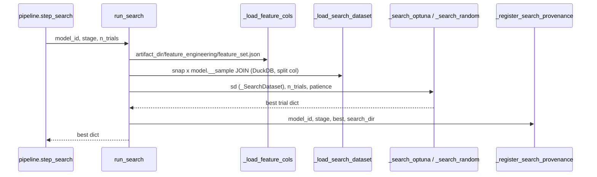
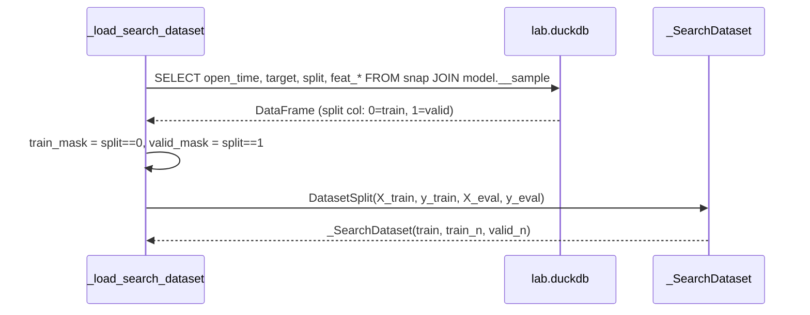
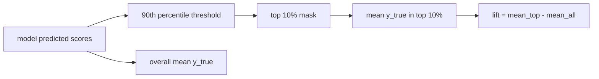
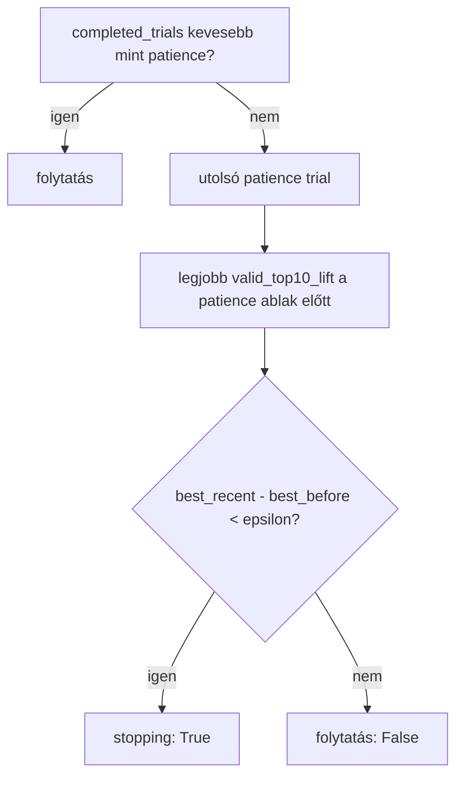
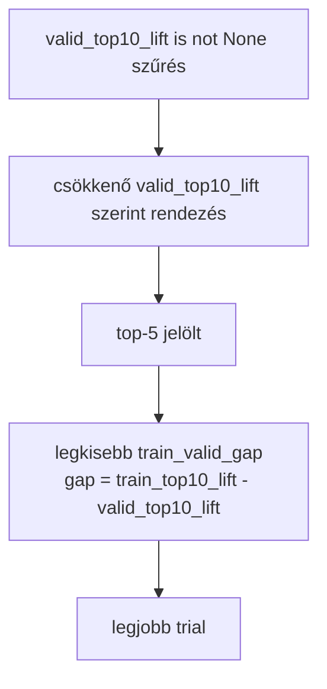

# 5520 — Hyperparameter Search

A `src/modeling/search/lgbm_search.py` valósítja meg a LightGBM hyperparameter
keresést fix train/valid split alapon, `valid_top10_lift` objektívvel. Optuna TPE
(ha telepítve van) vagy seeded random search futtatható.

Forrás:
- [search/lgbm_search.py](../../src/modeling/search/lgbm_search.py)

→ _doc_/methodology_doc/5500_hyper_param_search.md

---

## Overview





---

## `run_search(model_id, stage, n_trials, timeout_hours, row_stride, retry_failed)`

A fő belépési pont. Betölti a feature listát, betölti az adatot a snap ⋈ model.__sample
JOIN-ból (split col alapján), majd Optuna TPE vagy seeded random kereséssel iterál
trial-okon. Patience-alapú korai megállással.

| Paraméter | Típus | Default | Leírás |
|-----------|-------|---------|--------|
| `model_id` | `str` | — | Modell kulcs a `config/models.json`-ból |
| `stage` | `str` | `"smoke"` | Keresési fázis: `smoke`, `explore`, `refine` |
| `n_trials` | `int` | `100` | Maximális trial szám (`_MAX_TRIALS=100` cap érvényesül) |
| `timeout_hours` | `float \| None` | `None` | Falióra korlát (nincs ha None) |
| `row_stride` | `int \| None` | `None` | Sub-sampling stride (None = 1 = minden sor) |
| `retry_failed` | `bool` | `False` | Korábban hibás trial-ok újrafuttatása |

Returns: `dict` — legjobb trial rekord (`trial_no`, `params`, `objective_score`,
`valid_top10_lift`, `train_top10_lift`, `train_valid_gap`, `spearman_rho`, stb.).



---

## Adatbetöltés — `_load_search_dataset`

A train/valid adatot a `snap."<snapshot_id>"` ⋈ `model."<model_id>__sample"` DuckDB
JOIN-nal olvassa `open_time`-on. A sample tábla tartalmazza: `open_time`, target,
`split` (0=train, 1=valid); a snapshot tartalmazza az összes `feat_*` oszlopot.



Raises: `ValueError` ha a `split` oszlop hiányzik (sampling mode nem `train_valid_split`),
vagy ha nincs train / valid sor.

---

## `_SearchDataset` és `DatasetSplit`

### `_SearchDataset` (frozen dataclass)

A keresés belső adatstruktúrája. Egyszer épül fel (`_load_search_dataset`),
minden trial újrahasználja — nincs ismételt DB hívás.

| Mező | Típus | Leírás |
|------|-------|--------|
| `train` | `DatasetSplit` | Pre-built train/valid mátrixok |
| `train_n` | `int` | Train sorok száma |
| `valid_n` | `int` | Valid sorok száma |

### `DatasetSplit` (frozen dataclass, `modeling.training.training_windows`)

| Mező | Típus | Leírás |
|------|-------|--------|
| `X_train` | `pd.DataFrame` | Feature mátrix (train) |
| `y_train` | `pd.Series` | Target vektor (train) |
| `X_eval` | `pd.DataFrame` | Feature mátrix (valid) |
| `y_eval` | `pd.Series` | Target vektor (valid) |

---

## Objektív függvény — `valid_top10_lift`

```
objective = valid_top10_lift (magasabb = jobb)
objective_score = -valid_top10_lift (Optuna minimize irány)
```

### Top10 Lift definíció — `_compute_top10_lift(y_true, y_score)`

```
threshold = percentile(y_score, 90)
top_mask  = y_score >= threshold
top10_lift = mean(y_true[top_mask]) - mean(y_true)
```

A top 10%-os predikciók átlagos y_true értéke mínusz az overall átlag.
A lift akkor pozitív, ha a modell képes elkülöníteni a magasabb hozamú sorokat.



A `_compute_objective` a trial metrikákból csomagolja az objektívet és az audit metrikákat:

| Mező | Leírás |
|------|--------|
| `objective_score` | `-valid_top10_lift` (lower is better, Optuna minimize) |
| `valid_top10_lift` | Fő objektív |
| `train_top10_lift` | Diagnosztikai metrika |
| `train_valid_gap` | `train_top10_lift - valid_top10_lift` (overfit proxy) |
| `spearman_rho` | Spearman korreláció (valid) |
| `decile_monotonicity` | Szomszédos decilis párok monoton aránya (valid) |
| `valid_rmse` | RMSE (valid) |
| `train_rmse` | RMSE (train) |

---

## Patience stopping — `_check_patience`



| Konstans | Érték | Leírás |
|----------|-------|--------|
| `_PATIENCE` | `20` | Visszatekintési ablak (trial) |
| `_PATIENCE_EPSILON` | `0.001` | Minimális javulás threshold |

Feltétel: az utolsó `patience` trial-on belül nincs legalább `epsilon` javulás a megelőző
legjobb `valid_top10_lift`-hez képest → stopping.

---

## Legjobb trial kiválasztás — `_select_best_trial`



1. Kizárja a `valid_top10_lift` nélküli trial-okat
2. Csökkenő `valid_top10_lift` szerint rendez
3. Top-5 jelöltből a legkisebb `|train_valid_gap|`-et választja

A gap **nem** kemény cutoff — másodlagos preferencia az egyenlő teljesítményű jelöltek között.

---

## Egy trial futtatása — `_run_one_trial`

Minden paraméter kombinációhoz: LightGBM fit a train spliten, early stopping-gal,
majd train + valid predikció és metrika számítás.

**Early stopping:** `lgb.early_stopping(_ES_ROUNDS=100)` — 100 round RMSE javulás nélkül megáll.

**Metrikák:**

| Metrika | Leírás |
|---------|--------|
| `train_top10_lift` | Top10 lift a train seten |
| `valid_top10_lift` | Top10 lift a valid seten (fő objektív) |
| `train_valid_gap` | `train_top10_lift - valid_top10_lift` |
| `train_rmse` / `valid_rmse` | RMSE |
| `train_mae` / `valid_mae` | MAE |
| `spearman_rho` | Spearman korreláció (valid) |
| `decile_monotonicity` | Monoton szomszédos decilis párok aránya (valid) |
| `best_iteration` | LGB best iteration (early stopping után) |
| `top20_features` | Top 20 feature gain importance |

Learning curve: `trial_curves/trial_NNNN.json` — lecompressálva `_CURVE_MAX_POINTS=100` pontra.

---

## Paraméter tér — `_suggest_optuna_params` / `_sample_params_random`

| Paraméter | Tartomány | Skála |
|-----------|-----------|-------|
| `num_leaves` | 3 – 63 (smoke: 31) | log |
| `max_depth` | -1, 2, 3, 4, 5, 6, 8 | kategorikus |
| `min_child_samples` | 200 – 8000 | log |
| `min_child_weight` | 1e-4 – 0.1 | log |
| `min_split_gain` | 0 vagy 1e-5 – 0.1 | log (20% eséllyel 0) |
| `reg_alpha` | 1e-3 – 10 | log |
| `reg_lambda` | 1 – 100 | log |
| `subsample` | 0.45 – 0.95 | lineáris |
| `colsample_bytree` | 0.35 – 0.95 | lineáris |
| `learning_rate` | 0.005 – 0.05 | log |
| `max_bin` | 63, 127 | kategorikus |
| `path_smooth` | 1e-3 – 10 | log |
| `extra_trees` | False, True | kategorikus |

---

## Resumable keresés — hash-alapú deduplication

Minden trial paraméterkombináció + `n_features` + `row_stride` SHA256 hash-t kap
(`_make_param_hash`, 16 karakter). A `search_trials.jsonl` és `failed_trials.jsonl`
fájlokból beolvassa a korábbi futások hash-eit — duplikált trial-t nem futtat újra.

---

## Output fájlok és `search_trials.jsonl` séma

| Fájl | Tartalom |
|------|----------|
| `search/search_best.json` | Legjobb trial teljes rekordja |
| `search/best_params.json` | Legjobb paraméter dict |
| `search/search_trials.jsonl` | Minden elvégzett trial kompakt rekordja |
| `search/search_summary.csv` | Összefoglaló CSV (trial × metric) |
| `search/trial_logs/trial_NNNN.json` | Per-trial teljes log |
| `search/trial_curves/trial_NNNN.json` | Learning curve pontok (train + valid RMSE) |
| `search/failed_trials.jsonl` | Hibás trial rekordok |
| `search/optuna_study.db` | Optuna SQLite study (ha Optuna fut) |

### `search_trials.jsonl` mezők (egy sor = egy trial)

| Mező | Típus | Leírás |
|------|-------|--------|
| `trial_no` | `int` | Szekvenciális trial szám |
| `param_hash` | `str` | 16 karakteres SHA256 hash (deduplication kulcs) |
| `params` | `dict` | Hyperparaméter dict |
| `objective_score` | `float` | `-valid_top10_lift` (lower is better) |
| `valid_top10_lift` | `float` | Fő metrika — valid top10 lift |
| `train_top10_lift` | `float` | Diagnosztikai — train top10 lift |
| `train_valid_gap` | `float` | `train_top10_lift - valid_top10_lift` (overfit proxy) |
| `spearman_rho` | `float \| null` | Spearman korreláció (valid) |
| `decile_monotonicity` | `float` | Monoton decilis arány (valid) |
| `valid_rmse` | `float` | RMSE (valid) |
| `train_rmse` | `float` | RMSE (train) |
| `valid_mae` | `float` | MAE (valid) |
| `elapsed_s` | `float` | Trial futási idő másodpercben |
| `best_iteration` | `int` | LGB best iteration |

---

## Kapcsolódó fájlok

| Fájl | Tartalom |
|------|----------|
| [5500_hyper_param_search.md](../methodology_doc/5500_hyper_param_search.md) | Search metodológia |
| [5510_training.md](5510_training.md) | Training kód-ref |
| [5530_pipeline_predict_provenance.md](5530_pipeline_predict_provenance.md) | Pipeline / predict / provenance kód-ref |
| [5300_create_sample.md](5300_create_sample.md) | Sampling kód-ref (train/valid split kimenet) |
