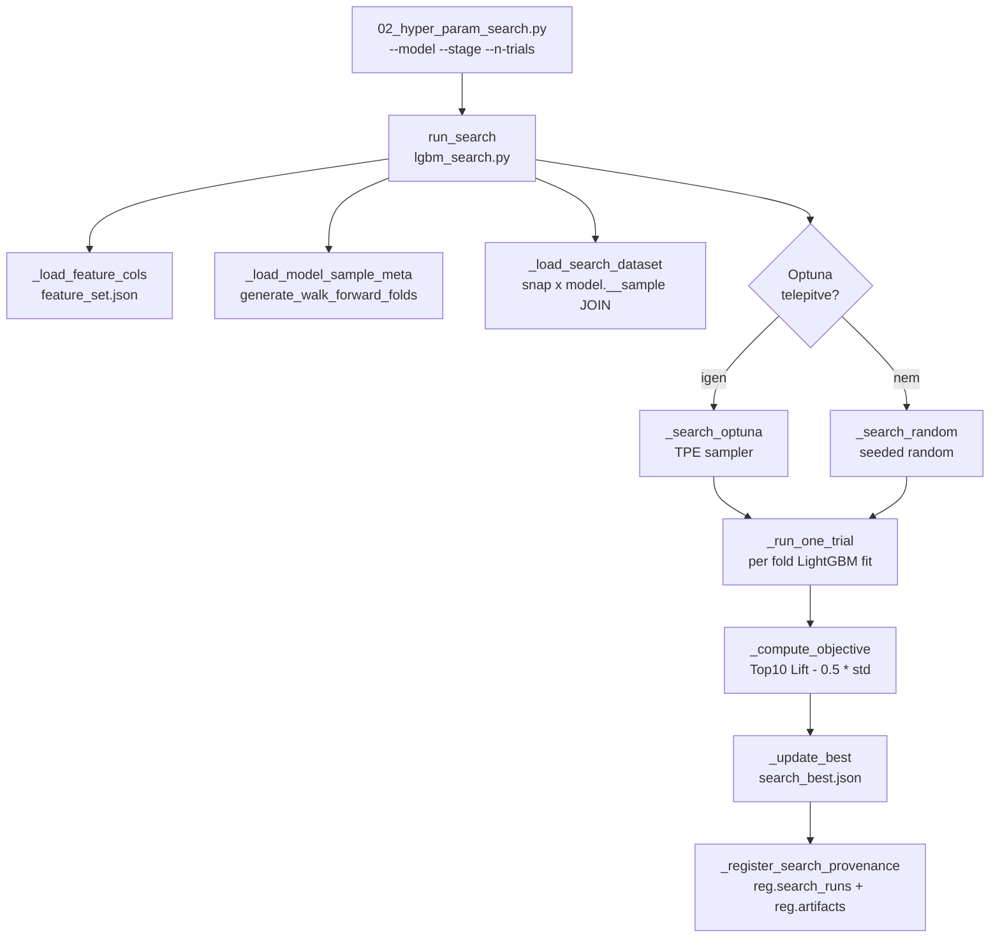
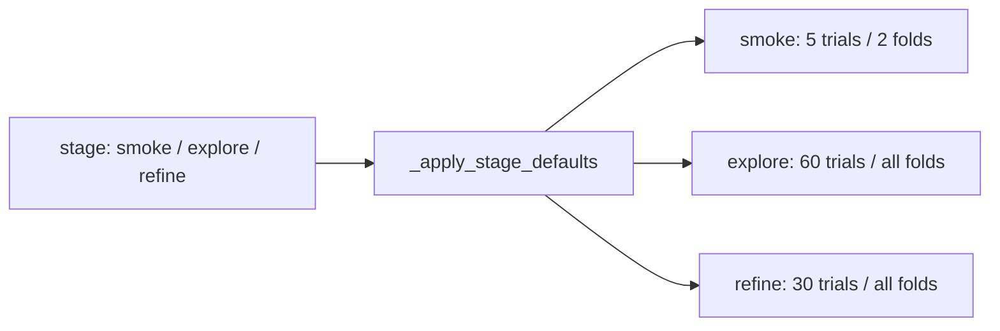
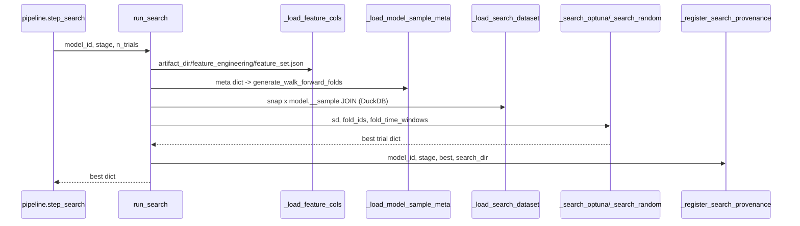
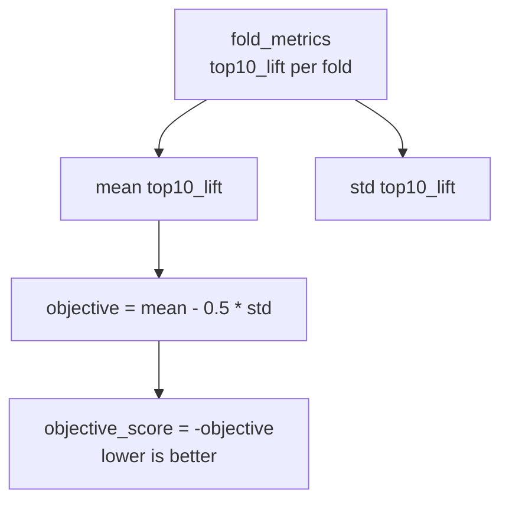

# 5520 — Hyperparameter Search

A `src/modeling/search/lgbm_search.py` és `src/modeling/02_hyper_param_search.py`
fájlok valósítják meg a LightGBM hyperparameter keresést walk-forward CV és
Top10 Lift objektívvel. Optuna TPE (ha telepítve van) vagy seeded random search
futtatható.

Forrás:
- [search/lgbm_search.py](../../src/modeling/search/lgbm_search.py)
- [02_hyper_param_search.py](../../src/modeling/02_hyper_param_search.py)

Metodológiai háttér: [5500_hyper_param_search.md](../methodology_doc/5500_hyper_param_search.md)

---

## Overview





---

## `run_search(model_id, stage, n_trials, timeout_hours, row_stride, fold_limit, retry_failed)`

A fő belépési pont. Betölti a feature listát, meghatározza a fold struktúrát
(`generate_walk_forward_folds`), betölti a CV adatot a snap ⋈ model.__sample
JOIN-ból, majd Optuna TPE vagy seeded random kereséssel iterál `n_trials` trial-on.

| Paraméter | Típus | Default | Leírás |
|-----------|-------|---------|--------|
| `model_id` | `str` | — | Modell kulcs a `config/models.json`-ból |
| `stage` | `str` | `"smoke"` | Keresési fázis: `smoke`, `explore`, `refine` |
| `n_trials` | `int` | `60` | Maximális trial szám (stage cap érvényesül) |
| `timeout_hours` | `float \| None` | `None` | Falióra korlát (nincs ha None) |
| `row_stride` | `int \| None` | `None` | Mintavételezés: minden N-edik sor (1 = teljes) |
| `fold_limit` | `int \| None` | `None` | Első N fold használata (default: stage default) |
| `retry_failed` | `bool` | `False` | Korábban hibás trial-ok újrafuttatása |

Returns: `dict` — legjobb trial rekord (`trial_no`, `params`, `objective_score`,
`mean_top10_lift`, `std_top10_lift`, `fold_summary`, stb.).



---

## Adatbetöltés — `_load_search_dataset`

A CV adatot a `snap."<snapshot_id>"` ⋈ `model."<model_id>__sample"` DuckDB JOIN-nal
olvassa (terv 5.1). A sample tábla tartalmazza: `open_time`, target, `fold_id`; a
snapshot tartalmazza az összes feature-t.

**I2 (logging):** A JOIN pontosan annyi sort ad vissza, mint amennyi a `model.__sample`-ben
van — a rowcount eltérés logger warning-ot generál (explicit assert t43 scope-ja).

Returns: `_SearchDataset(dataset: ModelingDataset, fold_ids: pd.Series[Int8])`

---

## Fold struktúra meghatározása — `_load_model_sample_meta`

Nem az artifact fájlból olvassa a fold ablakokat, hanem a `config/models.json`
`sampling` szekciójából determinisztikusan újragenerálja őket a
`generate_walk_forward_folds` hívásával.

| Kulcs | Leírás |
|-------|--------|
| `fold_time_windows` | Walk-forward fold ablak lista |
| `purge_minutes` | Purge zóna percben |
| `n_folds` | Fold-ok száma |

---

## Objektív függvény — `_compute_objective`

```
objective = mean(top10_lift_folds) - 0.5 * std(top10_lift_folds)
objective_score = -objective   (Optuna minimize irány)
```

A Top10 Lift a top 10%-os predikciók átlagos y_true értéke mínusz az overall átlag.
A stabilitási büntetés (`_LIFT_LAMBDA = 0.5 × std`) megakadályozza, hogy a search
fold-szenzitív megoldásra konvergáljon.



Kiegészítő metrikák (nem az objektív részei, de naplózva):
`mean_spearman_rho`, `mean_decile_monotonicity`, `mean_valid_rmse`, `mean_valid_mae`.

---

## Egy trial futtatása — `_run_one_trial`

Minden paraméter kombinációhoz végigfut az összes fold-on (vagy a `fold_limit`-ig).
Minden fold-ra: LightGBM fit early stopping-gal (`_ES_ROUNDS = 100`), train +
valid pred számítás, rank audit metrikák, feature importance, learning curve export
(`trial_curves/`).

**Early stopping:** `lgb.early_stopping(100)` — 100 round javulás nélkül megáll.

**Feature importance:** Top 20 feature split + gain alapján, fold-onként összesítve.

---

## Fold split — két mód

### `_fold_split_walk_forward(sd, fold_k, fold_time_windows, purge_minutes)`

Az explicit időablak alapú walk-forward CV fold split. A purge zóna: `train_end`
és `valid_start` közötti időszak, plusz a `valid_end` utáni `purge_minutes` perc.

| Zóna | Maszk |
|------|-------|
| `valid_mask` | `open_time in [valid_start .. valid_end]` |
| `purge_mask` | `(train_end < t < valid_start)` OR `(valid_end < t <= valid_end + delta)` |
| `train_mask` | `~valid_mask AND ~purge_mask` |

### `_fold_split_4fold(sd, fold_k, fold_week_assignments, purge_minutes)`

Hét-alapú fold split: a `fold_week_assignments` dict-ből olvassa ki az adott
fold héthatárait, és a purge zónát heti határok körül alkalmazza.

---

## Paraméter tér — `_suggest_optuna_params` / `_sample_params_random`

| Paraméter | Tartomány | Skála |
|-----------|-----------|-------|
| `num_leaves` | 3 – 63 (smoke: 31) | log |
| `max_depth` | -1, 2, 3, 4, 5, 6, 8 | kategorikus |
| `min_child_samples` | 200 – 8000 | log |
| `min_child_weight` | 1e-4 – 0.1 | log |
| `min_split_gain` | 0 vagy 1e-5 – 0.1 | log (20% eséllyel 0) |
| `reg_alpha` | 1e-3 – 10 | log |
| `reg_lambda` | 1 – 100 | log |
| `subsample` | 0.45 – 0.95 | lineáris |
| `colsample_bytree` | 0.35 – 0.95 | lineáris |
| `learning_rate` | 0.005 – 0.05 | log |
| `max_bin` | 63, 127 | kategorikus |
| `path_smooth` | 1e-3 – 10 | log |
| `extra_trees` | False, True | kategorikus |

---

## Resumable keresés — hash-alapú deduplication

Minden trial paraméterkombináció + `n_features` + `row_stride` SHA256 hash-t
(`_make_param_hash`, 16 karakter). A `search_trials.jsonl` és `failed_trials.jsonl`
fájlokból beolvassa a korábbi futások hash-eit — duplikált trial-t nem futtat.

---

## Output fájlok

| Fájl | Tartalom |
|------|----------|
| `search/search_best.json` | Legjobb trial teljes rekordja |
| `search/best_params.json` | Legjobb paraméter dict |
| `search/search_trials.jsonl` | Minden elvégzett trial kompakt rekordja |
| `search/search_summary.csv` | Összefoglaló CSV (trial × metric) |
| `search/trial_logs/trial_NNNN.json` | Per-trial teljes log |
| `search/trial_curves/trial_NNNN_fold_NN.json` | Learning curve pontok |
| `search/failed_trials.jsonl` | Hibás trial rekordok |
| `search/optuna_study.db` | Optuna SQLite study (ha Optuna fut) |

---

## CLI — `02_hyper_param_search.py`

| Argumentum | Típus | Default | Leírás |
|------------|-------|---------|--------|
| `--model` | `str` | kötelező | Modell ID |
| `--stage` | `str` | `smoke` | `smoke` / `explore` / `refine` |
| `--n-trials` | `int` | `60` | Max trial szám |
| `--timeout-hours` | `float` | `None` | Falióra korlát |
| `--row-stride` | `int` | `None` | Minden N-edik sor |
| `--fold-limit` | `int` | `None` | Első N fold |
| `--retry-failed` | flag | `False` | Hibás trial-ok újrafuttatása |

```bash
uv run python src/modeling/02_hyper_param_search.py --model <model_id> --stage explore --n-trials 60
uv run python src/modeling/02_hyper_param_search.py --model <model_id> --stage refine --n-trials 30 --timeout-hours 4
```

---

## Kapcsolódó fájlok

| Fájl | Tartalom |
|------|----------|
| [5500_hyper_param_search.md](../methodology_doc/5500_hyper_param_search.md) | Search metodológia |
| [5510_training.md](5510_training.md) | Training kód-ref |
| [5530_pipeline_predict_provenance.md](5530_pipeline_predict_provenance.md) | Pipeline / predict / provenance kód-ref |
| [4100_quant_train.md](4100_quant_train.md) | quant_train tábla + I1-I7 invariáns összefoglaló |
