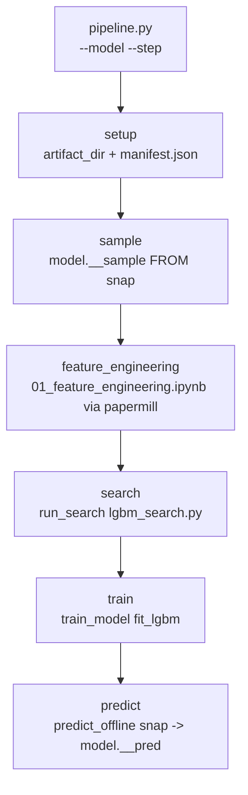
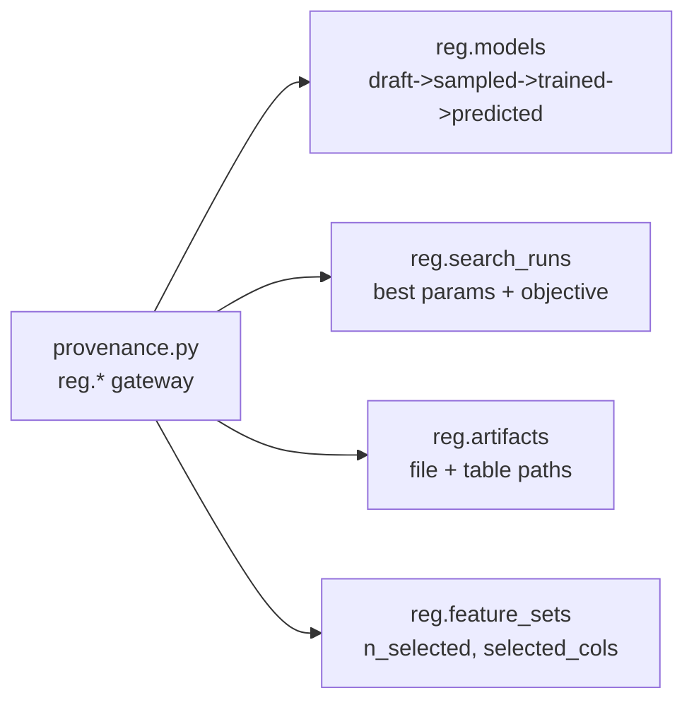
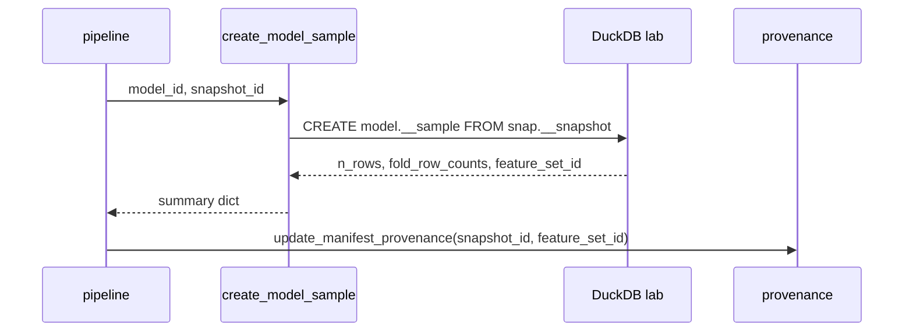
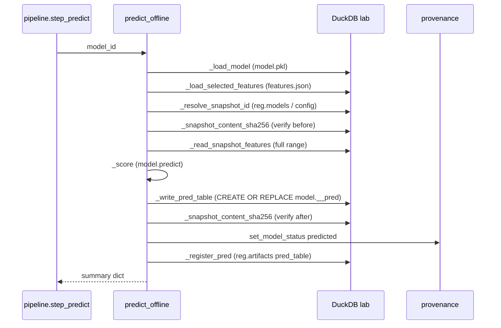
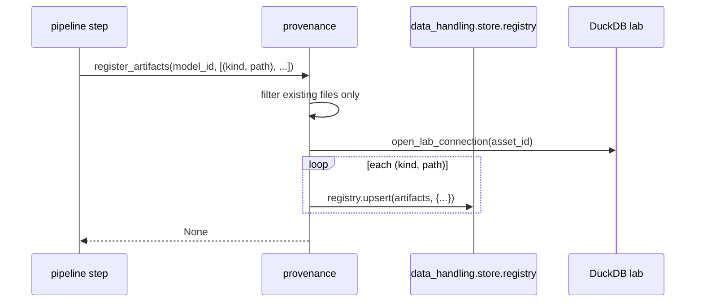

# 5530 — Pipeline, Offline Predict, Provenance

Három összefüggő modul, amelyek a modell fejlesztési pipeline lépéseit orkestrálják,
az offline predikciót elvégzik, és a provenance registry-t frissítik.

Forrás:
- [pipeline.py](../../src/modeling/pipeline.py)
- [predict.py](../../src/modeling/predict.py)
- [provenance.py](../../src/modeling/provenance.py)
- [03_fit_model.py](../../src/modeling/03_fit_model.py) — vékony CLI wrapper a `train_model` köré

Metodológiai háttér: [5600_model_training.md](../methodology_doc/5600_model_training.md) |
[5700_offline_prediction.md](../methodology_doc/5700_offline_prediction.md) |
[5000_modelling.md](../methodology_doc/5000_modelling.md)

---

## Overview — Pipeline lépések





---

## `pipeline.py` — Pipeline Orchestrátor

### `_parse_args()`

CLI argumentum parser. Minden step futtatható önállóan (`--step`) vagy sorban
(`--step` nélkül = összes step).

**Elérhető steps:** `setup`, `sample`, `feature_engineering`, `search`, `train`, `predict`

| Argumentum | Default | Leírás |
|------------|---------|--------|
| `--model` | kötelező | Modell ID |
| `--step` | `None` (összes) | Egyetlen step futtatása |
| `--stage` | `smoke` | Search stage (csak `search` stepnél) |
| `--n-trials` | `60` | Max trial (csak `search` stepnél) |
| `--timeout-hours` | `None` | Falióra korlát (search) |
| `--fold-limit` | `None` | Fold limit (search) |
| `--snapshot` | `None` | Snapshot ID override (sample stepnél) |

```bash
uv run python src/modeling/pipeline.py --model <model_id>
uv run python src/modeling/pipeline.py --model <model_id> --step search --stage explore --n-trials 60
uv run python src/modeling/pipeline.py --model <model_id> --step train
```

### `step_setup(model_id, meta, artifact_dir)`

Létrehozza az artifact könyvtárat és megírja a `manifest.json`-t. Provenance:
`reg.models` draft sor + manifest artifact regisztráció.

**`manifest.json` mezői:** `model_id`, `display_name`, `description`, `asset_id`,
`target_name`, `family`, `trainer`, `sampling`, `created_at`, `pipeline_status`.

### `step_sample(model_id, artifact_dir, snapshot_id)`

Létrehozza a `model."<model_id>__sample"` táblát egy immutable snapshot-ból
(`create_model_sample`). A sampling.snapshot_id a `config/models.json`-ból jön,
vagy `--snapshot` CLI argumentummal felülírható.



### `step_feature_engineering(model_id, meta, artifact_dir)`

Futtatja a `01_feature_engineering.ipynb` notebookot papermill-lel, majd Quarto-val
HTML-lé rendereli. A notebook a `snap."<snapshot_id>" ⋈ model."<model_id>__sample"`
joinból materializál egy lokális `quant_train` TEMP TABLE munkatáblát
(`materialize_sample_scoped_quant_train` → `sample_scope.py`), így a feature-szelekció
ugyanarra a modell-scope-ra épül, mint a search/train/predict.

**I1 kikényszerítve:** `sample_scope.py` ellenőrzi, hogy
`COUNT(TEMP quant_train) == COUNT(model.__sample)` — eltérés esetén `RuntimeError`.

A notebook a `feature_set.json["provenance"]` blokkba írja:

| Mező | Értéke |
|------|--------|
| `snapshot_id` | A forrás snapshot azonosítója |
| `sample_table` | `model."<model_id>__sample"` |
| `sample_rows` | `model.__sample` rowcount |
| `joined_rows` | `snap ⋈ model.__sample` rowcount (== `sample_rows`, I1) |
| `min_open_time` | Input időtartam eleje |
| `max_open_time` | Input időtartam vége |
| `source_contract` | `"snap ⋈ model.__sample"` |

Provenance: `link_feature_set` + notebook/html artifact regisztráció.

Részletes invariáns összefoglaló: → [4100_quant_train.md](4100_quant_train.md#invariánsok--sample-scoped-pipeline)

### `step_search(model_id, stage, n_trials, timeout_hours, fold_limit)`

Hívja `run_search`-t a `modeling.search.lgbm_search` modulból. Manifest status:
`search_done`.

### `step_train(model_id)`

Hívja `train_model`-t a `modeling.training.train` modulból. Manifest status:
`train_done`.

### `step_predict(model_id)`

Hívja `predict_offline`-t a `modeling.predict` modulból. Manifest status:
`predict_done`.

---

## `predict.py` — Offline Predikció

### `predict_offline(model_id, verify_snapshot=True)`

A végső illesztett modell score-olja a teljes immutable snapshot tartományát, és az
eredményt a `model."<model_id>__pred"` DuckDB táblába írja (plan 5 step 6).

A snapshot NEM módosul — a predikció elkülönített tábla. Az `open_time`-on keresztül
`snap ⋈ model.__pred` JOIN-nal kapcsolható össze.

**Fontos asszimmetria (I3):** A predict step szándékosan a snapshot **teljes range-ét**
score-olja — **nem** csak a `model.__sample` sorait. Ez helyes: az offline prediction
célja az összes historikus bar előrejelzése (utólagos kiértékeléshez, strategy
backtesthez). A sample scope csak a modell-fejlesztési lépésekre vonatkozik (FE,
search, train).

**I3 kikényszerítve:** `verify_snapshot=True` esetén a snapshot `content_sha256`
hash-e a predict előtt és után egyezik — ha eltér, `ValueError` (immutability sértve).

| Paraméter | Típus | Default | Leírás |
|-----------|-------|---------|--------|
| `model_id` | `str` | — | Modell kulcs (már betanított modell) |
| `verify_snapshot` | `bool` | `True` | Snapshot content hash ellenőrzése predict előtt/után |

Returns: `dict` — `model_id`, `snapshot_id`, `pred_table`, `n_rows`, `n_features`,
`snapshot_immutable`.

Raises: `ValueError` — ha modell/snapshot hiányzik, artifact fájlok nem találhatók,
a snapshot üres, vagy (verify=True esetén) a snapshot hash megváltozott.



### Snapshot immutability ellenőrzés

`_snapshot_content_sha256`: Újraszámítja a snapshot tábla sorait `to_json(t)` per
sor, `open_time`-on rendezve, SHA256 hash-elve. Összehasonlítja a `reg.snapshots`
tárolt értékével. Ha eltér: `ValueError` (immutability megsértve).

### Pred table séma

| Oszlop | Típus | Leírás |
|--------|-------|--------|
| `open_time` | Timestamp | Predikciós időpont |
| `pred` | DOUBLE | Modell predikció (regresszió) |

---

## `provenance.py` — Registry Gateway

A modeling pipeline oldaláról a `reg.*` táblákba (DuckDB lab) ír. Best-effort
szemantika: hiba esetén warning logot ír, de soha nem abort-olja a pipeline lépést.

### Model életciklus státuszok

`draft` → `sampled` → `trained` → `predicted`

### `register_model_draft(model_id, meta, artifact_dir)`

`reg.models` draft sor upsert + manifest provenance (`snapshot_id`, `content_sha256`).
Hívás: `pipeline.step_setup`.

### `set_model_status(model_id, status, asset_id)`

`reg.models.status` frissítése a modell életciklus láncon.

### `mark_model_trained(model_id, oos_metric, search_run_id, asset_id)`

`reg.models` upsert: `status='trained'`, `oos_metric`, `search_run_id`.

### `link_feature_set(model_id, asset_id)`

Az FE által kiválasztott feature set-et linkeli a modellhez `reg.models`-ben,
és upsert-el `reg.feature_sets`-be. A `feature_set_id`-t a
`snapshot_sampler.build_feature_set_id` segítségével deriválja.

Returns: `str | None` — a linkelt `feature_set_id`, vagy None ha nincs FE szelekcó.

### `latest_search_run_id(model_id, asset_id)`

A legutóbbi `reg.search_runs` bejegyzés ID-ját adja vissza a modellhez
(`updated_at DESC LIMIT 1`). A train step anélkül is fut, ha nincs search run.

### `register_search_run(model_id, stage, best, asset_id)`

`reg.search_runs` upsert: `search_run_id = "<model_id>__search_<stage>"`,
`objective`, `best_params`, `status='candidate'`.

Returns: `str` — a `search_run_id`.

### `register_artifacts(model_id, artifacts, asset_id)`

File path-okat regisztrál `reg.artifacts`-ba. Csak létező fájlokat rögzít;
hiányzó path-okat kihagyja. `artifact_id = "<model_id>__<kind>"`.

| Paraméter | Típus | Leírás |
|-----------|-------|--------|
| `model_id` | `str` | Modell kulcs |
| `artifacts` | `list[tuple[str, Path \| str]]` | `(kind, path)` párok |
| `asset_id` | `str \| None` | Asset kulcs |



### `update_manifest_provenance(artifact_dir, snapshot_id, feature_set_id, content_sha256)`

Csak a megadott (nem-None) mezőket írja bele a `manifest.json` `provenance` szekciójába.
Idempotens — korábbi mezőket nem írja felül.

---

## `03_fit_model.py` — CLI Wrapper

Vékony CLI wrapper a `train_model` köré. Önállóan futtatható, de a `pipeline.py --step train`
ugyanezt csinálja.

```bash
uv run python src/modeling/03_fit_model.py --model <model_id>
```

Output: `Model trained`, `n_estimators`, `n_features`, `Output` path a konzolra.

---

## Kapcsolódó fájlok

| Fájl | Tartalom |
|------|----------|
| [5600_model_training.md](../methodology_doc/5600_model_training.md) | Training metodológia |
| [5700_offline_prediction.md](../methodology_doc/5700_offline_prediction.md) | Offline predikció metodológia |
| [5000_modelling.md](../methodology_doc/5000_modelling.md) | Modellezési pipeline módszertani háttér |
| [5510_training.md](5510_training.md) | Training submodule kód-ref |
| [5520_search.md](5520_search.md) | Hyperparameter search kód-ref |
| [4100_quant_train.md](4100_quant_train.md) | quant_train tábla + I1-I7 invariáns összefoglaló |
| [5300_create_sample.md](5300_create_sample.md) | create_model_sample snap-natív sampling kód-ref |
