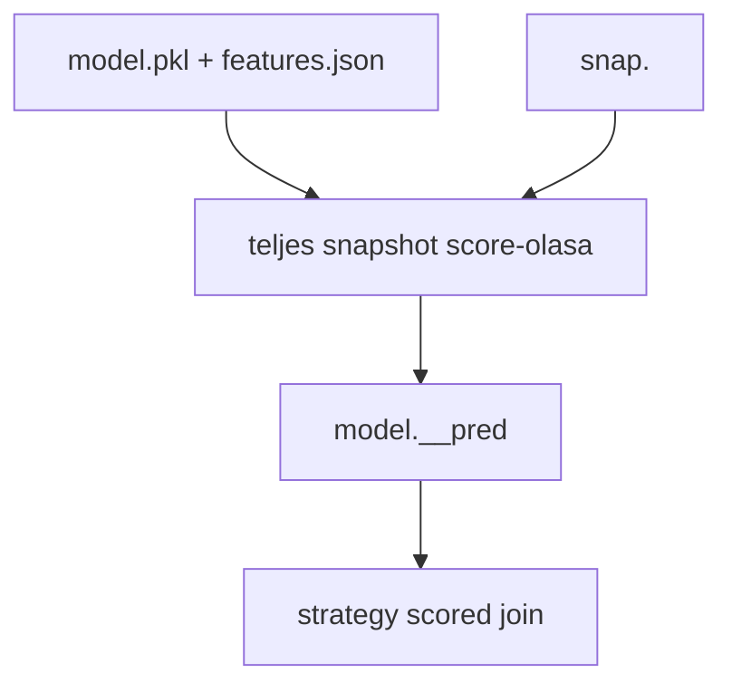
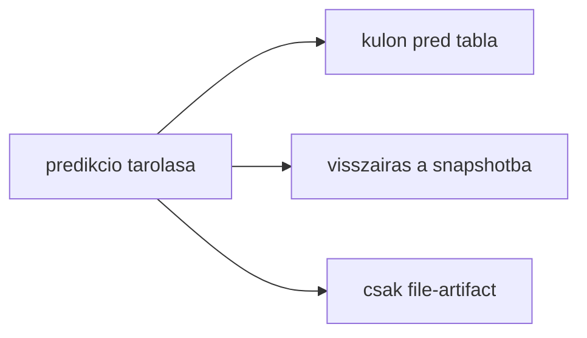
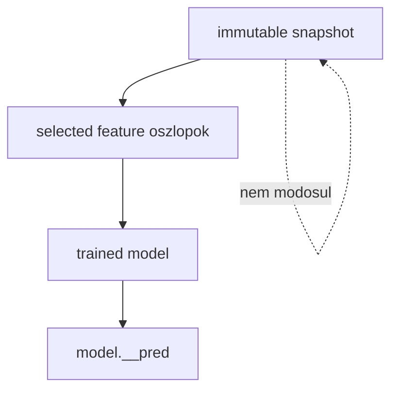
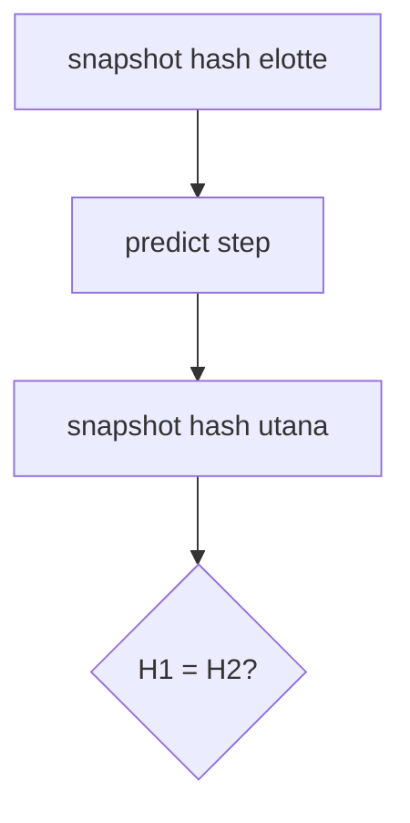

# 5700 - Offline Prediction

Az offline prediction a vegso modell score-jat a teljes snapshot-tartomanyra
kiterjeszti, majd kulon predikcios tablaban tarolja. Ez a lepes valasztja le
vegleg a train-artifactot a strategy inputjatol.

## Overview

## Uzleti es modszertani hatter

### Miért kritikus ez a lépés?

A strategy es a live trading nem a train matrixot fogyasztja, hanem egy idoben
vegigscore-olt modellkimenetet. Ehhez kell a teljes snapshotot lefedo, idobelyeghez
kotott predikcios tabla. Ha ez a lepes nincs tisztan elvalasztva, a strategy
kalibracio nem egy stabillá tett modelloutputon futna.

### Miért ezt a megközelítést?

| Megközelítés | Előny | Hátrány | Státusz |
|--------------|-------|---------|---------|
| Kulon `model.__pred` tabla | Snapshot immutable marad, strategy egyszeru joinnal dolgozhat | Egy plusz tabla keletkezik modellenkent | Valasztott |
| Pred visszairasa a snapshotba | Kevesebb join | Megszegi a snapshot immutabilitast | Elvetett |
| Csak file-ba irt score-ok | Hordozhato | Gyengebb adatbazis-integracio a strategy/session oldalon | Elvetett |
| Csak live ideju score-olas | Mindig friss | Nincs stabil offline kalibracios alap | Elvetett |

### Miért kell külön predikciós tábla és hogyan működik?

A modell a snapshot selected feature oszlopait olvassa, score-t számol minden sorra,
majd `(open_time, pred)` formában ment. Ettől a snapshot változatlan marad, a
strategy pedig egy egyszerű időbélyeg szerinti joinnal tud dolgozni.

**Szabály:** a predikció nem fuzionálódhat vissza a snapshotba.

### Snapshot-immutabilitás ellenőrzése: miért kell és hogyan működik?

Az offline predict lepes modszertani kotelezettsege, hogy ne tudja
megsérteni a snapshotot. Ezért a rendszer hash-alapú ellenőrzést is tud futtatni:
a predikcio elott es utan ugyanannak kell maradnia a snapshot tartalomlenyomatának.

**Szabály:** ha a snapshot hash megváltozna, az nem sima hiba, hanem a teljes
reprodukálhatósági szerződés sérülése.

### Paraméter alapértékek és indoklásuk

| Paraméter | Alapérték | Indoklás |
|-----------|-----------|----------|
| input tartomány | teljes snapshot | A strategy teljes score-eloszlást akar látni, nem csak train részt |
| output séma | `open_time`, `pred` | Minimális, irányfüggetlen és könnyen joinolható szerződés |
| verify snapshot | opcionális, de ajánlott | Biztonsági ellenőrzés az immutabilitási szerződéshez |
| input feature-lista | trained `features.json` | A predikció nem talál ki új inputteret |

### Ismert kockázatok és korlátok

| Kockázat | Tünet | Mitigáció |
|----------|-------|-----------|
| Snapshot/model mismatch | A predikciós tábla más snapshotra épül, mint a training | Registryből és manifestből oldott snapshot-kötés |
| Hiányzó predikciós tábla | Strategy session nem tud scored join-t építeni | A strategy előfeltétele a predict lépés |
| Csendes feature-eltérés | A predikció más features.json-t használ, mint amivel a modell készült | A training artifact részeként kötelező a features.json |
| Snapshot-ellenőrzés kikapcsolva | Ritka integritási hiba később derül ki | Kritikus futásoknál hash-verifikáció |

### Validációs checklist

- [ ] A `model.__pred` tábla a teljes snapshot tartományt lefedi.
- [ ] A predikció inputja a trained modell `features.json` listája.
- [ ] A predikció nem ír vissza a snapshot táblába.
- [ ] A strategy session előtt mindkét irány modelljének van `__pred` táblája.
- [ ] A predikció snapshot-kötése visszaolvasható a registryből vagy a manifestből.
- [ ] Kritikus futásnál az immutabilitás-ellenőrzés nem jelez eltérést.
