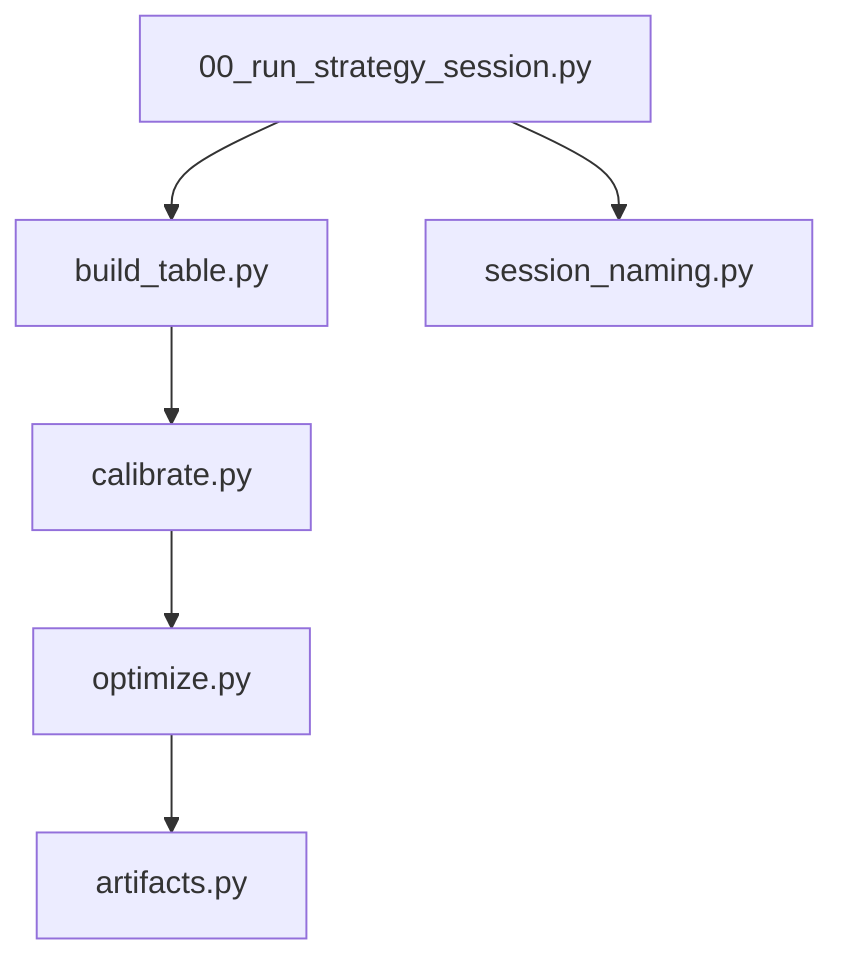
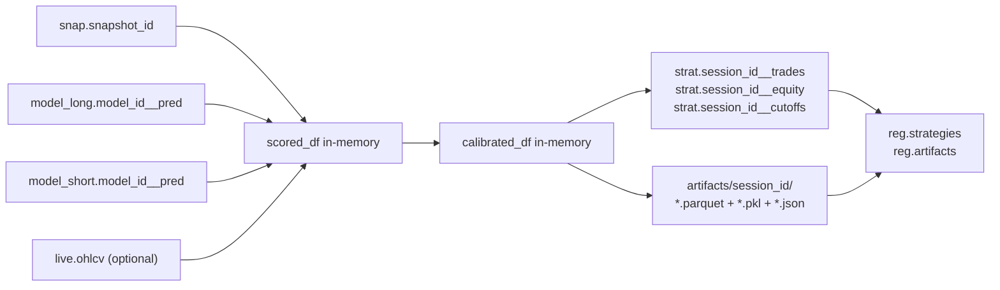
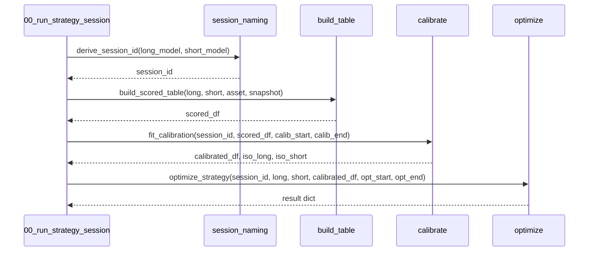
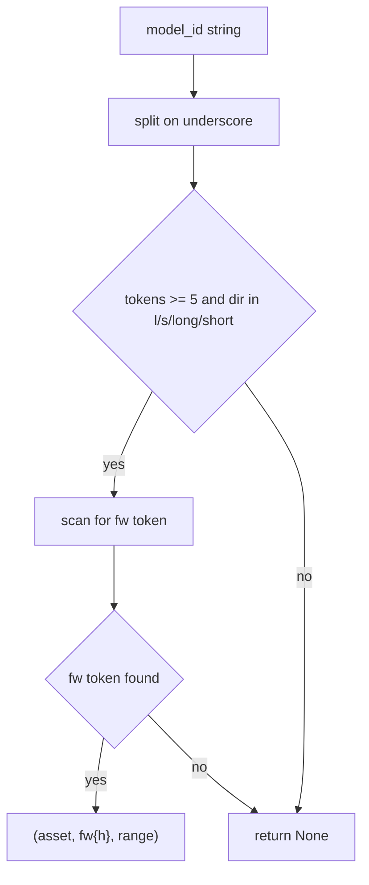

# 6100 — Strategy Module (Code Reference)

Code reference for `src/strategy/`. Methodology rationale:
→ `../methodology_doc/6000_strategy.md`
→ `../methodology_doc/6100_strategy_calibration.md`
→ `../methodology_doc/6200_strategy_optimization.md`

---

## Overview

The strategy package converts offline model predictions into a deployable decision
contract. It runs as a single CLI session that chains three pure-Python steps:
scored-table build → rank calibration → Optuna optimization.





---

## Package Layout

| File | Role |
|------|------|
| `src/strategy/strategy/build_table.py` | snap+pred DuckDB join → in-memory DataFrame |
| `src/strategy/strategy/calibrate.py` | rank lookup + isotonic calibration |
| `src/strategy/strategy/optimize.py` | Optuna sweep + state machine backtest |
| `src/strategy/strategy/artifacts.py` | DuckDB strat.* tables + file artifact I/O + registry |
| `src/strategy/strategy/session_naming.py` | session ID derivation |
| `src/strategy/00_run_strategy_session.py` | CLI entry point, chains all steps |

Submodule details:
- `6110_build_table.md` — build_table.py
- `6120_calibrate.md` — calibrate.py
- `6130_optimize.md` — optimize.py
- `6140_artifacts.md` — artifacts.py

---

## Session ID Convention

Session identifiers follow the plan-6 naming table. Given a matched long/short
model pair such as `lgbm_solusdt_l_fw60_2101_2605` /
`lgbm_solusdt_s_fw60_2101_2605`, the session id is:

```
strat_solusdt_fw60_combo_2101_2605
```

Pattern: `strat_{asset}_{horizon}_{scope}_{range}`.

Fallback when models do not share the same asset/horizon/range:
`strategy_{long_model_id}__{short_model_id}`.

---

## CLI — `00_run_strategy_session.py`

The entry point for a complete strategy session. Calls all three pipeline steps
in sequence; each step receives the in-memory DataFrame produced by the previous
step.

### Usage

```
uv run python src/strategy/00_run_strategy_session.py \
  --long-model  lgbm_solusdt_l_fw60_2101_2605 \
  --short-model lgbm_solusdt_s_fw60_2101_2605 \
  --calib-start 2025-10-01 --calib-end 2026-02-28 \
  --opt-start   2026-03-01 --opt-end   2026-05-31 \
  --n-trials 200
```

### Arguments

| Argument | Required | Default | Description |
|----------|----------|---------|-------------|
| `--long-model` | yes | — | Long-direction model id |
| `--short-model` | yes | — | Short-direction model id |
| `--session-id` | no | auto-derived | Override session id |
| `--asset-id` | no | from model config | Asset key for lab connection |
| `--snapshot-id` | no | from reg.models / config | Snapshot id override |
| `--calib-start` | yes | — | Calibration window start YYYY-MM-DD |
| `--calib-end` | yes | — | Calibration window end YYYY-MM-DD |
| `--opt-start` | yes | — | Optimization window start YYYY-MM-DD |
| `--opt-end` | yes | — | Optimization window end YYYY-MM-DD |
| `--n-trials` | no | 200 | Number of Optuna trials |

### Sequence



---

## `session_naming.py` — Session ID Helpers

### `derive_session_id(long_model_id, short_model_id, scope)`

Produces the canonical plan-6 session identifier `strat_{asset}_{horizon}_{scope}_{range}`.
Parses asset, horizon token (`fw{h}`), and date-range token from both model IDs.
Falls back to `derive_strategy_session_id` when the two models do not share
identical asset/horizon/range tokens.

| Parameter | Type | Description |
|-----------|------|-------------|
| `long_model_id` | `str` | Long-direction model id |
| `short_model_id` | `str` | Short-direction model id |
| `scope` | `str` | Direction scope token (`combo` / `l` / `s`), default `combo` |

Returns: `str` — the session identifier.

### `derive_strategy_session_id(long_model_id, short_model_id)`

Compact fallback. When both models match `{family}_{asset}_{l/s}_{rest}` and share
the same base, returns `strategy_{family}_{asset}_{rest}`. Otherwise returns
`strategy_{long}__{short}`.

| Parameter | Type | Description |
|-----------|------|-------------|
| `long_model_id` | `str` | Long model id |
| `short_model_id` | `str` | Short model id |

Returns: `str` — fallback session identifier.

### `_parse_model_id(model_id)` (internal)

Extracts `(asset, fw{h}, range)` from `{family}_{asset}_{dir}_fw{h}_{range}`.
Returns `None` when the id does not match the expected structure.


