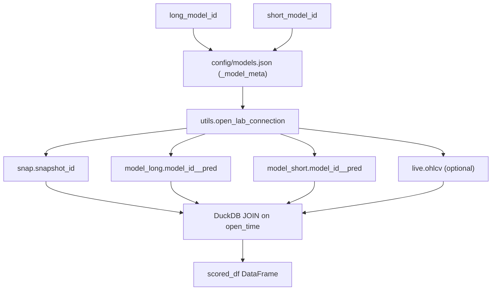
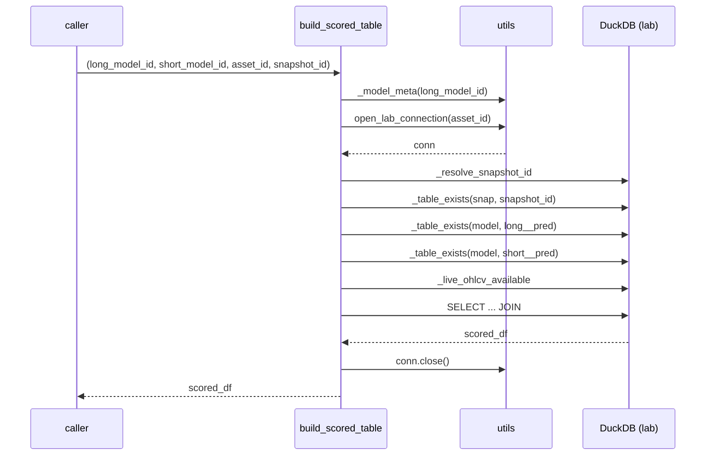

# 6110 — `build_table.py` (Code Reference)

`src/strategy/strategy/build_table.py`

Methodology rationale: → `../methodology_doc/6000_strategy.md`

---

## Overview

Builds the strategy scored table as a pure DuckDB join over three schemas
(`snap`, `model_long`, `model_short`) plus the optional `live.ohlcv` table.
No model `.pkl` is loaded; all scores are taken from the pre-computed offline
predict tables (`model."<model_id>__pred"`, written by the t315 predict step).
The result is an in-memory DataFrame — no parquet is written by this step.



---

## Constants

| Name | Value | Description |
|------|-------|-------------|
| `LONG_MFE_COL` | `"long_mfe_fw60"` | Realized long MFE column from snapshot |
| `SHORT_MFE_COL` | `"short_mfe_fw60"` | Realized short MFE column from snapshot |

---

## Functions

### `build_scored_table(long_model_id, short_model_id, asset_id, snapshot_id)`

Public entry point. Joins the snapshot's realized MFE targets with both models'
offline prediction tables on `open_time`. Optionally enriches with OHLCV price
columns from the live database. Raises if any table is missing or the join
produces no rows.

| Parameter | Type | Description |
|-----------|------|-------------|
| `long_model_id` | `str` | Long-direction model id; its `__pred` table is joined |
| `short_model_id` | `str` | Short-direction model id; its `__pred` table is joined |
| `asset_id` | `str \| None` | Asset key for lab connection; resolved from model config if None |
| `snapshot_id` | `str \| None` | Snapshot id to join against; resolved from `reg.models` / config if None |

Returns: `pd.DataFrame` with columns:

| Column | Type | Source |
|--------|------|--------|
| `open_time` | datetime | snap primary key |
| `pred_long_raw` | float | `model_long."<id>__pred".pred` |
| `pred_short_raw` | float | `model_short."<id>__pred".pred` |
| `long_mfe_fw60` | float | `snap."<snapshot_id>".long_mfe_fw60` |
| `short_mfe_fw60` | float | `snap."<snapshot_id>".short_mfe_fw60` |
| `open` | float \| NULL | `live.ohlcv.open` |
| `high` | float \| NULL | `live.ohlcv.high` |
| `low` | float \| NULL | `live.ohlcv.low` |
| `close` | float \| NULL | `live.ohlcv.close` |

Raises: `ValueError` when snapshot or predict table is absent, or join is empty.



---

### `_resolve_snapshot_id(conn, model_id, meta)` (internal)

Resolves the snapshot id for a model. Checks `reg.models` first via
`registry.get`; falls back to `meta["sampling"]["snapshot_id"]` from
`config/models.json`. Raises `ValueError` when neither source provides a value.

| Parameter | Type | Description |
|-----------|------|-------------|
| `conn` | `duckdb.DuckDBPyConnection` | Open lab connection |
| `model_id` | `str` | Model id to look up in reg.models |
| `meta` | `dict` | Model config dict from config/models.json |

Returns: `str` — snapshot id.

---

### `_table_exists(conn, schema, table)` (internal)

Checks `information_schema.tables` for `schema.table` in the lab database.

| Parameter | Type | Description |
|-----------|------|-------------|
| `conn` | `duckdb.DuckDBPyConnection` | Open lab connection |
| `schema` | `str` | Schema name (e.g. `snap`, `model`) |
| `table` | `str` | Table name (e.g. `solusdt_2101__pred`) |

Returns: `bool`.

---

### `_live_ohlcv_available(conn)` (internal)

Checks `information_schema.tables` for `table_catalog = 'live'` and
`table_name = 'ohlcv'`. Swallows `duckdb.Error` (live db may be detached).

Returns: `bool`.

---

### `_model_meta(model_id)` (internal)

Reads `config/models.json` via `utils.load_models_config()` and returns the
config dict for `model_id`. Returns `{}` if the model is absent.

Returns: `dict[str, Any]`.

---

## SQL Join Structure

The core query (simplified; price columns conditional on `_live_ohlcv_available`):

```sql
SELECT
    s.open_time,
    pl.pred          AS pred_long_raw,
    ps.pred          AS pred_short_raw,
    s."long_mfe_fw60",
    s."short_mfe_fw60",
    o.open, o.high, o.low, o.close   -- NULL if live unavailable
FROM snap."<snapshot_id>" s
JOIN model."<long_model_id>__pred"  pl ON pl.open_time = s.open_time
JOIN model."<short_model_id>__pred" ps ON ps.open_time = s.open_time
LEFT JOIN live.ohlcv o ON o.open_time = s.open_time
WHERE s."long_mfe_fw60"  IS NOT NULL
  AND s."short_mfe_fw60" IS NOT NULL
ORDER BY s.open_time
```

The two model JOINs are `INNER` — only rows present in both predict tables
(and the snapshot) are included. `live.ohlcv` is a `LEFT JOIN` so its absence
silently yields NULL price columns.
