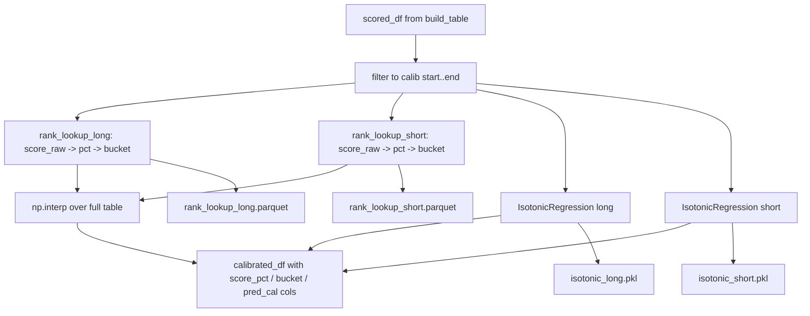
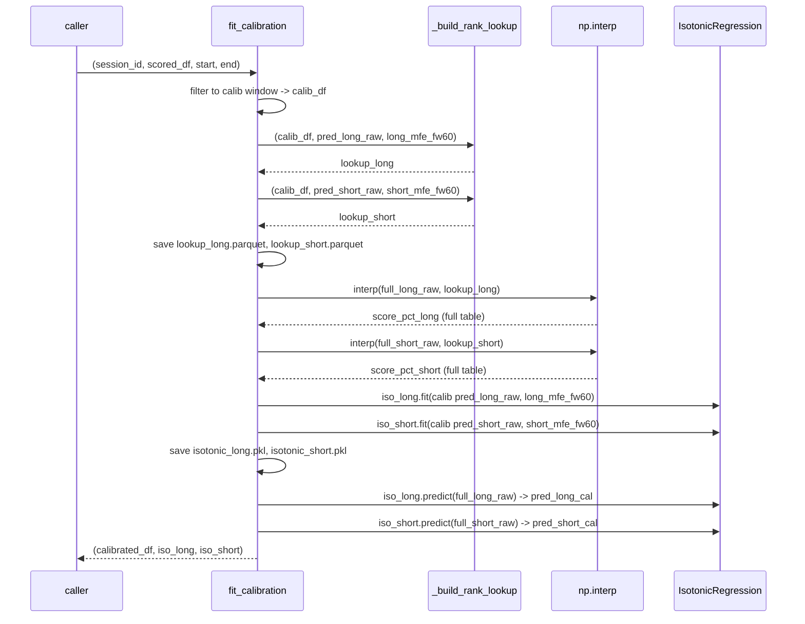
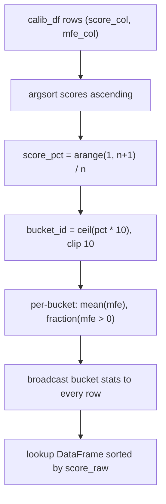

# 6120 — `calibrate.py` (Code Reference)

`src/strategy/strategy/calibrate.py`

Methodology rationale: → `../methodology_doc/6100_strategy_calibration.md`

---

## Overview

Implements rank-first score calibration. Takes the in-memory scored DataFrame
from `build_table.build_scored_table`, filters to the calibration window, builds
percentile rank lookup tables (one per direction), fits isotonic regression
calibrators, applies all calibrations to the full scored table, and writes four
file artifacts to `artifacts/{session_id}/`.



---

## File Artifacts Written

All artifacts land under `artifacts/{session_id}/` (created if absent):

| File | Format | Description |
|------|--------|-------------|
| `rank_lookup_long.parquet` | Parquet (zstd) | Per-row lookup: score_raw, score_pct, bucket_id, bucket_mean_mfe, bucket_hit_rate, bucket_median_mfe, bucket_p75_mfe |
| `rank_lookup_short.parquet` | Parquet (zstd) | Same structure for the short direction |
| `isotonic_long.pkl` | Pickle | Fitted `sklearn.IsotonicRegression` for long |
| `isotonic_short.pkl` | Pickle | Fitted `sklearn.IsotonicRegression` for short |

---

## Functions

### `fit_calibration(session_id, scored_df, start, end)`

Public entry point. Orchestrates rank lookup build, isotonic fitting, full-table
application, and artifact persistence. Returns the enriched DataFrame plus the
two fitted calibrators.

| Parameter | Type | Description |
|-----------|------|-------------|
| `session_id` | `str` | Strategy session identifier; determines artifact directory |
| `scored_df` | `pd.DataFrame` | Output of `build_scored_table` |
| `start` | `str` | Calibration window start, YYYY-MM-DD (inclusive) |
| `end` | `str` | Calibration window end, YYYY-MM-DD (inclusive) |

Returns: `tuple[pd.DataFrame, IsotonicRegression, IsotonicRegression]`
— `(calibrated_df, isotonic_long, isotonic_short)`.

Raises: `ValueError` when the calibration window contains no rows.

New columns added to `calibrated_df`:

| Column | Type | Description |
|--------|------|-------------|
| `score_pct_long` | float 0-1 | Interpolated percentile for long raw score |
| `score_pct_short` | float 0-1 | Interpolated percentile for short raw score |
| `bucket_long` | int 1-10 | Decile bucket for long (ceil(pct * 10)) |
| `bucket_short` | int 1-10 | Decile bucket for short |
| `bucket_mean_mfe_long` | float | Bucket's mean realized long MFE (calibration period) |
| `bucket_mean_mfe_short` | float | Bucket's mean realized short MFE |
| `bucket_hit_rate_long` | float 0-1 | Fraction of calib-period rows with long MFE > 0 |
| `bucket_hit_rate_short` | float 0-1 | Fraction of calib-period rows with short MFE > 0 |
| `bucket_median_mfe_long` | float | Bucket's median realized long MFE — basis for `median` TP-spec |
| `bucket_median_mfe_short` | float | Bucket's median realized short MFE |
| `bucket_p75_mfe_long` | float | Bucket's 75th-percentile realized long MFE — basis for `p75` TP-spec |
| `bucket_p75_mfe_short` | float | Bucket's 75th-percentile realized short MFE |
| `pred_long_cal` | float | Isotonic regression predicted MFE for long |
| `pred_short_cal` | float | Isotonic regression predicted MFE for short |



---

### `_build_rank_lookup(calib_df, score_col, mfe_col)` (internal)

Builds the rank lookup DataFrame for one direction from the calibration-period
rows. Sorts by raw score ascending, assigns each row its percentile rank
(`rank = position / n`) and decile bucket (`ceil(pct * 10)`, clipped to 10).
Aggregates mean MFE and hit rate per bucket, then denormalizes — every row in a
bucket carries the same bucket-level stats so downstream `np.interp` can apply
stats without a secondary join.

| Parameter | Type | Description |
|-----------|------|-------------|
| `calib_df` | `pd.DataFrame` | Calibration-period rows (already filtered) |
| `score_col` | `str` | Raw score column name (e.g. `pred_long_raw`) |
| `mfe_col` | `str` | Realized MFE column name (e.g. `long_mfe_fw60`) |

Returns: `pd.DataFrame` sorted by `score_raw` ascending, with columns:

| Column | Type | Description |
|--------|------|-------------|
| `score_raw` | float | Raw model score (sorted ascending) |
| `score_pct` | float | Percentile rank: position / n (1/n to 1.0) |
| `bucket_id` | int 1-10 | Decile bucket |
| `bucket_mean_mfe` | float | Mean realized MFE for this bucket |
| `bucket_hit_rate` | float | Fraction(mfe > 0) for this bucket |
| `bucket_median_mfe` | float | Median realized MFE for this bucket |
| `bucket_p75_mfe` | float | 75th-percentile realized MFE for this bucket |

**TP-spec kapcsolat:** A `bucket_median_mfe` és `bucket_p75_mfe` oszlopok a strategy session TP (take-profit) célárának alapjai. A strategy calibration `p75` TP-spec-je a `bucket_p75_mfe`-t használja célárként, a `median` TP-spec a `bucket_median_mfe`-t. A lookup ezért tartalmazza mindkét percentilis értéket bucket-szinten denormalizálva, hogy a TradingService a teljes tábla minden sorához join nélkül elérhesse.



---

### `_artifact_dir(session_id)` (internal)

Returns `Path(utils._resolve_path("artifacts")) / session_id`. Creates the
directory when `fit_calibration` calls `artifact_dir.mkdir(parents=True)`.

---

## Rank Interpolation (full table)

After building the lookup, `np.interp` maps every raw score in the full table
to a calibration-period percentile rank. Values outside the calibration range
are clipped to `[0.0, 1.0]` (boundary extrapolation):

```python
score_pct_long = np.interp(
    full_long_raw,
    lookup_long["score_raw"],   # xp (sorted ascending)
    lookup_long["score_pct"],   # fp
).clip(0.0, 1.0)
```

Bucket assignment on the full table: `ceil(pct * 10)`, clipped to 10.
Bucket-level stats are mapped via a `{bucket_id -> stat}` dict built from the
lookup's first row per bucket (all rows in a bucket share the same repeated stat).
