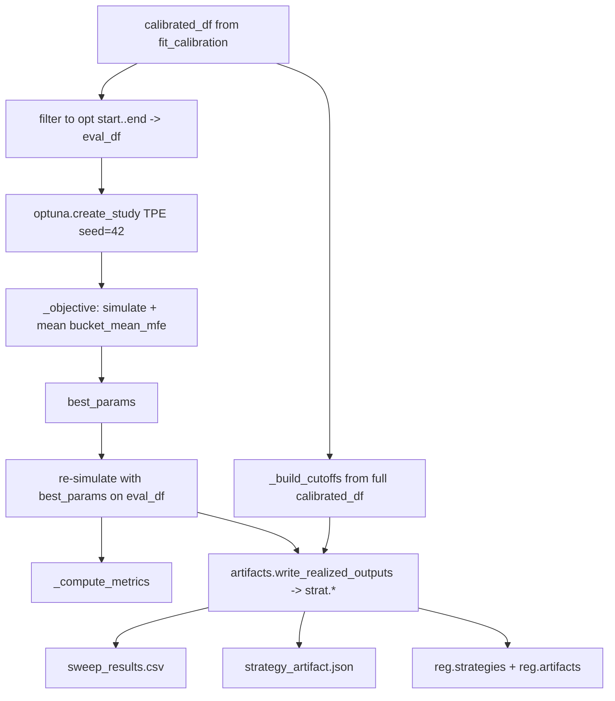
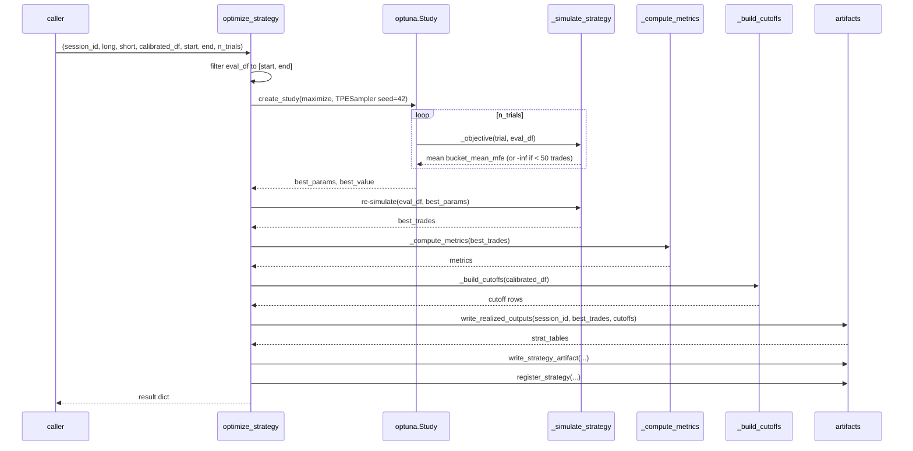
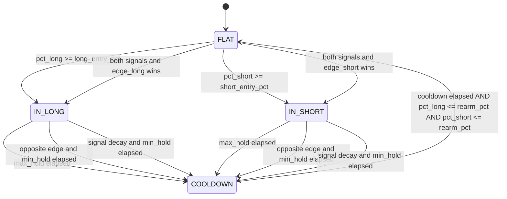

# 6130 — `optimize.py` (Code Reference)

`src/strategy/strategy/optimize.py`

Methodology rationale: → `../methodology_doc/6200_strategy_optimization.md`

---

## Overview

Runs an Optuna TPE sweep over seven entry/exit/cooldown parameters using a
pure-Python rank-first state machine backtest. After the sweep, re-simulates
the best trial on the evaluation window, computes metrics, and delegates all
persistence (DuckDB tables, JSON artifact, registry) to `artifacts.py`.

---

## Functions

### `optimize_strategy(session_id, long_model_id, short_model_id, calibrated_df, start, end, n_trials, asset_id)`

Public entry point. Orchestrates the Optuna sweep and all downstream writes.

| Parameter | Type | Description |
|-----------|------|-------------|
| `session_id` | `str` | Strategy session identifier |
| `long_model_id` | `str` | Long-direction model id |
| `short_model_id` | `str` | Short-direction model id |
| `calibrated_df` | `pd.DataFrame` | Output of `fit_calibration` (must include `score_pct_*` and `bucket_mean_mfe_*` columns) |
| `start` | `str` | Optimization window start YYYY-MM-DD (inclusive) |
| `end` | `str` | Optimization window end YYYY-MM-DD (inclusive) |
| `n_trials` | `int` | Number of Optuna trials (default 200) |
| `asset_id` | `str \| None` | Asset key for lab connection; resolved if None |

Returns: `dict` with keys:

| Key | Type | Description |
|-----|------|-------------|
| `session_id` | `str` | Strategy session identifier |
| `best_params` | `dict` | Best trial's parameter dict |
| `metrics` | `dict` | Performance metrics from `_compute_metrics` |
| `optuna_best` | `dict` | `{value, n_trials}` |
| `strat_tables` | `dict` | `{trades, equity, cutoffs}` -> FQN strings |

Raises: `ValueError` when required rank columns are absent, or optimization window is empty.

---

### `_simulate_strategy(df, long_entry_pct, short_entry_pct, min_edge_gap, max_hold_minutes, cooldown_minutes, min_hold_minutes, rearm_pct)` (internal)

Core state machine backtest. Iterates row-by-row over `df.itertuples` and
transitions through four states.

**State transitions:**

| Parameter | Type | Description |
|-----------|------|-------------|
| `df` | `pd.DataFrame` | Calibrated table with `open_time`, `score_pct_long`, `score_pct_short`, `bucket_mean_mfe_long`, `bucket_mean_mfe_short` |
| `long_entry_pct` | `float` | Min `score_pct_long` to enter long (0-1) |
| `short_entry_pct` | `float` | Min `score_pct_short` to enter short (0-1) |
| `min_edge_gap` | `float` | Min directional edge gap required when both signals fire simultaneously |
| `max_hold_minutes` | `int` | Forced exit after this many minutes |
| `cooldown_minutes` | `int` | Minimum minutes in COOLDOWN before re-arming check |
| `min_hold_minutes` | `int` | Minimum hold before signal-based exit is checked |
| `rearm_pct` | `float` | Both scores must be at or below this to exit COOLDOWN |

Returns: `list[dict]` — one trade dict per closed trade with keys:

| Key | Type | Description |
|-----|------|-------------|
| `entry_time` | Timestamp | Bar entry was triggered |
| `exit_time` | Timestamp | Bar exit was triggered |
| `direction` | `"long"` / `"short"` | Trade direction |
| `entry_price` | float \| None | Close price at entry (None if live.ohlcv unavailable) |
| `exit_price` | float \| None | Close price at exit |
| `score_pct_at_entry` | float | Percentile rank at entry bar |
| `bucket_mean_mfe` | float | Bucket mean realized MFE at entry bar |
| `n_bars` | int | Bars held |
| `hold_minutes` | int | Minutes held |
| `exit_reason` | str | `max_hold` / `opposite_edge` / `signal_decay` |

**Conflict resolution (both signals fire simultaneously):** The direction with
the higher edge gap (`pct_long - pct_short` vs `pct_short - pct_long`) wins,
but only if its gap meets `min_edge_gap`. When neither gap qualifies, the state
stays FLAT.

---

### `_objective(trial, eval_df)` (internal)

Optuna objective function. Suggests seven hyperparameters, runs
`_simulate_strategy`, and returns the mean `bucket_mean_mfe` over all trades.
Returns `-inf` when fewer than 50 trades are produced (minimum sample guard).

| Parameter | Space | Description |
|-----------|-------|-------------|
| `long_entry_pct` | float [0.70, 0.99] | Long entry percentile threshold |
| `short_entry_pct` | float [0.70, 0.99] | Short entry percentile threshold |
| `min_edge_gap` | float [0.00, 0.30] | Minimum conflict edge gap |
| `max_hold_minutes` | int [30, 240] | Maximum hold period |
| `cooldown_minutes` | int [15, 120] | Cooldown duration |
| `min_hold_minutes` | int [3, 30] | Minimum hold before signal-exit |
| `rearm_pct` | float [0.40, 0.75] | Re-arm score threshold |

Returns: `float` — mean `bucket_mean_mfe` or `-inf`.

---

### `_compute_metrics(trades)` (internal)

Computes summary statistics from a list of trade dicts.

| Parameter | Type | Description |
|-----------|------|-------------|
| `trades` | `list[dict]` | Trade dicts from `_simulate_strategy` |

Returns: `dict` with:

| Key | Type | Description |
|-----|------|-------------|
| `n_trades` | int | Total closed trades |
| `total_return` | float | Sum of `bucket_mean_mfe` across trades |
| `win_rate` | float \| None | Fraction of trades with MFE > 0 |
| `sharpe` | float \| None | Mean MFE / std MFE * sqrt(252) |
| `max_drawdown` | float \| None | Minimum running drawdown of cumulative MFE |
| `sufficient_sample` | bool | True when n_trades >= 50 |

---

### `_build_cutoffs(calibrated_df)` (internal)

Derives per-direction decile cutoff rows from the full calibrated DataFrame (not
just the evaluation window). Iterates over both directions and all 10 decile
buckets present in the data. Each row captures the raw-score boundaries
(`score_raw_lower`, `score_raw_upper`), the bucket's upper percentile, and its
realized stats.

| Parameter | Type | Description |
|-----------|------|-------------|
| `calibrated_df` | `pd.DataFrame` | Full calibrated table with bucket / score_pct / stat columns |

Returns: `list[dict]` with keys per row:

| Key | Type | Description |
|-----|------|-------------|
| `direction` | `"long"` / `"short"` | Direction |
| `bucket_id` | int 1-10 | Decile bucket |
| `score_raw_lower` | float | Min raw score in bucket |
| `score_raw_upper` | float | Max raw score in bucket |
| `score_pct_upper` | float | Max percentile in bucket |
| `bucket_mean_mfe` | float | Bucket mean realized MFE |
| `bucket_hit_rate` | float | Fraction(MFE > 0) |

These rows are written to `strat."<session>__cutoffs"` by `write_realized_outputs`.

---

## Optuna Study Configuration

| Setting | Value |
|---------|-------|
| Direction | maximize |
| Sampler | TPESampler(seed=42) |
| Verbosity | WARNING (per-trial logs suppressed) |
| Minimum trades | 50 (else objective returns -inf) |
| Objective | mean `bucket_mean_mfe` at entry across all trades |

The study is created fresh per session (no persistent storage). Trial results are
saved to `artifacts/{session_id}/sweep_results.csv` after the study completes.
