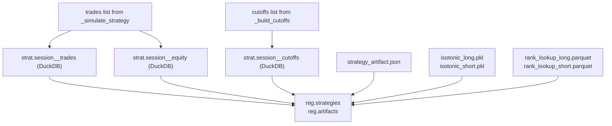
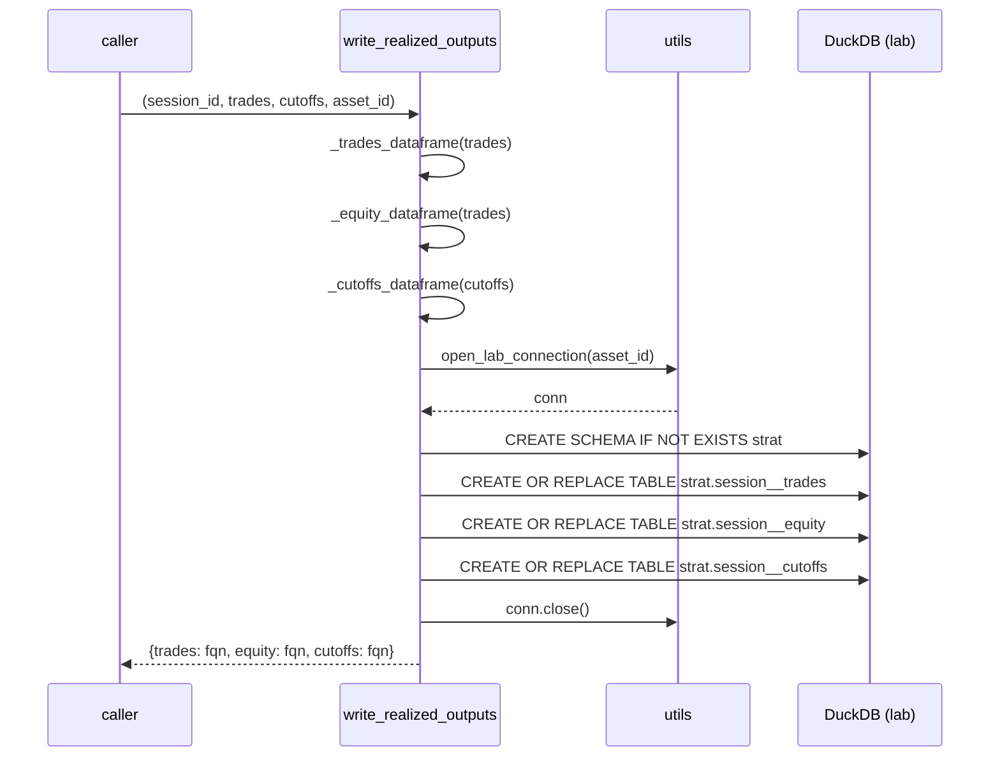

# 6140 — `artifacts.py` (Code Reference)

`src/strategy/strategy/artifacts.py`

Methodology rationale: → `../methodology_doc/6000_strategy.md`

---

## Overview

Handles all persistence for a strategy session. Two complementary surfaces:

1. **DuckDB tables** in the `strat` schema of the lab database — queried
   directly by the UI (`strat."<session>__trades"`, `__equity`, `__cutoffs`).
2. **File artifacts** under `artifacts/{session_id}/` — loaded by the live
   trading service (`strategy_artifact.json`, `isotonic_*.pkl`,
   `rank_lookup_*.parquet`).

Also writes registry rows to `reg.strategies` and `reg.artifacts`.



---

## DuckDB Table Schemas

### `strat."<session_id>__trades"`

Trade ledger. One row per closed trade.

| Column | Type | Description |
|--------|------|-------------|
| `entry_time` | TIMESTAMP | Bar when the trade was entered |
| `exit_time` | TIMESTAMP | Bar when the trade was exited |
| `direction` | VARCHAR | `long` or `short` |
| `entry_price` | DOUBLE | Close price at entry (NULL if live.ohlcv unavailable) |
| `exit_price` | DOUBLE | Close price at exit (NULL if live.ohlcv unavailable) |
| `hold_minutes` | BIGINT | Minutes held |
| `exit_reason` | VARCHAR | `max_hold` / `opposite_edge` / `signal_decay` |
| `score_pct_at_entry` | DOUBLE | Percentile rank score at entry bar |
| `bucket_mean_mfe` | DOUBLE | Calibration-period bucket mean MFE at entry |

### `strat."<session_id>__equity"`

Cumulative MFE equity curve. One row per closed trade in trade order.

| Column | Type | Description |
|--------|------|-------------|
| `trade_index` | BIGINT | Sequential trade index (0-based) |
| `entry_time` | TIMESTAMP | Entry time (matches trades table) |
| `bucket_mean_mfe` | DOUBLE | Per-trade MFE contribution |
| `cumulative_mfe` | DOUBLE | Running sum of bucket_mean_mfe |

### `strat."<session_id>__cutoffs"`

Per-direction decile bucket boundaries and realized stats. Used by the UI to
render the score-to-edge mapping.

| Column | Type | Description |
|--------|------|-------------|
| `direction` | VARCHAR | `long` or `short` |
| `bucket_id` | BIGINT | Decile bucket 1–10 |
| `score_raw_lower` | DOUBLE | Min raw model score in this bucket |
| `score_raw_upper` | DOUBLE | Max raw model score in this bucket |
| `score_pct_upper` | DOUBLE | Max percentile rank in this bucket |
| `bucket_mean_mfe` | DOUBLE | Mean realized MFE (calibration period) |
| `bucket_hit_rate` | DOUBLE | Fraction(MFE > 0) in calibration period |

---

## File Artifacts

All files reside under `artifacts/{session_id}/`.

| File | Written by | Loaded by |
|------|-----------|-----------|
| `strategy_artifact.json` | `write_strategy_artifact` | live trading service |
| `rank_lookup_long.parquet` | `calibrate.fit_calibration` | live trading service |
| `rank_lookup_short.parquet` | `calibrate.fit_calibration` | live trading service |
| `isotonic_long.pkl` | `calibrate.fit_calibration` | live trading service |
| `isotonic_short.pkl` | `calibrate.fit_calibration` | live trading service |
| `sweep_results.csv` | `optimize.optimize_strategy` | analyst review only |

---

## Functions

### `strat_table_fqn(session_id, kind)`

Returns the fully-qualified, double-quoted DuckDB table reference for a `strat`
table.

| Parameter | Type | Description |
|-----------|------|-------------|
| `session_id` | `str` | Strategy session identifier |
| `kind` | `str` | One of `trades` / `equity` / `cutoffs` |

Returns: `str` — e.g. `strat."strat_solusdt_fw60_combo_2101_2605__trades"`.

---

### `write_realized_outputs(session_id, trades, cutoffs, asset_id)`

Writes the three `strat.*` tables to the lab database in a single connection.
Creates the `strat` schema if absent. Each table is written via
`CREATE OR REPLACE TABLE` (idempotent; re-run replaces in place).

| Parameter | Type | Description |
|-----------|------|-------------|
| `session_id` | `str` | Strategy session identifier |
| `trades` | `list[dict]` | Trade dicts from `_simulate_strategy` |
| `cutoffs` | `list[dict] \| None` | Cutoff rows from `_build_cutoffs`; empty table written if None |
| `asset_id` | `str \| None` | Asset key for lab connection; resolved if None |

Returns: `dict[str, str]` — `{"trades": fqn, "equity": fqn, "cutoffs": fqn}`.



---

### `register_strategy(session_id, long_model_id, short_model_id, artifact_files, asset_id, status)`

Upserts a `reg.strategies` row linking the session to its two models, then
registers the three `strat.*` tables and all file artifacts in `reg.artifacts`.
File artifacts are only registered if the file exists on disk at the time of
registration.

| Parameter | Type | Description |
|-----------|------|-------------|
| `session_id` | `str` | Strategy session identifier (becomes `strategy_id`) |
| `long_model_id` | `str` | Long model id |
| `short_model_id` | `str` | Short model id |
| `artifact_files` | `list[tuple[str, Path]]` \| None | `(kind, path)` pairs for file artifacts |
| `asset_id` | `str \| None` | Asset key; resolved if None |
| `status` | `str` | Lifecycle status for the strategy row (default `candidate`) |

Returns: `str` — the `strategy_id` written.

`reg.strategies` row:

| Column | Value |
|--------|-------|
| `strategy_id` | session_id |
| `model_id_long` | long_model_id |
| `model_id_short` | short_model_id |
| `session_id` | session_id |
| `status` | status |

`reg.artifacts` rows (per strat table):

| Column | Value |
|--------|-------|
| `artifact_id` | `{session_id}__strat_{kind}` |
| `owner_id` | session_id |
| `kind` | `strat_trades` / `strat_equity` / `strat_cutoffs` |
| `path` | FQN string (e.g. `strat."session__trades"`) |
| `status` | `candidate` |

---

### `write_strategy_artifact(session_id, long_model_id, short_model_id, fit_period, decision_params, metrics, optuna_best)`

Writes `strategy_artifact.json` to `artifacts/{session_id}/`.

| Parameter | Type | Description |
|-----------|------|-------------|
| `session_id` | `str` | Strategy session identifier |
| `long_model_id` | `str` | Long model id |
| `short_model_id` | `str` | Short model id |
| `fit_period` | `dict` | `{"start": "YYYY-MM-DD", "end": "YYYY-MM-DD"}` |
| `decision_params` | `dict` | Best Optuna params + `conflict_rule: "highest_edge"` |
| `metrics` | `dict` | Performance metrics dict |
| `optuna_best` | `dict` | `{"value": float, "n_trials": int}` |

Returns: `Path` — absolute path to the written file.

JSON structure:

```json
{
  "session_id": "strat_solusdt_fw60_combo_2101_2605",
  "long_model": "lgbm_solusdt_l_fw60_2101_2605",
  "short_model": "lgbm_solusdt_s_fw60_2101_2605",
  "signal_mode": "rank_first",
  "evaluation_mode": "same_window",
  "fit_period": {"start": "YYYY-MM-DD", "end": "YYYY-MM-DD"},
  "rank_lookup_long_path": "rank_lookup_long.parquet",
  "rank_lookup_short_path": "rank_lookup_short.parquet",
  "isotonic_long_path": "isotonic_long.pkl",
  "isotonic_short_path": "isotonic_short.pkl",
  "decision_params": { "long_entry_pct": ..., "conflict_rule": "highest_edge", ... },
  "optuna_best_trial": { "value": ..., "n_trials": 200 },
  "metrics": { "n_trades": ..., "win_rate": ..., "sharpe": ..., ... },
  "trades_table": "strat.\"session__trades\"",
  "equity_table": "strat.\"session__equity\"",
  "cutoffs_table": "strat.\"session__cutoffs\"",
  "calibrated_at": "2026-06-22T10:00:00Z"
}
```

---

### `read_strategy_artifact(session_id)`

Reads and parses `strategy_artifact.json` from `artifacts/{session_id}/`.

| Parameter | Type | Description |
|-----------|------|-------------|
| `session_id` | `str` | Strategy session identifier |

Returns: `dict` — parsed artifact.

Raises: `FileNotFoundError` if the file does not exist.

---

### Internal DataFrame builders

| Function | Description |
|----------|-------------|
| `_trades_dataframe(trades)` | Converts trade dict list to typed DataFrame; returns empty typed DataFrame when list is empty |
| `_equity_dataframe(trades)` | Computes cumulative MFE series; returns empty typed DataFrame when list is empty |
| `_cutoffs_dataframe(cutoffs)` | Converts cutoff dict list to typed DataFrame; returns empty typed DataFrame when None or empty |
| `_write_strat_table(conn, session_id, kind, frame)` | Registers DataFrame as `_strat_df` in DuckDB, runs `CREATE OR REPLACE TABLE`, unregisters; returns row count |
| `_artifact_dir(session_id)` | Returns `repo_root / "artifacts" / session_id` |
