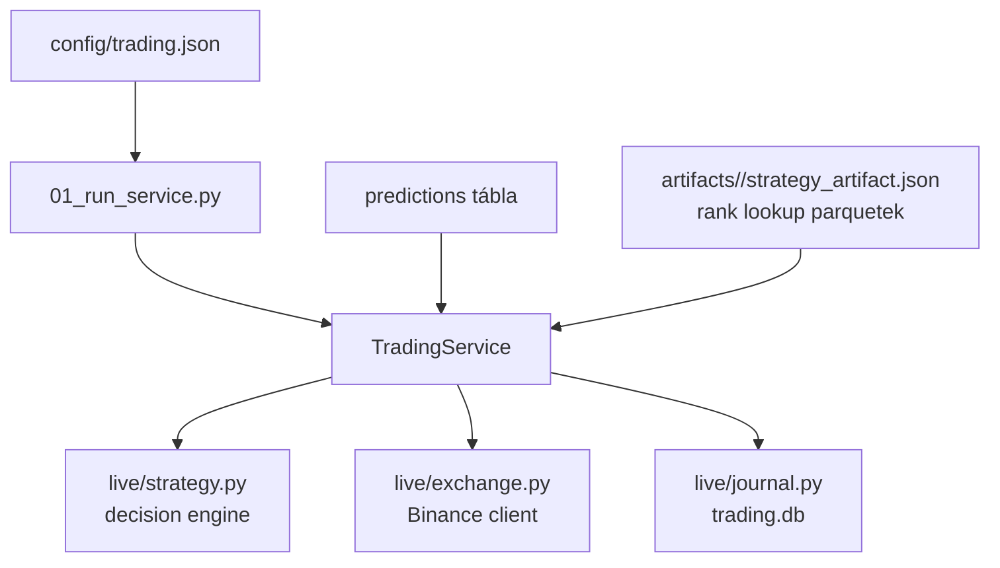

# 7000 - Trading

A `src/trading/` modul a strategy artifact live alkalmazó rétege: percenként
friss adatot szinkronizál, a nyers predikciókat percentilissé alakítja, majd
pozíciót nyit/zár és a teljes futást `trading.db`-be naplózza.

---

## Overview

---

## Felelősség

- Live loop futtatása a `strategy_session_id` alapján.
- Raw predikciók rank-percentile transzformációja a strategy artifact lookupjai szerint.
- Entry/exit/cooldown döntések végrehajtása.
- Folyamatos journal írás `trading_runs`, `trading_signals`, `trading_positions`,
  `trading_orders`, `trading_errors` táblákba.

## Nem feladata

- Strategy kalibráció vagy Optuna optimalizáció.
- Modelltanítás vagy score kalibráció újrafit.
- UI megjelenítés.

## Fejezetek

| Szám | Fájl | Tartalom | Szint |
|------|------|----------|-------|
| 7100 | [7100_live_trading.md](7100_live_trading.md) | Runtime metodológia és almodul-térkép | X100 |

Részletes kódszintű bontás külön a code-doc zónában él; a methodology zóna itt
szándékosan csak a runtime döntési és operációs elveket rögzíti.
