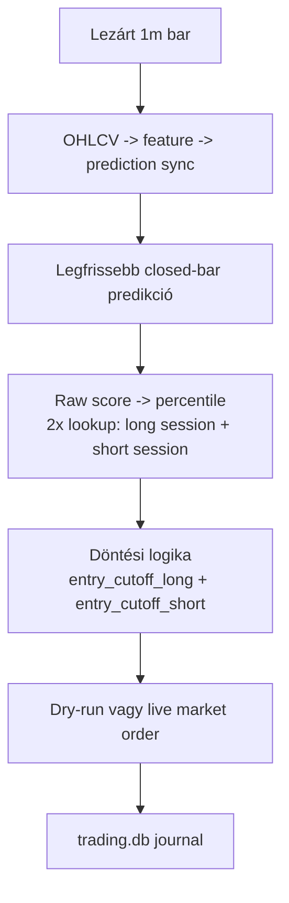
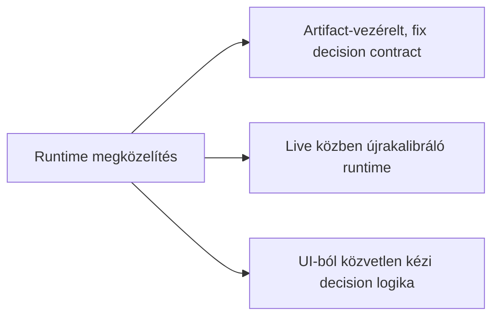
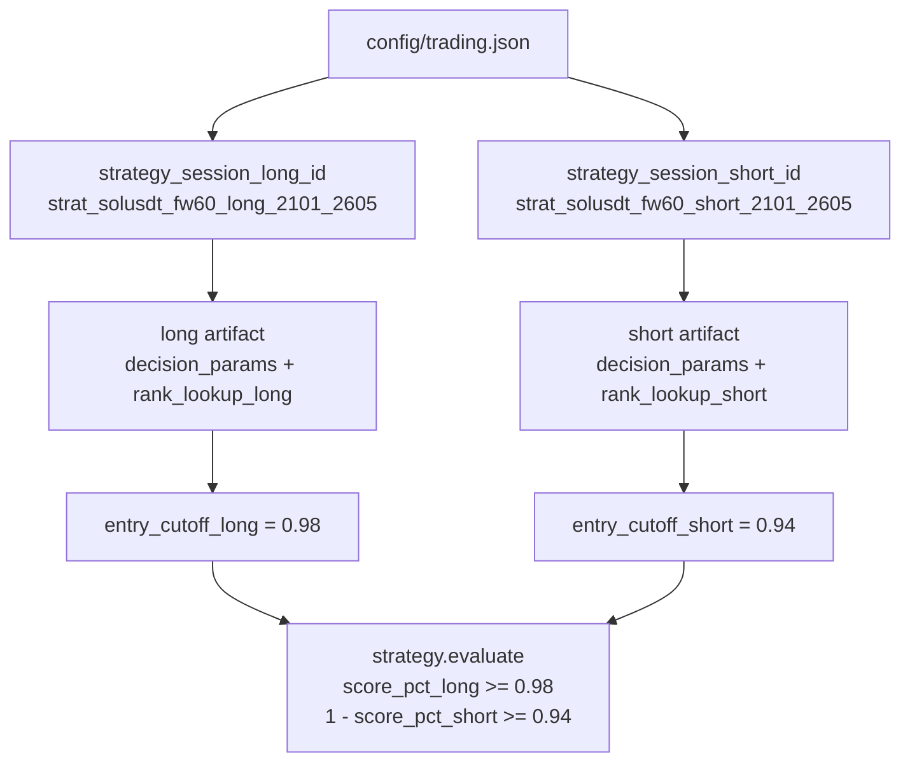
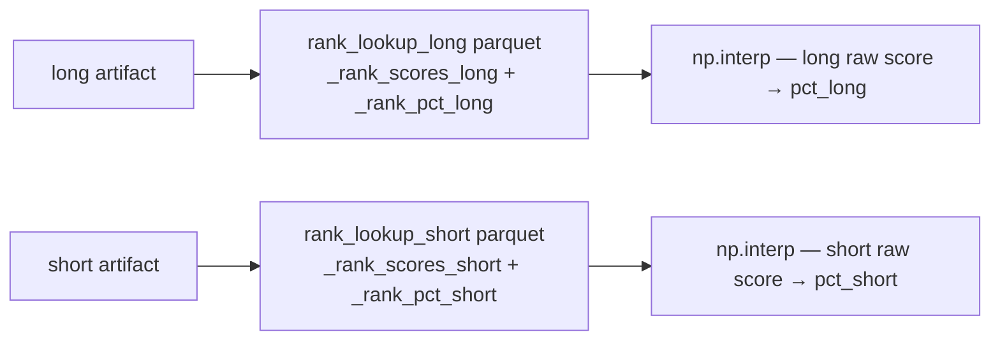
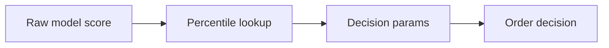
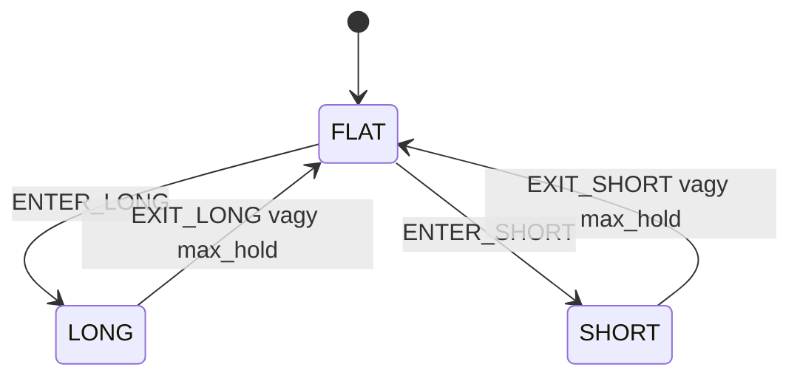

# 7100 - Live Trading Runtime

A live trading runtime feladata az, hogy a már kiválasztott stratégiai döntési szerződést percenként, determinisztikusan és újrahangolás nélkül hajtsa végre. Ez a réteg nem optimalizál és nem tanul újra: az offline pipeline eredményét fordítja át valós idejű pozíciókezeléssé.

## Overview





## Dual-Strategy Architektúra

A live trading service 2026 Q2-től **két önálló strategy session artifactot** tölt be: egyet a long, egyet a short irányra. Ez a szétválasztás a 6300-as fejezet (`strategy_grid_search`) által dokumentált döntésből következik: a long és short signal erőssége eltér, ezért eltérő belépési cutoff-ot igényelnek.



### Config struktúra

A `config/trading.json` korábban egyetlen `strategy_session_id` kulcsot tartalmazott, ami egy kombinált session artifactot jelölt. Az új struktúra:

| Kulcs | Példaérték | Szerep |
|-------|-----------|--------|
| `strategy_session_long_id` | `strat_solusdt_fw60_long_2101_2605` | Long irányú artifact session azonosítója |
| `strategy_session_short_id` | `strat_solusdt_fw60_short_2101_2605` | Short irányú artifact session azonosítója |

A régi `strategy_session_id` kulcs eltávolításra került. A `service.py` backward-compat fallback-et tartalmaz: ha véletlenül régi config érkezik, az egyetlen session-t mindkét irányra alkalmazza — de ez éles működésben nem megengedett.

### `strategy.evaluate()` szignatúra

A döntési függvény két önálló cutoff paramétert fogad irányonként:

```python
def evaluate(state, score_pct_long, score_pct_short, decision_params, now=None,
             entry_cutoff_long=None, entry_cutoff_short=None):
```

A belső logika:
- `_base_cutoff = decision_params["entry_cutoff"]` — fallback, ha az irány-specifikus cutoff nincs átadva
- `entry_cutoff_l = entry_cutoff_long if entry_cutoff_long is not None else _base_cutoff`
- `entry_cutoff_s = entry_cutoff_short if entry_cutoff_short is not None else _base_cutoff`

Long belépési feltétel: `score_pct_long >= entry_cutoff_l`
Short belépési feltétel: `(1.0 - score_pct_short) >= entry_cutoff_s`

Ha mindkét signal egyszerre aktív: **long prioritás** (a `long_priority` reason string jelzi a logban).

### Két rank lookup betöltése

A `TradingService.__init__()` két önálló lookup táblát tölt be:



A két lookup fizikailag is különböző artifact könyvtárakból jön, mert a long és short session különböző kalibráción ment keresztül. Ez garantálja, hogy az irány-specifikus percentilis-transzformáció megfelel az offline session statisztikáinak.

## Üzleti és módszertani háttér

### Miért kritikus ez a lépés?

Itt dől el, hogy az offline modellezési és stratégiai döntések tényleg ugyanabban a formában jelennek-e meg live környezetben is. Ha a runtime eltér az offline szerződéstől, akkor a backtest, a kalibráció és a valós végrehajtás között megszakad az auditálhatóság.

Ez a réteg egyben operációs biztonsági határ is. A futó service-nek egyszerre kell szinkronban tartania az adatfrissítést, a döntéskiértékelést, az order-végrehajtást és a journalingot úgy, hogy közben ne kezdjen önálló heurisztikákat alkalmazni.

### Miért ezt a megközelítést?

| Megközelítés | Előny | Hátrány | Státusz |
|--------------|-------|---------|---------|
| Előre gyártott artifact + lookup táblák + fix decision params futtatása | Live és offline viselkedés összehasonlítható, auditálható | A módosítás új strategy sessiont igényel | Választott |
| Live közbeni threshold- vagy score-újrakalibrálás | Gyorsan reagálhatna driftre | Megszünteti a backtesttel való egyértelmű egyezést | Elvetett |
| Nyers predikció közvetlen használata percentilis helyett | Kevesebb artifact | A nyers score skálája időben instabil lehet | Elvetett |
| Kézi UI-beavatkozással vezérelt döntéshozás | Operátori kontroll | Nem reprodukálható és nehezen auditálható | Elvetett |



### Miért kell percentilis-alapú live döntés és hogyan működik?

A nyers modellscore skálája időben eltolódhat még akkor is, ha a rangsor információtartalma megmarad. A runtime ezért nem közvetlenül a nyers score-ra küszöböl, hanem a kalibráció során rögzített rank lookup táblák alapján percentilisre fordítja azt.

**Szabály:** a live belépési feltétel ugyanazt a percentilis-szemantikát használja, mint az offline stratégia.

### Miért kell egyszerű, háromállapotú runtime és hogyan működik?

A jelenlegi live döntési logika szándékosan egyszerű: `FLAT -> LONG/SHORT -> FLAT`. Nincs külön cooldown állapotgép a runtime-ban; a kilépés utáni újrabelépés kérdését maga a belépési szabály és a maximális tartási idő kezeli.



**Szabály:** a live state machine nem lehet összetettebb, mint amit az offline strategy contract ténylegesen lefed.

### Paraméter alapértékek és indoklásuk

| Paraméter | Alapérték | Indoklás |
|-----------|-----------|----------|
| `strategy_session_long_id` | `strat_solusdt_fw60_long_2101_2605` | Kijelöli a long irányú artifact-csomagot; az offline long-strategy grid search eredménye |
| `strategy_session_short_id` | `strat_solusdt_fw60_short_2101_2605` | Kijelöli a short irányú artifact-csomagot; az offline short-strategy grid search eredménye |
| `entry_cutoff_long` | `0.98` (long artifact-ból) | A long signal erős: magas percentilis-küszöb szükséges a false pozitívok kiszűréséhez |
| `entry_cutoff_short` | `0.94` (short artifact-ból) | A short signal mérsékeltebb: alacsonyabb küszöb is elegendő belépési pontossággal |
| score-transzformáció | rank lookup alapú percentilis (irányonként külön) | Stabilabb jelentést ad, mint a nyers score küszöbölése; session-specifikus eloszlásra kalibrált |
| `max_hold_minutes` | tipikusan `60` | Összhangban marad a stratégiai horizonntal (fw60 target) |
| order típus | market jellegű végrehajtás | A service célja a determinisztikus végrehajtás, nem egy külön execution-algorithm |
| `mode` | `dry_run` vagy `live` | Ugyanaz a döntési logika futtatható valós order nélkül is |

### Ismert kockázatok és korlátok

| Kockázat | Tünet | Mitigáció |
|----------|-------|-----------|
| Long és short session eltérő verziója | Az egyik session frissítve, a másik nem → cutoff-aszimmetria | Mindkét session-t együtt kell frissíteni; config változtatás előtt ellenőrizni |
| Artifact és config eltérés | Más session fut, mint amit az operátor vár | Session-azonosítók explicit betöltése és journaling |
| Predikciós oszlop vagy lookup mismatch | Hibás percentilis vagy `NaN` decision input | Stabil `long_pred` / `short_pred` oszlopnevek; artifact-integritás ellenőrzése |
| Mindkét signal egyidejű aktiválása | Long és short belépési feltétel egyszerre teljesül | Beépített long-prioritás szabály; reason string jelzi a logban |
| Párhuzamos service-indítás | Dupla order-kísérlet vagy félrevezető UI-állapot | Singleton runner és futásállapot-ellenőrzés |
| Sync hiba vagy késés | Kimaradó vagy későn érkező döntési ciklus | Hibalogolás, ciklusonkénti error-kezelés |
| Egyszerű state machine korlátja | Bizonyos összetettebb kockázatkezelési minták nem modellezhetők | Tudatos scope-határ: a runtime a jelenlegi strategy contractot hajtja végre |

### Validációs checklist

- [ ] A `config/trading.json` tartalmaz `strategy_session_long_id` és `strategy_session_short_id` kulcsokat (a régi `strategy_session_id` nem használatos).
- [ ] A long és short artifact-ok ugyanahhoz az asset-hez és fw60 horizonhoz tartoznak.
- [ ] `entry_cutoff_long` (0.98) és `entry_cutoff_short` (0.94) a megfelelő session artifact-okból töltődnek be — nem hard-coded értékként.
- [ ] A long rank lookup a long session artifact könyvtárából, a short lookup a short session könyvtárából jön.
- [ ] A `strategy.evaluate()` mindkét cutoff-ot irány-specifikusan kapja meg (nem fallback `_base_cutoff`-ot használ).
- [ ] A state machine ténylegesen `FLAT`, `LONG`, `SHORT` állapotokra épül.
- [ ] A journaling minden ciklusban rögzíti a döntést és a végrehajtási eseményeket.
- [ ] Dry-run és live módban ugyanaz a decision logika fut, csak a végrehajtási oldal különbözik.

## Fő runtime szerződés

| Elem | Forrás | Runtime szerep |
|------|--------|----------------|
| Predikciós input | frissített `predictions` tábla (`long_pred`, `short_pred`) | closed-bar long/short score olvasása |
| Long rank lookup | long session artifact könyvtára | raw long score → percentile leképezés |
| Short rank lookup | short session artifact könyvtára | raw short score → percentile leképezés |
| `entry_cutoff_long` | long artifact `decision_params` | long belépési küszöb (0.98) |
| `entry_cutoff_short` | short artifact `decision_params` | short belépési küszöb (0.94) |
| Max tartási idő | long artifact `decision_params["max_hold_minutes"]` | pozíció záró feltétel |
| Mód | trading config | dry-run vagy live order-végrehajtás |
| Journal | `trading.db` | futás, signal, pozíció és order audit |
