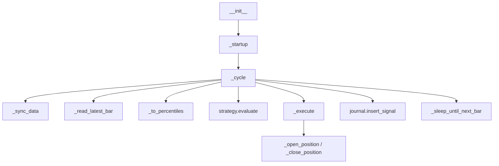
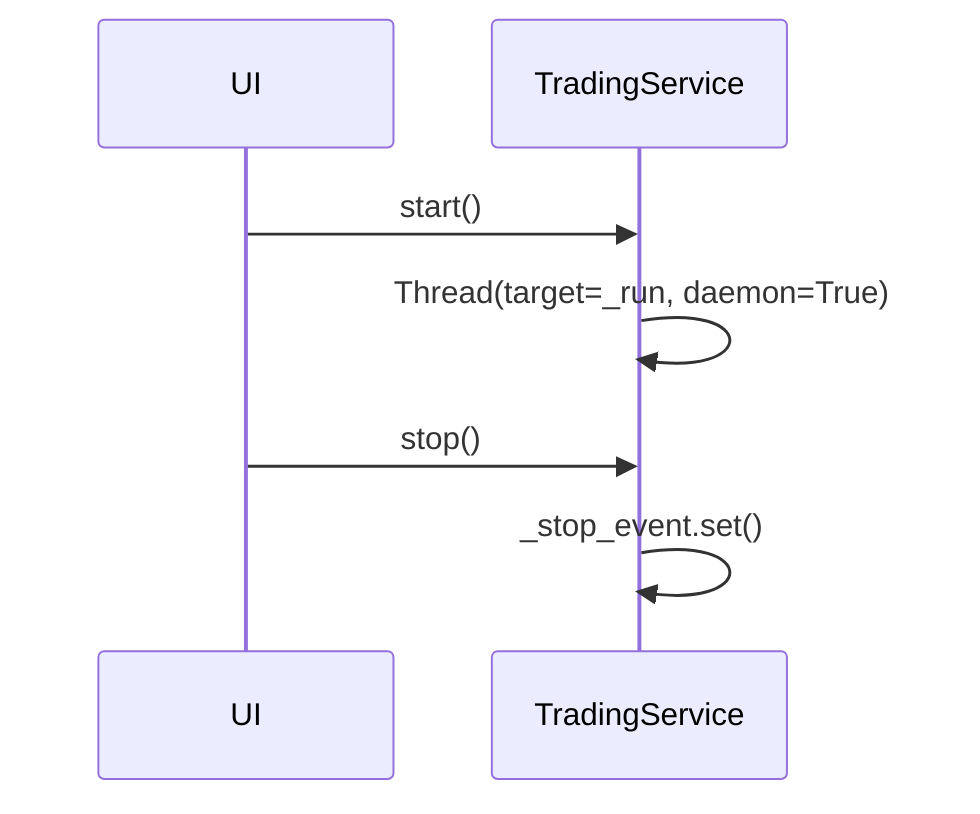
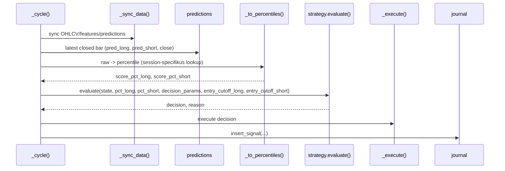
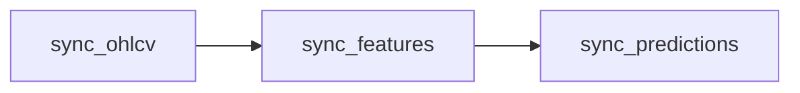

# 7120 - TradingService

`src/trading/live/service.py`

A `TradingService` a live trading runtime központi orchestratora. Egyetlen
objektumba fogja a strategy artifact betöltését, az 1m szinkront, a percentile
konverziót, a döntéshozást, a Binance végrehajtást és a journalinget.

> Módszertani háttér (cycle design, entry/exit logika, risk limits):
> → [`../methodology_doc/7100_live_trading.md`](../methodology_doc/7100_live_trading.md)

---

## Overview

---

## `TradingService.__init__(config)`

Inicializálja a runtime kontextust.

| Paraméter | Típus | Leírás |
|-----------|------|--------|
| `config` | `dict` | `config/trading.json` feloldott tartalma |

Lépések:
- betölti a **long és short session külön artifactját** (`strategy_session_long_id` + `strategy_session_short_id`);
- `entry_cutoff_long`: a long session `decision_params["entry_cutoff"]`-ja;
- `entry_cutoff_short`: a short session `decision_params["entry_cutoff"]`-ja;
- beolvassa a **session-specifikus rank lookup parqueteket** (long lookup a long sessionből, short a shortból);
- rögzíti a predikció oszlopneveket (`long_pred`, `short_pred`);
- létrehozza a `BinanceFuturesClient` példányt.

Dual session konfiguráció (trading.json):
- `strategy_session_long_id` — long session azonosítója (kötelező)
- `strategy_session_short_id` — short session azonosítója (fallback: `strategy_session_id`)

Ha `strategy_session_long_id` nincs megadva, a service `ValueError`-t dob.

Dual rank lookup tárolás:
- `_rank_scores_long` / `_rank_pct_long` — long session `rank_lookup_long_path` parquetből
- `_rank_scores_short` / `_rank_pct_short` — short session `rank_lookup_short_path` parquetből

## `start()` / `stop()` / `is_running()`

Háttérszálas futást biztosít a Streamlit UI számára.

Returns:
- `start()`: `None`
- `stop()`: `None`
- `is_running()`: `bool`

## `_run()`

Top-level lifecycle wrapper: startup, ciklus, hiba-kezelés, shutdown.

Returns: `None` - a loop `stop()` vagy hiba-limit után zárul.

## `_startup()`

Inicializálja a journalt és restore-olja az előző nyitott pozíciót.

Fő mellékhatások:
- `journal.ensure_tables()`
- `journal.insert_run()`
- `TradingState.from_db(...)`
- `exchange.set_leverage()`

## `_cycle()`

Egy lezárt bar teljes feldolgozása.

Returns: `None` - ha nincs új predikció, a kör üresen tér vissza.

## `_to_percentiles(pred_long, pred_short)`

`np.interp`-et használ a session-specifikus rank lookup görbéken:
- long percentile: `_rank_scores_long` / `_rank_pct_long` (long session lookupból)
- short percentile: `_rank_scores_short` / `_rank_pct_short` (short session lookupból)

| Paraméter | Típus | Leírás |
|-----------|------|--------|
| `pred_long` | `float` | nyers long score |
| `pred_short` | `float` | nyers short score |

Returns: `tuple[float, float]` - `(pct_long, pct_short)` a `[0, 1]` tartományban.

## `_execute(decision, reason, bar_open_time, bar_close, now)`

Routing függvény az entry/exit műveletekre.

Returns: `None`

Leágazások:
- `HOLD` -> nincs művelet;
- `ENTER_LONG/SHORT` -> `_open_position()`;
- `EXIT_LONG/SHORT` -> `_close_position()`.

## `_open_position(side, mark_price, bar_open_time, reason)`

Piaci belépés nyitása és journal insert.

Returns: `None`

Fő műveletek:
- napi risk limit check;
- `exchange.open_long/open_short`;
- `journal.insert_position`;
- `journal.insert_order`;
- `TradingState` frissítése.

## `_close_position(mark_price, reason, now)`

Pozíció zárása, PnL számítás és state visszaállítás `FLAT`-ra.

Returns: `None`

Fő műveletek:
- `exchange.close_long/close_short`;
- PnL számítás (entry-exit különbség × qty);
- `journal.close_position` + `journal.insert_order`;
- `state.record_trade_result(pnl_usdt)`;
- `state.status = FLAT` + `state.clear_position()`.

## `_sync_data()`

Az élő adatfrissítés háromlépcsős pipeline-ja.

Returns: `None` - kivételt dob, ha a sync nem sikerül.

## `_read_latest_bar()`

Az utolsó lezárt és nem-null predikciós sort olvassa a `predictions` táblából.

Returns: `tuple[str, float, float, float] | None`

Kimenet:
- `open_time`
- `long_pred`
- `short_pred`
- `close`

## `_daily_limits_ok()`, `_consecutive_errors_exceeded()`, `_handle_error()`, `_sleep_until_next_bar()`, `_shutdown()`

Runtime guard és lifecycle helper függvények:
- napi trade/loss limit;
- egymást követő hibák max száma;
- journalozott hibabejegyzés;
- perc-határra alvás;
- run lezárása és opcionális export.

---

## Kapcsolódó dokumentumok

- [`7110_run_service.md`](7110_run_service.md) — headless CLI belépési pont
- [`7130_trading_journal.md`](7130_trading_journal.md) — journal írási API
- [`7140_trading_exchange.md`](7140_trading_exchange.md) — `BinanceFuturesClient`
- [`7150_trading_state_strategy.md`](7150_trading_state_strategy.md) — `TradingState` és `evaluate`
- [`../methodology_doc/7100_live_trading.md`](../methodology_doc/7100_live_trading.md) — live trading módszertan
