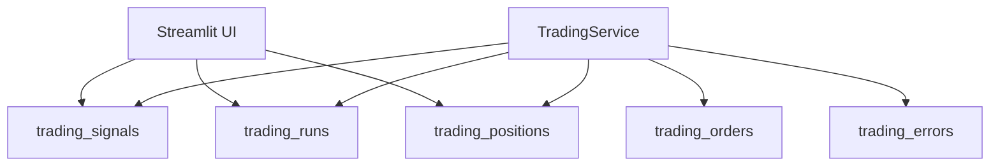
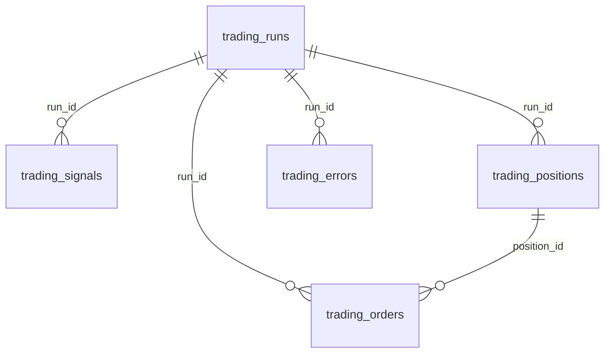

# 7130 - Trading Journal

`src/trading/live/journal.py`

A modul a `trading.db` teljes írható/olvasható szerződése. Minden write tranzakcióban
fut, a dashboard oldali olvasások pedig ugyanerről a sémáról épülnek.

> Módszertani háttér (journal design, audit trail):
> → [`../methodology_doc/7100_live_trading.md`](../methodology_doc/7100_live_trading.md)

---

## Overview

---

## `trading_db_path()`

Betölti a journal DB elérési útját a trading configból.

Returns: `str` - feloldott `db_path`.

## `_connect(db_path)`

Context manager, amely megnyitja a DuckDB kapcsolatot és tranzakciót kezel.

Returns: context manager `duckdb.DuckDBPyConnection`.

## `ensure_tables(db_path)`

Létrehozza a sequence-eket és az öt fő táblát.

Returns: `None`

## Write API

### `insert_run(...)`

Új service futás indítása.

Returns: `None`

### `mark_run_stopped(db_path, run_id)`

Lezárja a run-t `stopped_at` kitöltéssel.

Returns: `None`

### `insert_signal(...)`

Egy bar feldolgozásának döntésnaplója.

Returns: `None`

### `insert_position(...)`

Nyitott pozíció beszúrása.

Returns: `None`

### `close_position(...)`

Pozíció zárása, exit ár és PnL mentése.

Returns: `None`

### `insert_order(...)`

Order response perzisztálása nyitáskor és záráskor.

Returns: `None`

### `insert_error(...)`

Hibanapló írás; kivétel esetén elnyeli a journal saját hibáját, hogy a service
ne essen el másodlagos hibától.

Returns: `None`

## Read API

### `get_open_position(db_path)`

Az utolsó `OPEN` státuszú pozíció.

Returns: `dict | None`

### `get_latest_run(db_path)`

Legutóbbi run rekord.

Returns: `dict | None`

### `get_recent_signals(db_path, limit)`

Legutóbbi döntések listája.

Returns: `list[dict]`

### `get_recent_positions(db_path, limit)`

Legutóbbi pozíciók listája.

Returns: `list[dict]`

### `get_current_run_status(db_path)`

Dashboard-összesítő objektum a runról, open positionről és utolsó signalról.

Returns: `dict | None`

## Export API

### `export_run(db_path, run_id, report_dir)`

CSV exportot és `summary.json` fájlt készít a futásról.

Returns: `None`

### `_export_table(...)`, `_write_run_summary(...)`

Alacsony szintű export segédek.

---

## Kapcsolódó dokumentumok

- [`7120_trading_service.md`](7120_trading_service.md) — journal write hívások kontextusa
- [`8140_ui_runners.md`](8140_ui_runners.md) — dashboard journal read wrapper
- [`../methodology_doc/7100_live_trading.md`](../methodology_doc/7100_live_trading.md) — live trading módszertan
