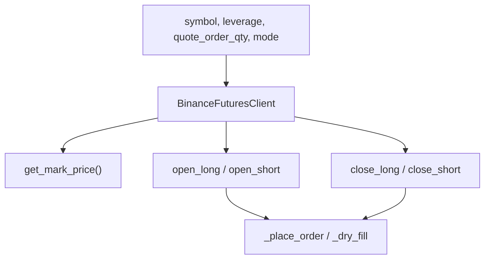
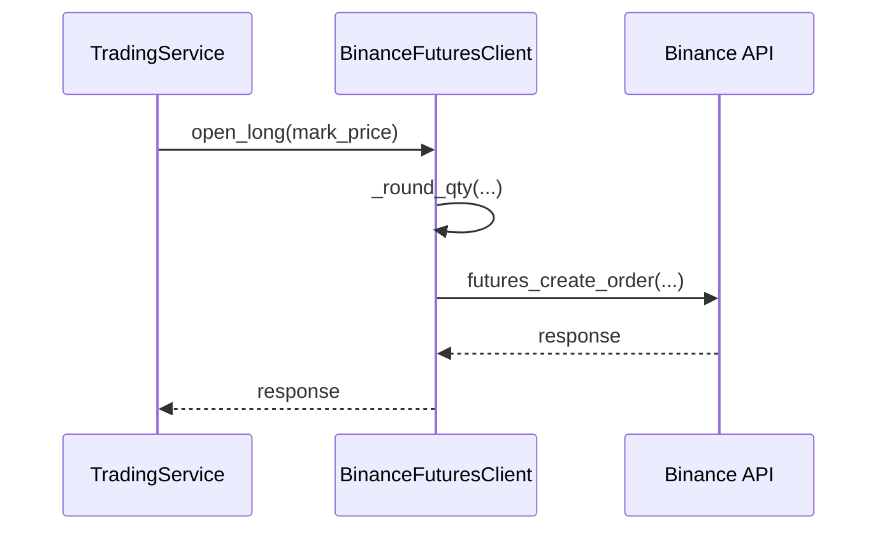

# 7140 - Binance Futures Client

`src/trading/live/exchange.py`

A `BinanceFuturesClient` egy vékony adapter a `python-binance` Futures API fölött.
Két futási módja van: `dry_run`, ahol a rendszer csak szimulált fill választ ad,
és `live`, ahol aláírt market ordereket küld.

> Módszertani háttér (dry-run vs live mód, Binance Futures integrációs döntések):
> → [`../methodology_doc/7100_live_trading.md`](../methodology_doc/7100_live_trading.md)

---

## Overview

---

## `_round_qty(qty, step=_SOL_QTY_STEP)`

SOLUSDT lot-size kerekítő.

Returns: `float` - lépésközre igazított mennyiség.

## `BinanceFuturesClient.__init__(symbol, leverage, quote_order_qty, mode)`

Eltárolja a kereskedési paramétereket és live módban létrehozza az API klienst.

Returns: `None`

## `set_leverage()`

Live módban beállítja a leverage-et, dry-run módban csak logol.

Returns: `None`

## `get_mark_price()`

Lekéri a mark árat.

Returns: `float`

Leágazások:
- `dry_run`: `_dry_run_price()`
- `live`: `futures_mark_price()`

## `open_long(mark_price)`, `open_short(mark_price)`

A quote notionalból és leverage-ből számol mennyiséget, majd market ordert küld
vagy dry fillt generál.

Returns: `dict` - Binance-szerű order response.

## `close_long(quantity, mark_price)`, `close_short(quantity, mark_price)`

Meglévő pozíció csökkentő záró market order.

Returns: `dict`

## `_place_order(side, quantity, reduce_only)`

Alacsony szintű futures order wrapper.

Returns: `dict`

## `_dry_fill(side, quantity, price)`

Determinista dry-run válasz, `dry_run: true` mezővel.

Returns: `dict`

## `_make_client()`

Beolvassa a Binance kulcsokat `config/env.json` által mutatott fájlból, majd a
szerveridő alapján korrigálja a `timestamp_offset` értéket.

Returns: `binance.client.Client`

---

## Kapcsolódó dokumentumok

- [`7120_trading_service.md`](7120_trading_service.md) — `BinanceFuturesClient` hívási kontextus
- [`../methodology_doc/7100_live_trading.md`](../methodology_doc/7100_live_trading.md) — live trading módszertan
