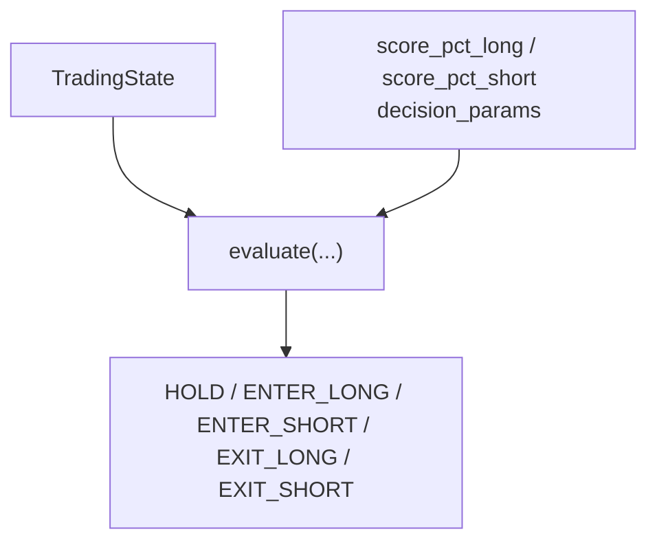
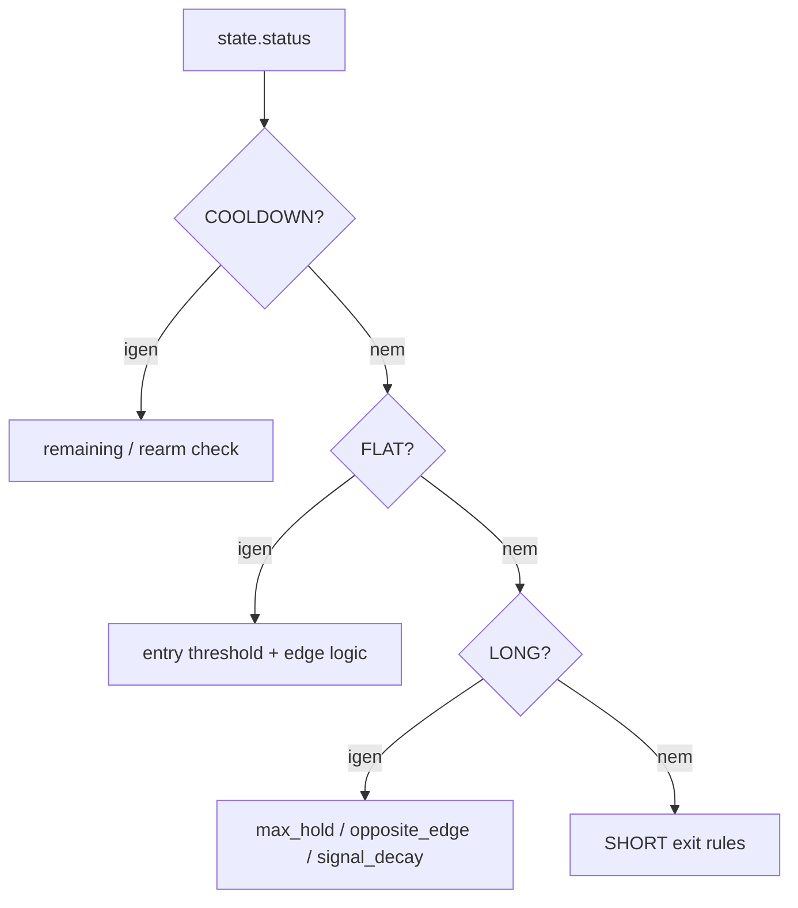

# 7150 - Trading State And Strategy

`src/trading/live/state.py`
`src/trading/live/strategy.py`

Ez a két fájl a live runtime döntési magja: az egyik a mutable állapotot tartja,
a másik egyetlen bar alapján visszaadja a következő akciót.

> Módszertani háttér (state machine design, entry/exit logika, cooldown rationale):
> → [`../methodology_doc/7100_live_trading.md`](../methodology_doc/7100_live_trading.md)

---

## Overview

---

## `TradingState`

Mutable dataclass egy service run idejére.

Fő mezők:
- lifecycle: `status`, `armed`, `cooldown_until`;
- open position: `position_id`, `side`, `entry_time`, `entry_price`, `quantity`;
- risk counters: `daily_trade_count`, `daily_loss_usdt`, `consecutive_errors`, `last_trade_date`.

### `hold_minutes(now=None)`

Returns: `float` - az aktuális pozíció tartási ideje percben.

### `clear_position()`

Returns: `None` - kinullázza a nyitott pozíció mezőit.

### `record_trade_result(pnl_usdt)`

Returns: `None` - napi trade számláló és veszteség limit alapját frissíti.

### `from_db(run_id, open_position)`

Returns: `TradingState` - journalból restore-olt vagy üres állapot.

## `evaluate(state, score_pct_long, score_pct_short, decision_params, now=None)`

Egyetlen closed bar döntését adja vissza állapotmódosítás nélkül.

| Paraméter | Típus | Leírás |
|-----------|------|--------|
| `state` | `TradingState` | aktuális runtime állapot |
| `score_pct_long` | `float` | long percentile |
| `score_pct_short` | `float` | short percentile |
| `decision_params` | `dict` | strategy artifact decision contract |
| `now` | `datetime | None` | opcionális idő a tesztelhetőséghez |

Returns: `tuple[str, str]` - `(decision, reason)`.

## Döntési szabályok

### FLAT

- `armed == False` esetén mindig `HOLD`.
- Long belépés: `score_pct_long >= long_entry_pct`.
- Short belépés: `score_pct_short >= short_entry_pct`.
- Kettős jel esetén `highest_edge` szabály dönt.

### LONG

- `max_hold_minutes` túllépése -> `EXIT_LONG`
- `short_entry_pct` elérése `min_hold_minutes` után -> `EXIT_LONG`
- `score_pct_long < rearm_pct` `min_hold_minutes` után -> `EXIT_LONG`

### SHORT

- `max_hold_minutes` túllépése -> `EXIT_SHORT`
- `long_entry_pct` elérése `min_hold_minutes` után -> `EXIT_SHORT`
- `score_pct_short < rearm_pct` `min_hold_minutes` után -> `EXIT_SHORT`

### COOLDOWN

- cooldown alatt `HOLD`
- lejárat után is addig `HOLD`, amíg mindkét percentile `<= rearm_pct`

## Tesztek

A fenti contractot a `src/trading/tests/live/smoke/` smoke tesztjei fedik:
- `test_strategy.py`
- `test_state.py`

---

## Kapcsolódó dokumentumok

- [`7120_trading_service.md`](7120_trading_service.md) — `evaluate` és `TradingState` hívási kontextus
- [`../methodology_doc/7100_live_trading.md`](../methodology_doc/7100_live_trading.md) — state machine és döntési logika módszertana
