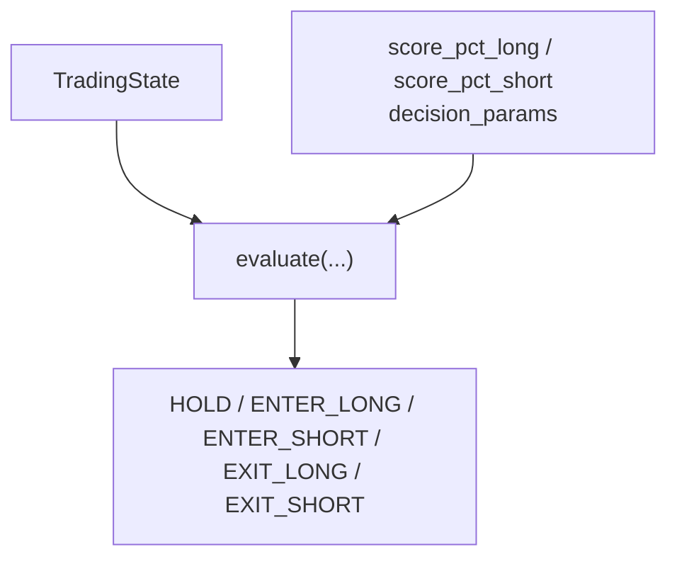
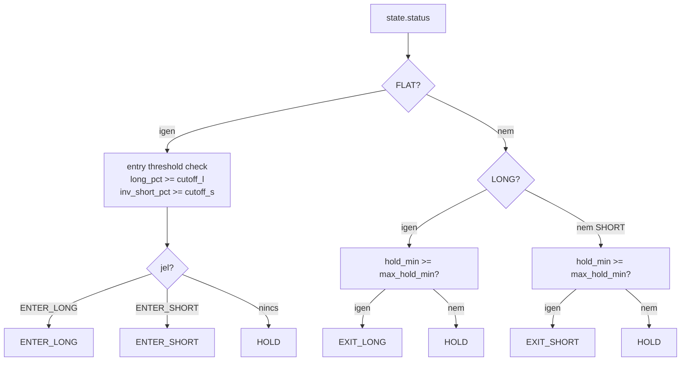

# 7150 - Trading State And Strategy

`src/trading/live/state.py`
`src/trading/live/strategy.py`

Ez a két fájl a live runtime döntési magja: az egyik a mutable állapotot tartja,
a másik egyetlen bar alapján visszaadja a következő akciót.

> Módszertani háttér (state machine design, entry/exit logika, timeout logika):
> → [`../methodology_doc/7100_live_trading.md`](../methodology_doc/7100_live_trading.md)

---

## Overview

---

## `TradingState`

Mutable dataclass egy service run idejére.

Fő mezők:
- lifecycle: `status` (`FLAT` | `LONG` | `SHORT`);
- open position: `position_id`, `side`, `entry_time`, `entry_price`, `quantity`;
- risk counters: `daily_trade_count`, `daily_loss_usdt`, `consecutive_errors`, `last_trade_date`.

### `hold_minutes(now=None)`

Returns: `float` - az aktuális pozíció tartási ideje percben.

### `clear_position()`

Returns: `None` - kinullázza a nyitott pozíció mezőit.

### `record_trade_result(pnl_usdt)`

Returns: `None` - napi trade számláló és veszteség limit alapját frissíti.

### `from_db(run_id, open_position)`

Returns: `TradingState` - journalból restore-olt vagy üres állapot.

## `evaluate(state, score_pct_long, score_pct_short, decision_params, now=None, entry_cutoff_long=None, entry_cutoff_short=None)`

Egyetlen closed bar döntését adja vissza állapotmódosítás nélkül.

| Paraméter | Típus | Leírás |
|-----------|------|--------|
| `state` | `TradingState` | aktuális runtime állapot |
| `score_pct_long` | `float` | long percentile |
| `score_pct_short` | `float` | short percentile |
| `decision_params` | `dict` | strategy artifact decision contract (alap `entry_cutoff` forrása) |
| `now` | `datetime \| None` | opcionális idő a tesztelhetőséghez |
| `entry_cutoff_long` | `float \| None` | opcionális long belépési cutoff; ha `None`, a `decision_params["entry_cutoff"]` az alap |
| `entry_cutoff_short` | `float \| None` | opcionális short belépési cutoff; ha `None`, a `decision_params["entry_cutoff"]` az alap |

A `TradingService` a long cutoffot a long session artifactból, a short cutoffot a short
session artifactból tölti be, és mindkettőt átadja ennek a függvénynek. Így a két irány
belépési küszöbe egymástól független.

Returns: `tuple[str, str]` - `(decision, reason)`.

## Döntési szabályok

### FLAT

- Long belépés: `score_pct_long >= entry_cutoff_long`.
- Short belépés: `(1.0 - score_pct_short) >= entry_cutoff_short`.
- Kettős jel esetén long prioritás: `ENTER_LONG` dönt.
- Egyik feltétel sem teljesül: `HOLD`.

### LONG

- `hold_minutes >= max_hold_minutes` -> `EXIT_LONG` (timeout-only exit).
- Egyéb esetben: `HOLD`.

### SHORT

- `hold_minutes >= max_hold_minutes` -> `EXIT_SHORT` (timeout-only exit).
- Egyéb esetben: `HOLD`.

## Tesztek

A fenti contractot a `src/trading/tests/live/smoke/` smoke tesztjei fedik:
- `test_strategy.py`
- `test_state.py`

---

## Kapcsolódó dokumentumok

- [`7120_trading_service.md`](7120_trading_service.md) — `evaluate` és `TradingState` hívási kontextus
- [`../methodology_doc/7100_live_trading.md`](../methodology_doc/7100_live_trading.md) — state machine és döntési logika módszertana
