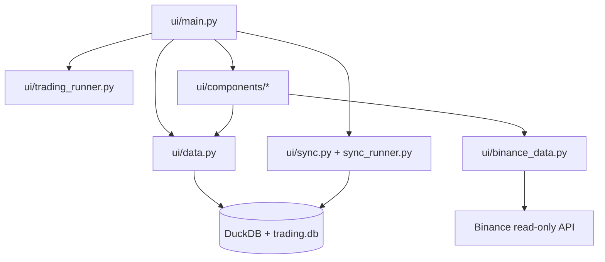

# 8000 - UI

A `src/ui/` modul a ChronoQuant Streamlit dashboardja. Olvas a predikciós és
journal adatforrásokból, vezérli a háttérszinkront és a trading service-t, majd
vizuális kártyákon és chartokon jeleníti meg az állapotot.

---

## Overview

---

## Felelősség

- Streamlit oldal összeállítása és állapotkezelése.
- Predikciós, trade és journal adatok olvasása.
- Background sync és background trading indítása/leállítása.
- Chartok, logok és trade kártyák kirajzolása.

## Nem feladata

- Modelltanítás vagy strategy kalibráció.
- Közvetlen DuckDB üzleti adatmanipuláció.
- Live order placement közvetlen hívása a komponensekből.

## Fejezetek

| Szám | Fájl | Tartalom | Szint |
|------|------|----------|-------|
| 8100 | [8100_dashboard.md](8100_dashboard.md) | dashboard metodológia és almodulok | X100 |

A kódszintű komponensbontás külön a code-doc zónában van; itt a cél a dashboard
működési logikájának és felelősségi határainak rögzítése.
