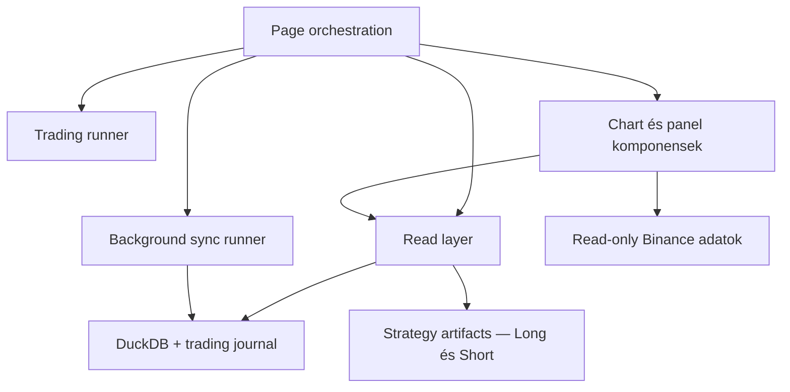
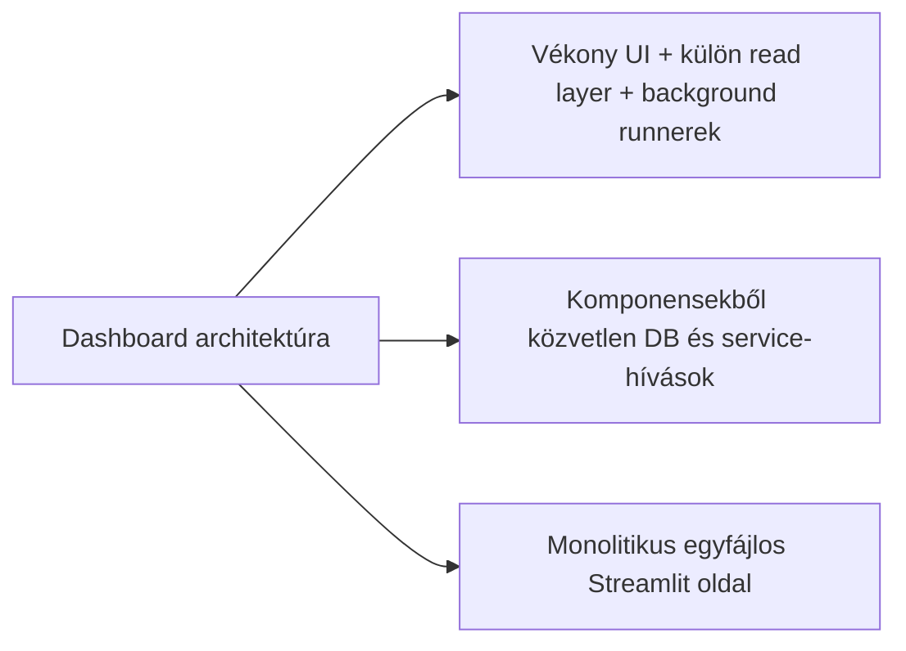
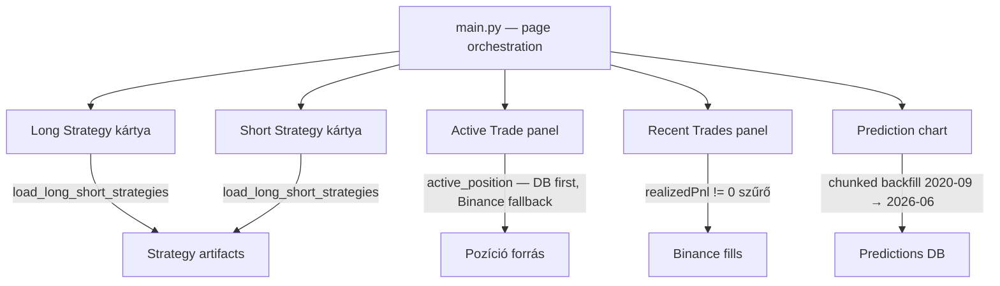
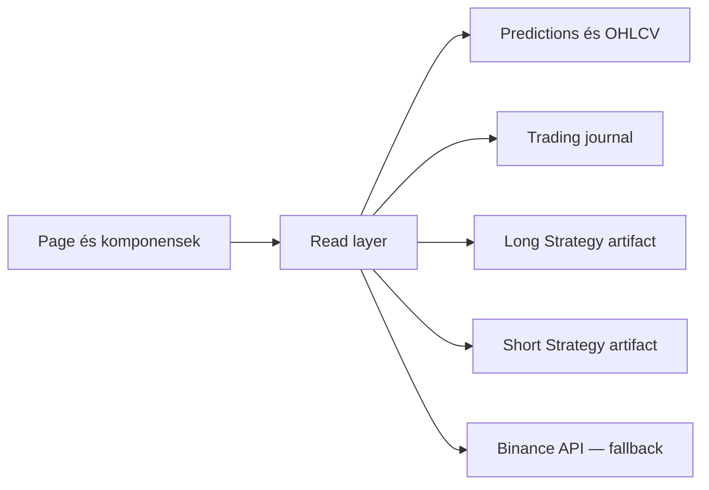
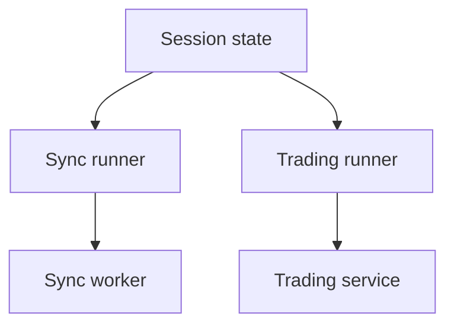
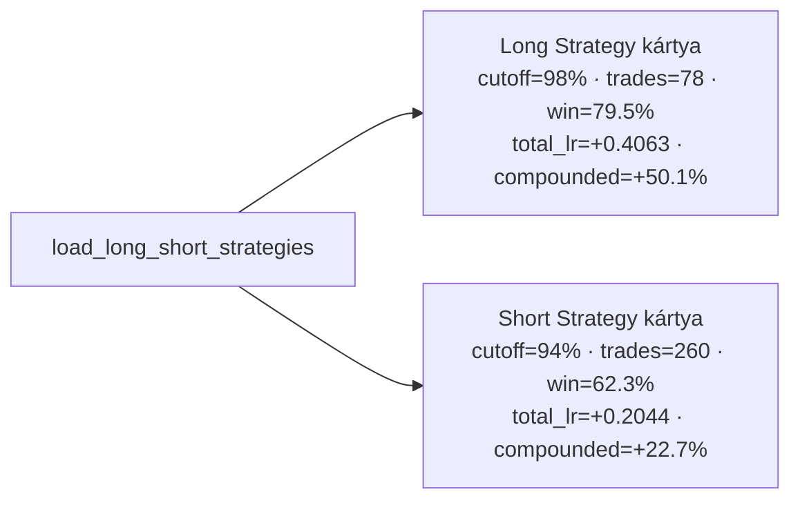
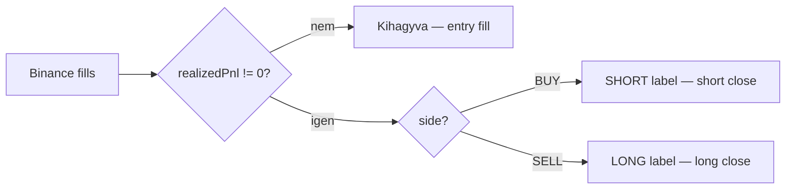
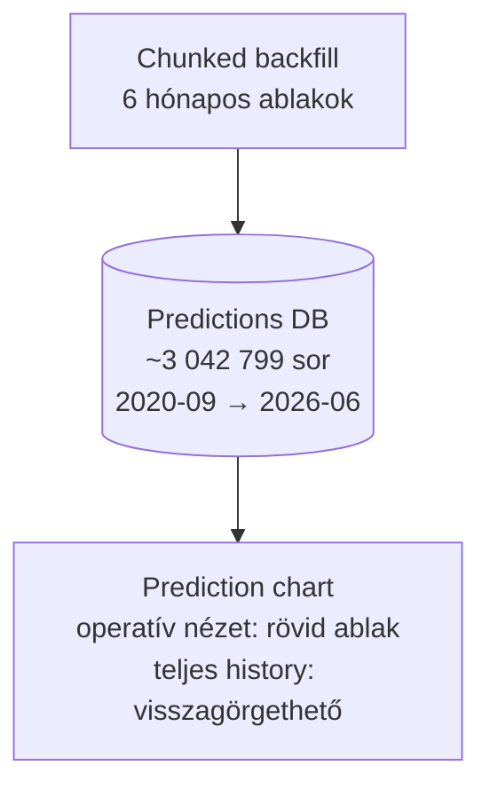

# 8100 - Dashboard

A dashboard célja, hogy ugyanabból a rendszerből egyszerre adjon operátori átláthatóságot és biztonságos vezérlési pontot. Nem elemző notebook és nem admin backoffice: a live állapot gyors, olvasható és korlátozottan vezérelhető nézete.

## Overview





### UI panel elrendezés (aktuális)



## Üzleti és módszertani háttér

### Miért kritikus ez a lépés?

A dashboard az a pont, ahol az operátor először látja együtt a predikciós állapotot, a futó syncet, a trading service státuszát és a közelmúltbeli trade-eket. Ha ez a réteg pontatlan vagy túl szorosan össze van kötve a backenddel, akkor egyszerre sérül a megfigyelhetőség és a biztonságos kezelhetőség.

Ez különösen fontos Streamlit környezetben, mert a rerender-ciklus könnyen elrejti a háttérben futó szálak és singleton service-ek valós állapotát. A dashboard metodológiájának ezért az explicit állapotkezelés és a felelősségek szétválasztása köré kell épülnie.

### Miért ezt a megközelítést?

| Megközelítés | Előny | Hátrány | Státusz |
|--------------|-------|---------|---------|
| Vékony page-layer, külön read-layer és külön background runner-ek | Csökkenti a UI-kód terhelését, jobban túléli a rerendert és lock-helyzeteket | Több modult kell összehangolni | Választott |
| Komponensekből közvetlen SQL és service-hívás | Gyors prototipizálás | Szétcsúszó lekérdezési logika, gyengébb hibakezelés | Elvetett |
| Egyetlen monolitikus Streamlit oldal minden felelősséggel | Kevés fájl | Nehéz karbantartani és tesztelni | Elvetett |
| Dashboardból közvetlen order placement logika | Rövid vezérlési út | Túl nagy UI-felelősség és operációs kockázat | Elvetett |

### Miért kell külön read-layer és hogyan működik?

A dashboard komponenseinek nem az a feladata, hogy önállóan tudják, melyik tábla, melyik artifact vagy melyik fallback útvonal az aktuális igazságforrás. A read-layer egységesíti ezt a hozzáférést, és egy stabilabb, magasabb szintű adatmodellt ad a page és a komponensek felé.



**Szabály:** komponens ne hordozzon saját SQL- vagy artifact-feloldási logikát, ha ugyanaz a kérdés a read-layeren keresztül egy helyen megoldható.

**`load_long_short_strategies()` — kettős artifact forrás:** a read-layer egyetlen hívással tölti be mindkét strategy session artifact-ját (Long és Short), és egy strukturált objektumot ad vissza, amiből a két kártya egymástól függetlenül renderel. Így a stratégiák bővíthetők és cserélhetők anélkül, hogy az UI layout logikát érinteni kellene.

### Miért kell külön sync- és trading-runner és hogyan működik?

Streamlit alatt a page újrarenderelődik, ezért a háttérfolyamatok életciklusa nem tárolható megbízhatóan lokális változókban. A sync- és trading-runner réteg ennek megfelelően explicit állapotobjektummal, háttérszállal és singleton szemantikával választja le a hosszabb életű műveleteket a vizuális renderelésről.



**Szabály:** a dashboard indíthat és állíthat folyamatot, de nem válhat maga a futó folyamat állapotának elsődleges tárolójává.

### Long Strategy / Short Strategy kártyák: miért kell és hogyan működnek?

Korábban egyetlen "Aktív Stratégia" kombinált kártya mutatta az aktuális session paramétereit. Mivel az asset-en egyidejűleg futhat long és short session, a kombinált kártya nem tudta megkülönböztetni a két irány eltérő cutoff és performance adatait. Az elavult kártya eltávolításra került a `main.py`-ból.

Az új elrendezésben két egymás melletti kártya jelenik meg:

| Kártya | Tartalom |
|--------|----------|
| `▲ Long Strategy` | session_id, cutoff %, trades, win rate, total_lr, compounded return |
| `▼ Short Strategy` | session_id, cutoff %, trades, win rate, total_lr, compounded return |



**Szabály:** a kártyák nem végeznek saját artifact-feloldást — a `load_long_short_strategies()` hívás adja vissza mindkét session adatait egy struktúrában. Ha csak egy irány aktív, a másik kártya üresen vagy `N/A` állapotban jelenik meg.

### Active Trade panel: Binance fallback pozíció-lekérdezés

A local trading journal az elsődleges pozíció-forrás. Ha a local DB-ben nincs nyitott pozíció (pl. service újraindítás után, vagy ha a journal még nem frissült), a `data.active_position()` automatikusan Binance API-t kérdez le. A Binance-ből érkező adat `[Binance]` taggel jelenik meg a panelen, és tartalmazza az unrealized PnL értékét is.

```mermaid
flowchart TD
  AP[active_position hívás]
  AP --> DBQ{Local DB\nnyitott pozíció?}
  DBQ -- igen --> LOCAL[Pozíció a journal-ből\nnincsen tag]
  DBQ -- nem --> BINQ[Binance API lekérdezés]
  BINQ --> BTAG[Pozíció Binance-ből\n[Binance] tag + unrealized PnL]
```

**Szabály:** a `[Binance]` tag vizuálisan jelzi az operátornak, hogy az adat nem a local journal-ből, hanem az exchange-ből érkezik — a kettő közt rövid eltérés lehetséges (PnL számítási különbség, funding, stb.).

### Recent Trades (Binance) panel: csak zárt ügyletek

Korábban minden fill megjelent a panelen, beleértve az entry és az SL/TP close részteljesítéseket egyaránt. Ez nehezen olvasható képet adott, mert az entry és a close ugyanabban a listában szerepelt.

Az új szűrési szabály: csak `realizedPnl != 0` sorok jelennek meg. Ezek a lezárt pozíciók, ahol az exchange elszámolt nyereséget vagy veszteséget. Ezen felül az irány-label is korrigálásra került:

| Binance side | Panel label | Magyarázat |
|--------------|-------------|------------|
| `BUY` fill | `SHORT` | A vevő-fill egy short pozíció zárása |
| `SELL` fill | `LONG` | Az eladó-fill egy long pozíció zárása |



**Szabály:** az entry fill-ek (`realizedPnl == 0`) nem jelennek meg a Recent Trades panelen. A panel kizárólag lezárt pozíciókat mutat, nem részteljesítéseket.

### Prediction chart: chunked backfill és teljes history

A predikciós chart korábbi változata csak az aktuális session terjedelméig mutatta az adatot. Az új megközelítésben a teljes elérhető prediction history (2020-09-tól 2026-06-ig, ~3 042 799 sor) be lett töltve a DB-be, így a chart long-term trendet és kontextust ad az operátornak.

A backfill OOM-problémák elkerülésére chunked (6 hónapos ablakonkénti) töltéssel történt. Az operatív nézet a rövid intraday ablakot mutatja alapértelmezetten, de az időtengely a teljes historikus adatig visszagörgethető.



**Szabály:** a chunked betöltés a memóriakorlát miatt kötelező — az egyszeri teljes lekérdezés OOM-ot okoz. Az intraday operatív ablak marad az alapértelmezett nézet.

### Paraméter alapértékek és indoklásuk

| Paraméter | Alapérték | Indoklás |
|-----------|-----------|----------|
| auto sync polling | rövid, másodperc-alapú fragment frissítés | A perces piac mellett gyors státuszvisszajelzés kell, de teljes oldalrerender nem szükséges |
| sync delay | néhány másodperces zárt-bar utáni várakozás | Csökkenti annak esélyét, hogy a dashboard még nem teljesen lezárt adatot kérjen le |
| chart fókusz | rövid intraday ablakok (teljes history visszagörgethető) | Operátori nézetben a közeli múlt fontosabb, de az előzmény kontextus is elérhető |
| trading mód választás | `dry_run` és `live` | Ugyanaz a felület használható validációra és éles futtatásra |
| lock esetén fallback | cache vagy utolsó ismert állapot | Az UI maradjon olvasható átmeneti DB-lock mellett is |
| stratégia kártya elrendezés | két egymás melletti kártya (Long / Short) | Mindkét irány cutoff és performance adata egyszerre látható, keveredés nélkül |
| active_position fallback | Binance API (ha local DB üres) | Service újraindítás után is azonnal látható a nyitott pozíció |
| Recent Trades szűrő | `realizedPnl != 0` | Csak lezárt pozíciók jelennek meg — entry fill-ek nem zavarják az olvashatóságot |
| prediction backfill ablak | 6 hónapos chunkok | OOM elkerüléséhez szükséges; a teljes 2020–2026 history egyszeri lekérdezése meghaladja a memóriakorlátot |

### Ismert kockázatok és korlátok

| Kockázat | Tünet | Mitigáció |
|----------|-------|-----------|
| Session-state és háttérfolyamat drift | A képernyő nem pontosan azt mutatja, ami fut | Runner szintű állapotkezelés és explicit státuszlekérdezés |
| DB lock olvasás közben | A chart vagy panel átmenetileg nem frissül | Fallback cache és read-only lekérdezési stratégia |
| Artifact és live service eltérés | A vizuális küszöbök más setupot sugallnak, mint ami fut | Strategy artifact központi feloldása (`load_long_short_strategies()`) |
| Túl sok inline UI-logika | Nehézkes újrahasznosítás és tesztelés | Komponensek és formatterek külön tartása |
| Dashboard túl nagy operációs hatáskörrel | Véletlenül backend-felelősséggé válik | Vezérlési funkciók korlátozása start/stop és read-only nézetekre |
| Binance és local journal eltérés | `[Binance]` tag mellett látott PnL eltér a journal-től | Egyértelmű vizuális jelölés; az operátor tudja, melyik forrásból jön az adat |
| Csak zárt ügyletek szűrése (Recent Trades) | Potenciálisan tévesen szűr, ha egy fill `realizedPnl == 0` de mégis lezárt pozíció | A szűrő az exchange szemantikájára épül — kivételes edge-case, nem kell overengineelni |
| Prediction chart OOM a teljes history egyszeri lekérdezésekor | Process kill vagy memóriahiba backfill közben | Chunked (6 hónapos) backfill az OOM elkerüléséhez |
| Long és Short kártya keveredése | Az operátor összekeveri a két irány adatait | Ikonos jelölés (`▲` és `▼`) és egymás melletti elrendezés |

### Validációs checklist

- [ ] A dashboard nem közvetlenül a komponensekből ír adatbázisba vagy place-el ordereket.
- [ ] A predikciós, journal- és artifact-adatokat a közös read-layer szolgálja ki.
- [ ] A háttérsync és a trading service állapota újrarender után is visszaolvasható.
- [ ] Lock-helyzet esetén a felület degradálódik, de nem omlik össze.
- [ ] A live és dry-run mód közti különbség a végrehajtásban jelenik meg, nem a megfigyelési logikában.
- [ ] A dashboardból látható állapot megfelel a futó artifactnak és a trading confignak.
- [ ] A Long Strategy és Short Strategy kártya eltérő session_id-t, cutoff-ot és performance adatot mutat — nem ugyanaz az artifact töltődik be kétszer.
- [ ] Az Active Trade panel `[Binance]` taggel jelzi, ha a pozíció Binance API-ból érkezik (nem a local journal-ből).
- [ ] A Recent Trades panelen csak `realizedPnl != 0` sorok jelennek meg — entry fill-ek nem látszanak.
- [ ] A prediction chart a teljes historikus adatot mutatja (2020-09-tól), nem csak az aktuális session terjedelméig.

## Almodulok

- Page orchestration és layout: a dashboard vizuális és interakciós gerince.
- Read-layer: predikció, pozíció, equity, strategy artifact és journal nézet egységes kiszolgálása.
- Sync runner: per-asset háttérszinkron és időzítés.
- Trading runner: singleton trading service indítás és státuszlekérdezés.
- Komponensek: chart, trade panel, log panel és formázási segédréteg.
