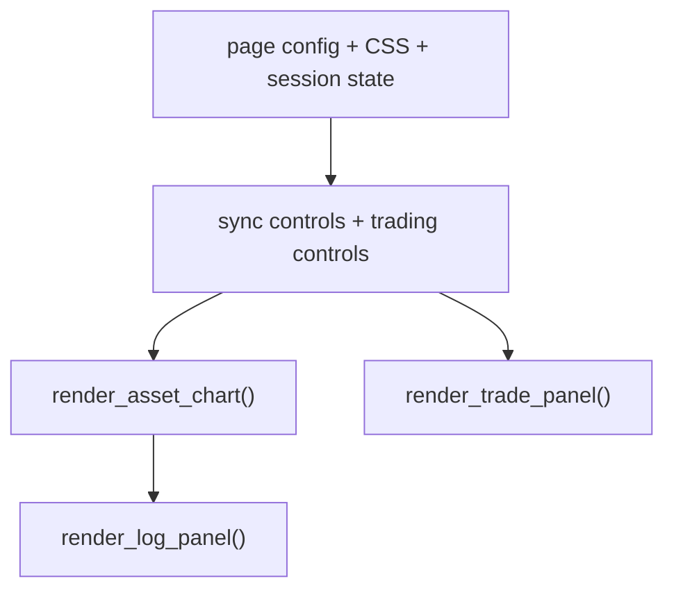
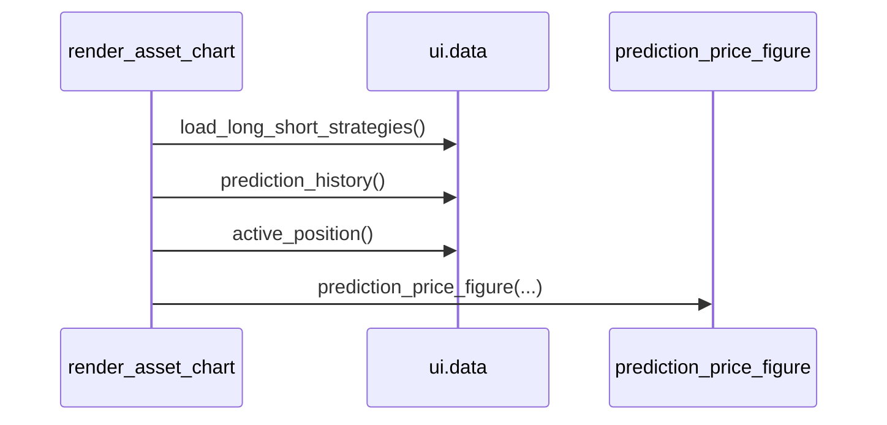

# 8110 - ui/main.py

`src/ui/main.py`

A dashboard belépési pontja. Beállítja a Streamlit page configot, inicializálja
az alap session state-et, kezeli az auto-sync és trading control gombokat, majd
kirendereli a chart és a jobb oldali trade panel elrendezést.

> Módszertani háttér (dashboard design, layout döntések):
> → [`../methodology_doc/8000_ui.md`](../methodology_doc/8000_ui.md)
> → [`../methodology_doc/8100_dashboard.md`](../methodology_doc/8100_dashboard.md)

---

## Overview

---

## `_render_sync_controls(asset_id)`

Egy asset sync állapotát és a gombokat rajzolja ki.

| Paraméter | Típus | Leírás |
|-----------|------|--------|
| `asset_id` | `str | None` | UI oldali asset kulcs |

Returns: `None`

Kapcsolódó hívások:
- `ensure_sync_state()`
- `is_sync_running()`
- `auto_sync_due_seconds()`
- `start_sync()`
- `enable_auto_sync()`
- `disable_auto_sync()`

## `_sync_panel_sol()`

`@st.fragment(run_every="2s")` wrapper az SOL panelhez.

Returns: `None`

## `render_asset_chart(asset_id)`

Betölti a predikciós history-t és az aktív pozíciót, majd létrehozza a Plotly ábrát.

Returns: `None`

## `_render_trading_controls()`

Start/stop gombok a background trading service-hez.

Returns: `None`

Leágazások:
- ha a service fut: státusz + stop gomb;
- ha nem fut: mode selector + start gomb.

## Top-level layout

A fájl végén:
- sidebar épül;
- `active_asset_id` az `utils.load_asset_config(None)["database"]["asset_id"]`-ból jön, `asset_label = "SOL / 1m"` rögzül;
- `st.columns([3, 1])` layoutban balra a chart és log, jobbra a trade panel kerül.

## `_render_strategy_card()` — hívás eltávolítva

A `main.py` tartalmaz egy `_render_strategy_card()` függvényt (régi egyoszlopos
formátum), de annak **hívása eltávolításra került** a top-level layoutból —
duplikáció volt a `trade_panel.py`-ban megvalósított kártyákkal.

A strategy kártyák megjelenítése kizárólag a `trade_panel.py`-ban él:
- `_render_strategy_card(cfg, direction)` — egy kártya HTML-je
- `_render_signal_trigger_card(asset_id)` — hívja mindkét kártyát egymás mellett

---

## Kapcsolódó dokumentumok

- [`8120_ui_data.md`](8120_ui_data.md) — dashboard olvasási réteg
- [`8130_ui_sync.md`](8130_ui_sync.md) — sync layer
- [`8140_ui_runners.md`](8140_ui_runners.md) — trading runner + logging
- [`8150_ui_components.md`](8150_ui_components.md) — chart és panel komponensek
- [`../methodology_doc/8100_dashboard.md`](../methodology_doc/8100_dashboard.md) — dashboard módszertan
