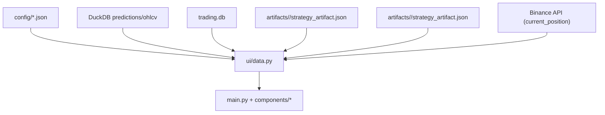

# 8120 - ui/data.py

`src/ui/data.py`

A dashboard olvasási rétege. Egyetlen modulban fogja össze a konfigurációs,
DuckDB, trading journal és artifact alapú olvasásokat, hogy a Streamlit oldal
és a komponensek ne közvetlenül SQL-lel dolgozzanak.

> Módszertani háttér (adatréteg design, UI olvasási kontraktus):
> → [`../methodology_doc/8100_dashboard.md`](../methodology_doc/8100_dashboard.md)

---

## Overview

---

## Config és strategy lookup

### `load_dashboard_config(asset_id=None)`

Összerakja a dashboard szempontjából fontos asset, model és strategy metadata-t.

Returns: `dict`

### `active_strategy(strategies_cfg=None, asset_id=None)`

Kiválasztja az assethez tartozó strategy rekordot.

Returns: `tuple[str | None, dict]`

### `load_long_short_strategies(asset_id=None)`

A long és short session külön-külön betöltött `strategy_artifact.json` fájljaiból
állítja össze a threshold-párokat. Mindkét dict tartalmaz: `entry_cutoff`, `n_trades`,
`win_rate`, `total_lr`, `compounded`, `session_id` mezőket.

- Long artifact: `_active_long_session_id()` által meghatározott session
- Short artifact: `_active_short_session_id()` által meghatározott session

Returns: `tuple[dict, dict]` — `(long_cfg, short_cfg)`

### `_active_long_session_id()`

A `trading.json`-ból olvassa a `strategy_session_long_id` kulcsot.
Visszaesési (fallback) sorrend: `strategy_session_long_id` → `strategy_session_id` → `None`.

Returns: `str | None`

### `_active_short_session_id()`

A `trading.json`-ból olvassa a `strategy_session_short_id` kulcsot.
Visszaesési (fallback) sorrend: `strategy_session_short_id` → `strategy_session_id` → `None`.

Returns: `str | None`

### `_load_session_artifact(session_id)`

A megadott `session_id`-hoz tartozó `artifacts/<session_id>/strategy_artifact.json`
fájlt olvassa be. Hiba esetén üres dict-et ad vissza.

| Paraméter | Típus | Leírás |
|-----------|-------|--------|
| `session_id` | `str \| None` | strategy session azonosító |

Returns: `dict`

## DB utility függvények

### `table_exists(...)`, `table_columns(...)`, `table_row_count(...)`, `latest_table_timestamp(...)`

Általános introspection segédek.

Returns:
- `table_exists`: `bool`
- `table_columns`: `list[str]`
- `table_row_count`: `int`
- `latest_table_timestamp`: `str | None`

## Prediction és chart adat

### `prediction_history(lookback_hours=24, asset_id=None)`

Predikció és OHLCV history összeillesztése chartoláshoz.

Returns: `pd.DataFrame`

### `latest_prediction(asset_id=None)`

Utolsó predikciós rekord JSON-safe dictként.

Returns: `dict | None`

## Trading és backtest adat

### `active_position(asset_id=None)`

Az utolsó nyitott pozíciót adja vissza. Elsődleges forrás a `trading.db`
`trading_positions` táblája (státusz: `OPEN`, `LONG`, `LONG_OPEN`, `SHORT`, `SHORT_OPEN`).

Ha a tábla üres (nem fut service, vagy nincs helyi rekord), **fallback**: a
`binance_data.current_position()` hívás lekérdezi a Binance Futures nyitott pozícióját.
A Binance-tól kapott dict `_source == "binance"` mezőt tartalmaz.

Returns: `dict | None`

### `closed_trades(limit=500, asset_id=None)`

Elsődlegesen `trading_positions` táblából, fallbackként `trades.parquet`-ből olvas.

Returns: `pd.DataFrame`

### `equity_curve(asset_id=None)`

Elsődlegesen DB snapshot táblából, fallbackként `equity_curve.parquet`-ből olvas.

Returns: `pd.DataFrame`

### `backtest_summary(asset_id=None)`

`summary.json` tartalmát adja vissza.

Returns: `dict`

### `recent_orders(limit=200, asset_id=None)`, `recent_errors(limit=100, asset_id=None)`

Trading journal táblák legutóbbi rekordjai.

Returns: `pd.DataFrame`

### `table_health(asset_id=None)`

Rövid health summary a konfigurált üzleti és trading táblákról.

Returns: `pd.DataFrame`

## Alacsony szintű helper réteg

### `_load_rank_lookups()`

Session-specifikus rank lookup párokat tölt be:
- **long lookup**: `_active_long_session_id()` sessionjéből a `rank_lookup_long_path` artifact
- **short lookup**: `_active_short_session_id()` sessionjéből a `rank_lookup_short_path` artifact

Mindkét lookup egy `(score_raw, score_pct)` numpy array-párból áll.

Returns: `tuple[tuple[np.ndarray, np.ndarray] | None, tuple[np.ndarray, np.ndarray] | None]`

### `_coerce_prediction_frame(df)`

Predikciós DataFrame tipizálása és normalizálása.

### `_read_sql(...)`, `_scalar(...)`, `_db_path(...)`, `_session_artifact_path(...)`, `_repo_path(...)`, `_quote_identifier(...)`, `_json_safe(...)`

Közös SQL/path/JSON segédek.

---

## Kapcsolódó dokumentumok

- [`8110_ui_main.md`](8110_ui_main.md) — a fő orchestrációs oldal
- [`8150_ui_components.md`](8150_ui_components.md) — komponensek, amelyek ezt a réteget hívják
- [`7130_trading_journal.md`](7130_trading_journal.md) — journal read API
- [`../methodology_doc/8100_dashboard.md`](../methodology_doc/8100_dashboard.md) — dashboard módszertan
