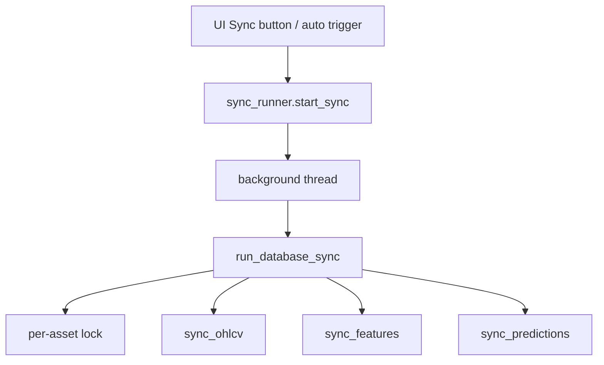

# 8130 - UI Sync Layer

`src/ui/sync.py`
`src/ui/sync_runner.py`

A dashboard sync rétege két részre bomlik: a `sync.py` a tényleges szinkront
futtatja és a per-asset lockot kezeli, a `sync_runner.py` pedig a Streamlit
session state, background thread és auto-trigger logikát adja.

> Módszertani háttér (UI sync design, auto-trigger döntések):
> → [`../methodology_doc/8100_dashboard.md`](../methodology_doc/8100_dashboard.md)

---

## Overview

---

## `sync.py`

### `get_sync_lock(asset_id=None)`

Per-asset `threading.Lock` példányt ad vissza.

Returns: `threading.Lock`

### `SyncResult`

Immutable adatobjektum:
- `start_time`
- `end_time`
- `ohlcv_rows_before`
- `ohlcv_rows_after`
- `inserted_ohlcv_rows` property

### `run_database_sync(asset_id=None)`

Nem-blokkoló lock acquire után elindítja a tényleges syncet.

Returns: `SyncResult`

### `_run_database_sync_locked(asset_id, logger, db_path)`

Az OHLCV -> features -> predictions pipeline core implementációja.

Returns: `SyncResult`

### `_run_with_logged_stdout(func, *args, logger, **kwargs)`

Átirányítja a sync almodulok stdout-ját dashboard logba.

Returns: `None`

### `_next_open_time(open_time)`, `_utc_str_to_ms(value)`

Idősegédek a sync startpont és Binance API input kiszámításához.

## `sync_runner.py`

### `ensure_sync_state(session_state, asset_id=None)`

Inicializálja vagy frissíti a per-asset UI state dictet.

Returns: `dict[str, Any]`

### `is_sync_running(state, asset_id=None)`

Thread és lock alapján megmondja, hogy fut-e sync.

Returns: `bool`

### `start_sync(state, asset_id=None)`

Háttérszálon elindítja a sync workert és frissíti a session state-et.

Returns: `bool`

### `enable_auto_sync(state)`, `disable_auto_sync(state)`

Auto-trigger kapcsolók.

Returns: `None`

### `auto_sync_due_seconds(state, asset_id=None)`

Kiszámolja, hány másodperc múlva esedékes a következő auto-sync.

Returns: `int | None`

### `_sync_worker(state, asset_id)`

Background worker, amely a `run_database_sync()` köré csomagolja a session-state update-et.

Returns: `None`

### `_result_payload(result)`, `_current_closed_minute(epoch)`, `_now_label()`, `_now_epoch()`

UI-specifikus payload és idősegédek.

---

## Kapcsolódó dokumentumok

- [`8110_ui_main.md`](8110_ui_main.md) — sync control gombok orchestrációja
- [`1210_sync_ohlcv.md`](1210_sync_ohlcv.md) — `sync_ohlcv` — az OHLCV sync backend
- [`../methodology_doc/8100_dashboard.md`](../methodology_doc/8100_dashboard.md) — dashboard módszertan
