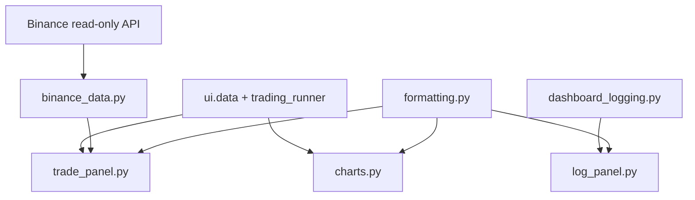

# 8150 - UI Components

`src/ui/components/charts.py`
`src/ui/components/trade_panel.py`
`src/ui/components/log_panel.py`
`src/ui/components/formatting.py`
`src/ui/binance_data.py`

A dashboard megjelenítési logikája ezekben a komponensmodulokban él. A page
szintű orchestration nem rajzol közvetlenül komplex HTML-t vagy chartot, hanem
ezekre a segédmodulokra támaszkodik.

> Módszertani háttér (chart design, trade panel layout, component separation):
> → [`../methodology_doc/8100_dashboard.md`](../methodology_doc/8100_dashboard.md)

---

## Overview



---

## `charts.py`

### `prediction_price_figure(...)`

Háromsoros Plotly figure:
- long prediction;
- price / candlestick;
- short prediction.

Returns: `plotly.graph_objects.Figure`

Fő helper függvények:
- `_ann`
- `_add_trade_overlay`
- `_has_ohlc`
- `_resample_ohlcv`
- `_add_price_candles`
- `_add_threshold_trace`
- `_threshold_legend`
- `_long_signal_markers`
- `_short_signal_markers`
- `_style_figure`

### `equity_figure(df)`

Matplotlib equity chart fallback.

Returns: `matplotlib.figure.Figure`

## `trade_panel.py`

Jobb oldali kereskedési kártyák és trade lista.

Fő render függvények:
- `_render_active_trade_card`
- `_render_recent_trades_panel`
- `_render_trading_status_card`
- `_render_trading_positions_card`
- `_render_signal_trigger_card`
- `_render_strategy_card`
- `render_trade_panel`

Segédek:
- `_fmt`
- `_fmt_time`
- `_group_trades_by_minute`
- `_binance_trade_row_html`

### `_render_strategy_card(cfg, direction)`

Egy strategy kártyát ad vissza HTML stringként (long vagy short).

| Paraméter | Típus | Leírás |
|-----------|-------|--------|
| `cfg` | `dict` | `load_long_short_strategies()` által visszaadott dict |
| `direction` | `str` | `"long"` vagy `"short"` |

Megjelenítési logika:
- `direction == "long"` → fejléc szín zöld (`_GREEN`), nyíl `▲`, cím "Long Strategy"
- `direction == "short"` → fejléc szín piros (`_RED`), nyíl `▼`, cím "Short Strategy"

Megjelenített metrikák: `entry_cutoff`, `n_trades`, `win_rate`, `total_lr`, `compounded`.

Returns: `str` — raw HTML, `st.markdown(..., unsafe_allow_html=True)`-ra szánva.

### `_render_signal_trigger_card(asset_id)` — két strategy kártya

A `_render_signal_trigger_card` végén a long/short strategy kártyák egymás mellé
kerülnek két Streamlit columnban:

```python
long_cfg, short_cfg = data.load_long_short_strategies(asset_id=asset_id)
if long_cfg or short_cfg:
    col1, col2 = st.columns(2)
    with col1:
        st.markdown(_render_strategy_card(long_cfg, "long"), ...)
    with col2:
        st.markdown(_render_strategy_card(short_cfg, "short"), ...)
```

### `_render_active_trade_card(position)` — side_color logika

Az aktív pozíció kártyáján a fejléc-szín:
- `"LONG"` → `_GREEN` (zöld)
- `"SHORT"` → `_RED` (piros)

A pozíció `_source == "binance"` esetén `[Binance]` tag jelenik meg a fejlécben.

## `log_panel.py`

Scrollozható pseudo-terminal a dashboard logfájlból.

Fő függvények:
- `_log_entries`
- `_split_log_header`
- `_terminal_line_html`
- `_render_log_terminal`
- `render_log_panel`

## `formatting.py`

Közös színpaletta és numerikus formatterek:
- `pct`
- `money`
- `number`

## `binance_data.py`

Read-only Binance trade history és pozíció wrapper.

Fő függvények:
- `_make_client`
- `recent_trades`
- `_normalize_futures`
- `_normalize_spot`
- `current_position`
- `_empty_frame`

### `_normalize_futures(rows)`

Futures kötési listát normalizál. Csak lezárt ügyletek kerülnek be: a `realizedPnl`
abszolút értéke alapján szűr (`abs(realizedPnl) >= 0.001`), így a nyitó kötések
(ahol `realizedPnl == 0`) nem jelennek meg.

Side-mapping (Binance futures szemantika):
- `BUY` → `"SHORT"` (ez egy SHORT pozíció zárása)
- `SELL` → `"LONG"` (ez egy LONG pozíció zárása)

Returns: `pd.DataFrame` — `["time", "side", "price", "qty", "quote_qty", "pnl", "commission", "source"]`

### `current_position(asset_id=None)`

Lekéri az assethez tartozó aktuálisan nyitott Binance futures pozíciót.
`futures_position_information` API-t hív, majd az első nem-nulla `positionAmt`
rekordot adja vissza diktként.

| Mező | Típus | Leírás |
|------|-------|--------|
| `side` | `str` | `"LONG"` ha `positionAmt > 0`, `"SHORT"` ha `< 0` |
| `entry_price` | `float` | átlagos belépési ár |
| `quantity` | `float` | pozíció mérete (abszolút érték) |
| `unrealized_pnl` | `float` | nem realizált PnL |
| `_source` | `str` | mindig `"binance"` — fallback forrás jelzésére |

Returns: `dict | None` — `None` ha nincs nyitott pozíció vagy hiba történt.

---

## Kapcsolódó dokumentumok

- [`8110_ui_main.md`](8110_ui_main.md) — `render_asset_chart` és `render_trade_panel` hívási kontextus
- [`8120_ui_data.md`](8120_ui_data.md) — adatbetöltési réteg (komponensek input source-ja)
- [`../methodology_doc/8100_dashboard.md`](../methodology_doc/8100_dashboard.md) — dashboard módszertan
