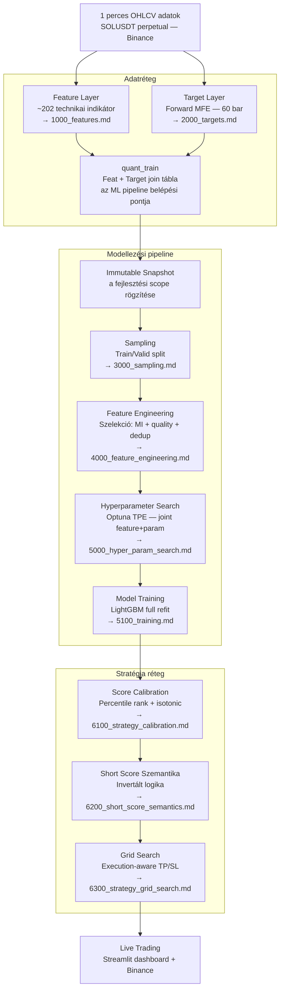
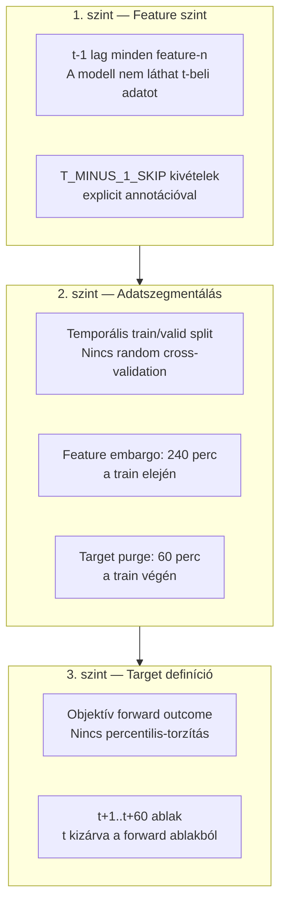

# 0000 — ChronoQuant Módszertani Specifikáció — Áttekintés

## Mi ez a dokumentáció és kinek szól

Ez a dokumentáció a ChronoQuant algoritmikus trading rendszer **módszertani specifikációja**. Nem kóddokumentáció és nem API-referencia — azok a `_doc_/database_and_code_doc/` könyvtárban találhatók. Ez a specifikáció azt rögzíti, **miért** ezek a módszertani döntések születtek, milyen alternatívákat fontoltunk meg, és milyen kockázatokat ismerünk el.

**Elsődleges olvasók:**

- Kvantitatív elemző, aki a módszertani döntések indokát akarja megérteni
- Data scientist, aki a pipeline-t akarja reprodukálni vagy továbbfejleszteni
- Fejlesztő, aki implementációhoz specifikációként használja

**Ami ebből hiányzik (szándékosan):** Python kód, SQL lekérdezések, API referenciák, implementációs fájlelérési utak. Azok a kóddokumentációba tartoznak.

---

## A teljes pipeline magas szintű áttekintése

---

## Fejezetek és az általuk megválaszolt kérdések

### 1000 — Feature Layer

**Kérdés:** Milyen jellemzőkkel írja le a rendszer a piac állapotát?

A `feat_ohlcv_quant` tábla az ML pipeline egyetlen feature forrása. ~202 technikai és statisztikai indikátor, 25 csoportba szervezve (momentum, trend, volatilitás, volume, price action, time/session és mások). Minden feature t-1 lag eltolással tárolódik — ez a lookahead szivárgás elleni fő védekezés. A warmup periódus kezelése meghatározza az első használható adatsor pozícióját.

→ `1000_features.md`

### 2000 — Target Layer

**Kérdés:** Mit tanul meg a modell előrejelezni, és miért ezt?

A target a forward Maximum Favorable Excursion (MFE): a következő 60 bar legjobb elérhető ára logreturn formában. `long_mfe_fw60 = log(max_forward / close)`, `short_mfe_fw60 = log(min_forward / close)`. Folytonos regressziós target — a profit-potenciál intenzitása megmarad, szemben a bináris labelekkel, amelyek elveszítenék ezt az információt.

→ `2000_targets.md`

### 3000 — Sampling

**Kérdés:** Milyen időbeli szerződés szerint tanul a modell?

Fix temporal split: 2021-01–2025-04 train, 2025-05–2026-05 valid. Óránkénti véletlenszerű percmintavétel az autokorreláció csökkentésére. Feature lookback embargo (240 perc) a train elején, target purge (60 perc) a train végén az adatszivárgás ellen.

→ `3000_sampling.md`

### 4000 — Feature Engineering

**Kérdés:** Mely feature-ök kerülnek be ténylegesen a modell tanításába?

Háromdimenziós szűrés a sample-scope-on: adatminőség (null, inf, variancia) → Mutual Information szűrés (MI ≥ 0.001) → korrelációs dedup (Pearson ≥ 0.98 esetén a kisebb MI-jű kiesik). Kimenet: `feature_set.json`. Gain rank a hyperparameter search prioritizálásához.

→ `4000_feature_engineering.md`

### 4100 — Mutual Information

**Kérdés:** Hogyan mérjük, hogy egy feature ténylegesen hordoz-e prediktív jelet?

k-NN alapú MI becslő (scikit-learn `mutual_info_regression`), rank-transformált targettel. A rank-transform az erősen ferde MFE eloszlás miatti becslési torzítást korrigálja — az MI invariáns monoton transzformációra, tehát értéke nem változik, de a becslő pontossága javul.

→ `4100_mutual_information.md`

### 5000 — Hyperparameter Search

**Kérdés:** Milyen LightGBM konfiguráció és hány feature adja a legjobb kereskedési rangsorolást?

Optuna TPE keresés joint módban: `feature_k` (feature-szám) és a LightGBM paraméterek egyszerre optimalizáltak. Objektív: `valid_ratio_p925` (long) / `valid_ratio_p075` (short) — a top/bottom 7.5%-os barok MFE arányát maximalizálja.

→ `5000_hyper_param_search.md`

### 5100 — Model Training

**Kérdés:** Hogyan épül a deployolható modell artifact?

A search által megtalált legjobb paraméterekkel egyszeri full refit az összes jóváhagyott sample-soron. A final `n_estimators` a keresési fold best-iteration átlagából + 10% puffer. Kimenet: `model.pkl`, `features.json`, `params.json`.

→ `5100_training.md`

### 6000 — Strategy Áttekintés

**Kérdés:** Hogyan fordítódik a modell score-ja trading döntéssé?

Három lépés: score kalibrálás → execution-aware grid search → live végrehajtás. A kalibrálás és a keresés offline fut; a live runtime csak a kész artifact-ot fogyasztja. Long és short irány szimmetrikus struktúrájú, de szemantikailag ellentétes.

→ `6000_strategy.md`

### 6100 — Strategy Calibration

**Kérdés:** Hogyan teszik a nyers modell score-ok összehasonlíthatóvá és értelmezhetővé?

Rank percentile kalibrálás: a raw score a kalibrációs periódus eloszlásán belüli helyzetét kapja meg (0–1 skála). Isotonic regression másodlagos overlay a várható MFE becsléshez. Bucket statisztikák (mean, median, p75) a TP-spec alapjaként.

→ `6100_strategy_calibration.md`

### 6200 — Short Score Szemantika

**Kérdés:** Miért fordított a short oldal logikája, és hogyan kell következetesen kezelni?

`short_mfe_fw60 < 0` — alacsonyabb (negatívabb) érték jobb short lehetőséget jelent. A percentilis rangsorban alacsony `score_pct_short` = erős short szignál. Entry feltétel: `(1 - score_pct_short) >= cutoff` — az inverzió explicit és szimmetrikus a long oldallal.

→ `6200_short_score_semantics.md`

### 6300 — Strategy Grid Search

**Kérdés:** Melyik entry/TP/SL kombináció maximalizálja a realizált hozamot?

Kimerítő grid search kis zárt téren: entry_cutoff × tp_spec × sl_spec. Objektív: realizált `fact_log_return` intrabar végrehajtási modellel. Dual-session architektúra: long és short külön optimalizált session-nel és artifacttal.

→ `6300_strategy_grid_search.md`

---

## Keresztmetszetű elvek

### Data Leakage Policy

A szivárgásmentes pipeline három védelmi szinten működik:

### Reprodukálhatóság

Minden pipeline lépés determinisztikus, rögzített seed-del (`seed=42`). Az adatforrás immutable snapshot, nem a live tábla. A feature-set és a modell artifact registry-ben követett provenance-szel. Ugyanaz a snapshot + seed = bitazonos minta.

### Aktív Champion Modell

| Tulajdonság | Érték |
|---|---|
| Model ID | `lgbm_solusdt_l/s_fw60_2101_2605` |
| Irányok | Long + Short (külön modellek) |
| Train periódus | 2021-01-01 – 2025-04-30 |
| Valid periódus | 2025-05-01 – 2026-05-31 |
| Target | `long_mfe_fw60` / `short_mfe_fw60` |
| Long entry cutoff | 0.98 (top 2%) |
| Short entry cutoff | 0.94 (top 6%) |
| Long teljesítmény | 78 trade, 79.5% win rate, +50.1% compounded |
| Short teljesítmény | 260 trade, 62.3% win rate, +22.7% compounded |

### Kód-dokumentáció és specifikáció szétválasztása

Ez a dokumentációs réteg specifikáció, nem kóddokumentáció. A kód hivatkozik ide — nem fordítva. Az implementációs részletek, fájlelérési utak, adatbázis-sémák a `_doc_/database_and_code_doc/` könyvtárban találhatók.
