# 1000 — Feature Layer

## Overview

A feature layer a ChronoQuant ML pipeline bemeneti adatrétege. A `feat_ohlcv_quant` DuckDB tábla az egyetlen feature forrás: minden modellezési döntés — sampling, feature engineering, training, live predict — ezen a táblán alapul. A tábla az 1 perces SOLUSDT OHLCV nyers adatból kiszámított ~202 technikai és statisztikai indikátort tartalmaz.

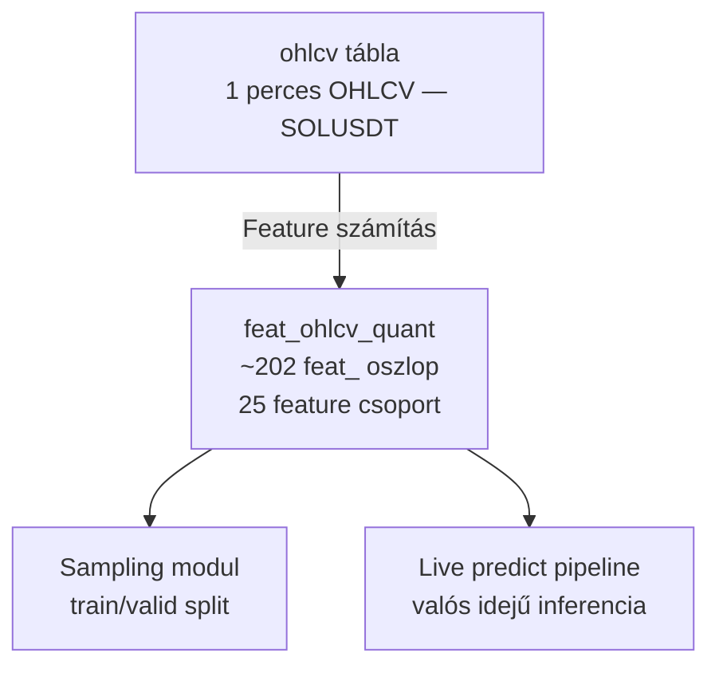

**Aktív feature profil:** `solusdt_fw60` — ~202 feature, 25 csoport, 1 perces granularitás.

A feature layer helyes implementációja kötelező kapu minden modellezési munka előtt. Ha a feature-számítás módosul, a teljes downstream pipeline (sampling, feature engineering, training) újrafuttatandó.

---

## Feature Csoportok és Üzleti Logikájuk

A feature-ök 25 csoportba szerveződnek. Az egyes csoportok különböző piaci aspektusokat mérnek, és különböző időhorizontokon dolgoznak.

A feature-ök 6 főszegmensbe, azon belül 25 alcsoportba szerveződnek.

**1. Ár és struktúra** — mit csinált az árfolyam egy gyertyán belül és a közeli múltban:

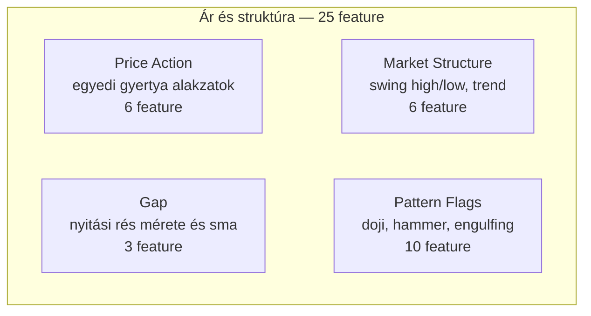

**2. Lendület és trend** — van-e irány és erő az árfolyamban:

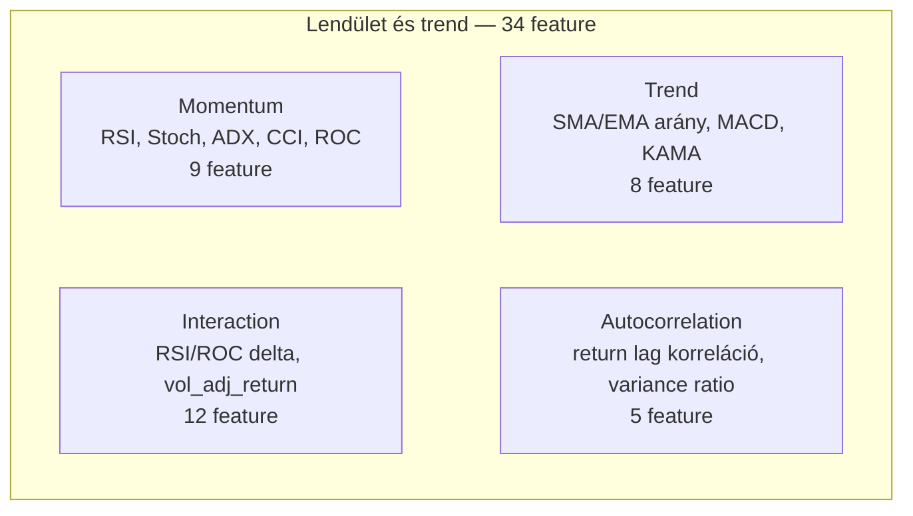

**3. Volatilitás** — mekkora és milyen jellegű a mozgás:

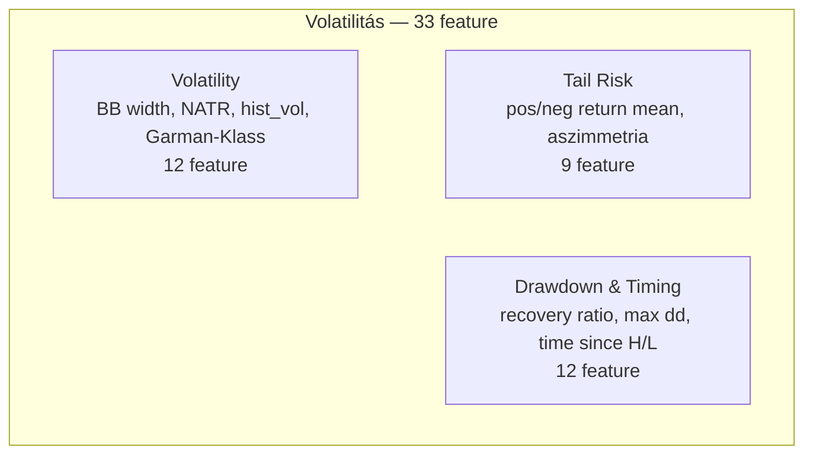

**4. Volume és aktivitás** — ki kereskedik és mennyi forgalommal:

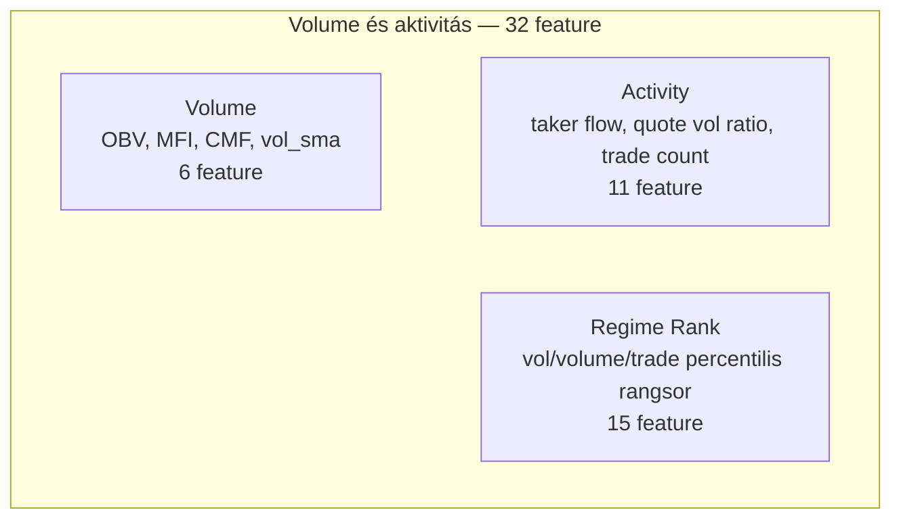

**5. Kontextus és visszatekintés** — hol van az árfolyam a közelmúlt tartományában:

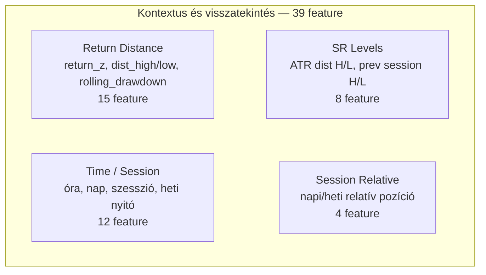

**6. Speciális indikátorok** — kiegészítő strukturált jelzések:

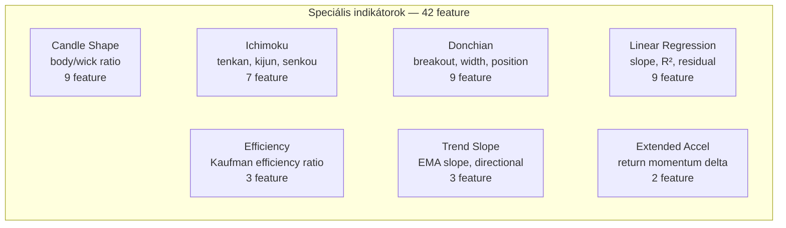

| # | Csoport | Db | Domináns ablak(ok) | Üzleti logika |
|---|---------|----|--------------------|---------------|
| 1 | Momentum | 9 | w=14, 20, 140 | Árfolyam-visszatekintő lendület — RSI, Stoch, ADX, CCI, ROC |
| 2 | Trend | 8 | w=14, 140 | SMA/EMA arány, MACD, KAMA — irány és erő |
| 3 | Volatility | 12 | w=14, 140, w=10,30,60 | BB width, NATR, hist_vol, Garman-Klass, Parkinson szórás |
| 4 | Volume | 6 | w=14, 20 | OBV momentum, MFI, CMF — forgalom minősége |
| 5 | Price Action | 6 | w=14 | Returns std/skew/kurt, log return, hml_range, close_pos |
| 6 | Market Structure | 6 | w=5 | Swing high/low, trend count — piaci struktúra |
| 7 | Activity | 11 | w=10, 30, 60 | Taker flow, quote vol ratio, trade count — aktivitás intenzitás |
| 8 | Return Distance | 15 | w=10, 30, 60 | return_z, dist_high/low, rolling_drawdown |
| 9 | Regime Rank | 15 | w=10, 30, 60 | vol/volume/trade percentilis rangsor — aktuális rezsimelhelyezkedés |
| 10 | Candle Shape | 9 | nincs / w=10,30 | body_ratio, wick_ratio — gyertya morfológia |
| 11 | Trend Slope | 3 | w=10, 30 | EMA slope, directional agreement |
| 12 | Interaction | 12 | w=5, 10, 30 | RSI/ROC delta, vol_adj_return — kompozit jelek |
| 13 | Time / Session | 12 | determinisztikus | Óra, nap, szesszió, heti nyitó — ciklikus idő |
| 14 | Autocorrelation | 5 | lag=1/5, w=30,60 | Return autocorr, variance ratio |
| 15 | Drawdown & Timing | 12 | w=10, 30, 60 | Recovery ratio, max drawdown, time since high/low |
| 16 | Pattern Flags | 10 | nincs / w=10,30,60 | Doji, hammer, engulfing, bull_bars_ratio |
| 17 | Gap | 3 | nincs / w=10,30 | Nyitási rés mérete és sma |
| 18 | Efficiency | 3 | w=10, 30, 60 | Kaufman efficiency ratio |
| 19 | SR Levels | 8 | w=10,30,60 + 1440 shift | ATR dist high/low, prev session H/L |
| 20 | Tail Risk | 9 | w=10, 30, 60 | Pos/neg return mean, return asymmetry |
| 21 | Extended Accel | 2 | w=10, 30 | Return momentum delta |
| 22 | Ichimoku | 7 | 9, 26, 52 | Tenkan, kijun, senkou, cloud pozíció |
| 23 | Donchian | 9 | w=10, 30, 60 | Breakout, width, channel position |
| 24 | Linear Regression | 9 | w=10, 30, 60 | Slope, R², residual |
| 25 | Session Relative | 4 | determinisztikus | Day range position, day/weekly open return, bars_into_session |

### Részletes alfejezetek

| Szegmens | Fájl |
|---|---|
| Ár és struktúra (Price Action, Market Structure, Gap, Pattern Flags) | `1100_features_ar_struktura.md` |
| Lendület és trend (Momentum, Trend, Interaction, Autocorrelation) | `1200_features_lendület_trend.md` |
| Volatilitás (Volatility, Tail Risk, Drawdown & Timing) | `1300_features_volatilitas.md` |
| Volume és aktivitás (Volume, Activity, Regime Rank) | `1400_features_volume_aktivitas.md` |
| Kontextus és visszatekintés (Return Distance, SR Levels, Time/Session, Session Relative) | `1500_features_kontextus.md` |
| Speciális indikátorok (Candle Shape, Ichimoku, Donchian, LinReg, Efficiency, Trend Slope, Extended Accel) | `1600_features_specialis.md` |

---

## Üzleti és módszertani háttér

### Miért kritikus ez a lépés?

A feature layer az egyetlen csatorna, amelyen keresztül a modell a piacot látja. Két hibatípus létezik, amelyek mindketteje közvetlen produkciós kockázatot jelent:

**1. hibatípus — Lookahead szivárgás:**

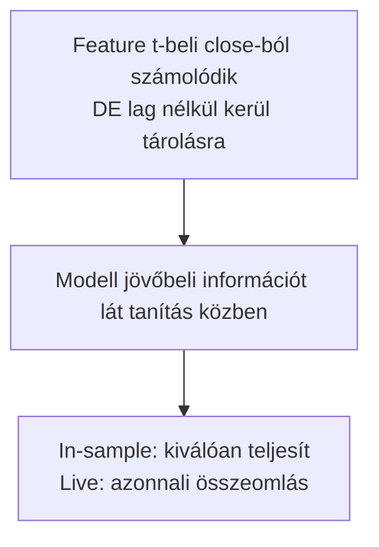

**2. hibatípus — Warmup kezelési hiba:**

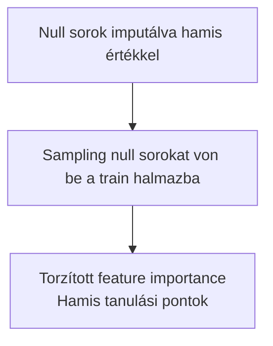

### Miért derivált technikai indikátorok és nem raw ár?

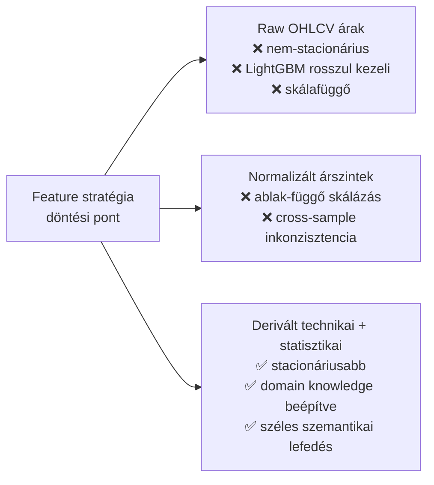

| Megközelítés | Előny | Hátrány | Státusz |
|---|---|---|---|
| Derivált technikai + statisztikai indikátorok | Stacionáriusabb, domain knowledge, széles lefedés | Sok feature → szelekció kell, warmup overhead | ✅ Választott |
| Raw OHLCV ár + volume | Egyszerű, nincs warmup | Nem-stacionárius, LightGBM számára nehezen értelmezhető skála | ❌ Elvetett |
| Csak momentum + trend (szűk készlet) | Gyors warmup, olvasható | Elveszett context (volatilitás, aktivitás, struktúra) | ⚠️ Egyszerű baseline-hoz |
| Deep learning embedding (raw OHLCV) | Automatikus feature extraction | Infrastruktúra-igény, interpretálhatatlan, projekt scope-on kívül | ❌ Elvetett |

### t-1 lag: miért kell és hogyan működik?

A lookahead szivárgás elleni legfontosabb védekezési mechanizmus a t-1 lag eltolás.

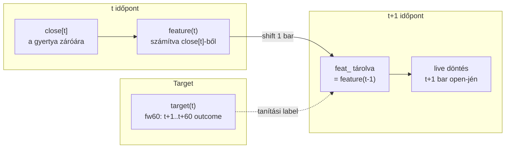

A modell tanítás közben a `feat_` oszlopot látja — ez a t-1-beli feature értéke. A live predict ugyanezt a `feat_` oszlopot olvassa. A konzisztencia garantált: nincs eltérés tanítás és live inferencia között.

**Kivétel — T_MINUS_1_SKIP:** Time/Session és Session Relative feature-ök nem igényelnek lag eltolást, mert az `open_time` timestamp-ből vagy a nap/hét nyitójából deterministikusan számolódnak — ezek nem tartalmaznak jövőbeli piacadatot.

### Warmup periódus és az első használható adatsor

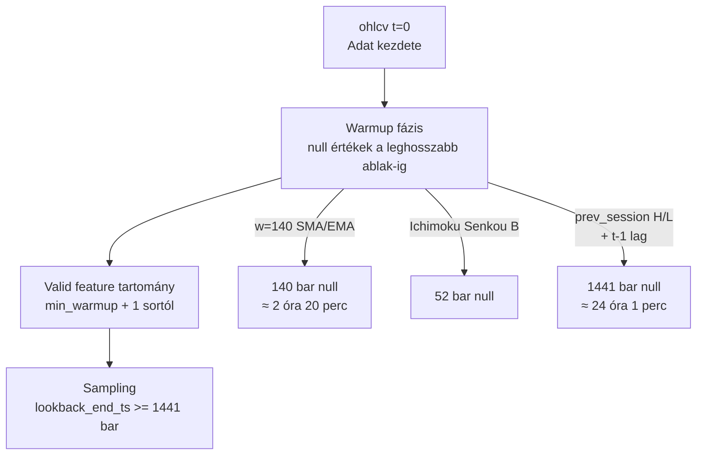

| Feature csoport | Warmup (bar) | Valós idő | Megjegyzés |
|---|---|---|---|
| Legtöbb rolling feature | 10–60 | 10–60 perc | Rövid ablakok |
| Ichimoku Senkou B | 52 | 52 perc | Ichimoku szabvány |
| SMA/EMA/BB w=140 | 140 | 2 óra 20 perc | Legszélesebb folytonos ablak |
| **prev_session H/L** | **1441** | **24 óra 1 perc** | 1440 shift + 1 lag |

A `prev_session_high/low_dist` feature a legkritikusabb: 1440 bar-t shift-el (előző naptári nap max/min), majd a t-1 lag eltolás is hozzáadódik — összesen 1441 bar null az adatsor elején.

**Következmény:** A sampling `lookback_end_ts` értékének minimum 1441 barral el kell tolódnia az adatsor kezdetétől. Ez nem adatszivárgás elleni védelem, hanem adatminőségi szűrés — a warmup nullák hamis tanulási pontot képviselnének.

### Paraméter alapértékek és indoklásuk

| Paraméter | Érték | Indoklás |
|---|---|---|
| Granularitás | 1 perc | Binance perpetual futures legkisebb aggregáció; elegendő intraday mintázathoz |
| Domináns short ablak | `w=10` | 10 perces kontextus gyors momentum jelekhez; 5-nél zajosabb, 14-nél lassabb |
| Domináns mid ablak | `w=14` | Klasszikus technikai elemzés konvenció (RSI, ATR, ADX) |
| Domináns long ablak | `w=30` | Félóra-szintű kontextus; közelíti a kereskedési szesszió egységét |
| Széles trend ablak | `w=140` | ~2.3 óra; nap-szintű trend kontextus közelítése 1 perces bárokon |
| Ichimoku Senkou B | `w=52` | Ichimoku szabványos beállítás (26 periódus × 2) |
| prev_session shift | `1440` | Pontosan egy napnyi (00:00–23:59 UTC) bar |
| Feature prefix | `feat_` | Névtérelkülönítés a target és raw OHLCV oszlopoktól |
| t-1 lag | `shift(1)` | Egy bar eltolás — a legkisebb production granularitás |

### Ismert kockázatok és korlátok

| Kockázat | Tünet | Mitigáció |
|---|---|---|
| Lookahead szivárgás új feature-nél | In-sample kiváló, live összeomlik | Minden új feature: T_MINUS_1_SKIP vagy lag scope kötelező |
| `prev_session` gap kockázat | Ha az OHLCV nem pontosan 1440 bar/nap, a shift nem a nap határán landol | Napos aggregáció indexelés alapján; vagy a feature elhagyható |
| Warmup null imputáció | Null sorok hamis középértékkel kitöltve → torzított szignál | `lookback_end_ts` offset >= 1441 bar kötelező |
| Feature multikollinearitás | Sok átfedő csoport (Momentum + Interaction + Return Distance) | LightGBM természetes szelekció; feature engineering MI/dedup szűrés |
| Feature count overhead | 202 feature → lassabb tanítás, overfitting veszély kis mintán | Feature engineering szűkíti a listát; gain rank prioritizálja |
| Live warmup hiány | Ha nincs elegendő history a széles ablakokhoz, az indikátorok nullák | Deploy előtt: min. 1441 bar history ellenőrzése |

### Validációs checklist

- [ ] Minden `feat_` oszlopban az első 1441 sor null (vagy az adott feature saját warmup-ja, amelyik nagyobb)
- [ ] Nincs lookahead: t-1 lag alkalmazva az összes nem T_MINUS_1_SKIP feature-re
- [ ] `prev_session_high_dist` és `prev_session_low_dist` az előző naptári nap max/min-jét tükrözik (nem az aktuális napét)
- [ ] A `feat_ohlcv_quant` tábla oszlopszáma megfelel az aktív feature profil konfigurációjának
- [ ] A sampling `lookback_end_ts` offset >= 1441 bar — ellenőrzés: null count riport
- [ ] Live prediction pipeline ugyanazon feature-definícióval fut, mint a tanítási pipeline
- [ ] Új feature hozzáadásakor: T_MINUS_1_SKIP vagy lag scope hatókörbe esik-e?
- [ ] Feature számítás módosítása után: downstream pipeline (sampling → training) újrafuttatva
