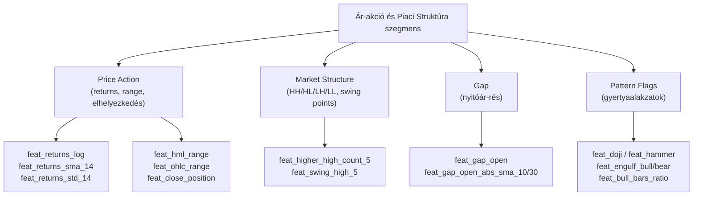
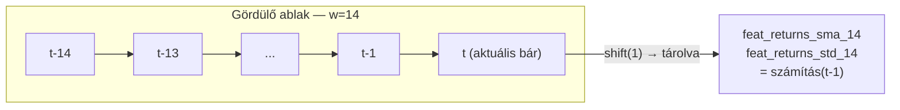
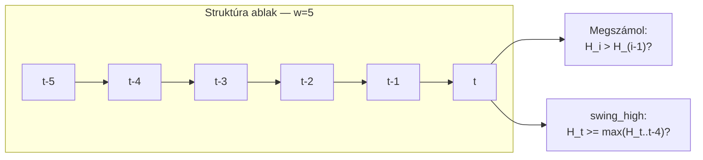
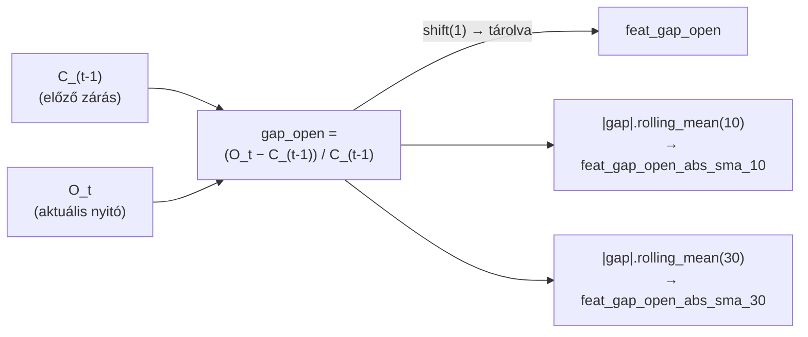
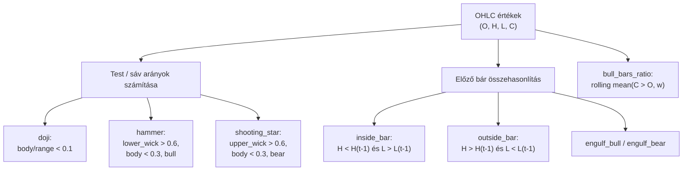

# 1100 — Feature Layer: Ár-akció és Piaci Struktúra

## Áttekintés

Ez a szegmens a piac legközvetlenebb „lenyomatait" rögzíti: az egyes gyertyák belső arányait (Price Action), a higher-high / lower-low szekvenciákat (Market Structure), a nyitóárkülönbözetet a megelőző záróárhoz képest (Gap), valamint a klasszikus japán gyertyaalakzatok bináris felismerését (Pattern Flags).

A csoportok közös logikája az, hogy kizárólag OHLCV adatokból dolgoznak, és elsősorban **rövid időhorizonton** (1–5 bár) ragadják meg a momentán piaci egyensúlyt. Míg a momentum vagy trend csoport glattolt, simított értékeket ad, ezek a feature-ök a nyers, torzítatlan piacstruktúrát képviselik — beleértve a hirtelen directional break-eket, doji-bizonytalanságot és a volume nélküli gap-eket.

---

## Price Action — 8 feature

### Mi ez és miért méri a piacot?

A Price Action csoport az ármozgás statisztikai jellemzőit ragadja meg: a logaritmikus hozamot és annak gördülő átlagát, szórását, ferdeségét és csúcsosságát, valamint az egyes gyertyák belső arány-metrikáit.

A logaritmikus visszatérítés (`log return`) az a transzformáció, amely a kompozit kamatszámítás elve alapján szimmetrikussá teszi a fel- és lefelé irányuló mozgásokat: +10% és -10% nem egyformán hat az abszolút árra, de a log-return skálán szimmetrikus. Ez különösen fontos gépi tanulási modellekben, ahol az aszimmetria torzítja a predikciót.

A gördülő szórás (`returns_std`) a rövid távú realizált volatilitás becslője. A ferdeség (`returns_skew`) megmutatja, hogy az eloszlás hányszor produkál „outlier" mozgást — negatív ferdeség azt jelenti, hogy a ritka nagy veszteségek dominálnak. A csúcsosság (`returns_kurt`) a „fat tail" jelensége: megmutatja, hogy az extrém mozgások sűrűbbek-e, mint amit egy normáleloszlás jósolna.

A `hml_range` és `ohlc_range` a bár relatív szélességét méri az árviszonylatában — magas érték egyszerre jelezhet breakout-ot és fals mozgást (volatilitásfüggő). A `close_position` azt mutatja, hol zárt a gyertya a saját high-low sávján belül: 1.0 = csúcson zárt (bullish), 0.0 = mélyponton zárt (bearish).

### Hogyan számolódik?

**Logaritmikus hozam:**

$$r_t^{\log} = \ln\!\left(\frac{C_t}{C_{t-1}}\right)$$

**Gördülő SMA és szórás a log-returnen (ablak = w):**

$$\mu_w = \frac{1}{w}\sum_{i=0}^{w-1} r_{t-i}^{\log}, \qquad \sigma_w = \sqrt{\frac{1}{w-1}\sum_{i=0}^{w-1}(r_{t-i}^{\log} - \mu_w)^2}$$

**Ferdeség (bias-korrigált Fisher):**

$$\text{Skew}_w = \frac{w}{(w-1)(w-2)} \sum_{i=0}^{w-1} \left(\frac{r_{t-i}^{\log} - \mu_w}{\sigma_w}\right)^3$$

**Csúcsosság (Fisher excess kurtosis):**

$$\text{Kurt}_w = \frac{1}{w}\sum_{i=0}^{w-1} \left(\frac{r_{t-i}^{\log} - \mu_w}{\sigma_w}\right)^4 - 3$$

**Range metrikák:**

$$\text{HML\_range} = \frac{H - L}{C}, \qquad \text{OHLC\_range} = \frac{H - L}{(O + C)/2}$$

$$\text{close\_position} = \frac{C - L}{H - L}$$

| Paraméter | Érték |
|---|---|
| returns_sma ablak | w = 14 |
| returns_std ablak | w = 14 |
| returns_skew ablak | w = 14 |
| returns_kurt ablak | w = 14 |

### Értelmezés

- `feat_returns_log`: tipikusan −0.005 … +0.005 tartomány 1 perces SOL/USDT-n; a szélső értékek (±0.02+) hirtelen breakout-ot jeleznek.
- `feat_returns_sma_14`: a közelmúlt átlagos iránya — tartósan pozitív = trend up, nulla közelében = oldalazás.
- `feat_returns_std_14`: volatilitás proxy; magas érték csökkenti a predikció megbízhatóságát, de önmagában is feature.
- `feat_returns_skew_14` / `feat_returns_kurt_14`: nem monoton kapcsolat a targettel — ML-modellben inkább interakció-tagként hasznosak.
- `feat_close_position`: 0.8+ = erős bullish bár; 0.2 alatt = erős bearish; 0.5 körül = bizonytalanság (doji-jelleg).

### Feature lista

| Feature neve | Ablak | Leírás |
|---|---|---|
| feat_returns_log | — | Logaritmikus egy-bár hozam |
| feat_returns_sma_14 | w=14 | Log-return gördülő átlaga |
| feat_returns_std_14 | w=14 | Log-return gördülő szórása |
| feat_returns_skew_14 | w=14 | Log-return gördülő ferdesége |
| feat_returns_kurt_14 | w=14 | Log-return gördülő csúcsossága |
| feat_hml_range | — | (High−Low)/Close — relatív bársáv |
| feat_ohlc_range | — | (High−Low)/((Open+Close)/2) |
| feat_close_position | — | Zárás elhelyezkedése a bár sávján belül [0,1] |

---

## Market Structure — 6 feature

### Mi ez és miért méri a piacot?

A piaci struktúra elemzése a technikai elemzés egyik alapköve: egy bullish trend definíció szerint Higher Highs (HH) és Higher Lows (HL) sorozatából áll, míg bearish trendben Lower Highs (LH) és Lower Lows (LL) váltakoznak. Ezt a logikát strukturálisan rögzítik ezek a feature-ök egy gördülő ablakban.

A swing point feature-ök az ablak extrémumait azonosítják: ha az aktuális high egyenlő az ablak rolling max-ával, az potenciális swing high — a trend tetőpontjára utal, ahol a vevők kimerülhetnek. Az ML modell ezeket a bináris jeleket (0/1) és a darabszám-arányokat kombinálja más feature-ökkel.

### Hogyan számolódik?

**Trend-count feature-ök (ablak = w = 5):**

$$\text{HH\_count}_w = \sum_{i=1}^{w} \mathbf{1}[H_{t-i+1} > H_{t-i}]$$

$$\text{HL\_count}_w = \sum_{i=1}^{w} \mathbf{1}[L_{t-i+1} > L_{t-i}]$$

Analóg módon: `lower_high_count` és `lower_low_count`.

**Swing point bináris jelzők:**

$$\text{swing\_high}_w = \mathbf{1}\!\left[H_t \geq \max_{i=0}^{w-1}H_{t-i}\right]$$

$$\text{swing\_low}_w = \mathbf{1}\!\left[L_t \leq \min_{i=0}^{w-1}L_{t-i}\right]$$

| Paraméter | Érték |
|---|---|
| trend_counts ablak | w = 5 |
| swing_points ablak | w = 5 |

### Értelmezés

- `feat_higher_high_count_5`: 0–5 skálán; 4–5 = erős bullish struktúra az elmúlt 5 bárban.
- `feat_swing_high_5`: ritka bináris jelző — 1.0 értéke azt jelzi, hogy az aktuális bár az elmúlt 5 bár csúcsa. Nem tartós signal, hanem esemény-jelzés.
- A négy count-feature együtt adja ki a teljes struktúraképet; tiszta bullish trend esetén: HH=4–5, HL=3–5, LH=0–1, LL=0–1.

### Feature lista

| Feature neve | Ablak | Leírás |
|---|---|---|
| feat_higher_high_count_5 | w=5 | Higher high-ok száma az ablakban |
| feat_higher_low_count_5 | w=5 | Higher low-ok száma |
| feat_lower_high_count_5 | w=5 | Lower high-ok száma |
| feat_lower_low_count_5 | w=5 | Lower low-ok száma |
| feat_swing_high_5 | w=5 | Bináris: aktuális bár az ablak csúcsa |
| feat_swing_low_5 | w=5 | Bináris: aktuális bár az ablak mélypontja |

---

## Gap — 3 feature

### Mi ez és miért méri a piacot?

A gap (nyitórés) az aktuális bár nyitóárának és az előző bár zárásának különbsége, normálva az előző záráshoz. Crypto piacon a „valódi" gap ritka (24/7 kereskedés), de a 1 perces adatokban microstructure-ből és hirtelen volatilitási kiugrásokból erednek nyitórések. Ezek prediktív értéke abban rejlik, hogy a piac hajlamos a gap részleges vagy teljes betöltésére rövid távon (gap-fill hatás), illetve erős directional impulzus esetén a gap irányában folytatódik a mozgás.

A gördülő átlagos gap-méret (abszolút érték) a piaci „turbulencia" historikus lábnyoma: magas érték aktív, fragmentált kereskedési periódust jelez.

### Hogyan számolódik?

$$\text{gap\_open}_t = \frac{O_t - C_{t-1}}{C_{t-1}}$$

$$\text{gap\_open\_abs\_sma}_w = \frac{1}{w}\sum_{i=0}^{w-1}|\text{gap\_open}_{t-i}|$$

| Paraméter | Érték |
|---|---|
| gap_open_abs_sma ablakok | w = 10, w = 30 |

### Értelmezés

- `feat_gap_open`: tipikusan ±0.001–0.003 tartomány 1 perces SOL-on; ±0.01+ már ritka, erős esemény (pl. makro hír, likvidáció).
- Pozitív gap = felfelé nyitott (bullish kontextus), negatív = lefelé nyitott.
- `feat_gap_open_abs_sma_10`: az elmúlt 10 bár átlagos turbulencia-szintje; ha magas, a többi feature megbízhatósága csökken (zajosabb piac).

### Feature lista

| Feature neve | Ablak | Leírás |
|---|---|---|
| feat_gap_open | — | Normált nyitórés az előző záráshoz képest |
| feat_gap_open_abs_sma_10 | w=10 | Abszolút gap gördülő átlaga (10 bár) |
| feat_gap_open_abs_sma_30 | w=30 | Abszolút gap gördülő átlaga (30 bár) |

---

## Pattern Flags — 10 feature

### Mi ez és miért méri a piacot?

A japán gyertyaelemzés évszázados hagyományából (eredetileg rizspiac, Osaka, 18. sz.) eredő alakzatok a vevők és eladók pillanatnyi egyensúlyát tükrözik egyetlen bár belső geometriájában. Ezek a feature-ök **bináris jelzőkként** (0.0 / 1.0) kódolják az alakzatokat, amelyeket az ML-modell más folytonos feature-ökkel kombinálva értelmez.

A `bull_bars_ratio` az egyetlen folytonos feature ebből a csoportból: azt méri, hogy az elmúlt w bárban mekkora arányban volt bullish a gyertya (close > open). Ez a rövid távú directional bias egyik legegyszerűbb, mégis megbízható mérőszáma.

### Hogyan számolódik?

**Doji** — a test aránya kisebb mint 10% a teljes bár-sávhoz képest:

$$\text{doji} = \mathbf{1}\!\left[\frac{|C-O|}{H-L} < 0.1\right]$$

**Hammer** — bullish bár, alsó kanóc > 60%, test < 30%:

$$\text{hammer} = \mathbf{1}\!\left[\frac{\min(C,O) - L}{H-L} > 0.6 \;\wedge\; \frac{|C-O|}{H-L} < 0.3 \;\wedge\; C > O\right]$$

**Shooting Star** — bearish bár, felső kanóc > 60%, test < 30%:

$$\text{shooting\_star} = \mathbf{1}\!\left[\frac{H - \max(C,O)}{H-L} > 0.6 \;\wedge\; \frac{|C-O|}{H-L} < 0.3 \;\wedge\; C < O\right]$$

**Inside Bar** — az aktuális bár teljes mértékben az előző sávján belül:

$$\text{inside\_bar} = \mathbf{1}[H < H_{t-1} \;\wedge\; L > L_{t-1}]$$

**Outside Bar** — meghaladja az előző bár sávját mindkét irányban:

$$\text{outside\_bar} = \mathbf{1}[H > H_{t-1} \;\wedge\; L < L_{t-1}]$$

**Bullish Engulfing:**

$$\text{engulf\_bull} = \mathbf{1}[C_{t-1} < O_{t-1} \;\wedge\; O_t < C_{t-1} \;\wedge\; C_t > O_{t-1}]$$

**Bearish Engulfing** — tükrözve.

**Bull Bars Ratio:**

$$\text{bull\_bars\_ratio}_w = \frac{1}{w}\sum_{i=0}^{w-1}\mathbf{1}[C_{t-i} > O_{t-i}]$$

| Paraméter | Érték |
|---|---|
| bull_bars_ratio ablakok | w = 10, w = 30, w = 60 |

### Értelmezés

- A bináris jelzők ritkák: tipikusan 1–5% prevalencia. Az ML-modell számára az érték önmagában kevésbé informatív, mint a többi feature-rel való korreláció.
- `feat_bull_bars_ratio_10`: 0.0–1.0 skálán; 0.7+ = bullish lendület az utolsó 10 bárban; 0.3 alatt = bearish dominancia.
- A doji és inside_bar „bizonytalanság" jelzők — magas volatilitás vagy forgalomváltozás után megjelenésük potenciális fordulópontot jelez.
- Gépi tanulási szempontból: ezek a feature-ök nem monoton kapcsolatban állnak a targettel, de interakciós tagként (pl. RSI + hammer) növelhetik az előrejelzési erőt.

### Feature lista

| Feature neve | Ablak | Leírás |
|---|---|---|
| feat_doji | — | Bináris: test/sáv < 10% |
| feat_hammer | — | Bináris: bullish hammer alakzat |
| feat_shooting_star | — | Bináris: bearish shooting star |
| feat_inside_bar | — | Bináris: az előző bár sávján belül |
| feat_outside_bar | — | Bináris: meghaladja az előző sávot |
| feat_engulf_bull | — | Bináris: bullish engulfing |
| feat_engulf_bear | — | Bináris: bearish engulfing |
| feat_bull_bars_ratio_10 | w=10 | Bullish gyertyák aránya (10 bár) |
| feat_bull_bars_ratio_30 | w=30 | Bullish gyertyák aránya (30 bár) |
| feat_bull_bars_ratio_60 | w=60 | Bullish gyertyák aránya (60 bár) |
