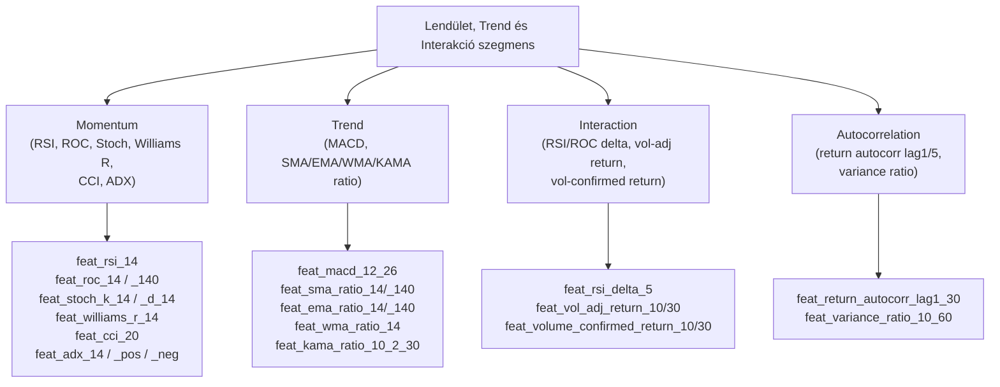
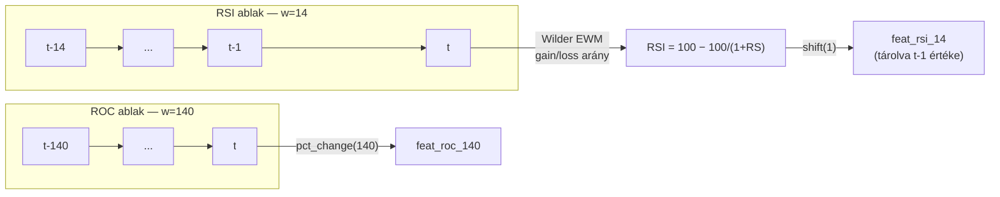
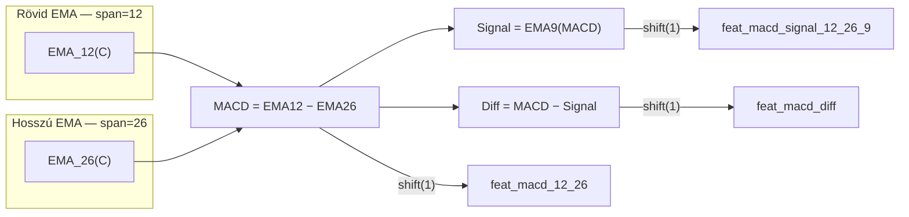
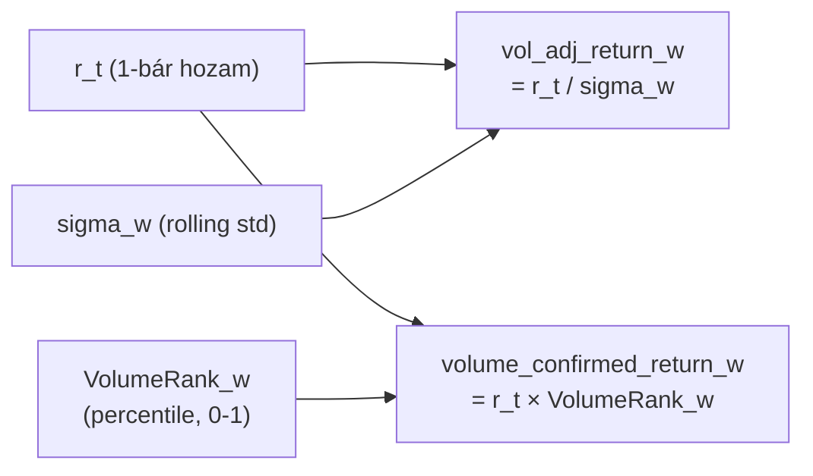
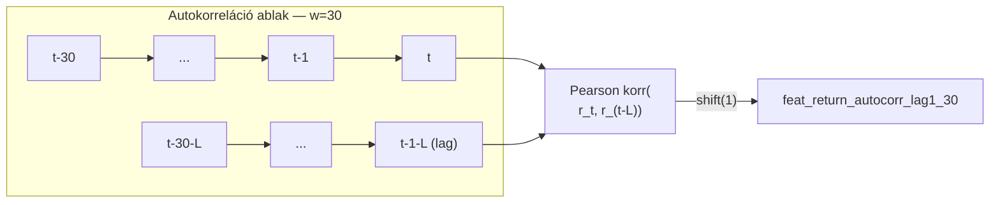

# 1200 — Feature Layer: Lendület, Trend és Interakció

## Áttekintés

Ez a szegmens a ármozgás irányát és sebességét mérő indikátorokat foglalja össze. A Momentum csoport a „mennyire gyorsan megy" kérdésre válaszol (RSI, ROC, Stochastic, Williams %R, CCI, ADX), a Trend csoport a „hol tart az árfolyam az átlagokhoz képest" kérdésre (MACD, SMA/EMA/WMA/KAMA ratio-k), az Interaction csoport kombinált jeleket számít (pl. volatilitással súlyozott hozam), az Autocorrelation csoport pedig a hozamsorozat időbeli memóriáját, véletlen-sétától való eltérését méri.

Közös logika: minden feature az ármozgás folytonos, simított leképezése — alkalmas arra, hogy a modell rövid és közép-távú trendstruktúrát tanuljon anélkül, hogy nyers OHLCV értékekkel dolgozna.

---

## Momentum — 11 feature

### Mi ez és miért méri a piacot?

A momentum indikátorok az ármozgás sebességét és a vevők/eladók relatív erejét mérik. Az RSI-t (Relative Strength Index) J. Welles Wilder fejlesztette ki 1978-ban, és az elmúlt w bárban a nyereségek és veszteségek arányát fejezi ki — a klasszikus technikai elemzés legelterjedtebb eszköze.

A ROC (Rate of Change) a legegyszerűbb lendület-mérő: az ár százalékos változása egy adott ablak alatt. A Stochastic Oscillator George Lane alkotása az 1950-es évekből: a záróár relatív helyzetét méri az ablak high-low sávján belül, és ezzel a túlvett/túladott zónák azonosítását szolgálja.

A Williams %R a Stochastic inverze (Larry Williams, 1973), a CCI (Commodity Channel Index, Donald Lambert, 1980) a tipikus ár és a mozgóátlag viszonyát normálja az átlagos eltéréshez, az ADX (Average Directional Index, Wilder, 1978) pedig az irányított mozgás erősségét méri anélkül, hogy az irányt önmagában jelezné.

### Hogyan számolódik?

**RSI** — Wilder-féle exponenciális simítás (com = w−1, adjust=False, min_samples=w):

$$\text{RS}_w = \frac{\text{EWM}_{w-1}(\max(\Delta C, 0))}{\text{EWM}_{w-1}(\max(-\Delta C, 0))}, \qquad \text{RSI}_w = 100 - \frac{100}{1 + \text{RS}_w}$$

ahol $\Delta C = C_t - C_{t-1}$.

**ROC:**

$$\text{ROC}_w = \frac{C_t - C_{t-w}}{C_{t-w}} \times 100$$

**Stochastic %K és %D** (smooth_window = 3):

$$\%K_w = \frac{C - \min_{w}(L)}{\max_{w}(H) - \min_{w}(L)} \times 100, \qquad \%D_w = \text{SMA}_3(\%K_w)$$

**Williams %R:**

$$\text{Williams\%R}_w = \frac{\max_{w}(H) - C}{\max_{w}(H) - \min_{w}(L)} \times (-100)$$

**CCI** (Lambert-féle MAD normálás, 0.015 konstans):

$$\text{TP} = \frac{H + L + C}{3}, \qquad \text{CCI}_w = \frac{\text{TP} - \text{SMA}_w(\text{TP})}{0.015 \times \text{MAD}_w(\text{TP})}$$

ahol $\text{MAD}_w$ = gördülő Mean Absolute Deviation.

**ADX** — Wilder-simítás a +DI, −DI és DX értékeken:

$$\text{+DI}_w = 100 \cdot \frac{\text{EWM}(\text{+DM})}{\text{EWM}(\text{TR})}, \quad \text{-DI}_w = 100 \cdot \frac{\text{EWM}(\text{-DM})}{\text{EWM}(\text{TR})}$$

$$\text{DX} = 100 \cdot \frac{|\text{+DI} - \text{-DI}|}{\text{+DI} + \text{-DI}}, \qquad \text{ADX}_w = \text{EWM}(\text{DX})$$

| Indikátor | Ablak | Smooth |
|---|---|---|
| RSI | w = 14 | — |
| ROC | w = 14, w = 140 | — |
| Stochastic %K | w = 14 | %D smooth = 3 |
| Williams %R | w = 14 | — |
| CCI | w = 20 | — |
| ADX | w = 14 | — |

### Értelmezés

- `feat_rsi_14`: 0–100 skálán; > 70 = overbought (potenciális short entry), < 30 = oversold. Erős trendben a 30–70 zóna elveszíti prediktív erejét — nem monoton kapcsolat.
- `feat_roc_14` / `feat_roc_140`: negatív = az ár az ablak elejéhez képest esett. A két ablak különbsége (14 vs 140) a rövid vs. hosszú trend divergenciáját mutatja.
- `feat_stoch_k_14`: 0–100; %D a %K simítottja, cross-signal generáláshoz hasznos. Extrém értékek: < 20 = oversold, > 80 = overbought.
- `feat_williams_r_14`: −100–0 skálán; −80 körül = oversold, −20 körül = overbought.
- `feat_cci_20`: nincs fix skála, tipikusan −200 … +200; ±100 a klasszikus küszöb.
- `feat_adx_14`: 0–100; < 20 = gyenge/oldalazó trend, > 40 = erős trend. `feat_adx_pos_14` és `feat_adx_neg_14` az irányt különíti el.

### Feature lista

| Feature neve | Ablak | Leírás |
|---|---|---|
| feat_rsi_14 | w=14 | Relative Strength Index |
| feat_roc_14 | w=14 | Rate of Change (rövid) |
| feat_roc_140 | w=140 | Rate of Change (hosszú) |
| feat_stoch_k_14 | w=14 | Stochastic %K |
| feat_stoch_d_14 | w=14, s=3 | Stochastic %D (simított %K) |
| feat_williams_r_14 | w=14 | Williams %R |
| feat_cci_20 | w=20 | Commodity Channel Index |
| feat_adx_14 | w=14 | Average Directional Index |
| feat_adx_pos_14 | w=14 | +DI (bullish directional mozgás) |
| feat_adx_neg_14 | w=14 | −DI (bearish directional mozgás) |

---

## Trend — 9 feature

### Mi ez és miért méri a piacot?

A trend feature-ök az ár és a különböző mozgóátlagok viszonyát ragadják meg ratio formájában (`close / MA`). Ez a megközelítés normálja az abszolút árszintet: 1.0 = az ár pontosan az átlagon van; > 1.0 = fölötte; < 1.0 = alatta.

A MACD (Moving Average Convergence/Divergence, Gerald Appel, 1970-es évek) a rövid és hosszú EMA különbsége — a „lendület a lendületben": nem az abszolút irányt, hanem a trendváltás sebességét méri. A signal-vonal a MACD EMA simítása, a diff a kettő eltérése.

A KAMA (Kaufman's Adaptive Moving Average, Perry Kaufman, 1998) piaci zajtól függően változtatja simítási sebességét: magas Efficiency Ratio esetén gyors (trend-követő), alacsony ER esetén lassú (noise-szűrő). Ez különösen hasznos crypto piacon, ahol az oldalazó és trendelő periódusok gyorsan váltakoznak.

### Hogyan számolódik?

**SMA ratio:**

$$\text{SMA\_ratio}_w = \frac{C}{\text{SMA}_w(C)}$$

**EMA ratio** (span = w, adjust=False):

$$\text{EMA\_ratio}_w = \frac{C}{\text{EMA}_w(C)}$$

ahol az EMA rekurzív: $\text{EMA}_t = (1 - \alpha)\,\text{EMA}_{t-1} + \alpha\,C_t$, $\alpha = 2/(w+1)$.

**WMA ratio** (lineárisan súlyozott):

$$\text{WMA}_w = \frac{\sum_{j=0}^{w-1}(j+1)\cdot C_{t-w+1+j}}{\sum_{j=1}^{w} j}, \qquad \text{WMA\_ratio}_w = \frac{C}{\text{WMA}_w}$$

**KAMA** (Efficiency Ratio alapú adaptív simítás):

$$\text{ER} = \frac{|C_t - C_{t-w}|}{\sum_{i=1}^{w}|C_{t-i+1} - C_{t-i}|}, \qquad \text{SC} = \left[\text{ER} \cdot \left(\frac{2}{3} - \frac{2}{31}\right) + \frac{2}{31}\right]^2$$

$$\text{KAMA}_t = \text{KAMA}_{t-1} + \text{SC} \cdot (C_t - \text{KAMA}_{t-1}), \qquad \text{KAMA\_ratio} = \frac{C}{\text{KAMA}}$$

**MACD:**

$$\text{MACD} = \text{EMA}_{12}(C) - \text{EMA}_{26}(C)$$

$$\text{Signal} = \text{EMA}_9(\text{MACD}), \qquad \text{Diff} = \text{MACD} - \text{Signal}$$

| Indikátor | Ablak(ok) | Megjegyzés |
|---|---|---|
| SMA ratio | w = 14, w = 140 | — |
| EMA ratio | w = 14, w = 140 | span=w, adjust=False |
| WMA ratio | w = 14 | Lineáris súlyozás |
| KAMA ratio | w=10, fast=2, slow=30 | Adaptív |
| MACD | fast=12, slow=26, signal=9 | 3 feature |

### Értelmezés

- `feat_sma_ratio_14`: 1.05 = az ár 5%-kal az SMA felett → bullish impulzus. Értékek tipikusan 0.95–1.05 közé esnek.
- `feat_sma_ratio_140` vs `feat_sma_ratio_14`: ha a rövid ratio > 1 de a hosszú < 1, a rövid trend felfelé tört, de a hosszú trend még bearish — divergencia.
- `feat_macd_12_26`: pozitív = rövid EMA a hosszú felett (bullish), nulla keresztezés = potenciális trendváltás.
- `feat_macd_diff`: a histogram — MACD gyorsulása/lassulása; pozitív és növekvő = erős bullish momentum.
- `feat_kama_ratio_10_2_30`: erős trendben közel van az EMA_14-hez; oldalazásnál lassabb, mint az SMA_140 — ez a kulcskülönbség.

### Feature lista

| Feature neve | Ablak | Leírás |
|---|---|---|
| feat_macd_12_26 | fast=12, slow=26 | MACD vonal |
| feat_macd_signal_12_26_9 | signal=9 | MACD signal vonal |
| feat_macd_diff | — | MACD − Signal (histogram) |
| feat_sma_ratio_14 | w=14 | Close / SMA14 |
| feat_sma_ratio_140 | w=140 | Close / SMA140 |
| feat_ema_ratio_14 | w=14 | Close / EMA14 |
| feat_ema_ratio_140 | w=140 | Close / EMA140 |
| feat_wma_ratio_14 | w=14 | Close / WMA14 |
| feat_kama_ratio_10_2_30 | w=10, f=2, s=30 | Close / KAMA |

---

## Interaction — 7 feature

### Mi ez és miért méri a piacot?

Az interakció feature-ök nem önálló indikátorok, hanem meglévő jelzők kombinációi, amelyek olyan dimenziókat nyitnak meg, amelyeket egyetlen indikátor önmagában nem fed le. Például a `vol_adj_return` — a hozam osztva a realized volatilitással — a Sharpe-ratio pillanatnyi analógjának tekinthető: megmutatja, hogy a hozam „megérdemelt"-e a vállalt kockázat alapján. A `volume_confirmed_return` azt kérdezi: a mozgást kísérte-e szokatlanul magas forgalom? Erős mozgás alacsony forgalommal sokszor hamis jel.

Az `rsi_delta` és `roc_delta` az indikátor változásának sebességét méri — az RSI/ROC „deriváltja" — ami a lendület gyorsulását vagy lassulását jelzi.

### Hogyan számolódik?

**RSI delta** (ablak = w = 5):

$$\text{rsi\_delta}_w = \text{RSI}_{14}(t) - \text{RSI}_{14}(t-w)$$

**ROC delta** (ablak = w = 5):

$$\text{roc\_delta}_w = \text{ROC}_{14}(t) - \text{ROC}_{14}(t-w)$$

**Volatilitással súlyozott hozam:**

$$\text{vol\_adj\_return}_w = \frac{(C_t - C_{t-1})/C_{t-1}}{\sigma_w^{\log}}$$

ahol $\sigma_w^{\log}$ a log-return gördülő szórása.

**Volume-confirmed return:**

$$\text{volume\_confirmed\_return}_w = r_t \times \text{VolumeRank}_w$$

ahol $\text{VolumeRank}_w$ = a volume percentile-rangja az ablakban (0–1 skálán).

**Taker flow confirmed return:**

$$\text{taker\_flow\_confirmed\_return}_w = r_t \times \frac{\sum_{i=0}^{w-1}\text{TakerBuyBase}_{t-i}}{\sum_{i=0}^{w-1}\text{Volume}_{t-i}}$$

| Feature | Ablak(ok) |
|---|---|
| rsi_delta | w = 5 |
| roc_delta | w = 5 |
| vol_adj_return | w = 10, w = 30 |
| volume_confirmed_return | w = 10, w = 30 |
| taker_flow_confirmed_return | w = 10, w = 30 |

### Értelmezés

- `feat_rsi_delta_5`: ha az RSI 5 bár alatt 10+ pontot emelkedett, erős bullish lendület-gyorsulás; negatív = lassulás.
- `feat_vol_adj_return_10`: pozitív és magas = az ár gyorsan mozgott alacsony volatilitású környezetben (megbízható signal). Ha a nyers hozam nagy, de ez a feature kicsi, a mozgás a zajba esett.
- `feat_volume_confirmed_return_10`: ha ez pozitív és magas, a bullish mozgást erős volume kísérte → megbízhatóbb breakout jelzés.

### Feature lista

| Feature neve | Ablak | Leírás |
|---|---|---|
| feat_rsi_delta_5 | w=5 | RSI változása 5 bár alatt |
| feat_roc_delta_5 | w=5 | ROC változása 5 bár alatt |
| feat_vol_adj_return_10 | w=10 | Volatilitással normált hozam |
| feat_vol_adj_return_30 | w=30 | Volatilitással normált hozam |
| feat_volume_confirmed_return_10 | w=10 | Hozam × volume percentile |
| feat_volume_confirmed_return_30 | w=30 | Hozam × volume percentile |
| feat_taker_flow_confirmed_return_10 | w=10 | Hozam × taker buy arány |
| feat_taker_flow_confirmed_return_30 | w=30 | Hozam × taker buy arány |

---

## Autocorrelation — 5 feature

### Mi ez és miért méri a piacot?

A hozamok autokorrelációja azt méri, hogy a múltbeli hozamok mennyire jelzik előre a jövőbeli hozamokat. Ha az autokorreláció lag-1-re pozitív, a piac rövid távon trendel (momentum hatás). Ha negatív, a piac mean-revertáló (visszafordulási hajlam). A nulla közeli autokorreláció véletlenszerű sétát (random walk) jelez.

A variancia-arány (Variance Ratio) Lo-MacKinlay tesztjéből (1988) ered: ha az ármozgás valóban véletlen séta, akkor a 10-bár hozam varianciájának pontosan 10-szerese kellene legyen az 1-bár hozam varianciájának. Ha ennél nagyobb, az impulzus (trendezési) hatás jelen van; ha kisebb, mean-reversion dominál.

### Hogyan számolódik?

**Pearson autokorreláció** (lag = L, ablak = w):

$$\rho_{L,w} = \frac{\text{Cov}(r_t, r_{t-L})_w}{\sqrt{\text{Var}(r_t)_w \cdot \text{Var}(r_{t-L})_w}}$$

ahol a kovariancia és szórás gördülő ablakos Pearson-képlettel számolódik.

**Variance Ratio** (ablak = 60, horizon = 10):

$$\text{VR}_{10,60} = \frac{\text{Var}_{60}(r_t^{10})}{10 \cdot \text{Var}_{60}(r_t^1)} \quad \in [0, 5]$$

ahol $r_t^{10} = (C_t - C_{t-10})/C_{t-10}$ a 10-bár hozam.

| Paraméter | Értékek |
|---|---|
| autokorreláció lag-ok | L = 1, L = 5 |
| autokorreláció ablakok | w = 30, w = 60 |
| variancia-arány horizon | k = 10 |
| variancia-arány ablak | w = 60 |

### Értelmezés

- `feat_return_autocorr_lag1_30`: pozitív (0.1+) = rövid-távú trend-követő periódus; negatív (−0.1 alatti) = mean-reversion periódus.
- `feat_return_autocorr_lag5_60`: hosszabb memória mérése — kevésbé zavaros, de lassabban változik.
- `feat_variance_ratio_10_60`: 1.0 körül = random walk; > 1.0 = trendező piac (momentum hatás erős); < 1.0 = mean-reverting piac. Klippelve [0, 5]-re.
- Gépi tanulási szempontból: ezek a feature-ök rezsim-jelzők — magas VR esetén a trend-alapú feature-ök megbízhatóbbak, alacsony VR esetén a mean-reversion jelzők.

### Feature lista

| Feature neve | Ablak / Lag | Leírás |
|---|---|---|
| feat_return_autocorr_lag1_30 | L=1, w=30 | 1-bár lag autokorreláció (30 bár) |
| feat_return_autocorr_lag1_60 | L=1, w=60 | 1-bár lag autokorreláció (60 bár) |
| feat_return_autocorr_lag5_30 | L=5, w=30 | 5-bár lag autokorreláció (30 bár) |
| feat_return_autocorr_lag5_60 | L=5, w=60 | 5-bár lag autokorreláció (60 bár) |
| feat_variance_ratio_10_60 | k=10, w=60 | Variancia-arány (random walk teszt) |
