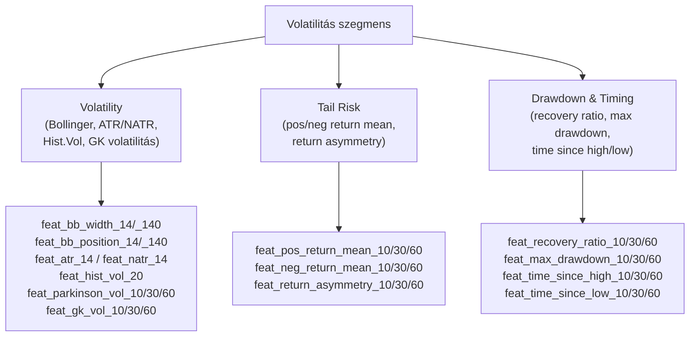
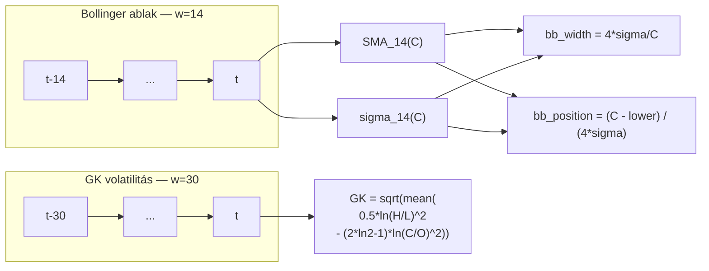
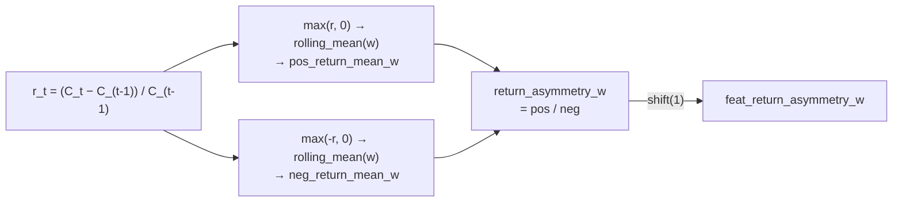
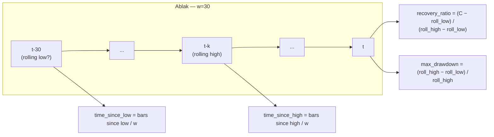

# 1300 — Feature Layer: Volatilitás, Tail Risk és Drawdown

## Áttekintés

Ez a szegmens a kockázat különböző dimenzióit méri: az ármozgás amplitúdóját (Volatility), a hozameloszlás szélső viselkedését (Tail Risk), és az ár csúcstól való relatív visszaesését különböző időhorizontokon (Drawdown & Timing). A Garman-Klass volatilitás OHLC-alapú becslője is ide tartozik mint a klasszikus close-to-close volatilitásnál hatékonyabb alternatíva.

Közös logika: minden feature a piaci „turbulencia" valamilyen aspektusát méri — hogy az aktuális volatilitás-szint hogyan viszonyul a historikushoz, és hogy az ár mennyire tért el a közeli csúcsoktól/mélypontoktól. Ezek a feature-ök különösen fontosak a pozíció-méretezés és a stop-loss stratégiák modellezhető kontextusának megragadásához.

---

## Volatility — 14 feature

### Mi ez és miért méri a piacot?

**Bollinger Bands** (John Bollinger, 1983): az ár statisztikai sávon belüli pozíciója. A `bb_width` a sáv szélességét normálja az árhoz — ez a Bollinger Bandwidth, a piaci összehúzódás (squeeze) és tágulás klasszikus mértéke. A `bb_position` azt mutatja, hogy a zárás hol van a sávon belül: 0 = alsó sávnál, 1 = felső sávnál.

**ATR / NATR** (Wilder, 1978): az Average True Range a piaci mozgás amplitúdóját méri a gyertyák közötti overnight gap-et is figyelembe véve. A Normalized ATR (NATR = ATR/Close) az abszolút értéket az árszinthez normálja, így különböző árszintű eszközökön összehasonlítható.

**Historical Volatility**: a log-return gördülő szórása — a realizált volatilitás standard mérőszáma. Az opciós árképzés alapja és a kockázati modellek fő inputja.

**Garman-Klass volatilitás** (1980): a close-to-close becslőnél 5–8-szor hatékonyabb, mert a High és Low adatokat is felhasználja. A Parkinson-becslő (1980) csak a High-Low sávot használja. Mindkét becslő feltételezi, hogy a kereskedés folyamatos és nincs drift — crypto piacon ez közelítőleg teljesül.

### Hogyan számolódik?

**Bollinger Band width és position** (ablak = w, dev = 2):

$$\text{SMA}_w = \frac{1}{w}\sum C, \qquad \sigma_w = \sqrt{\frac{1}{w}\sum(C - \text{SMA}_w)^2}$$

$$\text{bb\_width}_w = \frac{(\text{SMA}_w + 2\sigma_w) - (\text{SMA}_w - 2\sigma_w)}{C} = \frac{4\sigma_w}{C}$$

$$\text{bb\_position}_w = \frac{C - (\text{SMA}_w - 2\sigma_w)}{4\sigma_w}$$

**True Range és ATR** (Wilder-EWM, com = w−1):

$$\text{TR}_t = \max(H - L,\; |H - C_{t-1}|,\; |L - C_{t-1}|)$$

$$\text{ATR}_w = \text{EWM}_{w-1}(\text{TR}), \qquad \text{NATR}_w = \frac{\text{ATR}_w}{C}$$

**Historical Volatility:**

$$\text{hist\_vol}_w = \sigma_w(\ln(C_t/C_{t-1}))$$

**Parkinson-volatilitás** (ablak = w):

$$\hat{\sigma}_{\text{Parkinson},w} = \sqrt{\frac{1}{w}\sum_{i=0}^{w-1}\frac{(\ln H_{t-i}/L_{t-i})^2}{4\ln 2}}$$

**Garman-Klass volatilitás:**

$$\hat{\sigma}_{\text{GK},w} = \sqrt{\frac{1}{w}\sum_{i=0}^{w-1}\left[\frac{1}{2}(\ln H/L)^2 - (2\ln 2 - 1)(\ln C/O)^2\right]_{t-i}}$$

| Indikátor | Ablak(ok) | Megjegyzés |
|---|---|---|
| Bollinger width/position | w = 14, w = 140 | dev = 2 |
| ATR / NATR | w = 14 | Wilder EWM |
| Historical Vol | w = 20 | log-return std |
| Parkinson Vol | w = 10, 30, 60 | H/L alapú |
| Garman-Klass Vol | w = 10, 30, 60 | OHLC alapú |

### Értelmezés

- `feat_bb_width_14`: 0 közelében = squeeze (alacsony volatilitás, várható kitörés); magas érték = aktív terjeszkedési fázis.
- `feat_bb_position_14`: > 1.0 = az ár az upper band fölött (extrém overbought); < 0 = lower band alatt.
- `feat_natr_14`: tipikusan 0.001–0.005 SOL/USDT-n (0.1–0.5%), extrém mozgáskor 0.01+ is.
- `feat_hist_vol_20`: annualizálva (√525600 szorzóval) tipikusan 100–300% éves vol crypto-n — de itt nyers napi érték.
- `feat_gk_vol_10/30/60`: a három ablak összehasonlítása megmutatja a volatilitás struktúráját: ha a rövid (10) > hosszú (60), a volatilitás éppen emelkedőben van.

### Feature lista

| Feature neve | Ablak | Leírás |
|---|---|---|
| feat_bb_width_14 | w=14 | Bollinger sáv szélessége / ár |
| feat_bb_width_140 | w=140 | Bollinger sáv szélessége (hosszú) |
| feat_bb_position_14 | w=14 | Zárás pozíciója a Bollinger sávban |
| feat_bb_position_140 | w=140 | Zárás pozíciója (hosszú sáv) |
| feat_atr_14 | w=14 | Average True Range |
| feat_natr_14 | w=14 | Normalized ATR (ATR/Close) |
| feat_hist_vol_20 | w=20 | Realizált volatilitás (log-ret std) |
| feat_parkinson_vol_10 | w=10 | Parkinson-volatilitás (10 bár) |
| feat_parkinson_vol_30 | w=30 | Parkinson-volatilitás (30 bár) |
| feat_parkinson_vol_60 | w=60 | Parkinson-volatilitás (60 bár) |
| feat_gk_vol_10 | w=10 | Garman-Klass volatilitás (10 bár) |
| feat_gk_vol_30 | w=30 | Garman-Klass volatilitás (30 bár) |
| feat_gk_vol_60 | w=60 | Garman-Klass volatilitás (60 bár) |

---

## Tail Risk — 9 feature

### Mi ez és miért méri a piacot?

A hozameloszlás szimmetriájától való eltérés — az aszimmetria — közvetlen kockázati üzenettel bír. Ha a pozitív hozamok átlaga sokat meghalad a negatívon, az aszimmetria a vevők javára szól (visszafordulási potenciál felfele). Ha az eloszlás bal szárnyán jelennek meg kiugró értékek, a veszteség-kockázat nagyobb.

A `return_asymmetry` (más szóval Gain-to-Pain Ratio közelítője) az átlagos nyereség és átlagos veszteség arányát fejezi ki. Ez különbözik a klasszikus Sharpe-ratiótól: nem a szóráshoz, hanem a veszteségek átlagához normál, így a modell tanulhatja, mikor kedvező a kockázat/jutalom arány.

### Hogyan számolódik?

**Pozitív és negatív hozamok átlaga** (ablak = w):

$$\text{pos\_return\_mean}_w = \frac{1}{w}\sum_{i=0}^{w-1}\max(r_{t-i}, 0)$$

$$\text{neg\_return\_mean}_w = \frac{1}{w}\sum_{i=0}^{w-1}\max(-r_{t-i}, 0)$$

ahol $r_t = (C_t - C_{t-1})/C_{t-1}$ a lineáris hozam.

**Hozam-aszimmetria:**

$$\text{return\_asymmetry}_w = \frac{\text{pos\_return\_mean}_w}{\text{neg\_return\_mean}_w}$$

Nullával való osztás esetén: null értéket kap.

| Ablak | Értékek |
|---|---|
| Minden tail risk feature | w = 10, w = 30, w = 60 |

### Értelmezés

- `feat_pos_return_mean_10`: az utolsó 10 bár átlagos bullish hozama. Ha magas, a piac aktívan emelkedik.
- `feat_neg_return_mean_10`: az utolsó 10 bár átlagos esési mértéke. Ha ez nagyobb mint a pos_return_mean, a piac eséseket gyorsan, erősen hajtja végre.
- `feat_return_asymmetry_10`: > 1 = a nyereségek nagyobbak mint a veszteségek az adott ablakban (kedvező kockázati profil); < 1 = a veszteségek dominálnak.
- A három ablak (10/30/60) a rövid vs. közép vs. hosszú kockázati kontextust különíti el.

### Feature lista

| Feature neve | Ablak | Leírás |
|---|---|---|
| feat_pos_return_mean_10 | w=10 | Átlagos pozitív hozam |
| feat_pos_return_mean_30 | w=30 | Átlagos pozitív hozam |
| feat_pos_return_mean_60 | w=60 | Átlagos pozitív hozam |
| feat_neg_return_mean_10 | w=10 | Átlagos negatív hozam (abs) |
| feat_neg_return_mean_30 | w=30 | Átlagos negatív hozam (abs) |
| feat_neg_return_mean_60 | w=60 | Átlagos negatív hozam (abs) |
| feat_return_asymmetry_10 | w=10 | Hozam-aszimmetria (pos/neg arány) |
| feat_return_asymmetry_30 | w=30 | Hozam-aszimmetria |
| feat_return_asymmetry_60 | w=60 | Hozam-aszimmetria |

---

## Drawdown & Timing — 12 feature

### Mi ez és miért méri a piacot?

A drawdown és timing feature-ök az ár pozícióját mérik a közeli csúcsokon és mélypontokon belül, valamint azt, hogy milyen régen fordult elő a legutóbbi csúcs/mélypont. Ezek a feature-ök a piac „fájdalom-szintjét" és a visszafordulási lehetőségeket mérik.

A `recovery_ratio` azt mutatja, hogy az aktuális ár hol tart a közelmúlt high-low sávján belül — a Stochastic Oscillatorhoz hasonló logika, de nem simítva. A `max_drawdown` a csúcstól való maximális visszaesés mértéke az ablakban. A `time_since_high` és `time_since_low` a piaci memória időbeli dimenziója: ha sokáig nem volt új csúcs, a lendület kimerülhet.

### Hogyan számolódik?

**Recovery ratio** (ablak = w):

$$\text{recovery\_ratio}_w = \frac{C - \min_w(L)}{\max_w(H) - \min_w(L)}$$

**Max drawdown** (ablak = w):

$$\text{max\_drawdown}_w = \frac{\max_w(H) - \min_w(L)}{\max_w(H)}$$

**Time since high** (normálva az ablak méretéhez, numpy sliding window):

$$\text{time\_since\_high}_w = \frac{w - 1 - \arg\max_{i=0}^{w-1}C_{t-i}}{w}$$

**Time since low:**

$$\text{time\_since\_low}_w = \frac{w - 1 - \arg\min_{i=0}^{w-1}C_{t-i}}{w}$$

| Paraméter | Értékek |
|---|---|
| Minden drawdown/timing feature | w = 10, w = 30, w = 60 |

### Értelmezés

- `feat_recovery_ratio_10`: 0 = az ár az ablak mélypontján; 1 = az ablak csúcsán. Hasonló az %-K Stochastic-hoz, de rövidebb és normálatlan.
- `feat_max_drawdown_10`: kis értéke = szoros, konszolidáló piac; nagy értéke = erős trend vagy volatilis periódus.
- `feat_time_since_high_30`: 0 = épp most volt az ablak csúcsa; 1 = az ablak legelején volt a csúcs (az ár azóta folyamatosan esett). Magas érték bearish kontextust jelez.
- `feat_time_since_low_60`: 0 = épp most volt az ablak mélypontja; high érték = régen volt az utolsó mélypont, az ár azóta emelkedett.
- A három ablak összehasonlítása megmutatja, hogy a struktúra rövid vagy hosszú időhorizonton konzisztens-e.

### Feature lista

| Feature neve | Ablak | Leírás |
|---|---|---|
| feat_recovery_ratio_10 | w=10 | Ár helyzete a közeli sávban |
| feat_recovery_ratio_30 | w=30 | Ár helyzete a közeli sávban |
| feat_recovery_ratio_60 | w=60 | Ár helyzete a közeli sávban |
| feat_max_drawdown_10 | w=10 | High-Low / High hányad |
| feat_max_drawdown_30 | w=30 | High-Low / High hányad |
| feat_max_drawdown_60 | w=60 | High-Low / High hányad |
| feat_time_since_high_10 | w=10 | Eltelt bár / ablak a legutóbbi csúcs óta |
| feat_time_since_high_30 | w=30 | Eltelt bár / ablak a legutóbbi csúcs óta |
| feat_time_since_high_60 | w=60 | Eltelt bár / ablak a legutóbbi csúcs óta |
| feat_time_since_low_10 | w=10 | Eltelt bár / ablak a legutóbbi mélypont óta |
| feat_time_since_low_30 | w=30 | Eltelt bár / ablak a legutóbbi mélypont óta |
| feat_time_since_low_60 | w=60 | Eltelt bár / ablak a legutóbbi mélypont óta |
