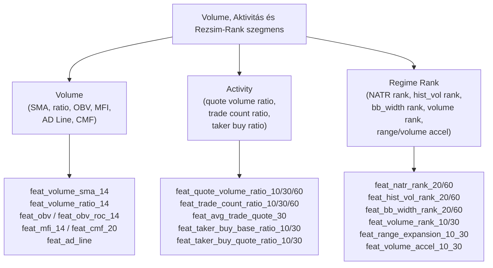
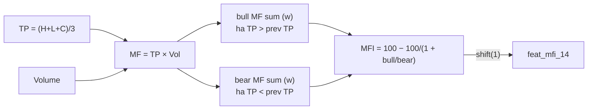
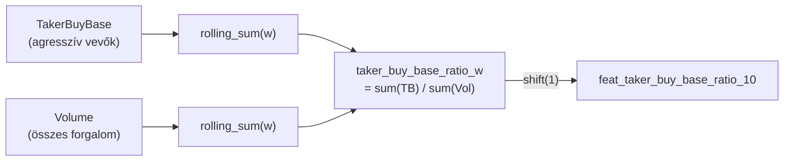
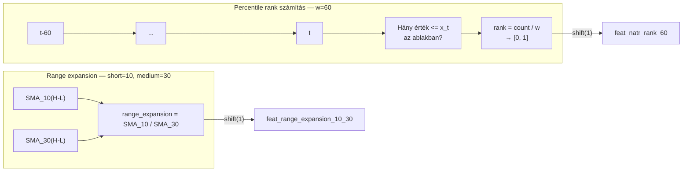

# 1400 — Feature Layer: Volume, Aktivitás és Rezsim-Rank

## Áttekintés

Ez a szegmens a kereskedési aktivitás különböző dimenzióit méri. A Volume csoport az alap forgalmi metrikákat és a pénzáramlás-indikátorokat tartalmazza (OBV, MFI, CMF, AD Line). Az Activity csoport a Binance-specifikus extra adatokat — taker buy arány, quote volume, ügyletek száma — használja fel a „minőségi" forgalom elkülönítéséhez. A Regime Rank csoport különböző metrikák percentile-rangját számítja, lehetővé téve a modell számára, hogy felismerje a relatív volatilitás-, volume- és terjeszkedési rezsimeket.

Közös logika: a forgalmi adatok önmagukban manipulálhatók és zajos jelzők — a ratio-képzés, rank-normálás és pénzáramlás-elemzés eltávolítja a nyers forgalom szintfüggőségét, és a piaci érdeklődés relatív intenzitását fejezi ki.

---

## Volume — 8 feature

### Mi ez és miért méri a piacot?

A forgalmi adatok a piaci meggyőzés mértékét mutatják: egy ármozgás erős forgalommal alátámasztva megbízhatóbb, mint forgalom nélkül. A klasszikus chartista axióma szerint „volume precedes price" — a forgalmi változások megelőzik az árváltozásokat.

**OBV** (On-Balance Volume, Joe Granville, 1963): kumulatív signed forgalom — bullish báron hozzáadjuk, bearish báron levonjuk. Ez az indikátor a pénzáramlás irányát tükrözi, de az abszolút szint alig értelmezhető, ezért az `obv_roc` (OBV változása) az operatív feature.

**MFI** (Money Flow Index, Quong & Soudack, 1989): az RSI-hoz hasonló 0–100 skálájú indikátor, de a forgalommal súlyozza a pénzáramlást. Megkülönbözteti a magas forgalmú trend-mozgásokat az alacsony forgalmú korrekcióktól.

**AD Line** (Accumulation/Distribution, Marc Chaikin): a Close-Low és High-Close viszonyt (CLV) forgalommal súlyozza, és kumulálja. Megmutatja, hogy a forgalom inkább a csúcshoz (accumulation) vagy a mélyponthoz (distribution) közelíti-e a zárást.

**CMF** (Chaikin Money Flow): az AD Line gördülő változata — az egyes bárban forgalommal súlyozott CLV összege osztva az összes forgalommal az ablakban.

### Hogyan számolódik?

**Volume SMA és ratio:**

$$\text{volume\_sma}_w = \frac{1}{w}\sum_{i=0}^{w-1}\text{Vol}_{t-i}, \qquad \text{volume\_ratio}_w = \frac{\text{Vol}_t}{\text{volume\_sma}_w}$$

**OBV:**

$$\text{OBV}_t = \sum_{i=1}^{t}\text{sgn}(C_i - C_{i-1}) \cdot \text{Vol}_i$$

ahol $\text{sgn}(x) \in \{+1, 0, -1\}$.

$$\text{obv\_roc}_w = \frac{\text{OBV}_t - \text{OBV}_{t-w}}{\text{OBV}_{t-w}} \times 100$$

**MFI:**

$$\text{TP} = \frac{H+L+C}{3}, \qquad \text{MF} = \text{TP} \times \text{Vol}$$

$$\text{MFI}_w = 100 - \frac{100}{1 + \frac{\sum_{\text{bull}}\text{MF}_{w}}{\sum_{\text{bear}}\text{MF}_{w}}}$$

ahol bull: $\text{TP}_t > \text{TP}_{t-1}$, bear: $\text{TP}_t < \text{TP}_{t-1}$.

**CLV és AD Line:**

$$\text{CLV} = \frac{(C - L) - (H - C)}{H - L}, \qquad \text{AD}_t = \text{AD}_{t-1} + \text{CLV}_t \times \text{Vol}_t$$

**CMF:**

$$\text{CMF}_w = \frac{\sum_{i=0}^{w-1}\text{CLV}_{t-i} \cdot \text{Vol}_{t-i}}{\sum_{i=0}^{w-1}\text{Vol}_{t-i}}$$

| Indikátor | Ablak | Megjegyzés |
|---|---|---|
| volume_sma | w = 14 | — |
| volume_ratio | w = 14 | Vol / SMA |
| OBV | — | Kumulatív |
| obv_roc | w = 14 | OBV pct_change |
| MFI | w = 14 | 0–100 skála |
| AD Line | — | Kumulatív |
| CMF | w = 20 | −1 … +1 |

### Értelmezés

- `feat_volume_ratio_14`: > 2.0 = kétszeres az átlagos forgalom — breakout vagy esemény jele; < 0.5 = alacsony aktivitás, nem megbízható ármozgás.
- `feat_obv_roc_14`: pozitív = OBV emelkedik → pénz áramlik be a piacra; negatív = forgalommal alátámasztott eladói nyomás.
- `feat_mfi_14`: 0–100 skálán; > 80 = overbought forgalom szempontjából; < 20 = oversold. Az RSI-tól eltér: figyelembe veszi a forgalom súlyát.
- `feat_cmf_20`: −1 … +1 skálán; > 0.05 = akkumuláció (bullish); < −0.05 = disztribúció (bearish).
- `feat_ad_line`: abszolút szintje nem értelmezhető önmagában, trendje számít — emelkedő AD line ár-esés közben bullish divergencia.

### Feature lista

| Feature neve | Ablak | Leírás |
|---|---|---|
| feat_volume_sma_14 | w=14 | Forgalom gördülő átlaga |
| feat_volume_ratio_14 | w=14 | Forgalom / SMA arány |
| feat_obv | — | On-Balance Volume (kumulatív) |
| feat_obv_roc_14 | w=14 | OBV változási üteme |
| feat_mfi_14 | w=14 | Money Flow Index |
| feat_ad_line | — | Accumulation/Distribution vonal |
| feat_cmf_20 | w=20 | Chaikin Money Flow |

---

## Activity — 10 feature

### Mi ez és miért méri a piacot?

A Binance API 5 plusz adatoszlopot biztosít az alap OHLCV-n felül: `quote_volume` (USD-alapú forgalom), `trades` (ügyletek száma), `taker_buy_base` (vevők által kezdeményezett forgalom alap devizában), `taker_buy_quote` (vevők által kezdeményezett forgalom USD-ben). Ezek a forgalom „minőségét" és irányát mérik — a taker buy arány különösen informatív, mert a taker az, aki piaci áron vásárol (agresszív vevő).

A `quote_volume_ratio` az egységár-szintű volumen változásait normálja: egy bár 1000 SOL forgalma más értékű, ha a SOL $150 vagy $200 — a quote volume ezt kiszűri. A `trade_count_ratio` az ügyletek számát méri az átlaghoz képest: sok kis ügylet lehet retail aktivitás; kevés nagy ügylet intézményi beáramlás.

### Hogyan számolódik?

**Quote volume ratio** (ablak = w):

$$\text{quote\_volume\_ratio}_w = \frac{\text{QuoteVol}_t}{\text{SMA}_w(\text{QuoteVol})}$$

**Trade count ratio:**

$$\text{trade\_count\_ratio}_w = \frac{\text{Trades}_t}{\text{SMA}_w(\text{Trades})}$$

**Average trade quote** (összegzett):

$$\text{avg\_trade\_quote}_w = \frac{\sum_{i=0}^{w-1}\text{QuoteVol}_{t-i}}{\sum_{i=0}^{w-1}\text{Trades}_{t-i}}$$

**Taker buy base ratio** (összegzett):

$$\text{taker\_buy\_base\_ratio}_w = \frac{\sum_{i=0}^{w-1}\text{TakerBuyBase}_{t-i}}{\sum_{i=0}^{w-1}\text{Vol}_{t-i}}$$

**Taker buy quote ratio:**

$$\text{taker\_buy\_quote\_ratio}_w = \frac{\sum_{i=0}^{w-1}\text{TakerBuyQuote}_{t-i}}{\sum_{i=0}^{w-1}\text{QuoteVol}_{t-i}}$$

| Feature | Ablak(ok) |
|---|---|
| quote_volume_ratio | w = 10, 30, 60 |
| trade_count_ratio | w = 10, 30, 60 |
| avg_trade_quote | w = 30 |
| taker_buy_base_ratio | w = 10, 30 |
| taker_buy_quote_ratio | w = 10, 30 |

### Értelmezés

- `feat_taker_buy_base_ratio_10`: > 0.6 = az elmúlt 10 bárban a forgalom 60%+ részét agresszív vevők tették ki → bullish pressure; < 0.4 = eladói dominancia.
- `feat_trade_count_ratio_30`: > 2 = kétszeres az átlagos ügyletek száma, retail aktivitás-csúcs (pl. Twitter/news esemény).
- `feat_avg_trade_quote_30`: az átlagos ügyletméret USD-ben; ha magas, intézményi méretű kereskedők aktívak; ha alacsony, retail-fragmentált piac.
- A 10/30/60 ablakok összehasonlítása megmutatja, hogy a taker-flow aktualitása mennyire friss.

### Feature lista

| Feature neve | Ablak | Leírás |
|---|---|---|
| feat_quote_volume_ratio_10 | w=10 | Quote forgalom / SMA arány |
| feat_quote_volume_ratio_30 | w=30 | Quote forgalom / SMA arány |
| feat_quote_volume_ratio_60 | w=60 | Quote forgalom / SMA arány |
| feat_trade_count_ratio_10 | w=10 | Ügyletszám / SMA arány |
| feat_trade_count_ratio_30 | w=30 | Ügyletszám / SMA arány |
| feat_trade_count_ratio_60 | w=60 | Ügyletszám / SMA arány |
| feat_avg_trade_quote_30 | w=30 | Átlagos ügyletméret USD-ben |
| feat_taker_buy_base_ratio_10 | w=10 | Agresszív vevői arány (alap) |
| feat_taker_buy_base_ratio_30 | w=30 | Agresszív vevői arány (alap) |
| feat_taker_buy_quote_ratio_10 | w=10 | Agresszív vevői arány (USD) |
| feat_taker_buy_quote_ratio_30 | w=30 | Agresszív vevői arány (USD) |

---

## Regime Rank — 13 feature

### Mi ez és miért méri a piacot?

A percentile-rank transzformáció a non-stationary jelzőket stacionárius, 0–1 közé eső értékekre vetíti. Az NATR, hist_vol és bb_width abszolút értékei ármozgás-függők; a rangjuk — „hol tart a mai volatilitás az elmúlt w bár eloszlásában" — időben stabil, összehasonlítható jelzővé válik.

A `range_expansion` és `volume_accel` a rövid vs. közepes ablak arányát mérik: > 1 = a rövid bár sáv / forgalom nagyobb az átlagnál → terjeszkedési fázis; < 1 = összehúzódás.

### Hogyan számolódik?

**Rolling percentile rank** (ablak = w, numpy sliding window):

$$\text{rank}(x, w) = \frac{\#\{x_{t-i}: x_{t-i} \leq x_t, i=0,\ldots,w-1\}}{w}$$

Alkalmazva:
- NATR-re (14 bár Wilder-ATR alapú, w=20 és w=60 rank)
- Historical Vol-ra (20 bár std, w=20 és w=60 rank)
- BB width-re (14 bár Bollinger, w=20 és w=60 rank)
- Volume-ra (w=10 és w=30 rank)
- Quote volume-ra (w=10 és w=30 rank)
- Trade count-ra (w=10 és w=30 rank)

**Range expansion** (short/medium arány):

$$\text{range\_expansion}_{s,m} = \frac{\text{SMA}_s(H-L)}{\text{SMA}_m(H-L)}$$

**Volume accel és trade count accel:**

$$\text{volume\_accel}_{s,m} = \frac{\text{SMA}_s(\text{Vol})}{\text{SMA}_m(\text{Vol})}$$

| Feature | Ablak |
|---|---|
| natr_rank | w = 20, w = 60 |
| hist_vol_rank | w = 20, w = 60 |
| bb_width_rank | w = 20, w = 60 |
| volume_rank | w = 10, w = 30 |
| quote_volume_rank | w = 10, w = 30 |
| trade_count_rank | w = 10, w = 30 |
| range_expansion | short=10, medium=30 |
| volume_accel | short=10, medium=30 |
| trade_count_accel | short=10, medium=30 |

### Értelmezés

- `feat_natr_rank_60`: 0.9+ = a mai normált ATR az elmúlt 60 bár legmagasabb 10%-ába esik → extrém volatilitás periódus; 0.1 alatt = rendkívül alacsony volatilitás (squeeze).
- `feat_hist_vol_rank_20` vs `feat_hist_vol_rank_60`: ha a rövid rank magasabb a hosszúnál, a volatilitás nemrég ugrott meg.
- `feat_range_expansion_10_30`: > 1.3 = az utolsó 10 bár sávja 30%-kal szélesebb az elmúlt 30 bár átlagánál → aktív terjeszkedés; < 0.7 = squeeze.
- `feat_volume_accel_10_30`: > 1.5 = a forgalom felgyorsult → breakout potenciál; < 0.5 = forgalom drasztikusan csökkent → érdeklődés vesztett.
- A rank feature-ök különös értéke, hogy nem árszintfüggők: egy 2021-es és egy 2024-es periódus azonos rank-értékkel bír, ha az eloszlásban azonos helyen van.

### Feature lista

| Feature neve | Ablak | Leírás |
|---|---|---|
| feat_natr_rank_20 | w=20 | NATR percentile-rank (20 bár) |
| feat_natr_rank_60 | w=60 | NATR percentile-rank (60 bár) |
| feat_hist_vol_rank_20 | w=20 | Hist. vol percentile-rank |
| feat_hist_vol_rank_60 | w=60 | Hist. vol percentile-rank |
| feat_bb_width_rank_20 | w=20 | BB width percentile-rank |
| feat_bb_width_rank_60 | w=60 | BB width percentile-rank |
| feat_volume_rank_10 | w=10 | Volume percentile-rank |
| feat_volume_rank_30 | w=30 | Volume percentile-rank |
| feat_quote_volume_rank_10 | w=10 | Quote vol percentile-rank |
| feat_quote_volume_rank_30 | w=30 | Quote vol percentile-rank |
| feat_trade_count_rank_10 | w=10 | Ügyletszám percentile-rank |
| feat_trade_count_rank_30 | w=30 | Ügyletszám percentile-rank |
| feat_range_expansion_10_30 | s=10, m=30 | Sáv-terjeszkedési arány |
| feat_volume_accel_10_30 | s=10, m=30 | Forgalom-gyorsulási arány |
| feat_trade_count_accel_10_30 | s=10, m=30 | Ügyletszám-gyorsulási arány |
