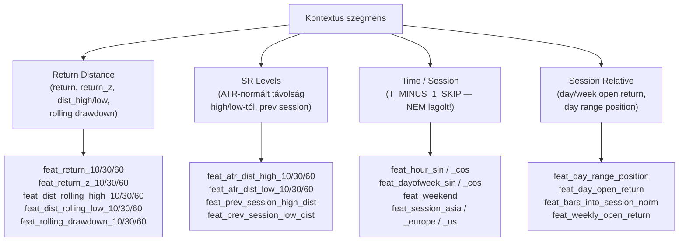
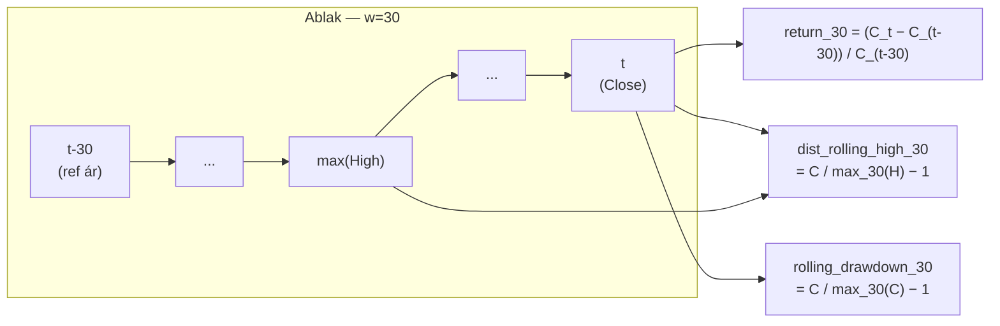
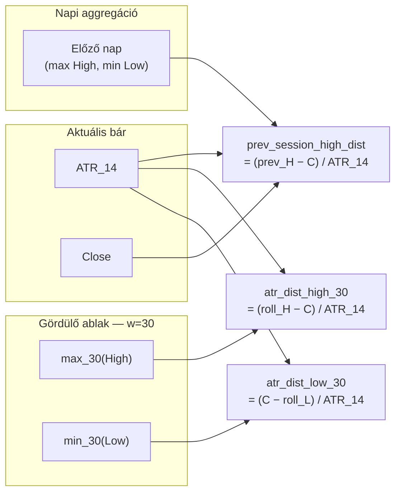
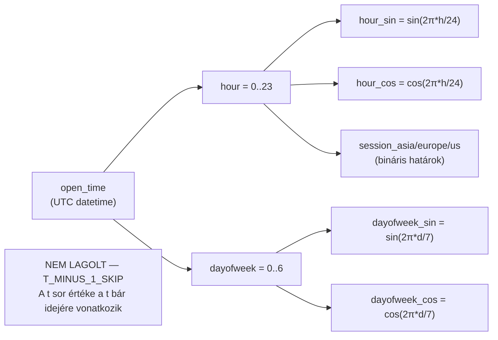
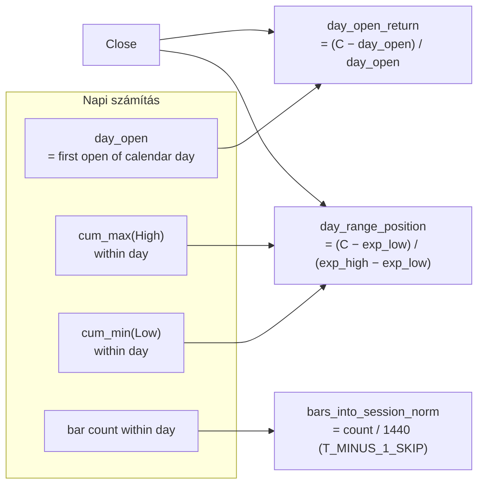

# 1500 — Feature Layer: Kontextus — Return Distance, SR Levels, Idő és Session

## Áttekintés

Ez a szegmens azt méri, hogy az aktuális ár hol helyezkedik el a tér-idő kontextusában: milyen messze van a közeli csúcsoktól/mélypontoktól és a support/resistance szintektől (Return Distance, SR Levels), valamint mikor vagyunk a napon és héten belül (Time/Session, Session Relative).

A Time/Session és Session Relative csoportok feature-jei **kivételt képeznek** a t-1 lag szabály alól. Mivel ezek determinisztikus idő-index értékek (az aktuális bár nyitási idejéből számolódnak, nem historikus piaci megfigyelésből), a `T_MINUS_1_SKIP` halmazba kerültek: az adatbázisban tárolt értékük a tényleges bár idejét tükrözi, nem az előző bárét. A `bars_into_session_norm` szintén ebbe a kategóriába tartozik.

> **Fontos:** A `feat_bars_into_session_norm`, `feat_hour_sin`, `feat_hour_cos`, `feat_dayofweek_sin`, `feat_dayofweek_cos`, `feat_weekend`, `feat_session_asia`, `feat_session_europe`, `feat_session_us` feature-ök **nem kapnak t-1 lag eltolást**. A többi feature a `feat_day_range_position`, `feat_day_open_return` és `feat_weekly_open_return` esetén is érvényes az OHLCV-alapú t-1 lag.

---

## Return Distance — 15 feature

### Mi ez és miért méri a piacot?

A return distance feature-ök az ár több időhorizonton mért relatív elmozdulását mérik. A nyers `return_w` (lineáris hozam) az ár százalékos változását adja w bár alatt — ez egy kontextuális feature: nem azt mondja meg, hogy mi fog történni, hanem hogy honnan indulunk. Egy +5% return a 30 perces ablakban momentum kontextust jelent, míg egy −5% visszapattanási lehetőséget sugallhat.

A `return_z` (z-score) a hozamot normálja az aktuális volatilitáshoz: ha az ár 1%-ot mozdult, de a szokásos napi volatilitás 3%, akkor ez alig számít; ha a szokásos volatilitás 0.2%, akkor rendkívüli esemény. A z-score ezt a viszonylagosságot fejezi ki.

A `dist_rolling_high` és `dist_rolling_low` az ár távolságát méri a közeli csúcstól/mélyponttól: a csúcstól való távolság „az eladói nyomás előtti tér", a mélyponttól való távolság a „vevői védelem fölötti tér".

A `rolling_drawdown` a csúcstól való visszaesés mértéke: ez nem a maximális drawdown (ami fix csúcstól méri), hanem a gördülő ablak csúcsához viszonyított aktuális pozíció.

### Hogyan számolódik?

**Return** (ablak = w bárral ezelőtti árhoz képest):

$$\text{return}_w = \frac{C_t - C_{t-w}}{C_{t-w}}$$

**Return z-score** (1-bár hozam osztva a gördülő log-ret szórással):

$$\text{return\_z}_w = \frac{(C_t - C_{t-1})/C_{t-1}}{\sigma_w^{\log}}$$

ahol $\sigma_w^{\log}$ a log-return gördülő szórása.

**Távolság a gördülő csúcstól/mélyponttól:**

$$\text{dist\_rolling\_high}_w = \frac{C}{\max_w(H)} - 1$$

$$\text{dist\_rolling\_low}_w = \frac{C}{\min_w(L)} - 1$$

**Rolling drawdown** (gördülő csúcstól mért visszaesés):

$$\text{rolling\_drawdown}_w = \frac{C}{\max_w(C)} - 1$$

| Paraméter | Értékek |
|---|---|
| return ablakok | w = 10, 30, 60 |
| return_z ablakok | w = 10, 30, 60 |
| dist_rolling_high ablakok | w = 10, 30, 60 |
| dist_rolling_low ablakok | w = 10, 30, 60 |
| rolling_drawdown ablakok | w = 10, 30, 60 |

### Értelmezés

- `feat_return_10`: tipikusan −0.02 … +0.02 (SOL 10 perces periódusa alatt); ±0.05+ = jelentős impulzus.
- `feat_return_z_10`: > 2 = az ár 2 szórásnyi pozitív elmozdulást produkált a tipikushoz képest → potenciális overbought; < −2 = extrém esés.
- `feat_dist_rolling_high_30`: −0.05 = az ár 5%-kal van a 30 perces csúcs alatt → közel van a resistance-hoz; −0.20 = 20%-kal lemaradva, sok tér van a csúcsig.
- `feat_rolling_drawdown_30`: −0.03 = 3%-kal esett a 30 perces csúcstól → normál korrekció; −0.15 = 15% drawdown → trend változás jele.

### Feature lista

| Feature neve | Ablak | Leírás |
|---|---|---|
| feat_return_10 | w=10 | Lineáris hozam 10 bár alatt |
| feat_return_30 | w=30 | Lineáris hozam 30 bár alatt |
| feat_return_60 | w=60 | Lineáris hozam 60 bár alatt |
| feat_return_z_10 | w=10 | Z-score normált hozam |
| feat_return_z_30 | w=30 | Z-score normált hozam |
| feat_return_z_60 | w=60 | Z-score normált hozam |
| feat_dist_rolling_high_10 | w=10 | Relatív távolság a 10-bár csúcstól |
| feat_dist_rolling_high_30 | w=30 | Relatív távolság a 30-bár csúcstól |
| feat_dist_rolling_high_60 | w=60 | Relatív távolság a 60-bár csúcstól |
| feat_dist_rolling_low_10 | w=10 | Relatív távolság a 10-bár mélyponttól |
| feat_dist_rolling_low_30 | w=30 | Relatív távolság a 30-bár mélyponttól |
| feat_dist_rolling_low_60 | w=60 | Relatív távolság a 60-bár mélyponttól |
| feat_rolling_drawdown_10 | w=10 | Gördülő visszaesés a 10-bár csúcstól |
| feat_rolling_drawdown_30 | w=30 | Gördülő visszaesés a 30-bár csúcstól |
| feat_rolling_drawdown_60 | w=60 | Gördülő visszaesés a 60-bár csúcstól |

---

## SR Levels — 8 feature

### Mi ez és miért méri a piacot?

A support és resistance szintek a technikai elemzés legrégibb koncepciói. Ehelyett a ChronoQuant az ATR-rel normált távolságot alkalmazza: a nyers price distance ($10 vs $0.10) értelmezhetetlen különböző árszinteken, de az ATR-egységnyi távolság összehasonlítható — a volatilitás-korrekció miatt.

A `prev_session_high_dist` és `prev_session_low_dist` az előző nap kereskedési sávjának szélső értékeihez való távolságot méri. Ezek a szintek a piaci memória legfontosabb referencia-pontjai: a következő nap kereskedői figyelemmel kísérik, hogy az ár az előző nap high-ja fölé vagy low-ja alá tör-e.

### Hogyan számolódik?

**ATR-normált távolság a gördülő high/low-tól:**

$$\text{atr\_dist\_high}_w = \frac{\max_w(H) - C}{\text{ATR}_{14}}$$

$$\text{atr\_dist\_low}_w = \frac{C - \min_w(L)}{\text{ATR}_{14}}$$

ahol $\text{ATR}_{14}$ a Wilder-féle 14-bár ATR.

**Előző nap high/low távolsága** (napi aggregáció, majd 1440 bárral visszatolt — 1 nap = 1440 perc):

$$\text{prev\_session\_high\_dist} = \frac{\max_{\text{prev\_day}}(H) - C}{\text{ATR}_{14}}$$

$$\text{prev\_session\_low\_dist} = \frac{C - \min_{\text{prev\_day}}(L)}{\text{ATR}_{14}}$$

| Paraméter | Értékek |
|---|---|
| atr_dist_high/low ablakok | w = 10, 30, 60 |
| prev_session lag | 1440 bár (1 nap) |
| ATR ablak | w = 14 |

### Értelmezés

- `feat_atr_dist_high_10`: 0.5 = az ár 0.5 ATR-nyire van a 10-bár csúcstól (közel a resistance-hoz); 3.0+ = messze van, breakout esetén sok tér van.
- Negatív értékek elvileg nem lehetségesek (a close mindig <= rolling max), de numerikus pontatlanság esetén nullára klippelve kezelhető.
- `feat_prev_session_high_dist`: ha közel 0 = az ár épp az előző nap high-ján van (kritikus döntési szint); nagy pozitív = a szint fölött jár az ár → az előző nap high-ja most supportként funkcionálhat.
- `feat_prev_session_low_dist`: szimmetrikusan: kis érték = az előző nap low-jára esett vissza az ár (kritikus support teszt).

### Feature lista

| Feature neve | Ablak | Leírás |
|---|---|---|
| feat_atr_dist_high_10 | w=10 | ATR-normált távolság a 10-bár csúcstól |
| feat_atr_dist_high_30 | w=30 | ATR-normált távolság a 30-bár csúcstól |
| feat_atr_dist_high_60 | w=60 | ATR-normált távolság a 60-bár csúcstól |
| feat_atr_dist_low_10 | w=10 | ATR-normált távolság a 10-bár mélyponttól |
| feat_atr_dist_low_30 | w=30 | ATR-normált távolság a 30-bár mélyponttól |
| feat_atr_dist_low_60 | w=60 | ATR-normált távolság a 60-bár mélyponttól |
| feat_prev_session_high_dist | — | Távolság az előző nap high-jától (ATR) |
| feat_prev_session_low_dist | — | Távolság az előző nap low-jától (ATR) |

---

## Time / Session — 9 feature (T_MINUS_1_SKIP)

### Mi ez és miért méri a piacot?

A kriptopiacok erős szezonalitást mutatnak: az ázsiai, európai és USA kereskedési session-ök eltérő volumen-profillal, volatilitással és irányultsággal rendelkeznek. Az UTC-alapú session-határok (Ázsia: 0–8h, Európa: 7–16h, USA: 13–22h, átfedésekkel) a legtöbb crypto aktívum esetén empirikusan megerősített forgalmi struktúrát tükröznek.

A trigonometrikus kódolás (sin/cos) az óra és nap ciklikus természetét kezeli: a lineáris kódolásban az éjfél (23h→0h) ugrása hamis discontinuitást okozna. A sin+cos pár egyértelműen meghatározza az időpontot a körön: 2 komponens szükséges, mert pl. sin(pi/6) = sin(5*pi/6).

> **T_MINUS_1_SKIP**: Ezek a feature-ök determinisztikus idő-index értékek — az aktuális bár nyitási idejéből számolódnak, NEM historikus OHLCV megfigyelésekből. Ezért **nem kapnak t-1 lag eltolást**. Az adatbázisban a t sorban tárolt érték az aktuális bár (t) idejéhez tartozik, nem a t-1 bár idejéhez.

### Hogyan számolódik?

**Óra ciklikus kódolás** (UTC óra = 0–23):

$$\text{hour\_sin} = \sin\!\left(\frac{2\pi \cdot h}{24}\right), \qquad \text{hour\_cos} = \cos\!\left(\frac{2\pi \cdot h}{24}\right)$$

**Hét napja ciklikus kódolás** (0=Hétfő, 6=Vasárnap):

$$\text{dayofweek\_sin} = \sin\!\left(\frac{2\pi \cdot d}{7}\right), \qquad \text{dayofweek\_cos} = \cos\!\left(\frac{2\pi \cdot d}{7}\right)$$

**Hétvége bináris jelző:**

$$\text{weekend} = \mathbf{1}[d \geq 5]$$

**Session bináris jelzők** (UTC alapon):

$$\text{session\_asia} = \mathbf{1}[0 \leq h < 8]$$
$$\text{session\_europe} = \mathbf{1}[7 \leq h < 16]$$
$$\text{session\_us} = \mathbf{1}[13 \leq h < 22]$$

### Értelmezés

- `feat_hour_sin` + `feat_hour_cos`: együtt egyértelműen meghatározzák az UTC órát. Pl. 12h UTC: sin≈0, cos≈−1. A modell a két értékből tanulja a napi ciklust.
- `feat_session_europe`: 1.0 = az aktuális bár az európai session-be esik. Az európai–USA átfedés (13–16h UTC) a legvolatilisabb periódus.
- `feat_weekend`: kriptopiacokon a hétvégén alacsonyabb forgalom és szezonálisan eltérő viselkedés jellemző — a modell explicit kontextust kap.
- A session binárisok átfednek (pl. 14h UTC egyszerre európai és USA session) — ez szándékos, mert az átfedési zónák speciális karakterrel bírnak.

### Feature lista

| Feature neve | Megjegyzés | Leírás |
|---|---|---|
| feat_hour_sin | T_MINUS_1_SKIP | Óra sin-komponens |
| feat_hour_cos | T_MINUS_1_SKIP | Óra cos-komponens |
| feat_dayofweek_sin | T_MINUS_1_SKIP | Nap-a-héten sin-komponens |
| feat_dayofweek_cos | T_MINUS_1_SKIP | Nap-a-héten cos-komponens |
| feat_weekend | T_MINUS_1_SKIP | Bináris: szombat vagy vasárnap |
| feat_session_asia | T_MINUS_1_SKIP | Bináris: ázsiai session (UTC 0–8h) |
| feat_session_europe | T_MINUS_1_SKIP | Bináris: európai session (UTC 7–16h) |
| feat_session_us | T_MINUS_1_SKIP | Bináris: USA session (UTC 13–22h) |

---

## Session Relative — 4 feature

### Mi ez és miért méri a piacot?

A session-relatív feature-ök az ár pozícióját mérik az aktuális nap/hét kontextusában. A `day_open_return` azt mutatja, mennyit mozdult az ár a nap nyitása óta — ez az intraday P&L proxy, az aznapos hangulat mutatója. A `day_range_position` azt jelzi, hogy az ár hol tart az aznapon eddig megtett range-en belül.

A `bars_into_session_norm` egyedi feature: azt mutatja, hogy a nap 1440 percéből hány perces bár telt el (0–1 normálva). Ezzel a modell tanulhatja, hogy a nap elején, közepén vagy végén eltérő viselkedés várható — például a záró-órában erős mean-reversion, nyitáskor breakout tendencia.

> **Részleges T_MINUS_1_SKIP:** A `feat_bars_into_session_norm` szintén determinisztikus és nem kap t-1 lag eltolást. A `feat_day_range_position`, `feat_day_open_return` és `feat_weekly_open_return` OHLCV-adatokból számolódnak (bár a napon belüli first open is OHLCV), ezért az általános t-1 lag érvényes rájuk.

### Hogyan számolódik?

**Day open return** (napnyitó ár = az adott naptári napon az első bár open értéke):

$$\text{day\_open\_return} = \frac{C - O_{\text{day}}}{O_{\text{day}}}$$

**Day range position** (tágulási expanding high/low a nap folyamán):

$$\text{day\_range\_position} = \frac{C - \min_{\text{day}}(L_{\text{expanding}})}{\max_{\text{day}}(H_{\text{expanding}}) - \min_{\text{day}}(L_{\text{expanding}})}$$

ahol az expanding high/low a nap első bárjától az aktuálisig vett kumulatív max/min.

**Bars into session norm:**

$$\text{bars\_into\_session\_norm} = \min\!\left(\frac{\text{sorszám a napon belül}}{1440},\; 1.0\right)$$

**Weekly open return:**

$$\text{weekly\_open\_return} = \frac{C - O_{\text{week}}}{O_{\text{week}}}$$

ahol $O_{\text{week}}$ a hét hétfőjének első bárjának open értéke.

### Értelmezés

- `feat_day_open_return`: +0.03 = az ár 3%-kal van a napnyitó felett; ha a kereskedési session vége felé pozitív, bullish nap zárást vetít előre.
- `feat_day_range_position`: 0 = az aznapos mélypontán van az ár; 1 = az aznapos csúcson; 0.5 = pontosan a napi range közepén. Ez a feature dinamikusan bővül a nap folyamán.
- `feat_bars_into_session_norm`: 0.0 = éppen nyitott a nap; 0.5 = a nap fele eltelt; 1.0 = a nap végén. Nem lagolt — az aktuális bár sor idejének értékét tárolja.
- `feat_weekly_open_return`: +0.10 = az ár 10%-kal van a hétfői nyitó felett. Nagyobb értékek esetén a piac „túlvásárolt" lehet a heti kontextusban.

### Feature lista

| Feature neve | Lag | Leírás |
|---|---|---|
| feat_day_range_position | t-1 lagolt | Napi expanding range-en belüli pozíció |
| feat_day_open_return | t-1 lagolt | Visszatérítés a nap nyitójához képest |
| feat_bars_into_session_norm | T_MINUS_1_SKIP | Napi haladás aránya (0–1) |
| feat_weekly_open_return | t-1 lagolt | Visszatérítés a hét nyitójához képest |
