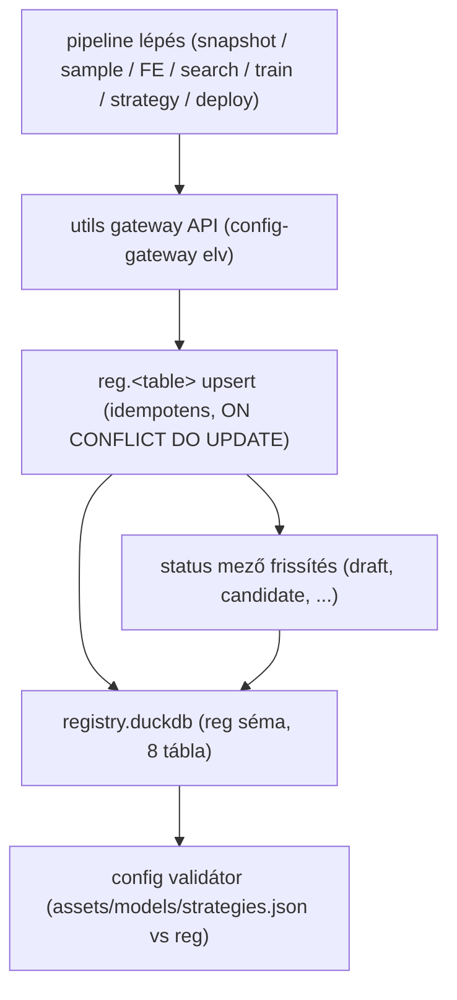
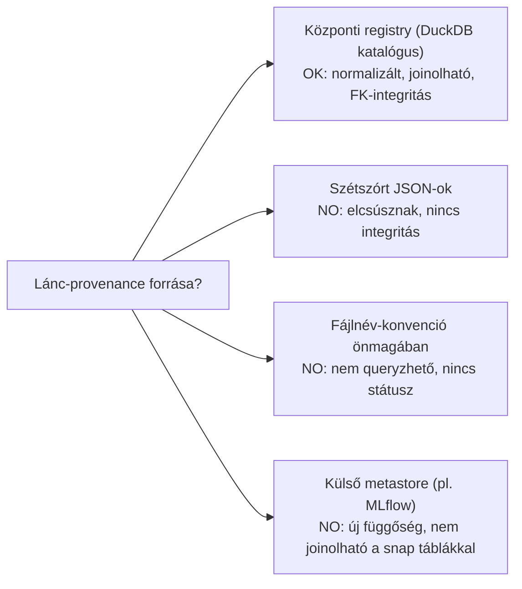
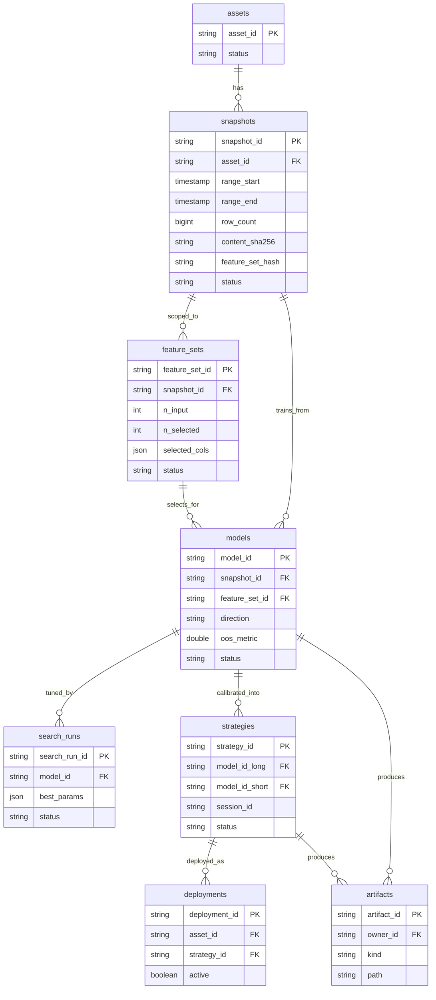
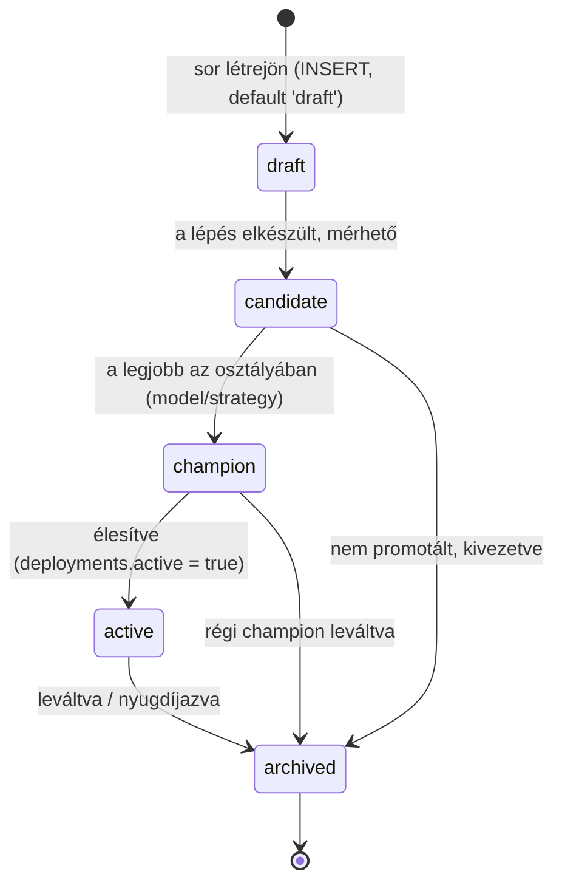
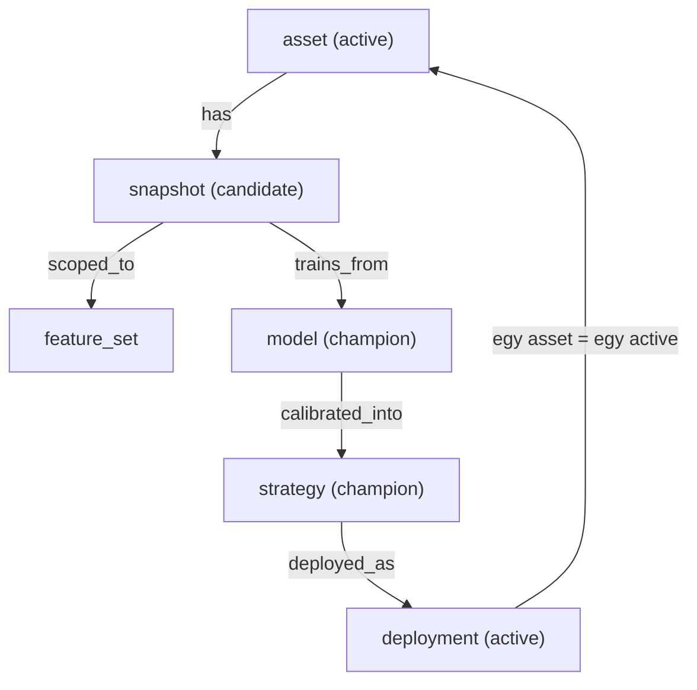
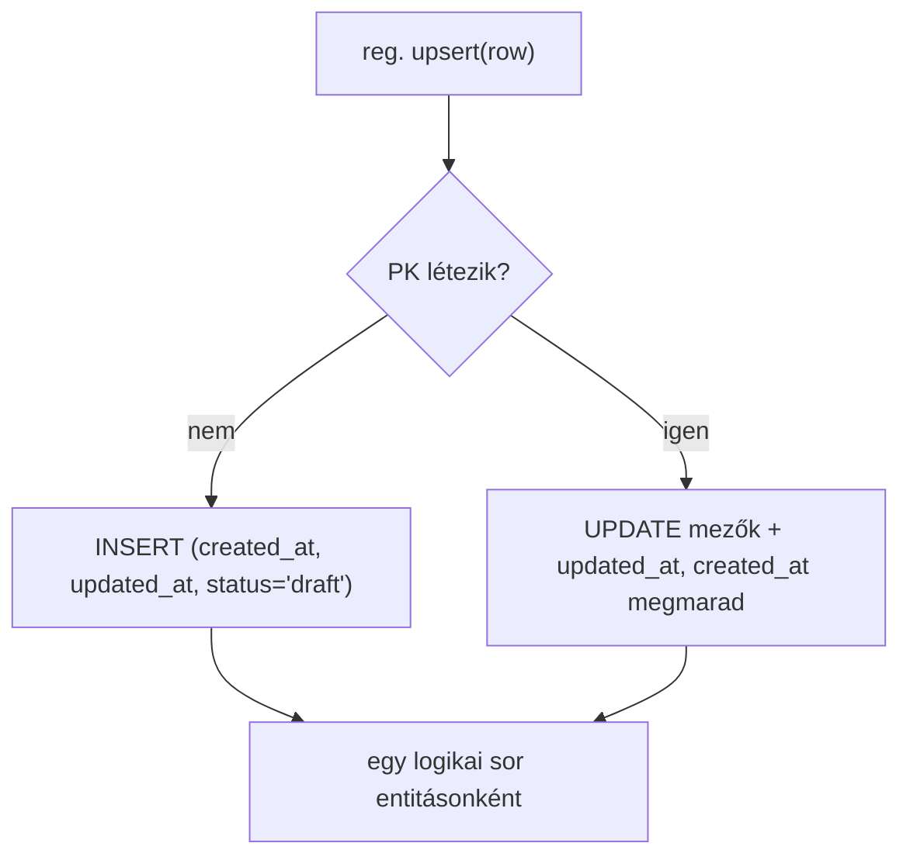
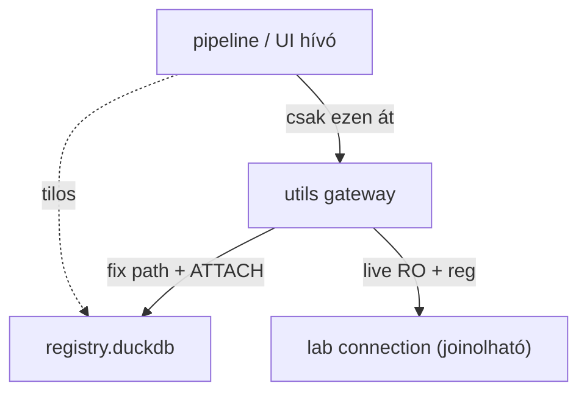

# 1500 — Registry (Központi Katalógus)

A registry a `database/_registry/registry.duckdb` `reg` sémája: az
`asset → snapshot → feature_set → model → search_run → strategy → deployment`
láncot összekötő **normalizált igazságforrás**. Minden entitásnak van
státusza (`draft → … → archived`), és a registry jegyzi fel a hash-eket, linkeket
és artifact-útvonalakat, amelyek korábban szétszórt JSON-okban és fájlnév-
konvenciókban éltek.

> Tárolási topológia és a rétegek (live / lab / registry) átfogó leírása:
> → `_doc_/database_and_code_doc/0002_data_architecture.md`. Ez a doc kizárólag a registry réteg
> **miértjeit** és módszertani szabályait írja le, nem ismétli a topológiát.

---

## Overview

A registry **nem termel adatot** — minden lépés a saját DuckDB objektumát hozza
létre (snapshot, sample, pred), és a registrybe csak a **provenance-t** írja:
melyik entitás melyikből származik, milyen hash-sel, milyen státuszban. Az olvasók
(UI, validátor, lifecycle) innen kérdezik le a lánc aktuális állapotát.

---

## Üzleti és módszertani háttér

### Miért kritikus ez a lépés?

A registry a teljes modellfejlesztési lánc **provenance-gerince**. Korábban a
láncot fájlnév-konvenciók és három, egymástól független JSON kódolta
(`assets.json`, `models.json`, `strategies.json`), amelyek már elcsúsztak
egymástól (a `strategies.json` egy olyan `model_id`-re hivatkozott, ami a
`models.json`-ban más range-gel szerepelt). Ha a lánc nincs egyetlen normalizált
helyen rögzítve, a `strategy → model → snapshot` kapcsolat kézzel romlik el, és
egy élesített stratégiáról nem mondható meg, milyen adatból tanult model áll
mögötte. A registry ezt a normalizált igazságforrást adja: minden link egy FK, és
egy validátor jelzi, ha egy ember-szerkesztett config elcsúszik a registrytől.

### Miért ezt a megközelítést?

| Megközelítés | Előny | Hátrány | Státusz |
|--------------|-------|---------|---------|
| Jelenlegi — központi `reg` séma DuckDB-ben (ATTACH) | Normalizált; egy connectionből joinolható a snap/live rétegekkel; FK-integritás; státusz-mező; idempotens upsert | Egy plusz DB-fájl és migrations-keret kell | ✅ Választott |
| Szétszórt `config/*.json` mint igazságforrás | Ember-szerkeszthető, nincs új réteg | Három fájl elcsúszik egymástól (P3); nincs FK-integritás; nem queryzhető | ❌ Elvetett — már bizonyítottan elcsúszott |
| Csak fájlnév-konvenció (ID-kből parsolva) | Nincs külön tár | Nem queryzhető, nincs státusz, nincs best_params/metric mező | ❌ Elvetett — a név nem hordoz állapotot |
| Külső metastore (MLflow / sqlite mellé) | Kész UI, kész tracking | Új függőség; nem joinolható natívan a `snap`/`live` DuckDB táblákkal; kettős igazságforrás | ❌ Elvetett — a DuckDB-natív irány feladása |

> A `config/*.json` fájlok **megmaradnak** ember-szerkeszthető **bemenetnek**; a
> registry a normalizált, validált igazságforrás. A kettő nem konkurál: a config
> a szándék, a registry a tény.

### A 8 entitás és relációik: miért kell és hogyan működik?

A registry nyolc táblát tart, amelyek a fejlesztési lánc egy-egy fázisát
reprezentálják. A relációk a `data_process_architecture.md` 4.3 ER-jét követik.

A lánc iránya: egy `asset` több `snapshot`-ot foghat be; egy snapshot fölött több
`feature_set` (logikai feature-szűrés) és több `model` élhet; egy model
`search_run`-ok által hangolt és `strategy`-be kalibrált; a strategy
`deployment`-ként élesíthető. A bináris/report kimenetek nem a táblákban, hanem
fájlban élnek — az `artifacts` tábla csak az **útvonalukat** jegyzi (`owner_id`
poliморф: model vagy strategy).

**Szabály:** Egyetlen entitás sem hivatkozhat olyan szülőre, amely nincs a
registryben (FK-integritás). A feature-szűrés **logikai** — `feature_sets` sor,
nem fizikai tábla; a snapshot szuperszettjét hordozza, a `selected_cols` JSON adja
a szűkítést.

### Entitás-életciklus és státuszok: miért kell és hogyan működik?

Minden registry-sor `status` mezője teszi a katalógust „élővé": megmondja, melyik
entitás melyik fázisban van, és mi promotálható tovább. A státusz-folyam:
`draft → candidate → champion → active → archived`.

A státusz-folyam **monoton előre** halad (nincs visszaugrás `active`-ról
`candidate`-re); egy leváltott entitás `archived` lesz, nem törlődik. Egy assetre
egyszerre **egy** `active` deployment lehet (az „aktív asset = solusdt" elv ezen
keresztül kényszerített).

**Szabály:** A státusz a promotálás kapuja — csak `champion` model kalibrálható
`active` deploymentbe; egy új `active` deployment a régit `archived`-re állítja
(nincs két párhuzamos élő stratégia ugyanarra az assetre). A státusz-átmenetek a
gateway CRUD `set_status` függvényén át történnek, nem közvetlen UPDATE-tel.

### Idempotens upsert: miért kell és hogyan működik?

A pipeline lépések újrafuttathatók (egy elhasalt train újraindítható), ezért a
registry-írás nem szabad, hogy duplikáljon vagy a meglévő provenance-t elveszítse.
Az upsert `INSERT ... ON CONFLICT (<PK>) DO UPDATE` szemantikájú: ugyanazzal a
PK-val az írás frissít, nem új sort hoz létre, és az `updated_at` automatikusan
megújul.

**Szabály:** Egy entitás (PK) egyetlen logikai sor a registryben; az
újrafuttatás frissít, nem duplikál. A `created_at` az első létrehozást őrzi, az
`updated_at` minden módosítást. Ez teszi a teljes pipeline-t **újrafuttathatóvá**
provenance-vesztés nélkül.

### Config-gateway: miért nem nyúlnak a hívók közvetlenül a registryhez?

A registry elérése kizárólag az `utils` gateway API-n át történik
(`open_registry_connection`, `open_lab_connection`), soha közvetlen DB- vagy
JSON-eléréssel. Ez tartja a fix path-ot (`database/_registry/registry.duckdb`) és
az ATTACH-logikát egy helyen, így egy hívó sem köti be magát a fizikai
elrendezésbe.

**Szabály:** A hívók nem ismerik a registry fizikai path-ját és az ATTACH-aliasokat
— ezeket a gateway adja. Így a tárolási topológia (3-fájl) megváltoztatható a hívó
kód módosítása nélkül.

### Paraméter alapértékek és indoklásuk

| Paraméter | Alapérték | Indoklás |
|-----------|-----------|---------|
| registry path | `database/_registry/registry.duckdb` (fix, asset-agnosztikus) | A registry **globális** katalógus, nem asset-szintű; egyetlen helyen tartja a teljes láncot minden asset fölött, így nem kerül az `assets.json`-ba |
| `status` default | `'draft'` | Minden új sor még nem promotált; az explicit promotálás (`set_status`) emeli tovább — így a „kész"-nek hitt, de validálatlan entitás nem szivárog be a láncba |
| reg séma elhelyezés | a registry.duckdb **default (main)** sémájában, nem nested `reg` schema | ATTACH-nál a `reg` alias + nested `reg` schema `reg.reg.assets`-et adott volna; a default sémában a plan 4.2 `reg.models` SQL-je tisztán az ATTACH alias |
| migrations verzió | `1` (`reg_schema_initial`) | A reg séma az 1-es verziójú migráció; verziózott, idempotens keret (kiváltja az inline `ensure_tables()` ALTER/DROP mintát) |
| JSON oszlopok | `feature_sets.selected_cols`, `search_runs.best_params` | Változó-hosszú, strukturált tartalom (oszloplista, hiperparaméterek); natív JSON oszlop kerüli a külön join-táblát, és DuckDB-ben lekérdezhető marad |

### Ismert kockázatok és korlátok

| Kockázat | Tünet | Mitigáció |
|----------|-------|-----------|
| Config drift (P3) | A `config/*.json` és a registry eltér (pl. strategy egy nem létező model_id-re hivatkozik) | Validátor összeveti a configot a registryvel; a registry a normalizált igazságforrás, a config csak bemenet |
| Dangling FK | Egy entitás olyan szülőre mutat, ami archived vagy törölt | FK-integritás + `archived` status (nem hard delete) — a szülő sor megmarad provenance-ként |
| Státusz-inkonzisztencia | Két `active` deployment ugyanarra az assetre | A promotálás kényszeríti: új `active` a régit `archived`-re állítja; egy asset = egy active |
| Registry-írás hosszú olvasás alatt | Lock/konkurencia ha egy hosszú olvasó kapcsolat blokkolja az írást | Rövid, tranzakciós upsert-ek; nem hosszú olvasó connection alatt írunk |
| Migrations-drift | A reg séma kézi ALTER-rel csúszik el a kódtól | Verziózott, idempotens migrations-keret; minden séma-változás új verzió, nincs inline ALTER |
| Artifact-útvonal elavulás | A `reg.artifacts.path` egy már mozgatott/törölt fájlra mutat | Az `artifacts` csak útvonalat jegyez; a fájl-mozgatás registry-frissítéssel jár, validátor ellenőrizheti a path létezését |

### Validációs checklist

- [ ] A `reg` séma mind a 8 táblát tartalmazza (`assets`, `snapshots`, `feature_sets`, `models`, `search_runs`, `strategies`, `deployments`, `artifacts`)
- [ ] Minden táblának van `status` mezője (default `'draft'`), `created_at` és `updated_at`
- [ ] Az FK-láncok a 4.3 ER szerint épülnek (asset→snapshot→feature_set/model→search_run/strategy→deployment)
- [ ] Az upsert idempotens: ugyanazon PK-ra frissít, nem duplikál; `created_at` megmarad, `updated_at` frissül
- [ ] A státusz-átmenetek monotonok (`draft→candidate→champion→active→archived`), `set_status`-on át
- [ ] Egy assetre egyszerre legfeljebb egy `active` deployment létezik
- [ ] A registry elérése kizárólag a gateway API-n át (nincs közvetlen DB/JSON elérés a hívóknál)
- [ ] A JSON oszlopok (`selected_cols`, `best_params`) szerializálódnak és visszaolvashatók
- [ ] Egy entitás sem hivatkozik a registryben nem létező szülőre (FK-integritás)

---

## Kapcsolódó metodológia

| Téma | Hivatkozás |
|------|-----------|
| Tárolási topológia (live / lab / registry, ATTACH) | `_doc_/database_and_code_doc/0002_data_architecture.md` |
| Snapshot réteg + content-hash (a registry forrása) | [1400_snapshots.md](1400_snapshots.md) |
| Sampling a snapshot fölött | [5400_sampling.md](5400_sampling.md) |
| quant_train (a snapshot forrása) | [4000_quant_train.md](4000_quant_train.md) |
