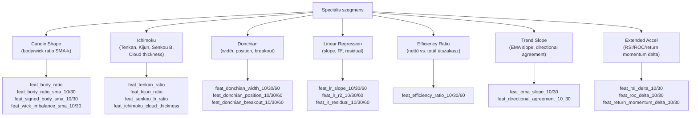
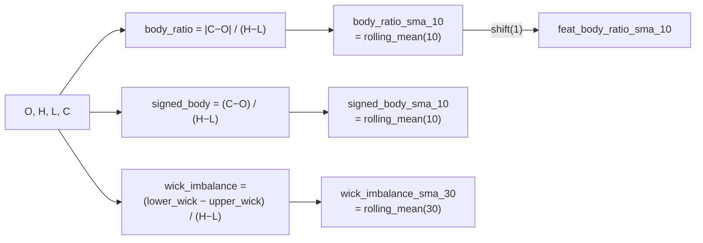
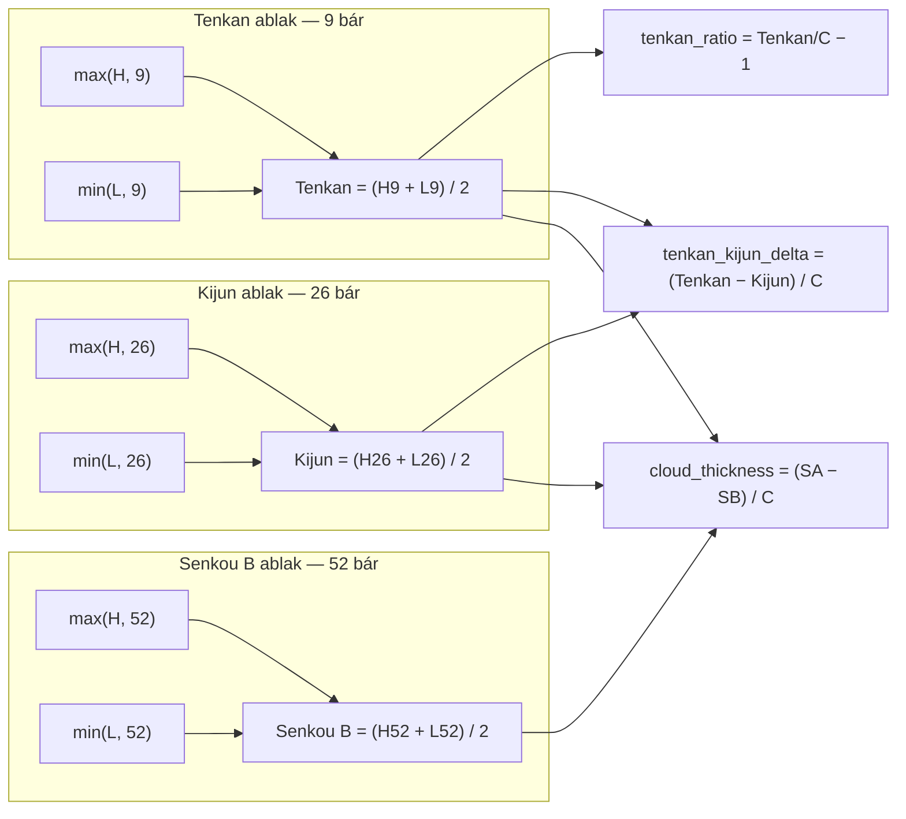
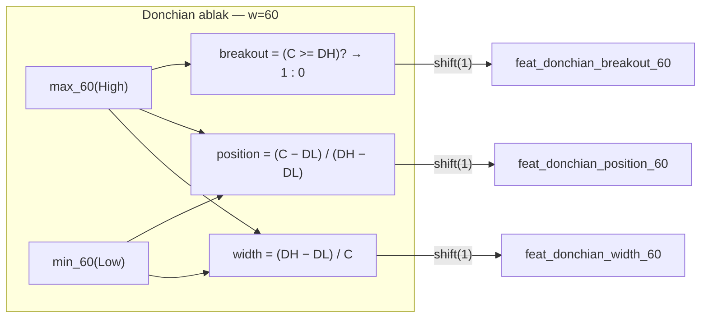
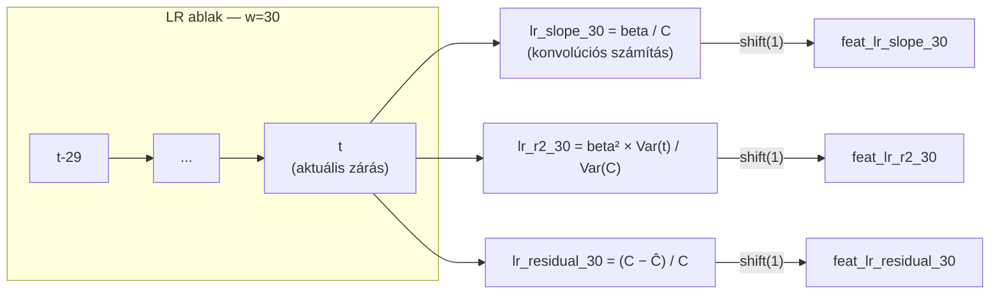
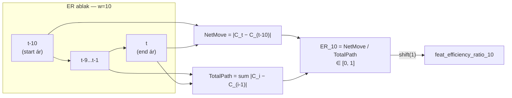
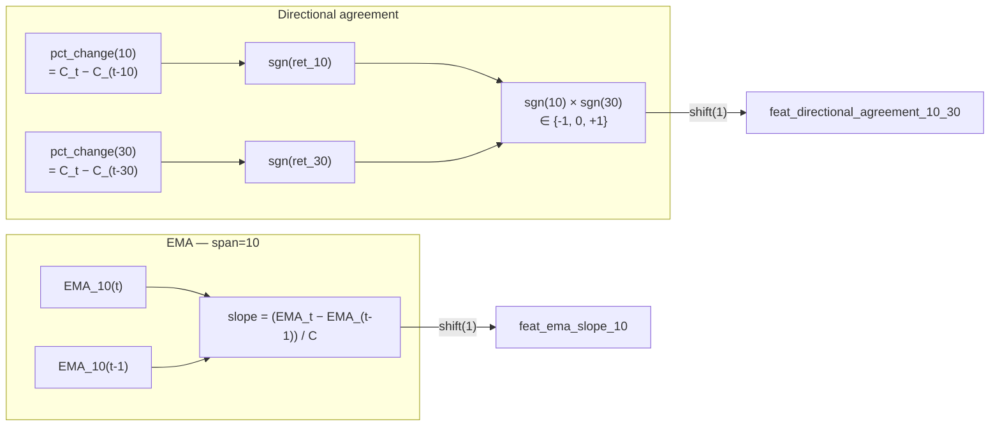
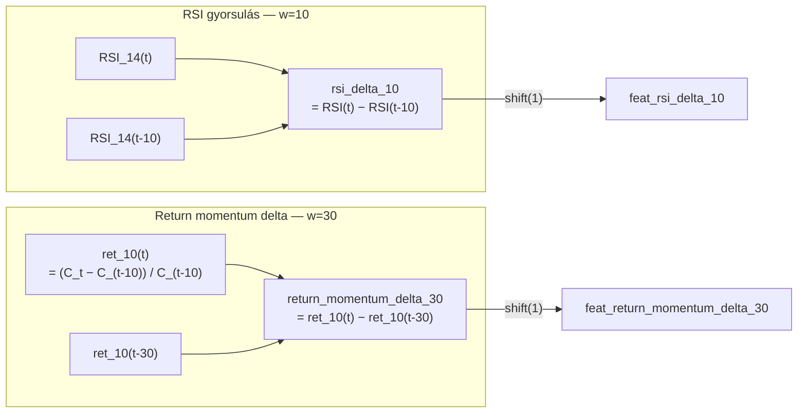

# 1600 — Feature Layer: Speciális Indikátorok

## Áttekintés

Ez a szegmens a kevésbé elterjedt, de erősen speciális célú indikátorokat foglalja össze: a gyertyán belüli arányok gördülő simításait (Candle Shape), a japán rizspiac örökségét a modern crypto-ra alkalmazva (Ichimoku), a trendcsatorna breakout-elemzést (Donchian), a lineáris regresszión alapuló trendmérést (Linear Regression), a piaci mozgás hatékonyságát (Efficiency), az EMA irányszámítást és rövid-hosszú irányegyezést (Trend Slope), valamint a momentum-gyorsulás mérését (Extended Accel).

Közös logika: ezek a feature-ök vagy geometriai (pl. Ichimoku fix periódusaival, Donchian csatornáival), vagy statisztikai alapú (lineáris regresszió, variancia-elemzés) megközelítést alkalmaznak. Sok esetben kombinálják az ármozgás irányát, erejét és időbeli struktúráját egyetlen jelzőben.

---

## Candle Shape — 10 feature

### Mi ez és miért méri a piacot?

Az egyedi gyertya test-kanóc arányai pillanatnyi döntési logikát tükröznek, de egyetlen bárból nem megbízható következtetni. A gördülő SMA simítás az arányok időbeli alakulását rögzíti: ha az elmúlt 10–30 bárban átlagosan nagy testek és kis kanócok jellemzők, az erős, határozott trendet jelez. Ha a kanócok dominálnak, a piac kétirányú nyomás alatt áll.

A `signed_body_ratio` nemcsak a test méretét, hanem irányát is megőrzi: pozitív = bullish, negatív = bearish. A gördülő átlaga az irányított lendületet méri. A `wick_imbalance` (alsó kanóc − felső kanóc) azt jelzi, hogy az ár honnan pattant vissza: tartósan pozitív imbalance = a vevők mindig megtámogatják az ár esését (bullish kontextus).

### Hogyan számolódik?

Alap arányok (az egyedi bárból):

$$\text{body\_ratio} = \frac{|C - O|}{H - L}$$

$$\text{signed\_body\_ratio} = \frac{C - O}{H - L}$$

$$\text{upper\_wick} = H - \max(C, O), \qquad \text{lower\_wick} = \min(C, O) - L$$

$$\text{wick\_imbalance} = \frac{\text{lower\_wick} - \text{upper\_wick}}{H - L}$$

Gördülő SMA simítások (ablak = w):

$$\text{body\_ratio\_sma}_w = \frac{1}{w}\sum_{i=0}^{w-1}\text{body\_ratio}_{t-i}$$

$$\text{signed\_body\_sma}_w = \frac{1}{w}\sum_{i=0}^{w-1}\text{signed\_body\_ratio}_{t-i}$$

$$\text{wick\_imbalance\_sma}_w = \frac{1}{w}\sum_{i=0}^{w-1}\text{wick\_imbalance}_{t-i}$$

| Paraméter | Értékek |
|---|---|
| body_ratio_sma ablakok | w = 10, w = 30 |
| signed_body_sma ablakok | w = 10, w = 30 |
| wick_imbalance_sma ablakok | w = 10, w = 30 |

### Értelmezés

- `feat_body_ratio` (azonnali, nem simított): 0.8+ = erős irányú bár (kis kanócok); 0.1 alatt = doji-szerű, határozatlan bár.
- `feat_signed_body_sma_10`: > 0.3 = az elmúlt 10 bár átlagosan bullish; < −0.3 = bearish lendület.
- `feat_wick_imbalance_sma_30`: > 0.2 = az elmúlt 30 bárban az alsó kanócok domináltak → vásárlói védelem jelen van; < −0.2 = az eladók mindig lenyomják a zárást.
- A raw feature-ök (`feat_body_ratio`, `feat_signed_body_ratio`, `feat_upper_wick_ratio`, `feat_lower_wick_ratio`) egybárra vonatkoznak — magas momentán érték.

### Feature lista

| Feature neve | Ablak | Leírás |
|---|---|---|
| feat_body_ratio | — | Nyers test/sáv arány |
| feat_signed_body_ratio | — | Irányított test/sáv arány |
| feat_upper_wick_ratio | — | Felső kanóc / sáv |
| feat_lower_wick_ratio | — | Alsó kanóc / sáv |
| feat_body_ratio_sma_10 | w=10 | Test arány gördülő átlaga |
| feat_body_ratio_sma_30 | w=30 | Test arány gördülő átlaga |
| feat_signed_body_sma_10 | w=10 | Irányított test SMA |
| feat_signed_body_sma_30 | w=30 | Irányított test SMA |
| feat_wick_imbalance_sma_10 | w=10 | Kanóc-egyenlőtlenség SMA |
| feat_wick_imbalance_sma_30 | w=30 | Kanóc-egyenlőtlenség SMA |

---

## Ichimoku — 7 feature

### Mi ez és miért méri a piacot?

Az Ichimoku Kinko Hyo rendszert Goichi Hosoda (álnevén Ichimoku Sanjin) fejlesztette ki az 1930-as évektől kezdve, és 1969-ben publikálta. Eredetileg a japán tőzsdére (Nikkei) alkalmazták. A rendszer 5 vonalból áll — ChronoQuant az 5 vonalból a 3 legfontosabb egyensúlyi szintet és azok ártól való relatív eltéréseit számítja.

Az Ichimoku egyedisége, hogy **nem paraméterezhető ablakokkal** dolgozik — a 9/26/52 periódus a japán heti piac hagyományos 5-napos tradinghjéből ered (9 ≈ 2 hét, 26 ≈ 1 hónap, 52 ≈ 2 hónap). A modern ChronoQuant alkalmazásban ezek fix értékek, amelyeket nem konfigurálnak — az intuíció a periódusok közötti arányban rejlik.

A felhő (Kumo) vastagsága — Senkou A és Senkou B különbsége — a piaci bizonytalanság mértéke: vastag felhő = erős support/resistance; vékony felhő = gyenge szint, könnyebben áttörhető.

### Hogyan számolódik?

**Midpoint segédfüggvény** (ablak = w):

$$\text{midpoint}(w) = \frac{\max_w(H) + \min_w(L)}{2}$$

**Tenkan-sen** (gyors vonal, 9 periódus):

$$\text{Tenkan} = \text{midpoint}(9)$$

**Kijun-sen** (lassú vonal, 26 periódus):

$$\text{Kijun} = \text{midpoint}(26)$$

**Senkou Span B** (felhő alja/teteje, 52 periódus):

$$\text{Senkou B} = \text{midpoint}(52)$$

**Feature-ök** (Close-hoz normálva):

$$\text{tenkan\_ratio} = \frac{\text{Tenkan}}{C} - 1, \qquad \text{kijun\_ratio} = \frac{\text{Kijun}}{C} - 1$$

$$\text{senkou\_b\_ratio} = \frac{\text{Senkou B}}{C} - 1$$

$$\text{tenkan\_kijun\_delta} = \frac{\text{Tenkan} - \text{Kijun}}{C}$$

$$\text{price\_vs\_tenkan} = \frac{C - \text{Tenkan}}{C}, \qquad \text{price\_vs\_kijun} = \frac{C - \text{Kijun}}{C}$$

$$\text{cloud\_thickness} = \frac{(\text{Tenkan} + \text{Kijun})/2 - \text{Senkou B}}{C}$$

(A Senkou A = (Tenkan + Kijun)/2 definíciójából következik.)

### Értelmezés

- `feat_tenkan_ratio`: ha pozitív, a Tenkan az ár felett van → az ár a gyors átlag alá esett (bearish rövid táv); ha negatív, az ár a Tenkan felett = bullish.
- `feat_tenkan_kijun_delta`: pozitív = Tenkan > Kijun → bullish jel (gyors vonal a lassú felett); negatív = cross-over → potenciális trendváltás.
- `feat_ichimoku_cloud_thickness`: pozitív = Senkou A a Senkou B felett (bullish felhő); negatív = bearish felhő. A vastagság maga a meggyőzés erejét jelzi.
- `feat_price_vs_kijun`: az ár és a Kijun viszonya; az ár a Kijun fölé kerülése klasszikus Ichimoku belépési jel.

### Feature lista

| Feature neve | Periódus | Leírás |
|---|---|---|
| feat_tenkan_ratio | 9 | Tenkan/Close − 1 |
| feat_kijun_ratio | 26 | Kijun/Close − 1 |
| feat_senkou_b_ratio | 52 | Senkou B/Close − 1 |
| feat_tenkan_kijun_delta | 9/26 | (Tenkan − Kijun) / Close |
| feat_price_vs_tenkan | 9 | (Close − Tenkan) / Close |
| feat_price_vs_kijun | 26 | (Close − Kijun) / Close |
| feat_ichimoku_cloud_thickness | 9/26/52 | (Senkou A − Senkou B) / Close |

---

## Donchian — 9 feature

### Mi ez és miért méri a piacot?

A Donchian-csatornát Richard Donchian fejlesztette ki a Turtle Trading System alapjaként (1970-es évek, William Eckhardt és Richard Dennis által elhíresítve). A csatorna egyszerűen a gördülő high/low maximumot és minimumot jelöli ki. Breakout a felső csatornán = erős vételi jel (az ár új w-bár csúcsra emelkedett), ami a klasszikus trend-követő stratégia alapszignálja.

A `donchian_position` (0–1 skála) a Stochastic Oscillatorhoz hasonló, de glattolás nélkül: a Close helyzete a csatornán belül. A `donchian_width` a csatorna relatív szélességét méri — a Bollinger Bandwidth Donchian-analógja, de szórás helyett high-low range alapon.

### Hogyan számolódik?

(Ablak = w):

$$\text{don\_high}_w = \max_w(H), \qquad \text{don\_low}_w = \min_w(L)$$

$$\text{donchian\_width}_w = \frac{\text{don\_high}_w - \text{don\_low}_w}{C}$$

$$\text{donchian\_position}_w = \frac{C - \text{don\_low}_w}{\text{don\_high}_w - \text{don\_low}_w}$$

$$\text{donchian\_breakout}_w = \mathbf{1}\!\left[C \geq \text{don\_high}_w\right]$$

| Paraméter | Értékek |
|---|---|
| Donchian ablakok | w = 10, w = 30, w = 60 |

### Értelmezés

- `feat_donchian_breakout_10`: ha 1.0 = az ár az utolsó 10 bár csúcsát érte el → rövid-távú breakout jel. Ritka esemény, de amikor igaz, erős impulzust jelez.
- `feat_donchian_position_30`: 1.0 = csúcsnál, 0.0 = mélypontnál, 0.5 = közepén. Bullish trendben tartósan 0.6–0.9 körül marad.
- `feat_donchian_width_60`: a 60 bár relatív sávszélessége — magas = nagy rangelés; alacsony = squeeze. A breakout valószínűsége empirikusan növekszik, ahogy a width összeszűkül majd kitágul.
- A három ablak (10/30/60) a különböző időhorizontokon való pozíciót és sávszélességet adja meg.

### Feature lista

| Feature neve | Ablak | Leírás |
|---|---|---|
| feat_donchian_width_10 | w=10 | Csatorna szélessége / Close |
| feat_donchian_width_30 | w=30 | Csatorna szélessége / Close |
| feat_donchian_width_60 | w=60 | Csatorna szélessége / Close |
| feat_donchian_position_10 | w=10 | Close helyzete a csatornán belül [0,1] |
| feat_donchian_position_30 | w=30 | Close helyzete a csatornán belül |
| feat_donchian_position_60 | w=60 | Close helyzete a csatornán belül |
| feat_donchian_breakout_10 | w=10 | Bináris: Close >= 10-bár csúcs |
| feat_donchian_breakout_30 | w=30 | Bináris: Close >= 30-bár csúcs |
| feat_donchian_breakout_60 | w=60 | Bináris: Close >= 60-bár csúcs |

---

## Linear Regression — 9 feature

### Mi ez és miért méri a piacot?

A lineáris regresszió az ármozgás determinisztikus lineáris komponensét határolja el a zajt. A meredekség (slope) a trend sebességét méri — nem az ár abszolút szintjét, hanem az ár változásának irányát és ütemét. Az $R^2$ a trend „tisztaságát" mutatja: 1.0 = az ár pontosan lineárisan mozgott; 0.0 = véletlenszerű mozgás. A rezidum az ár eltérése a lineáris fit-től — ha pozitív, az ár az vártnál magasabban jár; ha negatív, alulteljesít.

A konvolúciós implementáció hatékony: a slope a záróárak és az időindex közötti súlyozott összege, amely NumPy konvolúcióval számolódik $O(n \cdot w)$ helyett $O(n \cdot w^2)$ komplexitással.

### Hogyan számolódik?

Lineáris regresszió $C_{t-w+1},\ldots,C_t$ az időindexen (centrálisan igazítva):

$$t_i = i - \frac{w-1}{2}, \quad i = 0,\ldots,w-1$$

**Slope** (konvolúcióval):

$$\beta = \frac{\sum_{i=0}^{w-1} t_i \cdot C_{t-w+1+i}}{\sum_{i=0}^{w-1} t_i^2}$$

Normálva az árhoz: $\text{lr\_slope}_w = \beta / C$

**R-négyzet:**

$$R^2 = \text{clip}\!\left(\frac{\beta^2 \cdot \text{Var}(t)}{\text{Var}(C)_w},\; 0,\; 1\right)$$

ahol $\text{Var}(t) = \frac{1}{w}\sum t_i^2$ (centrált ablak).

**Rezidum** (normált ár-eltérés a fit-től):

$$\text{lr\_residual}_w = \frac{C - \hat{C}}{C}$$

ahol $\hat{C} = \bar{C} + \beta \cdot t_{\text{aktuális}}$ az előrejelzett ár az ablak jobb szélén.

| Paraméter | Értékek |
|---|---|
| LR ablakok | w = 10, w = 30, w = 60 |

### Értelmezés

- `feat_lr_slope_10`: pozitív és magas = az ár gyorsan emelkedik 10 bár alatt; negatív = erős esés. Normált, ezért összehasonlítható az árszinttel.
- `feat_lr_r2_30`: 0.8+ = az ár nagyon simán trendelt 30 bár alatt (nincs oldalazás); 0.2 alatt = kaotikus mozgás, a trend nem megbízható.
- `feat_lr_residual_10`: pozitív = az ár a lineáris fit fölé ugrott (túlteljesítés, potenciális visszafordulás); negatív = az ár elmaradt a trendtől (alulteljesítés, mean-reversion lehetőség).
- Az R² és slope kombinációja különösen informatív: ha slope nagy, de R² alacsony = az ár sokat mozgott, de nem lineárisan; ha slope kicsi, de R² magas = konzisztens lassú trend.

### Feature lista

| Feature neve | Ablak | Leírás |
|---|---|---|
| feat_lr_slope_10 | w=10 | Normált LR meredekség (10 bár) |
| feat_lr_slope_30 | w=30 | Normált LR meredekség (30 bár) |
| feat_lr_slope_60 | w=60 | Normált LR meredekség (60 bár) |
| feat_lr_r2_10 | w=10 | LR illeszkedés minősége [0,1] |
| feat_lr_r2_30 | w=30 | LR illeszkedés minősége |
| feat_lr_r2_60 | w=60 | LR illeszkedés minősége |
| feat_lr_residual_10 | w=10 | Normált ár-eltérés a trendfittől |
| feat_lr_residual_30 | w=30 | Normált ár-eltérés a trendfittől |
| feat_lr_residual_60 | w=60 | Normált ár-eltérés a trendfittől |

---

## Efficiency Ratio — 3 feature

### Mi ez és miért méri a piacot?

Az Efficiency Ratio (ER) Perry Kaufman fejlesztése (1998, ugyanabból a munkából, mint a KAMA). Azt méri, hogy az ár mozgása mennyire „hatékony": ha az ár egyenesen A-ból B-be ment, az ER = 1.0 (tökéletesen hatékony mozgás, nulla zaj). Ha sokat ide-oda ingadozott, de végül ugyanott kötött ki, az ER közel 0 (sok mozgás, kevés irányultság).

Gépi tanulási szempontból ez az egyik legjobb rezsim-azonosítók: magas ER = trendező periódus (a momentum indikátorok megbízhatóak); alacsony ER = oldalazó, zajos periódus (mean-reversion jelzők előnybe kerülnek).

### Hogyan számolódik?

(Ablak = w):

$$\text{NetMove}_w = |C_t - C_{t-w}|$$

$$\text{TotalPath}_w = \sum_{i=1}^{w}|C_{t-i+1} - C_{t-i}|$$

$$\text{ER}_w = \frac{\text{NetMove}_w}{\text{TotalPath}_w} \in [0, 1]$$

Az eredmény klippelve [0, 1] közé (numerikus stabilitás miatt).

| Paraméter | Értékek |
|---|---|
| efficiency_ratio ablakok | w = 10, w = 30, w = 60 |

### Értelmezés

- `feat_efficiency_ratio_10`: közel 1.0 = az ár 10 bár alatt szinte egyenesen mozgott; közel 0 = kaotikus, irányítás nélküli mozgás.
- `feat_efficiency_ratio_60`: 0.5+ = az utóbbi óra konzisztens trendet mutatott; 0.1 alatt = az ár fel-le ingadozva maradt nagyjából ugyanott.
- Rezsim-jelzőként: ha mind a 3 ablak (10/30/60) magas ER-t mutat, az erős, multi-horizon trend jele.

### Feature lista

| Feature neve | Ablak | Leírás |
|---|---|---|
| feat_efficiency_ratio_10 | w=10 | Hatékonysági arány (10 bár) |
| feat_efficiency_ratio_30 | w=30 | Hatékonysági arány (30 bár) |
| feat_efficiency_ratio_60 | w=60 | Hatékonysági arány (60 bár) |

---

## Trend Slope — 3 feature

### Mi ez és miért méri a piacot?

Az EMA slope az exponenciális mozgóátlag pillanatnyi meredekségét méri: az EMA egy lépés alatt mekkora változást mutat, az árhoz normálva. Ez szoros kapcsolatban áll a MACD-vel (az EMA slope a MACD-t alkotó EMA-k deriváltja), de közvetlenebb interpretációval bír: negatív slope = az EMA csökken, az ár esik a glattolt mozgóátlag szempontjából.

A `directional_agreement` azt méri, hogy a rövid (10 bár) és közepes (30 bár) hozam azonos irányba mutat-e: +1 = mindkettő bullish, −1 = mindkettő bearish, 0 = ellentmondásos jelzés. Ez a cross-temporal momentum konzisztencia jelzője.

### Hogyan számolódik?

**EMA slope** (ablak = w):

$$\text{ema\_slope}_w = \frac{\text{EMA}_w(t) - \text{EMA}_w(t-1)}{C}$$

ahol az EMA span=w paraméterrel, adjust=False.

**Directional agreement** (short=10, medium=30):

$$\text{dir\_agreement}_{s,m} = \text{sgn}(C_t - C_{t-s}) \times \text{sgn}(C_t - C_{t-m})$$

ahol $\text{sgn}(x) \in \{-1, 0, +1\}$.

| Paraméter | Értékek |
|---|---|
| ema_slope ablakok | w = 10, w = 30 |
| directional_agreement | short=10, medium=30 |

### Értelmezés

- `feat_ema_slope_10`: pozitív = az EMA emelkedik; tipikusan ±0.001 SOL 1 perces adatokon (normált az árhoz). Hirtelen trend esetén ±0.005 fölé ugorhat.
- `feat_ema_slope_30`: lassabb EMA lassabb slope-ot mutat; ha mindkét slope pozitív és növekvő, erős trend van kibontakozóban.
- `feat_directional_agreement_10_30`: +1.0 = rövid és közepes trend egyirányú (megbízható irány); −1.0 = divergencia (kockázatos belépés); 0 = az egyik hozam nulla (stagnálás).

### Feature lista

| Feature neve | Ablak | Leírás |
|---|---|---|
| feat_ema_slope_10 | w=10 | EMA meredeksége / Close |
| feat_ema_slope_30 | w=30 | EMA meredeksége / Close |
| feat_directional_agreement_10_30 | s=10, m=30 | Rövid/közepes irány egyezése |

---

## Extended Accel — 6 feature

### Mi ez és miért méri a piacot?

A momentum-gyorsulás jelzők azt mérik, hogy a piac mozgásainak sebessége változik-e. Ha az RSI 5 bár alatt 10 pontot emelkedett, az momentum-gyorsulás; ha 30 bár alatt alig mozdult, az momentum-kimerülés. Ez az időbeli derivált koncepciója indikátorokra alkalmazva.

A `return_momentum_delta` a 10-bár hozam változásának gyorsulását méri: ha az utóbbi 10 bár hozama az előző 10-bár hozamhoz képest nagyobb, az lendületes trend; ha csökkent, a trend lassul.

Megjegyzés: az Extended Accel csoportban az `rsi_delta` és `roc_delta` az Interaction csoportban (1200-as fájl, w=5 ablakkal) is szerepel — a különbség, hogy itt w=10 és w=30 ablakokkal is számolódik a gyorsulás.

### Hogyan számolódik?

**RSI delta** (ablak = w):

$$\text{rsi\_delta}_w = \text{RSI}_{14}(t) - \text{RSI}_{14}(t-w)$$

**ROC delta:**

$$\text{roc\_delta}_w = \text{ROC}_{14}(t) - \text{ROC}_{14}(t-w)$$

**Return momentum delta** (10-bár hozam gyorsulása):

$$\text{return\_momentum\_delta}_w = (C_t - C_{t-10})/C_{t-10} \;-\; (C_{t-w} - C_{t-w-10})/C_{t-w-10}$$

| Paraméter | Értékek |
|---|---|
| Extended accel ablakok | w = 10, w = 30 |

### Értelmezés

- `feat_rsi_delta_10`: +15 = az RSI 10 bár alatt 15 pontot emelkedett → momentum gyorsulás (bullish); −15 = lendületes RSI esés.
- `feat_roc_delta_30`: ha a 30-bár ROC delta pozitív és nagy, a trend az elmúlt hónapban gyorsult.
- `feat_return_momentum_delta_10`: pozitív = a 10-bár hozam az előző 10-bárhoz képest nagyobb (gyorsulás); negatív = lassulás (potenciális trend-vég).
- Az Extended Accel feature-ök különösen hasznosak volatilitási csúcsokon: ha az RSI és ROC delta egyszerre ugornak, az erős impulzust jelez.

### Feature lista

| Feature neve | Ablak | Leírás |
|---|---|---|
| feat_rsi_delta_10 | w=10 | RSI változása 10 bár alatt |
| feat_rsi_delta_30 | w=30 | RSI változása 30 bár alatt |
| feat_roc_delta_10 | w=10 | ROC változása 10 bár alatt |
| feat_roc_delta_30 | w=30 | ROC változása 30 bár alatt |
| feat_return_momentum_delta_10 | w=10 | 10-bár hozam gyorsulása |
| feat_return_momentum_delta_30 | w=30 | 10-bár hozam gyorsulása (30 bár kontextus) |
