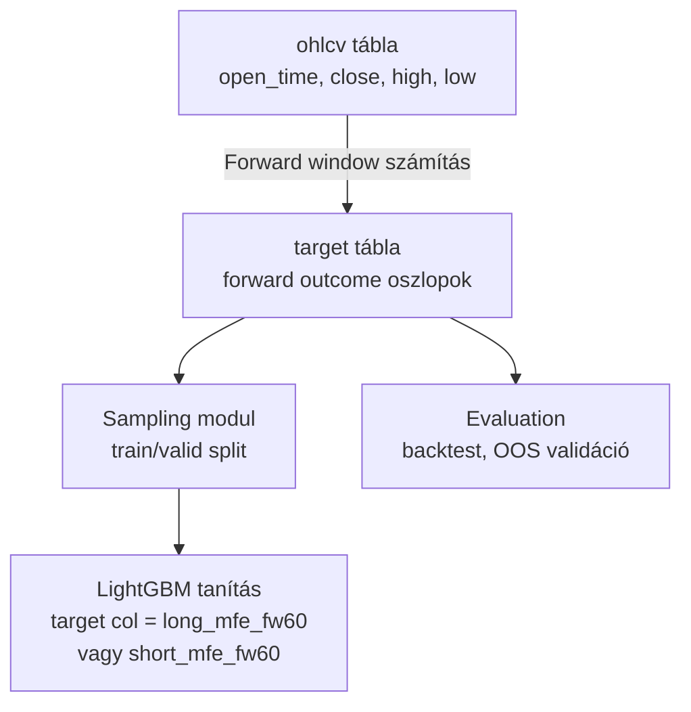
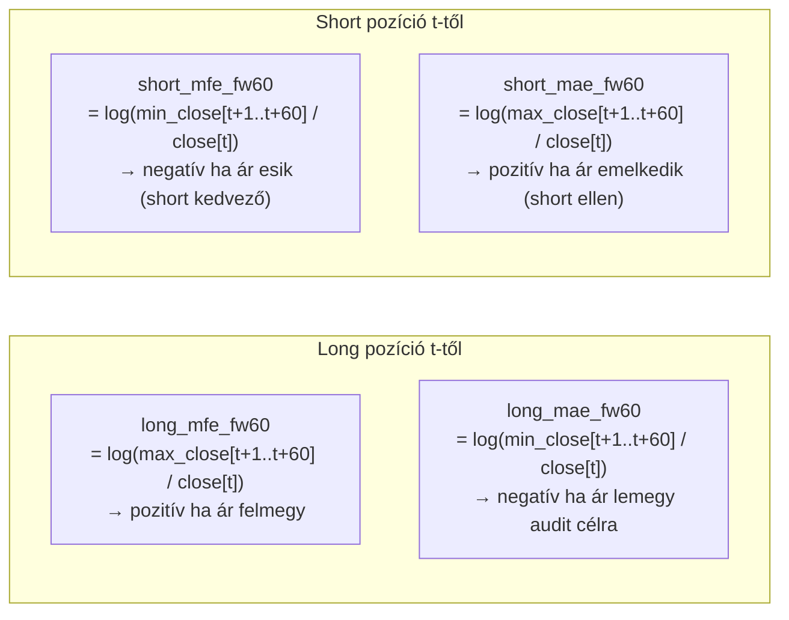
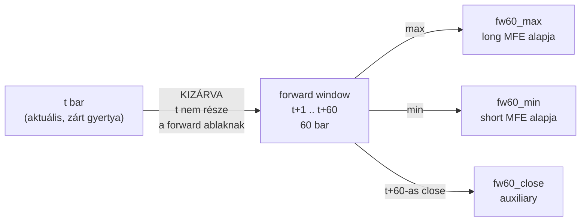
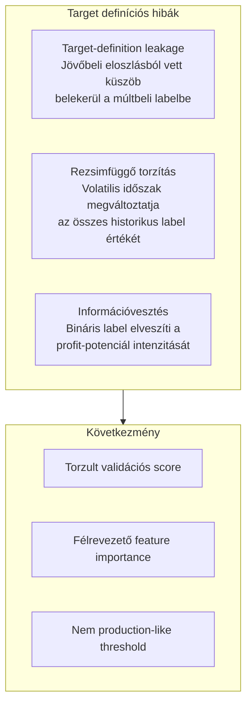
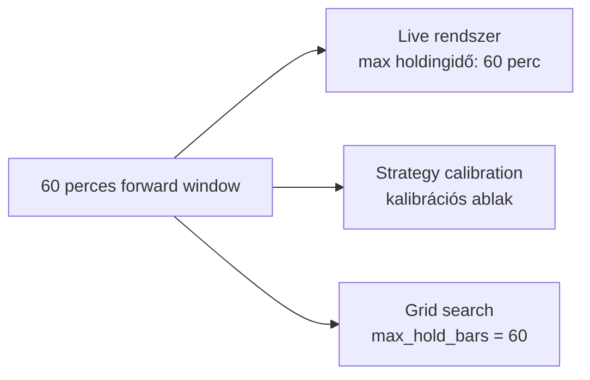
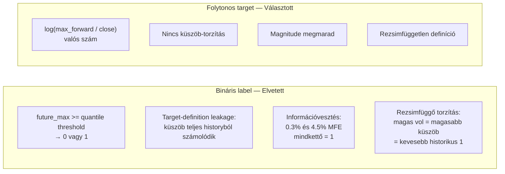

# 2000 — Target Layer

## Overview

A target layer a ChronoQuant ML pipeline label-rétege. A target tábla az `ohlcv` nyers árból számított, jövőbe tekintő (forward-looking) outcome oszlopokat tartalmaz — ezek alkotják a modellek tanítási célváltozóit.

**Aktív target oszlopok:** `long_mfe_fw60`, `short_mfe_fw60` — 60 perces forward logreturn outcome-ok.

A target layer dönti el, hogy a modell **mit tanul meg előrejelezni**. A helyes target definíció kritikus: ha torz, a validációs score nem tükrözi a valós produkciós teljesítményt.

---

## A Forward MFE Target

### Definíció

**MFE (Maximum Favorable Excursion):** az a maximális nyereség, amelyet egy pozíció elméletileg elért volna a tartási horizonton belül — anélkül, hogy bármilyen exit döntést hoznánk.

A modell `long_mfe_fw60` targetre tanul long irányban, `short_mfe_fw60` targetre short irányban. A MAE értékek nem elsődleges targetok, de az evaluation és adverse move audit során kötelezően ellenőrizendők.

### Forward window szemantika

Az aktuális bar (`t`) kizárása kötelező: a predikció a `t` bar zárásakor készül, és a `t+1` bar nyitásán kerül végrehajtásra. Ha `t` benne lenne a forward ablakban, az outcome egy részben már ismert értéket tükrözne.

**NULL tail:** Az utolsó 60 sor minden outcome oszlopban `NULL` — nincs 60 jövőbeli bar. Ezeket a sorokat soha ne töltsd fel `0`-ra: a null nem negatív esemény, hanem ismeretlen kimenet.

---

## Üzleti és módszertani háttér

### Miért kritikus ez a lépés?

Ha a target definíció torz, az egész downstream pipeline félrevezető — a modell olyasmit tanul meg előrejelezni, ami nem felel meg a valós kereskedési célnak, vagy ami adatminőségi problémát hordoz magában.

### Miért MFE és nem realized return?

Az MFE a **maximális potenciált** méri, nem a TP/SL döntést. Ez szándékos szétválasztás:

| Kérdés | MFE alapú target | Realized return alapú target |
|---|---|---|
| Mit mér? | Legjobb elérhető outcome | Tényleges végrehajtott hozam |
| TP/SL függő? | Nem — TP/SL nincs benne | Igen — TP/SL megváltoztatja |
| Modell feladata | Jó lehetőséget rangsorolni | Konkrét exit rule-t tanulni |
| Újraoptimalizálás | TP/SL keresés offline | Modell újratanítás kell |

A rendszer logikájában a modell feladata a lehetőségek rangsorolása. A **strategy réteg** (→ `6000_strategy.md`) dönti el, hogy a jó lehetőségből mikor és hogyan lép be/ki a live kereskedés. Ez a szétválasztás teszi lehetővé, hogy a TP/SL paramétereket a modell újratanítása nélkül optimalizáljuk.

### Miért 60 bar (60 perc)?

A 60 bar horizon egységes a teljes pipeline-on: a live rendszer is 60 perc után zár timeout-tal, a grid search is 60 bar-t szimulál. Ez a konzisztencia biztosítja, hogy a modell ugyanolyan időhorizonon optimalizál, amelyen a live kereskedés fut.

### Miért folytonos regresszió és nem bináris osztályozás?

| Megközelítés | Előny | Hátrány | Státusz |
|---|---|---|---|
| Folytonos fw60 logreturn (jelenlegi) | Nincs percentilis-torzítás, magnitude megmarad, flexibilis | Regresszor szükséges, binary baseline elvész | ✅ Választott |
| Full-history quantile bináris | Egyszerű classifier, stabil threshold | Target-definition leakage, rezsimfüggő torzítás, információvesztés | ❌ Eltávolítva — legacy |
| Fold-specifikus quantile bináris | Leakage-mentes binarizálás | Minden foldban különböző label → összehasonlíthatatlan metrikák | ⚠️ Derived label-ként fontolóra vehető |
| Triple-barrier | MFE + MAE egyszerre kezel, stop-loss implicit | Konfiguráció érzékeny, training instabilabb | ⚠️ Jövőbeli kísérlethez |

### Miért logreturn és nem simple return?

| Mérőszám | Jellemző | Alkalmazhatóság |
|---|---|---|
| Simple return `(max − close) / close` | Aszimmetrikus: +10% és −10% nem összehasonlítható | Napi riporthoz elfogadható |
| Logreturn `log(max / close)` | Additív, szimmetrikus; kis értékeknél ≈ simple return | ML target, multi-period aggregáció |

A logreturn additív természete lehetővé teszi, hogy a long és short MFE értékek közvetlenül összehasonlíthatók legyenek, és multi-period kilátások összeadással aggregálhatók. Kis moves esetén (<2%) a numerikus különbség elhanyagolható.

### Paraméter alapértékek és indoklásuk

| Paraméter | Érték | Indoklás |
|---|---|---|
| Forward horizon | `60` bar | 60 perces opportunity ablak; egyezik a live max holdingidővel |
| Window logika | `t+1..t+60` | Aktuális bar kizárva; pontosan 60 jövőbeli bar |
| NULL küszöb | `fw_bar_count >= 60` | Csak teljes forward ablakkal rendelkező sorok kapnak értéket |
| Logreturn alap | természetes logaritmus (LN) | Szimmetrikus, additív |
| Elsődleges long target | `long_mfe_fw60` | MFE = maximális long opportunity |
| Elsődleges short target | `short_mfe_fw60` | MFE short oldalon = log(min/close) — legkedvezőbb short |
| Rebuild policy | teljes DELETE+INSERT | Minden sync hívás teljes újraszámítást végez — idempotens |

### Ismert kockázatok és korlátok

| Kockázat | Tünet | Mitigáció |
|---|---|---|
| NULL tail torzítás | Ha sampling elszedi az utolsó 60 sort és 0-ra imputálja | Null target sorok droppolva a dataset loaderben; soha ne impute-old 0-ra |
| Rezsimváltás eltérő target eloszlást okoz | Alacsony volatilitásban az MFE p90 kisebb | Expanding window kontextus; a valid periódus követi a legfrissebb rezsimet |
| `short_mfe_fw60` szemantikai félreértés | Pozitív short_mfe értéket hibásnak vélni | Szabály: short_mfe < 0 mindig igaz profitábilis short esetén — ez nem adathiba |
| Kis logvalue értelmezése | `long_mfe_fw60 = 0.003` → ~0.30% mozgás — konfúzió a magnitude körül | Riportokban mindig % formában is feltüntetni |
| Legacy target referencia | Régi bináris `trg_*` targetekre hivatkozó dokumentáció | Elavultként kezelni; ground truth: ez a specifikáció és a forráskód |

### Validációs checklist

- [ ] A target tábla utolsó 60 sora minden fw60 outcome oszlopban `NULL`
- [ ] Az aktuális bar (`t`) nem szerepel a forward ablakban — csak `t+1..t+60`
- [ ] `long_mfe_fw60` = `log(fw60_max / close)` — numerikusan ellenőrzött determinisztikus teszttel
- [ ] `short_mfe_fw60` = `log(fw60_min / close)` — numerikusan ellenőrzött determinisztikus teszttel
- [ ] `long_mfe_fw60` és `short_mfe_fw60` csak DOUBLE `NULL`, soha `0.0` — nem impute-olt
- [ ] A target tábla nem tartalmaz legacy `trg_*` bináris oszlopot
- [ ] Sync után: computed_from, computed_to, computed_at metaadat frissítve
- [ ] Dataset loader: null target sorok droppolva — nincs `0` imputation
