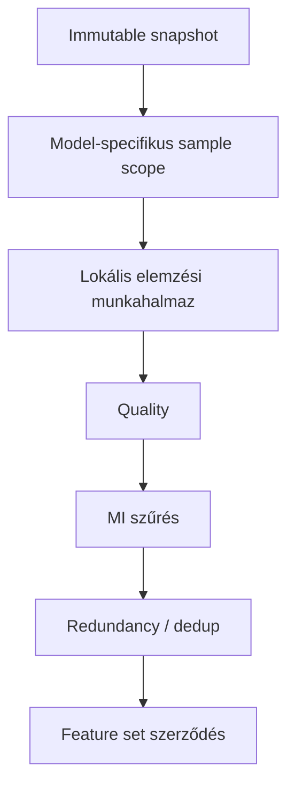
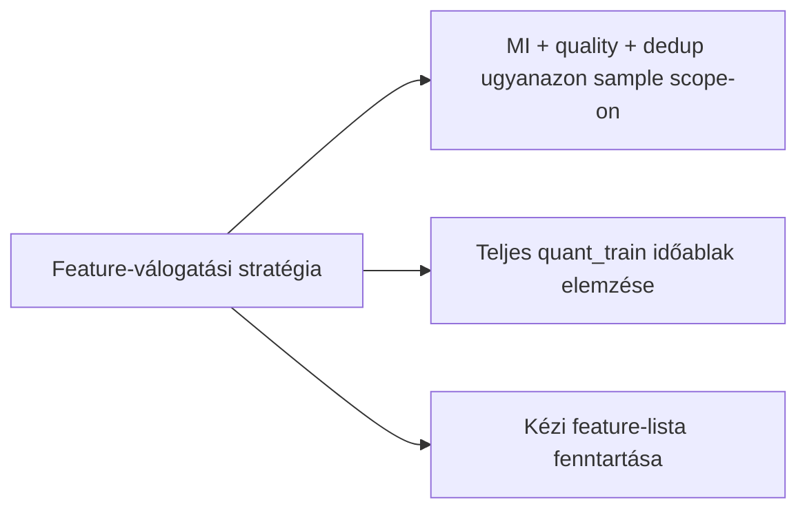
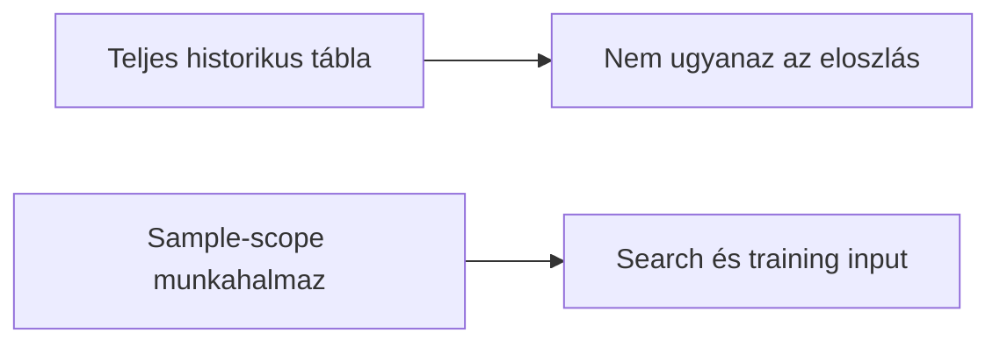
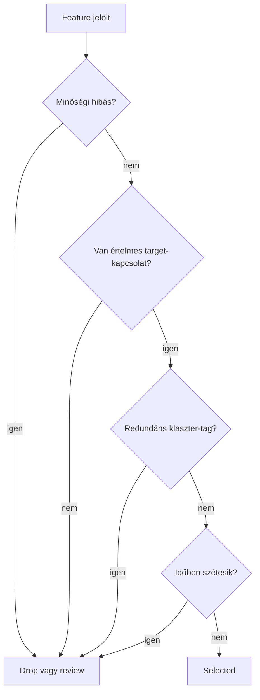
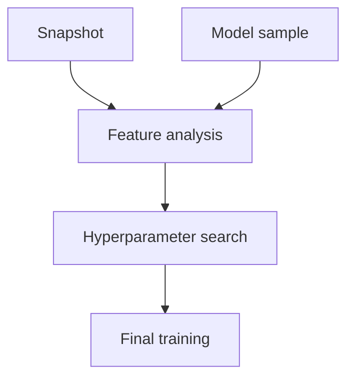

# 2010 - Feature Engineering Analysis

A feature engineering analysis réteg célja nem új feature-ök gyártása, hanem annak eldöntése, hogy a már előállított jelöltek közül melyek maradhatnak bent a modell-specifikus tanítási szerződésben. A kimenet egy reprodukálható feature-lista, amelyet ugyanaz a snapshot- és sample-scope köt meg, mint a későbbi search és training lépést.

## Overview





A módszertani cél itt az, hogy a feature-válogatás ne egy absztrakt, teljes historikus táblán történjen, hanem pontosan azon a sorhalmazon, amelyen a modell később tanulni és validálódni fog.

## Üzleti és módszertani háttér

### Miért kritikus ez a lépés?

Ez a lépés dönti el, hogy a modell mennyi zajt, mennyi redundanciát és mennyi időben széteső mintázatot visz tovább a search és a final fit felé. Ha a feature-szűrés túl laza, a modell instabil és nehezen auditálható lesz. Ha túl agresszív, akkor értékes prediktív jel tűnik el még a search előtt.

Különösen fontos, hogy az elemzés ugyanazon sample-scope-on fusson, mint a downstream pipeline. Ha a feature-döntés más sorhalmazon születik, mint amin a modell később ténylegesen tanul, akkor a feature-set nem ugyanarra a valószínűségi környezetre optimalizál.

### Miért ezt a megközelítést?

| Megközelítés | Előny | Hátrány | Státusz |
|--------------|-------|---------|---------|
| Háromdimenziós szűrés: quality + MI + korrelációs dedup | Nem-lineáris kapcsolatot is kap el (MI); nincs false negative a volatilitás-feature-öknél; egy notebookba koncentrálva | Stabilitás-drift nincs külön mérve | ✅ Választott |
| Korábban: quality + Spearman + Pearson-redundancy + stability | Stabilitás-drift is mérve | Stability false negative: az összes volatilitás feature REVIEW-ba kerül (vol clustering miatt) | ❌ Elvetett — szisztematikus false negative |
| Teljes historikus időablakra futtatott általános feature-audit | Egyszerűbb, nagyobb elemszám | Nem ugyanazon scope-on dönt, mint amin a modell tanul | Elvetett |
| Kézi, statikus feature-whitelist | Könnyen kommunikálható | Nem reagál adatdriftre és új feature-csoportokra | Elvetett |
| Csak modellalapú fontosság szerinti utólagos szelekció | Közelebb van a végső objective-hez | A zajos vagy szivárgó feature már a searchöt is torzíthatja | Fontolóra vehető kiegészítő lépésként |



### Négydimenziós feature-döntés: miért kell és hogyan működik?

A feature bent maradása nem egyetlen mérőszámon múlik. Más kérdés, hogy egy oszlop technikailag használható-e, más, hogy hordoz-e jelet, más, hogy csak egy másik oszlop másolata-e, és megint más, hogy időben stabil marad-e.



**Szabály:** feature csak akkor maradhat a végső listában, ha mind a négy nézőpontból átmegy a minimális minőségi küszöbön.

### Sample-scope konzisztencia: miért kell és hogyan működik?

A feature engineering nem pusztán a snapshotból olvas, hanem a snapshot és a modellhez tartozó sample metszetén dolgozik. Ez biztosítja, hogy a feature-döntések ugyanarra a fejlesztési scope-ra érvényesek, amelyet a sampling már kijelölt.



**Szabály:** a feature-lista nem általános domain-lista, hanem modell-scope szerződés.

### Paraméter alapértékek és indoklásuk

| Paraméter | Alapérték | Indoklás |
|-----------|-----------|----------|
| `max_null_rate` | `0.01` | Egy feature ne maradjon bent, ha a minta érzékelhető részén hiányos; 1% fölött már könnyen műtermékké válik a jel |
| `max_inf_rate` | `0.001` | A végtelen érték tipikusan számítási vagy normalizációs hiba jele; ennek toleranciája a null-rate-nél is szigorúbb |
| `min_variance` | `1e-8` | Közel konstans feature ne foglaljon helyet a modellben és ne terhelje a searchöt |
| `MI_THRESHOLD` | `0.001` | Ez alatt a feature statisztikailag független a targettől; LightGBM számára zaj, nem jel. Az MI k-NN alapú, nemlineáris összefüggéseket is kap el — false negative-ek száma sokkal kisebb, mint Spearman-nál |
| `CORR_THRESHOLD` | `0.98` | E fölötti Pearson-korreláció esetén a két feature csoporton belül szinte azonos információt hordoz; a kisebb MI-jű tagot eltávolítjuk |

### Miért nem kell stabilitás lépés?

A korábban alkalmazott per-90-napos-bucket Spearman-drift elemzés szisztematikusan false negative-eket produkált:

- **Vol clustering:** A volatilitás-feature-ök (`returns_std_14`, `hml_range`, `bb_width_*` stb.) rezsimfüggők — de ez nem hiba, hanem szándékos. Nagy múltbeli volatilitás → nagy jövőbeli volatilitás → nagyobb MFE. Ez a mintázat rezsimváltásoknál driftként jelent meg, holott valójában az info tartalma érvényes maradt.
- **MI-ötszöröse:** A stability szűrés REVIEW-ba tette az MI-ben legjobb feature-öket (MI ≈ 0.09–0.10), miközben valóban gyenge feature-ök (MI ≈ 0) SELECTED-ben maradtak.
- **Stabilitásra a search/fit megfelel:** A cross-validation foldok időben szét vannak választva — a hyperparameter search automatikusan büntet instabil feature-t. Külön stabilitási pre-szűrő ezért redundáns.

### Ismert kockázatok és korlátok

| Kockázat | Tünet | Mitigáció |
|----------|-------|-----------|
| Túl agresszív szűrés | A search gyenge eredményeket ad, kevés feature marad | MI_THRESHOLD csökkentése (0.0005-re) és notebook újrafuttatás |
| Túl laza szűrés | Instabil fold-metrikák, redundáns feature-csomagok | CORR_THRESHOLD csökkentése; post-hoc SHAP-alapú pruning |
| Scope-eltérés a samplinghez képest | A feature-set más sorhalmazon születik, mint amin a modell tanul | Sample-scope materializáció kötelező |
| Rejtett leakage | Extrém IV/MI vagy túl jó validációs eredmény | IV-spike keresés + upstream feature audit |
| Rezsimváltás elveszti a best feature-t | Live deploy-on a volatilitás-feature-ök veszítenek MI-ből | Periodikus re-run; ha MI < 0.01, újraértékelés |

### Validációs checklist

- [ ] A feature analysis ugyanazon snapshot- és sample-scope-on futott, mint a későbbi search.
- [ ] A végső lista nem tartalmaz olyan oszlopot, amely quality okból drop státuszt kapott.
- [ ] A bent maradó feature-ek között nincs 0.98 feletti csoporton belüli Pearson-korreláció.
- [ ] Nincs 0 MI-jű feature a selected listában.
- [ ] A feature-lista reprodukálható ugyanazzal a snapshot-, sample- és threshold-konfigurációval.
- [ ] `run_gain_rank()` lefutott és `feature_set.json["gain_ranked"]` friss (a selected lista alapján).

---

## Gain rank: search input feature-sorrend

A feature engineering kimenete (`selected` lista) a joint search bemenete, de a
joint search-hez egy **gain fontossági sorrend** is szükséges, amelyet a `run_gain_rank()`
állít elő.

```mermaid
flowchart LR
  SEL[feature_set.json: selected]
  GAIN[run_gain_rank\ncolsample_bytree=1.0 fit]
  RANKED[gain_ranked — gain fontosság szerint\ncsökkenő sorrend]
  SEARCH[joint search\nfeature_k[:k] per trial]

  SEL --> GAIN --> RANKED --> SEARCH
```

**Miért kell a gain rank a search előtt?**

A joint search `feature_k` Optuna paraméterként keresi az optimális feature-számot.
A rangsor biztosítja, hogy kis `feature_k`-nál az optimizer mindig a legfontosabbnak
ítélt feature-öket kapja — ez jobb prior, mint a véletlen sorrend.

**Mikor kell újrafuttatni?**

- Ha a `selected` lista megváltozik (MI/quality re-run után).
- Ha a snapshot vagy a sample scope megváltozik.
- Új modell esetén mindig a saját scope-jával futtatandó.

A gain rank eredménye a `feature_set.json["gain_ranked"]` kulcsban tárolódik.
A `run_prune()` lépés utólag eltávolítja a keresett K-n belüli nulla-split
feature-öket, és az eredmény `pruned_joint` (vagy `pruned_<search_tag>`) kulcson
kerül tárolásra — ez az aktív modell tényleges feature listája.

Részletes leírás: → `_doc_/methodology_doc/5500_hyper_param_search.md`
