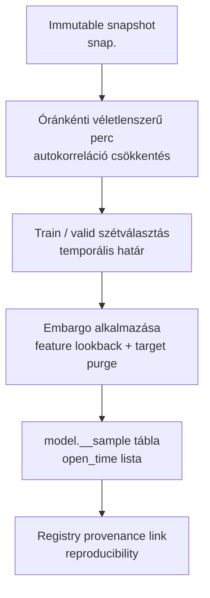
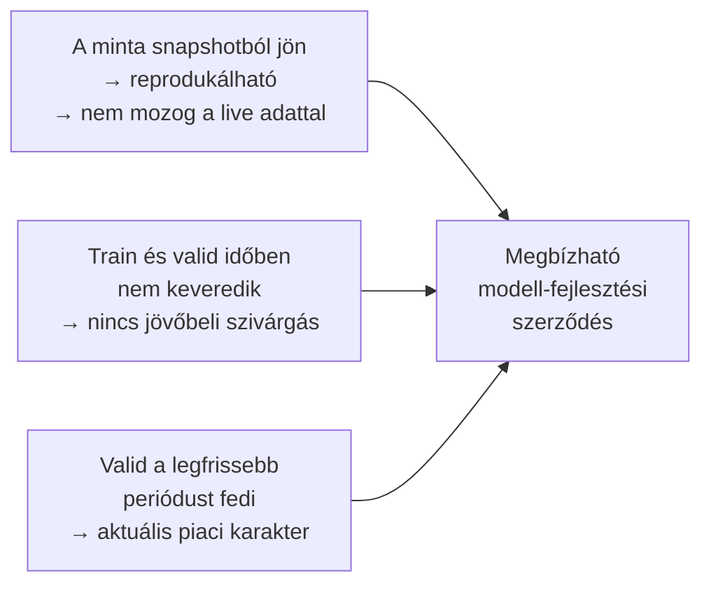
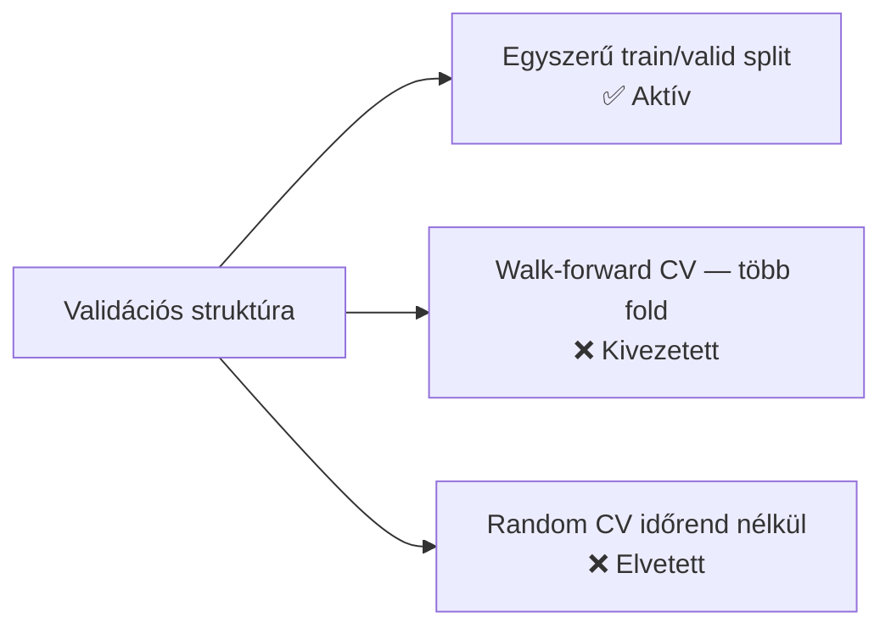
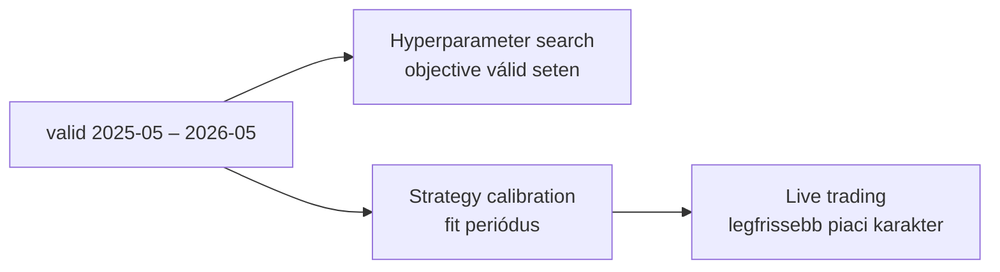
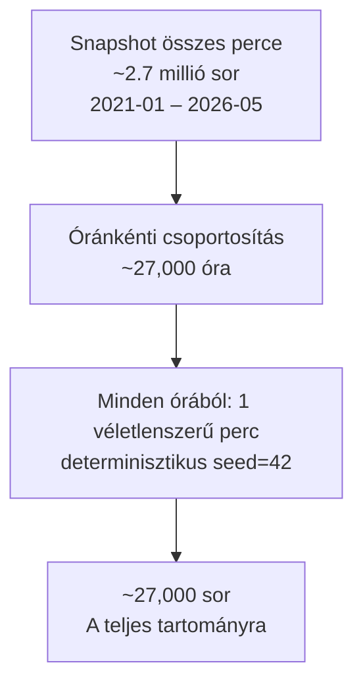
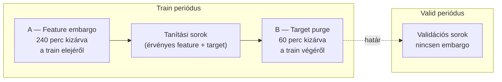
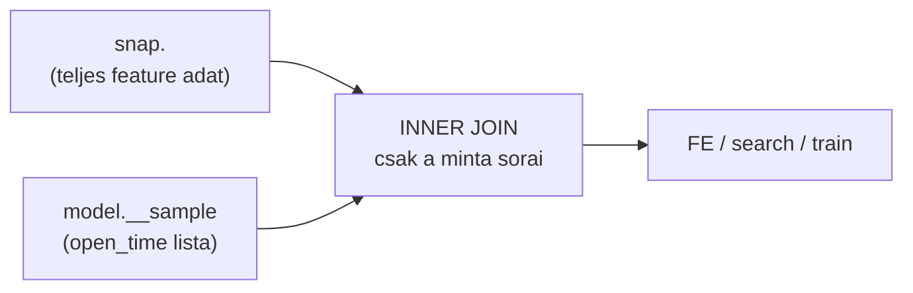

# 3000 — Sampling (Train/Valid Split)

## Overview

A sampling lépés feladata, hogy egy immutable snapshotból reprodukálható, modell-specifikus mintát készítsen, és pontosan definiálja azt az időbeli szerződést, amelyen a hyperparameter search és a modell tanul.



**Aktív champion modell időbeli elrendezése:**

```
2021-01                              2025-04  2025-05            2026-05
  │                                       │        │                  │
  │◄──────────── TRAIN (51 hónap) ───────►│        │◄── VALID (12 hó)─►│
  │                                       │        │                  │
  ├─ embargo (240 perc)            purge ─┤        │ (nincs embargo)  │
     feature lookback          (60 perc)
     teljességi garancia       target ablak
```

---

## Üzleti és módszertani háttér

### Miért kritikus ez a lépés?

A sampling az a pont, ahol eldől, hogy a modell milyen időbeli szerződés szerint látja a piacot. Ha a mintavétel helytelen, a search és a training már egy hamis világban dolgozik — még ha minden más lépés helyes is.

Három feltételnek kell egyszerre teljesülnie:



### Miért fix split és nem walk-forward cross-validation?



| Megközelítés | Előny | Hátrány | Státusz |
|---|---|---|---|
| **Egyszerű train/valid split** | Átlátható, a valid a legfrissebb periódus, nincs fold-logika | A search közvetlenül a valid seten optimalizál | ✅ Aktív |
| Walk-forward CV (4 fold) | Több validációs ablak → robusztusabb becslés | Implementációs hiba: train mask nem tartalmazott felső időhatárt → minden fold train-je látta az összes többi fold valid periódusát | ❌ Kivezetett |
| Random CV időrendi szabály nélkül | Egyszerű, ismert | Idősoron súlyos adatszivárgás, production-tól eltérő validáció | ❌ Elvetett |

**A walk-forward kivezetés részlete:** Az audit során derült ki, hogy a `_fold_split_walk_forward` függvényben a train mask nem tartalmazott felső időhatárt. Ennek következtében minden fold train-je látta az összes többi fold valid periódusát is — jövőbeli adaton tanult. A hiba javítható lett volna, de az egyszerű split a jelenlegi projekt céljaihoz jobban illeszkedik: nem több időszak robusztusságát vizsgáljuk, hanem a legfrissebb piaci rezsimre keressük a legjobb paramétereket.

### Miért ez a train/valid határvonal?



A valid pontosan az a 12 hónapos ablak, amelyet a strategy calibráció is használ majd. Ez szándékos összhang: a hyperparameter search ugyanazon a perióduson optimalizál, amelyen a belépési küszöbök és a kalibrációs görbék is épülnek. Az élő kereskedés a legfrissebb piaci karaktert feltételezi — a 2025-2026-os valid ezt képezi le.

### Miért óránkénti véletlenszerű mintavétel?

Az 1 perces OHLCV és a rá épülő feature-ök erősen autokorreláltak. Ha minden percet beengednénk, a modell sok majdnem azonos helyzetet látna, a validációs metrikák torzítottak lennének, és a search lassabb volna.



Az óránkénti egy perc erősen csökkenti az autocorrelációt, miközben megőrzi az intraday időszerkezetet. A kiválasztás tartalom- és időbélyeg-alapú, nem input-sorrend-függő — ugyanaz a snapshot + seed bitazonos mintát ad.

### Embargo — az adatminőségi és szivárgásvédelmi szegmentálás



**A — Train eleje: feature lookback embargo (240 perc)**

A snapshot legelső percei mögött nincs elegendő historikus adat a hosszabb feature-ök kiszámításához. Ezek a sorok hiányos vagy hamis feature-értékeket tartalmaznak (warmup nullák). Kizárásuk nem adatszivárgás elleni védelem, hanem adatminőségi szűrés.

**B — Train vége: target purge (60 perc)**

A `fw60` target a következő 60 perc legmagasabb/legalacsonyabb árát méri. A train utolsó 60 percének target értéke tehát már a valid periódus price action-jéből számítódik. Ha ezek a sorok bent maradnak, a modell olyan célváltozót lát, amelyet a valid periódus befolyásolt — ez adatszivárgás.

**C — Valid eleje: nincs embargo**

A valid első sorainak feature-jei visszanéznek a train periódusra — ez helyes és elvárt. A feature-ök mindig historikus adatot használnak; a valid sorok feature-számítása nem jelent szivárgást.

### A `model.__sample` tábla mint modell-szintű szerződés

A `model.__sample` tábla nem egyszerű adatritkítás. Ez a tábla definiálja a modell fejlesztési scope-ját: minden downstream lépésnek (feature engineering, search, train) pontosan ezekre a sorokra kell épülnie.



Az INNER JOIN kötelező — ha bármely downstream lépés időablakos szűréssel dolgozna (MIN/MAX open_time alapján), olyan perceket is beengedne, amelyeket a sampling szándékosan kihagyott. Ez megbontaná a sampling → search → train lánc integritását.

### Paraméter alapértékek és indoklásuk

| Paraméter | Alapérték | Indoklás |
|---|---|---|
| `train_start` | `2021-01-01` | Elegendő historikus tartomány; különböző volatilitási és trend rezsimek képviselve |
| `train_end` | `2025-04-30` | A valid (kalibráció) 2025-05-től indul; egységes határvonal |
| `valid_start` | `2025-05-01` | Legfrissebb 12 hónapos ablak; egybeesik a strategy calibráció időszakával |
| `valid_end` | `2026-05-31` | A jelenleg elérhető adat vége |
| `seed` | `42` | Determinisztikus mintavétel; reprodukálható minta |
| `feature_lookback_embargo_minutes` | `240` | Konzervatív puffer a leghosszabb feature lookback ablak (1441 bar) felett |
| `target_purge_minutes` | `60` | Pontosan a `fw60` target horizon; train utolsó 60 perce kizárva |
| `sampling_unit` | óránként 1 véletlenszerű perc | Autocorreláció csökkentése, intraday szerkezet megőrzése |

### Ismert kockázatok és korlátok

| Kockázat | Tünet | Mitigáció |
|---|---|---|
| Valid set overfitting a search során | A kiválasztott paraméterek a 2025-2026 periódusra túloptimalizáltak | Korlátozott trial-szám (100); patience-alapú early stopping; train/valid metrika párhuzamos figyelése |
| Rezsimváltás a valid periódusban | A valid 12 hónap nem homogén piaci karakter | A strategy calibráció és a live trading is ugyanezt az időszakot használja — a kockázat szimmetrikus |
| Purge mérete változik ha fw változik | Ha a target horizon megváltozik, a 60 perces purge elavul | A purge mindig a target horizon-nal szinkronizált konfigurációs érték |
| Snapshotcsere | Azonos model_id mögött más adatverzió | Registry link és manifest provenance kötelező |
| Feature lookback bővülése | Ha új, hosszabb feature kerül be, a 240 perces embargo kevés | Embargo mérete config-ban állítható; feature audit kötelező új feature hozzáadásakor |

### Validációs checklist

- [ ] A minta forrása `snap.<snapshot_id>`, nem a mutable live tábla
- [ ] A train és valid határvonal pontosan 2025-04-30 / 2025-05-01
- [ ] Az első 240 perc kizárva a train mintából (feature lookback embargo)
- [ ] A train utolsó 60 perce kizárva (target purge)
- [ ] A valid elején nincs külön embargo alkalmazva
- [ ] Ugyanaz a snapshot + seed újrafuttatva bitazonos mintát ad
- [ ] A downstream lépések (FE, search, train) INNER JOIN-on mennek a sample táblával
- [ ] A minta registry-ben visszaköthető a snapshothoz és a modellhez
