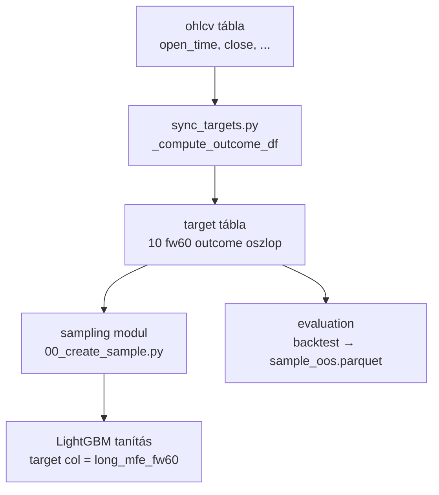
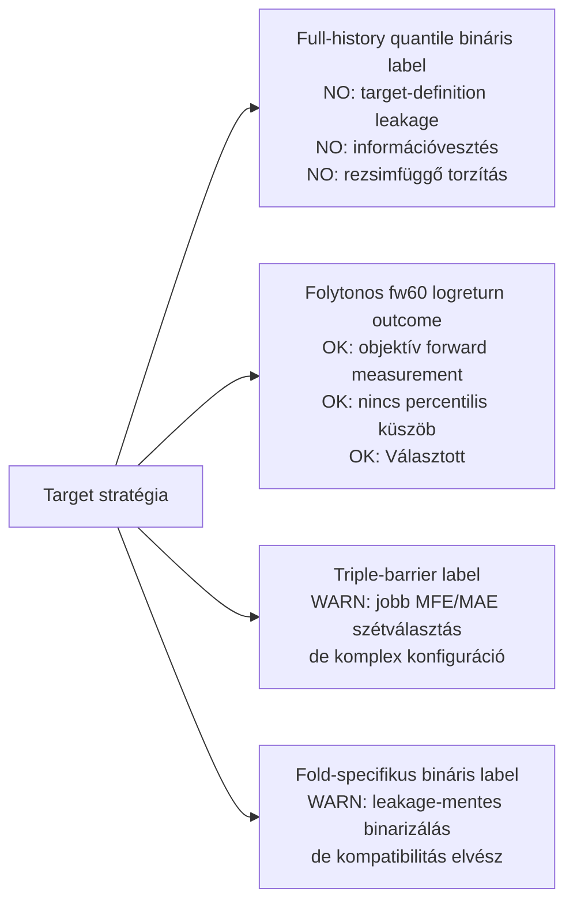
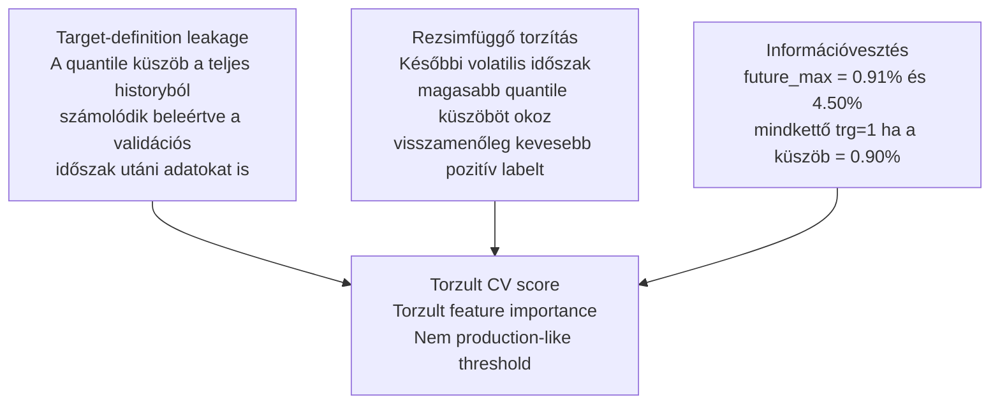
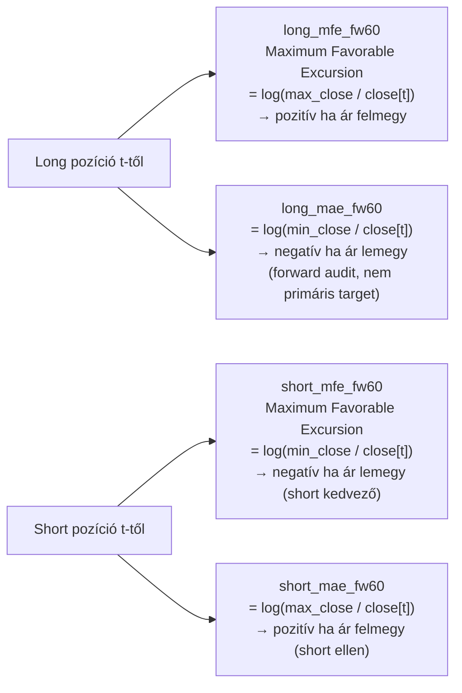
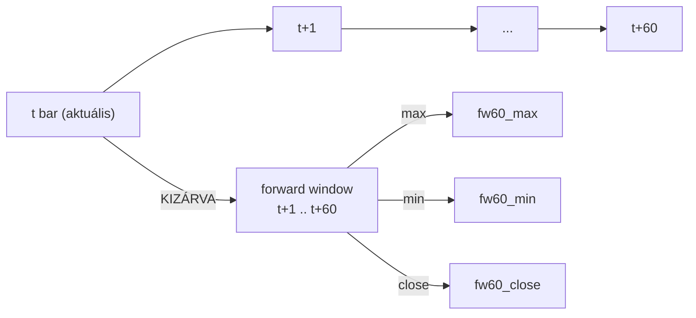

# 3000 — Target Layer

A target layer a ChronoQuant ML pipeline label-rétege: a `target` DuckDB tábla tárolja az objektív forward outcome-okat, amelyek alapján a modellek taníthatók és értékelhetők.

---

## Overview

A target layer az `ohlcv` nyers árból számított, jövőbe tekintő (forward-looking) outcome oszlopokból áll. Ezek nem feature-ök — a modell inputjaként soha nem kerülhetnek felhasználásra, kizárólag tanítási label-ként és evaluation benchmark-ként.



**Aktív target oszlopok:** `long_mfe_fw60`, `short_mfe_fw60` — 60-perces forward logreturn outcome-ok.

**Implementáció:** [`src/data_handling/sync_tables/sync_targets.py`](src/data_handling/sync_tables/sync_targets.py)
**Kód referencia:** [`_doc_/3100_sync_targets.md`](../database_and_code_doc/3100_sync_targets.md)

---

## Target Oszlopok

| Oszlop | Típus | Definíció | Szerep |
|--------|-------|-----------|--------|
| `close` | DOUBLE | close[t] — referencia close | kontextus |
| `fw60_close` | DOUBLE | close[t+60] — nyers forward close | auxiliary |
| `fw60_max` | DOUBLE | max(close[t+1:t+60]) | auxiliary |
| `fw60_min` | DOUBLE | min(close[t+1:t+60]) | auxiliary |
| `fw60_close_ret` | DOUBLE | close[t+60] / close[t] − 1 | auxiliary |
| `fw60_close_logret` | DOUBLE | log(close[t+60] / close[t]) | auxiliary |
| `fw60_max_ratio` | DOUBLE | max(close[t+1:t+60]) / close[t] | auxiliary |
| `fw60_min_ratio` | DOUBLE | min(close[t+1:t+60]) / close[t] | auxiliary |
| **`long_mfe_fw60`** | **DOUBLE** | **log(max(close[t+1:t+60]) / close[t])** | **LONG TARGET** |
| **`short_mfe_fw60`** | **DOUBLE** | **log(min(close[t+1:t+60]) / close[t])** | **SHORT TARGET** |

Az utolsó **60 sor** minden outcome oszlopban `NULL` — nincs elegendő jövőbeli adat a teljes horizont kiszámításához.

---

## Üzleti és módszertani háttér

### Miért kritikus ez a lépés?

A target layer dönti el, hogy a modell **mit tanul meg előrejelezni**. Ha a target definíció torz (pl. jövőbeli eloszlásból vett küszöb éget bele a múltbeli labelbe), a cross-validation score nem tükrözi a valós produkciós teljesítményt. Ha a forward window helytelen (pl. az aktuális bar beleszámít), az in-sample performance irreálisan magas lesz.

A target layer ezért alapvetően meghatározza a modell megbízhatóságát és az eredmények interpretálhatóságát.

### Miért ezt a megközelítést?



| Megközelítés | Előny | Hátrány | Státusz |
|---|---|---|---|
| Folytonos fw60 logreturn (jelenlegi) | Nincs percentilis-torzítás, magnitude megmarad, flexibilis | Regresszor szükséges, binary baseline elvész | ✅ Választott (epic-011) |
| Full-history quantile bináris | Egyszerű classifier, stabil threshold | Target-definition leakage, rezsimfüggő torzítás, információvesztés | ❌ Eltávolítva — legacy |
| Fold-specifikus quantile bináris | Leakage-mentes binarizálás | Minden foldban különböző label → összehasonlíthatatlan metrikák | ⚠️ Fontolóra vehető derived label-ként |
| Triple-barrier | MFE + MAE egyszerre kezel, stop-loss implicit | Konfiguráció érzékeny, training instabilabb | ⚠️ Jövőbeli kísérlethez |
| Quantile regression target | Tail opportunity fókusz | Nem standard loss, nehezebben interpretálható | ⚠️ Objektív altarget |

### Miért váltottunk binárisról folytonos targetre?

A korábbi rendszerben (`epic-011` előtt) két bináris label létezett:

```
trg_long = (future_max_return >= teljes history quantile küszöb)
trg_short = (future_min_return <= teljes history quantile küszöb)
```

Ez három strukturális problémát okozott:



**Target-definition leakage:** Ha a quantile küszöb a teljes 2025–2026-os historyból számolódik, akkor a 2025 Q2 validációs fold targetjei már 2026-os eloszlásinformációt tartalmaznak a label definíciójában. Ez nem klasszikus feature leakage, hanem *target-definition leakage*.

**Megoldás:** Objektív, küszöb-mentes forward outcome — `log(future_max / close[t])`. Az outcome a tényleges piacmozgást méri, percentilis policy és binarizálás nélkül.

### MFE és MAE: miért kell és hogyan működik?



- `long_mfe_fw60` **pozitív** → az ár felfelé ment → long kedvező
- `short_mfe_fw60` **negatív** → az ár lefelé ment → short kedvező
- `long_mae_fw60` = `short_mfe_fw60` (azonos numerikus érték, ellentétes szemantika)

**Szabály:** A modell `long_mfe_fw60` targetre tanul; a `short_mfe_fw60` a másik modellé. A MAE értékek nem elsődleges targetok, de az evaluation és adverse move audit során kötelezően ellenőrizendők.

### Forward window szemantika: miért zárjuk ki az aktuális bart?



SQL invariáns: `ROWS BETWEEN 1 FOLLOWING AND 60 FOLLOWING`

Az aktuális bar (`t`) kizárása azért kötelező, mert a predikció a `t` bar zárásakor készül — a `t+1` bar nyitásán kerül végrehajtásra. Ha `t` benne lenne a forward ablakban, az outcome egy részben már ismert értéket tükrözne.

**NULL tail:** Az utolsó 60 sor minden outcome oszlopban `NULL` — nincs 60 jövőbeli bar. **Soha ne impute-old `0`-ra** — a null sor nem megfigyelt, nem negatív esemény.

### Logreturn vs. simple return: miért logaritmikus?

| Mérőszám | Képlet | Jellemző |
|---|---|---|
| Simple return | (max − close) / close | Aszimmetrikus: +10% és −10% nem összehasonlítható |
| Logreturn | log(max / close) | Additív, szimmetrikus; kis értékeknél ≈ simple return |

A logreturn additív természete lehetővé teszi, hogy multi-period outlookokat összeadással aggregáljuk, és a long/short side értékei közvetlenül összehasonlíthatók. Kis moves esetén (<2%) a két mérőszám numerikusan közel esik egymáshoz, tehát a váltás nem rontja az értelmezhetőséget.

### Paraméter alapértékek és indoklásuk

| Paraméter | Érték | Indoklás |
|---|---|---|
| Forward horizon | `60` bar | 60 perces opportunity ablak; egyezik a trading stratégia max hold time felfogásával |
| Window logika | `t+1..t+60` | Aktuális bar kizárva; forward window pontosan 60 ismert future bar |
| NULL küszöb | `fw_bar_count >= 60` | Csak teljes forward ablakkal rendelkező sorok kapnak értéket |
| Logreturn alap | természetes logaritmus (`LN`) | DuckDB `LN()` — szimmetrikus, additív |
| Elsődleges long target | `long_mfe_fw60` | MFE = maximum favorable excursion — a legjobb elérhető long opportunity |
| Elsődleges short target | `short_mfe_fw60` | MFE short oldalon = log(min/close) — a legjobb elérhető short opportunity |
| Rebuild policy | teljes DELETE+INSERT | Minden `sync_targets()` hívás teljes újraszámítást végez — idempotens |

### Ismert kockázatok és korlátok

| Kockázat | Tünet | Mitigáció |
|---|---|---|
| NULL tail torzítás | Ha a sampling elszedi az utolsó 60 sort és `0`-ra imputálja, a modell hamis negatívokat lát | `audit_feature_table()` ellenőrzi; null sorok droppolva a dataset loaderben |
| Rezsimváltás eltérő target eloszlást okoz | Alacsony volatilitású periódusban a `long_mfe_fw60` p90 kisebb mint magas volatilitású periódusban | Expanding window CV kezeli; az expanding train hatókör követi a rezsimeket |
| `fw60_max` és `fw60_min` szimmetriája | A két outcome ugyanazon a skálán van, de long és short értelmezésük ellentétes | Dokumentált szimmetria: `long_mae_fw60` numerikusan = `short_mfe_fw60` |
| Kis log value értelmezése | `long_mfe_fw60 = 0.003` → `exp(0.003) − 1 ≈ 0.30%` — konfúzió a magnitude körül | Model card-on és reporting-ban mindig % formában is feltüntetni |
| Legacy target referencia örökség | Régi docs a bináris `trg_*` targetekre hivatkoznak | Elavultként kezelni; ground truth: `_doc_/3100_sync_targets.md` és a forráskód |

### Validációs checklist

- [ ] A `target` tábla utolsó 60 sora minden fw60 outcome oszlopban `NULL`
- [ ] `ROWS BETWEEN 1 FOLLOWING AND 60 FOLLOWING` — az aktuális bar (`t`) nem szerepel a forward ablakban
- [ ] `long_mfe_fw60` = `log(fw60_max / close)` — numerikusan ellenőrzött determinisztikus teszttel
- [ ] `short_mfe_fw60` = `log(fw60_min / close)` — numerikusan ellenőrzött determinisztikus teszttel
- [ ] `long_mfe_fw60` és `short_mfe_fw60` csak DOUBLE `NULL`, soha `0.0` — nem impute-olt
- [ ] A `target` tábla nem tartalmaz legacy `trg_*` bináris oszlopot
- [ ] `sync_targets()` teljes futás után: `computed_from`, `computed_to`, `computed_at` frissítve a `solusdt.json` metaadatban
- [ ] Dataset loader: null target sorok droppolva (`dropna` a target col alapján) — nincs `0` imputation
