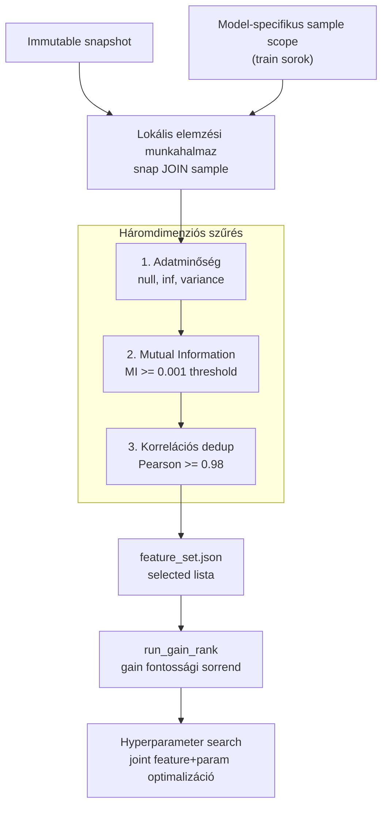
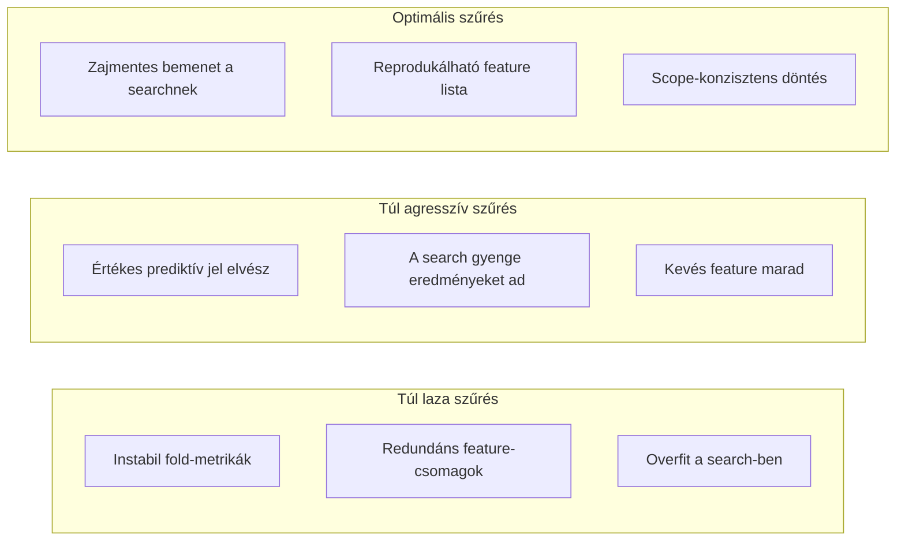
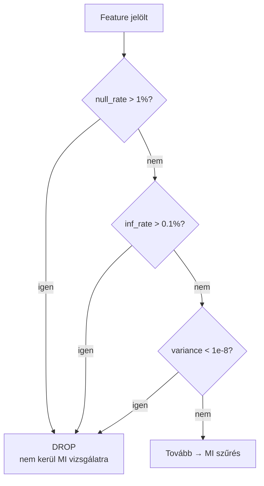
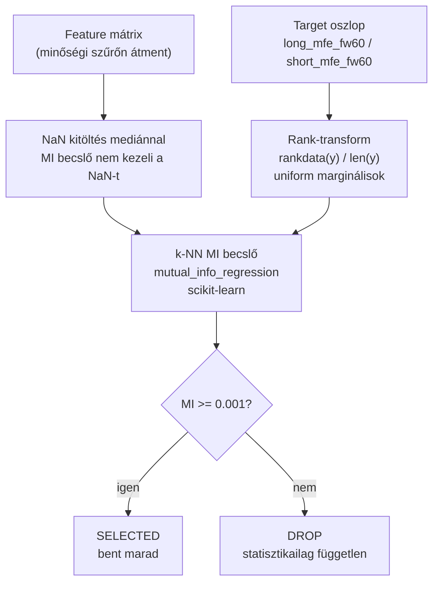
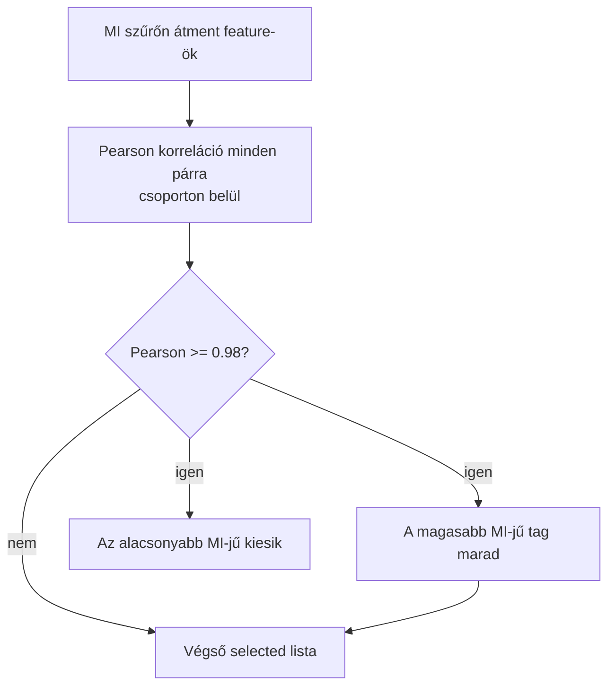
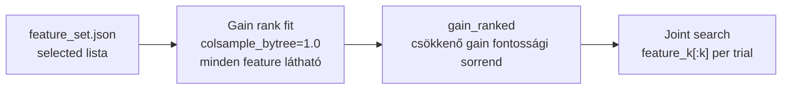

# 4000 — Feature Engineering

## Overview

A feature engineering a ChronoQuant pipeline-ban nem új feature-ök gyártását jelenti, hanem **feature szelekcióit**: eldönti, hogy a ~202 jelölt közül melyek kerülnek be a modell tanításába. A döntés a sample-scope-on fut — ugyanazon a sorhalmazon, amelyen a downstream search és training is dolgozik.

A feature engineering kimenete: `feature_set.json` — ez a modell tanítási szerződése. Minden downstream lépés (search, training) csak erre a listára épít.

---

## Üzleti és módszertani háttér

### Miért kritikus ez a lépés?

Ez a lépés dönti el, hogy a modell mennyi zajt, mennyi redundanciát és mennyi időben széteső mintázatot visz tovább a search és a final fit felé.

Különösen fontos, hogy az elemzés **ugyanazon sample-scope-on** fusson, mint a downstream pipeline. Ha a feature-döntés más sorhalmazon születik, nem ugyanarra a valószínűségi környezetre optimalizál, ahol a modell ténylegesen tanul.

### Miért ezt a megközelítést?

| Megközelítés | Előny | Hátrány | Státusz |
|---|---|---|---|
| **Quality + MI + korrelációs dedup** | Nemlineáris kapcsolatot is elfog (MI); nincs false negative a volatilitás-feature-öknél; átlátható pipeline | Stabilitás-drift nincs külön mérve | ✅ Választott |
| Quality + Spearman + Pearson + stability | Stabilitás-drift is mérve | Szisztematikus false negative: az összes volatilitás feature REVIEW-ba kerül (vol clustering miatt) | ❌ Elvetett |
| Teljes historikus időablakra futtatott audit | Egyszerűbb, nagyobb elemszám | Nem ugyanazon scope-on dönt, mint amin a modell tanul | ❌ Elvetett |
| Kézi, statikus feature-whitelist | Könnyen kommunikálható | Nem reagál adatdriftre és új feature-csoportokra | ❌ Elvetett |
| Csak modell-alapú fontosság utólag | Közel van a végső objective-hoz | A zajos feature már a searchöt is torzíthatja | Kiegészítő lépésként fontolóra vehető |

### Miért nem kell stabilitás lépés?

A korábban alkalmazott per-90-napos-bucket Spearman-drift elemzés szisztematikusan false negative-eket produkált:

- **Vol clustering false negative:** A volatilitás-feature-ök (`returns_std_14`, `hml_range`, `bb_width_*`) rezsimfüggők — de ez szándékos. Nagy múltbeli volatilitás → nagy jövőbeli volatilitás → nagyobb MFE. Ez a mintázat rezsimváltásoknál driftként jelent meg, holott az információtartalom érvényes maradt. A stability szűrés REVIEW-ba tette az MI-ben legjobb feature-öket (MI ≈ 0.09–0.10), miközben valóban gyenge feature-ök (MI ≈ 0) SELECTED-ben maradtak.
- **A search automatikusan bünteti az instabilitást:** A hyperparameter search cross-validation foldjai időben szét vannak választva. Az instabil feature-ök gyengébb validációs metrikát adnak — a search természetes szelekcióval kiszűri őket. Külön stabilitási pre-szűrő ezért redundáns.

---

## A háromdimenziós szűrési folyamat

### 1. Adatminőség szűrés

Az adatminőségi szűrés az MI számítás előtt fut — felesleges számítás elkerülése és hamis MI értékek megelőzése érdekében.

### 2. Mutual Information szűrés

A rank-transform kötelező a MI számítás előtt — a skewed MFE target nélküle alábecsléshez vezet. Részletes magyarázat: → `4100_mutual_information.md`

### 3. Korrelációs dedup

A korrelációs dedup csoporton belül fut: csak erősen korrelált featurepárok esetén távolítja el a gyengébbet. Az eltávolítás alapja az MI értéke — a jobb prediktív erővel bíró tag marad.

---

## Gain Rank — a search input feature-sorrendje

A feature engineering kimenete (`selected` lista) a joint search bemenete, de a joint search-hez **gain fontossági sorrend** is szükséges.

**Miért kell a gain rank a search előtt?**

A joint search `feature_k` Optuna paraméterként keresi az optimális feature-számot. A gain rangsor biztosítja, hogy kis `feature_k`-nál az optimizer mindig a legfontosabbnak ítélt feature-öket kapja — ez jobb prior, mint a véletlen sorrend.

**Prune lépés:** A best-params-szal fitelt modellnél néhány feature lehet, hogy egyáltalán nem kap split-et — ilyenkor ténylegesen nem használt. A prune lépés ezeket eltávolítja, és a végső `pruned_joint` feature listát a training lépés veszi át.

**Mikor kell újrafuttatni?**

- Ha a `selected` lista megváltozik (MI/quality re-run után)
- Ha a snapshot vagy a sample scope megváltozik
- Új modell esetén mindig a saját scope-jával

---

## Paraméter alapértékek és indoklásuk

| Paraméter | Alapérték | Indoklás |
|---|---|---|
| `max_null_rate` | `0.01` | 1% felett a feature érzékelhetően hiányos; könnyen műtermékké válik a jel |
| `max_inf_rate` | `0.001` | Végtelen érték számítási vagy normalizációs hiba jele; szigorúbb a null-rate-nél |
| `min_variance` | `1e-8` | Közel konstans feature nem hordoz jelet; ne terhelje a searchöt |
| `MI_THRESHOLD` | `0.001` | Ez alatt a feature statisztikailag független a targettől; LightGBM számára zaj |
| `CORR_THRESHOLD` | `0.98` | E fölötti Pearson esetén a két feature szinte azonos információt hordoz |

### Ismert kockázatok és korlátok

| Kockázat | Tünet | Mitigáció |
|---|---|---|
| Túl agresszív szűrés | A search gyenge eredményeket ad, kevés feature marad | MI_THRESHOLD csökkentése (0.0005-re) és újrafuttatás |
| Túl laza szűrés | Instabil fold-metrikák, redundáns feature-csomagok | CORR_THRESHOLD csökkentése; post-hoc SHAP-alapú pruning |
| Scope-eltérés a samplinghez képest | A feature-set más sorhalmazon születik, mint amin a modell tanul | Sample-scope materializáció kötelező — INNER JOIN path |
| Rejtett leakage | Extrém MI vagy túl jó validációs eredmény | IV-spike keresés + upstream feature audit |
| Rezsimváltás elveszíti a legjobb feature-t | Live deploy-on a volatilitás-feature-ök MI-je csökken | Periodikus re-run; ha MI < 0.01, újraértékelés |
| Skewed target rank-transform nélkül | MI szűrés kiszűri a prediktív feature-öket a sűrűsödési zónában | Rank-transform kötelező minden MI hívás előtt — long és short egyaránt |

### Validációs checklist

- [ ] A feature analysis ugyanazon snapshot- és sample-scope-on futott, mint a search
- [ ] A végső lista nem tartalmaz quality okból drop státuszt kapott oszlopot
- [ ] A bent maradó feature-ek között nincs 0.98 feletti csoporton belüli Pearson-korreláció
- [ ] Nincs 0 MI-jű feature a selected listában
- [ ] A feature-lista reprodukálható ugyanazzal a snapshot-, sample- és threshold-konfigurációval
- [ ] `run_gain_rank()` lefutott, `feature_set.json["gain_ranked"]` friss
- [ ] A MI számítás előtt rank-transform alkalmazva a target oszlopra — long és short modelleknél egyaránt
- [ ] Prune lépés lefutott, `pruned_joint` lista elérhető a search után
