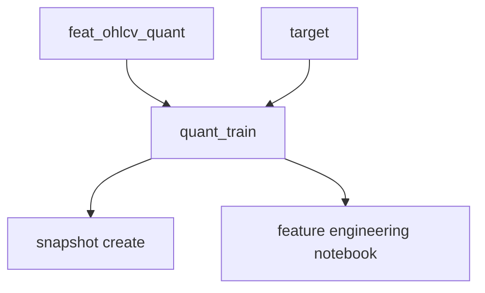
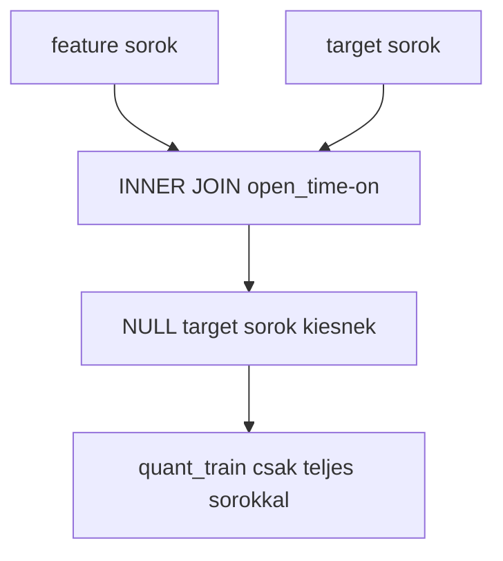
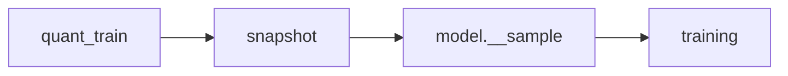

# 4000 - quant_train

A `quant_train` tabla a feature- es targetreteget egyetlen modellezesre alkalmas
nezetbe rendezi. Fontos upstream staging felulet, de az aktiv modellezesi pipeline
mar nem kozvetlenul ezt fogyasztja a sampling, training es predict lepesben.

## Overview

## Uzleti es modszertani hatter

### Miért kritikus ez a lépés?

A `quant_train` biztosítja, hogy a feature- és targetréteg konzisztensen legyen
összeillesztve, és ne kerüljenek be NULL targetes sorok a modellezés előszobájába.
Ha ez a tábla hibás, a rá épülő snapshot és feature engineering is rossz alapot kap.

### Miért ezt a megközelítést?

| Megközelítés | Előny | Hátrány | Státusz |
|--------------|-------|---------|---------|
| Külön materializált `quant_train` staging tábla | Egyértelmű join-pont, könnyebb audit és snapshotképzés | Fenntart egy plusz köztes réteget | Valasztott |
| Minden lépés közvetlenül a feature + target táblából joinol | Kevesebb köztes objektum | Szétszórt, ismétlődő logika | Elvetett |
| A live tábla közvetlen modellezési forrásként | Egyszerűnek tűnik | Gyengébb reprodukálhatóság és nehezebb audit | Elvetett |
| Csak notebook-on-the-fly join | Gyors kísérletezés | Nincs egységes modell-előszoba | Elvetett |

### INNER JOIN + NULL-szűrés: miért kell és hogyan működik?

Ez a logika azt garantálja, hogy a target horizon végén jelentkező ismeretlen sorok
ne csússzanak be sem a snapshotkészítésbe, sem a későbbi elemzésbe.

**Szabály:** a `quant_train` nem tartalmazhat NULL aktív targetet.

### Upstream staging szerep: miért fontos a pontos pozíció?

A korábbi leírások túl erősen úgy kezelték a `quant_train`-t, mintha ez lenne a
végső modellezési input. A jelenlegi kódban ez már csak egy stabil előkészítő réteg:
snapshot innen készül, de a sample, training és predict már a snapshotból dolgozik.

**Szabály:** ha ellentmondás van a régi dokumentáció és a pipeline között, a
snapshot-native útvonal az elsődleges igazság.

### Paraméter alapértékek és indoklásuk

| Paraméter | Alapérték | Indoklás |
|-----------|-----------|----------|
| join kulcs | `open_time` | Az egyetlen közös időbeli azonosító a feature és target réteg között |
| rebuild mód | teljes rebuild alapértelmezésben | Egyszerű, determinisztikus, könnyen auditálható |
| range rebuild | opcionális | Inkrementális karbantartásra használható, de nem ez a fő kutatási út |
| target oszlopok | aktív MFE céloszlopok | A feature engineering ezekkel dolgozik együtt |

### Ismert kockázatok és korlátok

| Kockázat | Tünet | Mitigáció |
|----------|-------|-----------|
| Dokumentációs félreértés | A `quant_train`-t végső training source-nak írják le | A modell-domainben explicit jelölni kell az upstream szerepet |
| Schema drift | Új feature megjelenik, de a staging nem frissül | Rebuild és staging audit |
| Stale staging | Régi adathatárral készül snapshot | Snapshot előtt build és határellenőrzés |
| Duplikált open_time | Inkonzisztens join és hibás snapshot | Validációs ellenőrzések a staging táblára |

### Validációs checklist

- [ ] A `quant_train` a feature és target réteg INNER JOIN-jából épül.
- [ ] Az aktív target oszlopok nem tartalmaznak NULL értéket.
- [ ] A staging táblában az `open_time` egyedi és rendezett.
- [ ] A snapshotképzés mindig a frissített `quant_train`-re épül.
- [ ] A dokumentáció egyértelműen upstream stagingként kezeli, nem végső modellezési inputként.
