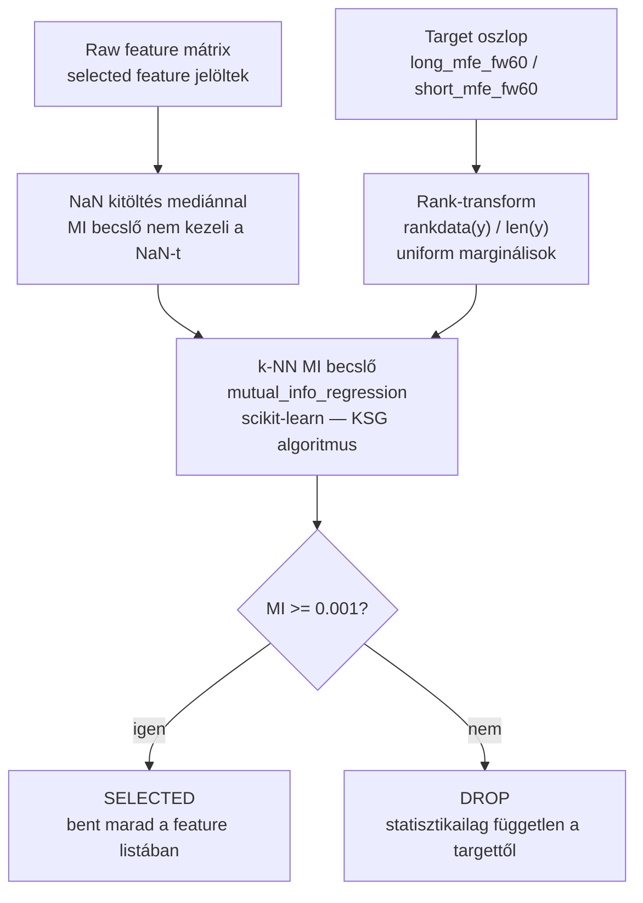
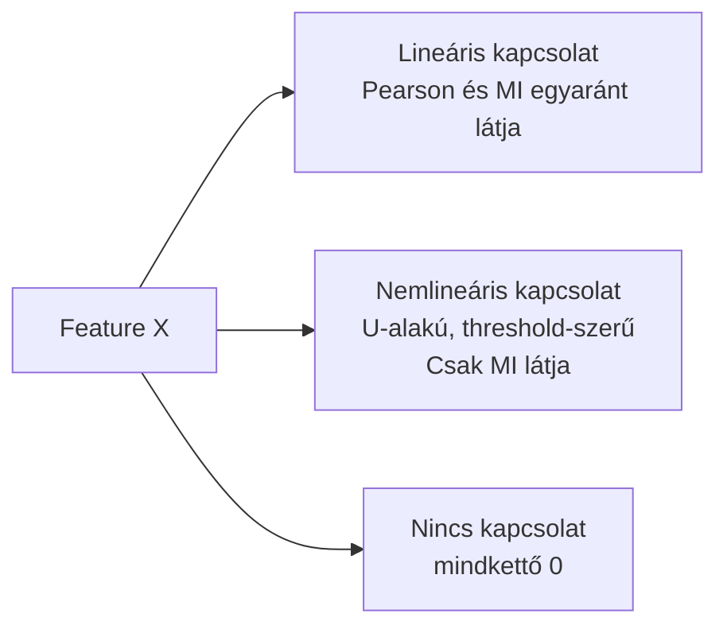
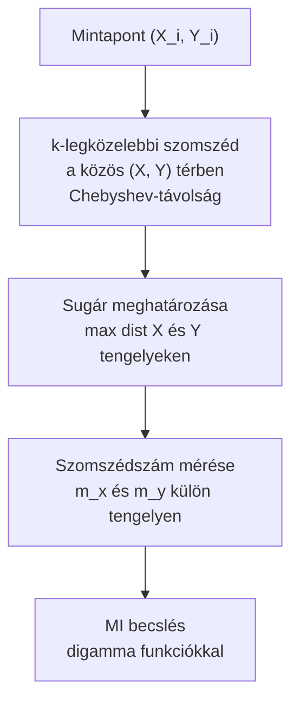
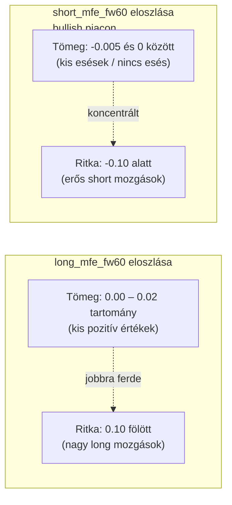
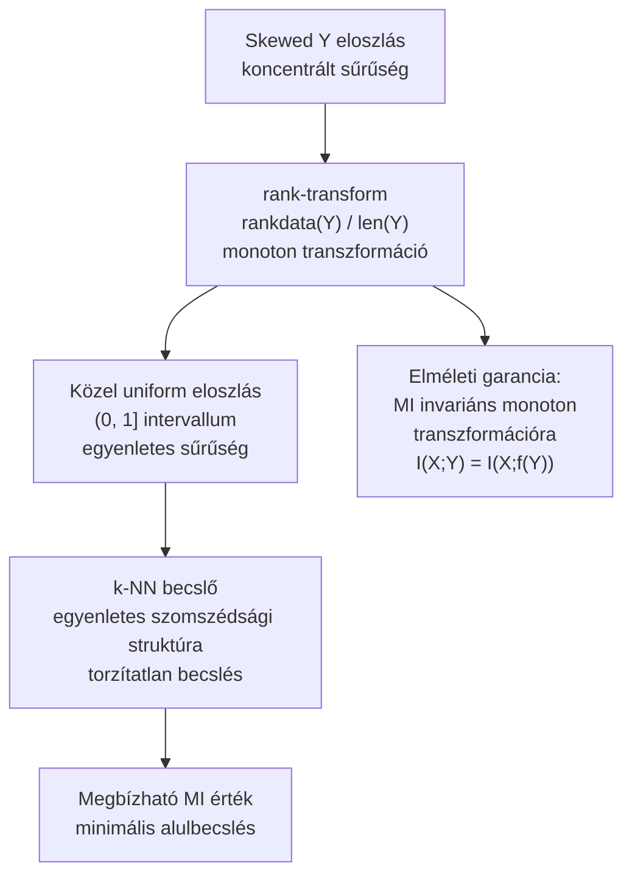

# 4100 — Mutual Information Alapú Feature Szelekció

## Overview

A Mutual Information (MI) azt méri, hogy mennyi információt hordoz egy feature a targetről — lineáris és nemlineáris összefüggésekben egyaránt. A ChronoQuant pipeline-ban a MI a feature szelekció elsődleges statisztikai kapuja: az MI_THRESHOLD (0.001) alatti feature-ök kiszűrésre kerülnek.



Szülő kontextus: → `4000_feature_engineering.md`

---

## Mi a Mutual Information és miért méri jobban az összefüggést?

A Mutual Information két változó statisztikai függetlenségétől való eltérését méri. Intuitívan: az MI azt mondja meg, mennyit csökken az Y bizonytalansága, ha X értékét ismerjük.

A Pearson-korreláció csak lineáris kapcsolatot mér — ha nincs monoton összefüggés, a korreláció 0 marad, akkor is, ha erős nemlineáris kapcsolat áll fenn. Az MI ezzel szemben bármilyen statisztikai összefüggést elvileg el tud fogni.



| Összefüggés típusa | Pearson | MI | Következmény |
|---|---|---|---|
| Lineáris: Y = aX + b | >0 | >0 | Mindkettő elfogja |
| Kvadratikus: Y = X² | 0 | >0 | Pearson tévesen 0-t ad |
| XOR kapcsolat (bináris) | 0 | log 2 | Pearson tévesen 0-t ad |
| Kör alakú pontfelhő | 0 | >0 | Pearson tévesen 0-t ad |
| Threshold-szerű: Y=0 ha X<k, Y=X−k ha X≥k | kis érték | >0 | Pearson alábecsüli |
| Nincs kapcsolat | 0 | ≈0 | Helyes |

**Szabály:** Ha az MI 0 vagy a MI_THRESHOLD küszöb alatt van, a feature statisztikailag redundáns a targettel szemben — kiszűrjük.

---

## A k-NN MI becslő (KSG algoritmus) és eloszlásérzékenysége

Folytonos változók esetén az MI-t közelíteni kell. A scikit-learn `mutual_info_regression` a Kraskov-Stögbauer-Grassberger (KSG) becslőt alkalmazza, amely k-legközelebbi szomszédon alapul.



**Az eloszlásérzékenység:** A KSG becslő feltételezi, hogy a minták közel egyenletesen töltik ki a teret. Ha Y erősen koncentrálódik egy szűk tartományba, az összes szomszéd ugyanabba a sávba torlódik — a sugár kicsi lesz az Y tengelyen, a szomszédszám magas, az MI becslés alacsony. Ez torzítást okoz még akkor is, ha X prediktív.

---

## A skewed target probléma és a rank-transform megoldás

### A ChronoQuant MFE targetjeinek eloszlása



**Gondolatkísérlet — miért alábecsül a k-NN:**

Ha `short_mfe_fw60` értékeinek 80%-a a [−0.005, 0] sávban van, egy mintapont k=5 legközelebbi szomszédja csaknem biztosan mind ebben a sávban lesz — nem azért, mert X nem prediktív, hanem mert sűrű a tömeg. A sugár kicsi lesz az Y tengelyen, az MI becslés alacsony lesz. Egy feature, amely megkülönbözteti a −0.001-es és −0.004-es eseteket, valóban prediktív — a torzítás miatt mégis kiszűrjük.

| Szituáció | MI becslés torzítása | Következmény |
|---|---|---|
| Egyenletes Y eloszlás | Minimális | Becslő megbízható |
| Koncentrált Y (short target bullish piacon) | Súlyos alulbecslés | Prediktív feature kieshet |
| Jobbra ferde Y (long target) | Mérsékelt alulbecslés | Tail-prediktív feature érzéketlen |

### A rank-transform mint megoldás



**Miért szabad rank-transformot alkalmazni?**

Kulcstény: ha f szigorúan monoton növő függvény, akkor az MI értéke változatlan marad:

```
I(X; f(Y)) = I(X; Y)
```

A bizonyítás alapja: a feltételes entrópiából kivont ugyanolyan tagot ad az addítív Jacobian-tag, így a különbségük — az MI — változatlan. A rangsor egy monoton transzformáció (a sorrend megmarad), így az MI értéke elméletileg azonos marad — de a k-NN becslő jobb közelítést ad, mert az uniform eloszlás esetén a szomszédsági struktúra egyenletesebb.

**Miért alkalmazzuk long targettel is?**

A `long_mfe_fw60` szintén jobbra ferde: sok kis pozitív értéke van, kevés nagy. Bár a torzítás kevésbé súlyos, mint short esetén, a rank-transform:

1. Stabilizálja a becslést a tail-tartományban prediktív feature-öknél
2. Egységes preprocessing-et biztosít mindkét target típusnál
3. Megkönnyíti az összehasonlíthatóságot (MI értékek azonos skálán)

---

## Üzleti és módszertani háttér

### Miért ezt a megközelítést?

| Megközelítés | Előny | Hátrány | Státusz |
|---|---|---|---|
| k-NN MI becslő + rank-transform | Nemlineáris kapcsolatot is elfog; uniform marginálisok stabilizálják a becslést | Számításilag lassabb | ✅ Választott |
| Pearson-korreláció | Gyors, interpretálható | Csak lineáris kapcsolatot mér; sűrű target-eloszlásnál hibás nullát ad | ❌ Elvetett |
| Spearman-korreláció | Rangsor alapú, nemlineáris | Nem szimmetrikus information measure; küszöbölés nem elvi alapú | ❌ Elvetett |
| k-NN MI rank-transform nélkül | Egyszerűbb kód | Skewed target esetén alábecsüli a prediktív feature-öket | ❌ Elvetett |

### Paraméter alapértékek és indoklásuk

| Paraméter | Alapérték | Indoklás |
|---|---|---|
| `MI_THRESHOLD` | `0.001` | Ez alatt a feature statisztikailag nem prediktív; nem 0, mert kis mintán a becslési zaj miatt 0 MI sem jelent feltétlenül valódi függetlenséget |
| `random_state` | `42` | A k-NN becslő perturbálja a pontokat a kötések elkerülésére; rögzített seed → reprodukálható |
| `discrete_features` | `False` | Az összes feature folytonos numerikus |
| `k` (szomszédok száma) | `3` (scikit-learn default) | Kisebb k: finomabb lokális becslés, több variancia; nagyobb k: simabb, de torzítottabb. 3 jó kompromisszum |
| Rank-transform | `rankdata(y) / len(y)` | (0, 1] tartomány; osztó `len(y)` (nem `len(y)+1`), mert a maximális rangszám = n |

### Ismert kockázatok és korlátok

| Kockázat | Tünet | Mitigáció |
|---|---|---|
| Rezsimváltás megemeli a zajszintet | Sok feature kerül a küszöb alá egy re-run után | MI_THRESHOLD ideiglenes csökkentése (0.0005); re-run és összehasonlítás |
| Rank-transform eltünteti az eloszlás alakját | Szándékos; más szempont (pl. calibráció) szemszögéből a raw eloszlás az irányadó | A rank csak a MI becsléshez alkalmazott; downstream pipeline raw értékekkel dolgozik |
| k-NN becslő kis mintán nagy variancia | Két azonos paraméterű run eltérő MI értéket adhat | `random_state=42` rögzített; reprodukálhatóság garantált |
| Korrelált blokk aggregált MI-t mutat | Egy csoport tagjai hasonló MI értékkel szűrnek; a dedup választja a reprezentánst | MI szűrés → CORR_THRESHOLD dedup szekvenciális alkalmazása |
| NaN kitöltés mediánnal eltolhatja az eloszlást | Magas null_rate esetén a mediános kitöltés szűkíti a variance-t | `max_null_rate = 0.01` eleve kizárja a magas hiányzásarányú feature-öket |

### Validációs checklist

- [ ] A rank-transform csak a valós target-értékekre fut (NaN-ok kizárva a mask-kel)
- [ ] A `mutual_info_regression` ugyanazon mask-kel fut, mint a rank-transformált target
- [ ] `random_state=42` minden futásban rögzített; az eredmény reprodukálható
- [ ] MI_THRESHOLD (0.001) alatti feature-ök DROP státuszt kapnak
- [ ] A rank-transform után a target értékek (0, 1] intervallumban vannak és közel egyenletesen elosztva
- [ ] A MI becslés lefutott mind a long, mind a short modell esetén a saját targetjükkel
- [ ] Azonos paraméterek és adat mellett az eredmény determinisztikus
