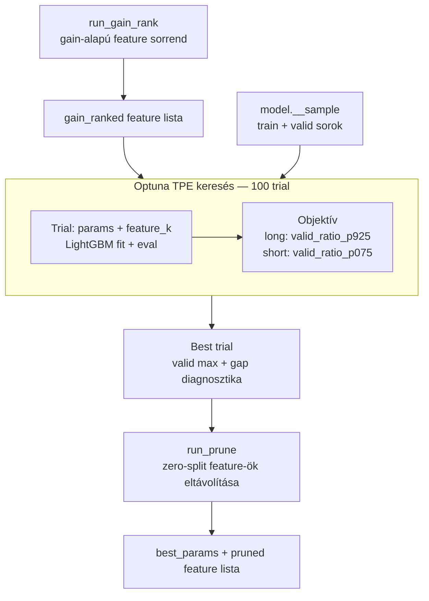
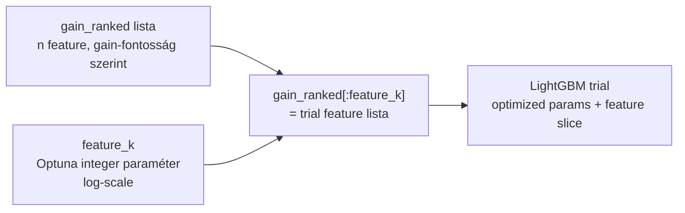
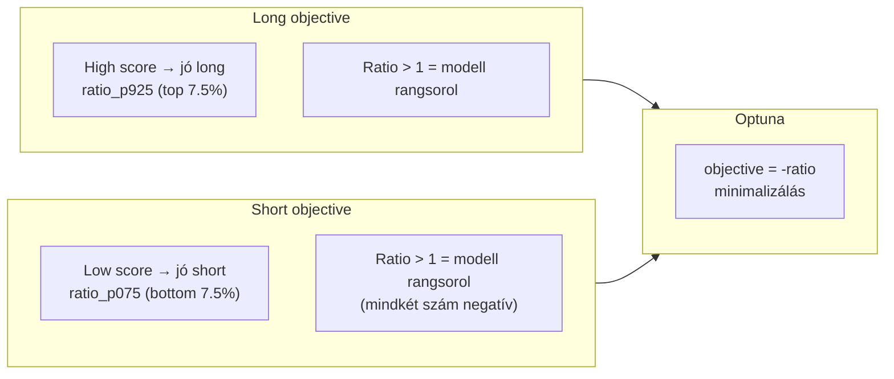

# 5000 — Hyperparameter Search

## Overview

A hyperparameter search célja nem az általános regressziós hiba minimalizálása, hanem annak megkeresése, hogy melyik LightGBM paraméter- és feature-kombináció közelíti legjobban a kereskedésképes lehetőségek rangsorát a valid perióduson.

Az aktív megközelítés: **joint feature + hyperparameter search** — a feature-szám (`feature_k`) is Optuna paraméter, nem fix.



**Időbeli szerkezet:**

```
2021-01                              2025-04  2025-05            2026-05
  │                                       │        │                  │
  │◄──────────── TRAIN (51 hónap) ───────►│        │◄── VALID (12 hó)─►│
  │  (audit diagnosztika, nem optimized)  │        │  (objective itt)  │
```

---

## Üzleti és módszertani háttér

### Miért kritikus ez a lépés?

A hyperparameter search dönti el, hogy a modell milyen komplexitású, milyen feature-halmazzal és milyen regularizációval tanít. Rossz objective esetén a kiválasztott konfiguráció laborban jónak tűnhet, de live környezetben nem az a tulajdonsága lesz optimális, amit a kereskedés megkíván.

### Miért joint search (feature_k + params egyszerre)?

A hagyományos hyperparameter search fix feature listán keresi a legjobb LightGBM konfigurációt. A probléma: a LightGBM-nek nincs L1-szerű mechanizmus, amely a feature-számot direkten büntetné. A `reg_alpha` és `reg_lambda` a levélértékeket regularizálják, nem a feature-számot.



Az optimizer egyszerre keres optimális paramétereket és optimális feature-számot. A log-scale `feature_k` favorizálja a kis K-t — a legtöbb próba a legfontosabb feature-öket foglal magában, amelyek a gain rank tetején vannak.

### Miért ezt a megközelítést?

| Megközelítés | Előny | Hátrány | Státusz |
|---|---|---|---|
| **Joint search (feature_k + params)** | Feature-szám és params egyszerre optimalizált; gain-rank jó prior | ~2× trial-idő nagy K-nál, mint kis K-nál | ✅ Aktív |
| Fix feature lista (összes selected) | Egyszerűbb | Nincs mechanizmus kevesebb feature felé; overfit a search-ben magas | Baseline / research |
| Gap penalty (λ > 0) | Közel nulla train-valid gap | Elveszi a modell komplexitását → discriminative power csökken | Kutatási opció — nem éles |
| Walk-forward CV | Több ablak → robusztusabb | Implementációs hiba (`_fold_split_walk_forward`); kivezetett | ❌ Kivezetett |
| Csak RMSE objective | Egyszerű | Gyenge top-decile rangsor | ❌ Elvetett |

---

## A Search Objective — Irányspecifikus Ratio

A trading stratégia csak a legmagasabb/legalacsonyabb score-ú jelzésekre kereskedik — az átlagos predikciós pontosság nem releváns, a top/bottom decile pontossága igen.

### Long irány — valid_ratio_p925

```
valid_ratio_p925 = mean(y_true | score >= p92.5) / mean(y_true)
```

A top 7.5% pontszámú bar átlagos MFE-je osztva az összes bar átlagával. Ratio > 1 azt jelenti, hogy a legmagasabb score-ú barok valóban jobb long MFE-t adnak — a modell képes rangsorolni a lehetőségeket.

### Short irány — valid_ratio_p075

```
valid_ratio_p075 = mean(y_true | score <= p7.5) / mean(y_true)
```

A bottom 7.5% pontszámú bar átlagos (negatív) MFE-je osztva az összes bar átlagával. Mivel mindkét szám negatív, ratio > 1 azt jelenti, hogy a legalacsonyabb score-ú barok szignifikánsan nagyobb (negatívabb) short MFE-t adnak — ezek a legjobb short belépési pontok.



**Miért ratio és nem RMSE?**

| Metrika | Mit optimalizál? | Kereskedési relevancia |
|---|---|---|
| RMSE | Átlagos predikciós hibát | Alacsony — az átlag nem a kereskedési döntés alapja |
| MAE | Átlagos abszolút hibát | Alacsony — ugyanaz a probléma |
| Top10 lift / ratio | Top/bottom decile minőségét | Magas — ez tükrözi a kereskedési szelektivitást |

---

## Gap Penalty és Best Trial Kiválasztás

### Gap penalty — aktív állapot

A `gap_penalty = 0.0` az éles konfiguráció. A gap penalty (λ > 0) kipróbált kutatási opció, de éles konfigurációban nem használt: a train-valid gap büntetése csökkentette a modell diszkriminatív erejét anélkül, hogy mérhetően javította volna a live stratégia teljesítményét.

| Konfig | Státusz | Indoklás |
|---|---|---|
| `gap_penalty = 0.0` | Aktív (éles) | Csak a valid lift számít |
| `gap_penalty > 0` (pl. λ=1.0) | Kutatási opció | Közelebb nulla gap, de gyengébb top-decile rangsor |

### Best trial kiválasztás

Az Optuna `objective_score = -ratio` értéket minimalizál. A best trial kiválasztás: az objective_score alapján rendezi a trial-okat (lower = better), és a top-5 közül azt választja, amelyiknél a train-valid gap minimális — ez diagnosztika, nem hard filter.

### Prune lépés

A best-params-szal fitelt modellnél néhány feature (a `feature_k`-on belül) lehet, hogy egyáltalán nem kap split-et — ténylegesen nem használt. A prune lépés ezeket eltávolítja, és a végső `pruned_joint` feature listát a training lépés veszi át.

---

## Paraméter alapértékek és indoklásuk

| Paraméter | Alapérték | Indoklás |
|---|---|---|
| Search engine | Optuna TPE | Strukturált keresés, prior trial-okból tanul; hatékonyabb véletlenes mintavételnél |
| `objective` | `quantile`, `alpha=0.925` | Aszimmetrikus loss: 9.25× érzékenyebb a top-tail barok alulbecslésére |
| `n_estimators` | `3000` (search) | Felső korlát; early stopping határozza meg a tényleges mélységet |
| `early_stopping_rounds` | `100` | Védi a trial-okat a felesleges túlfuttatástól |
| `feature_k` | Optuna integer, log-scale | Log-scale favorizálja a kis K-t; 3 az abszolút minimum |
| Max trial | `100` | Felső korlát; valid set overfitting elleni védelem |
| Search objective | `valid_ratio_p925` (long) / `valid_ratio_p075` (short) | Közvetlenül a strategy céljával összhangban |
| `gap_penalty` | `0.0` | Éles pipeline nem használ gap penalty-t |

### Ismert kockázatok és korlátok

| Kockázat | Tünet | Mitigáció |
|---|---|---|
| Valid set overfitting | Szép search score, gyenge out-of-sample stratégia | Max 100 trial; gain-rank prior a feature-sorrendhez |
| Feature drift | A gain_rank más rezsimben más sorrendet ad | Periodikus re-run; ha a best K jelentősen változik, modell re-train |
| Snapshotváltás | Más adatverzió ugyanahhoz a model_id-hoz | Registry link kötelező minden search futásnál |
| Gap penalty bekapcsolása tévesen | Discriminative power elvész | Kizárólag `gap_penalty = 0.0` az éles konfigurációban |

### Validációs checklist

- [ ] `run_gain_rank()` lefutott, `feature_set.json["gain_ranked"]` létezik
- [ ] `feature_selection="joint"`, `direction` a modell irányával konzisztens
- [ ] A valid periódus 2025-05-01 – 2026-05-31 (sampling config-gal összhangban)
- [ ] A search objective: long → `valid_ratio_p925`; short → `valid_ratio_p075`
- [ ] `gap_penalty = 0.0` — nincs gap büntetés az éles konfigurációban
- [ ] `run_prune()` lefutott, `pruned_joint` létezik a feature_set-ben
- [ ] A `best_params` és `search_best` artifact ugyanahhoz a search tag-hez tartozik
- [ ] A training lépés a `pruned_joint` feature listát és a megfelelő `search_tag`-et használja
