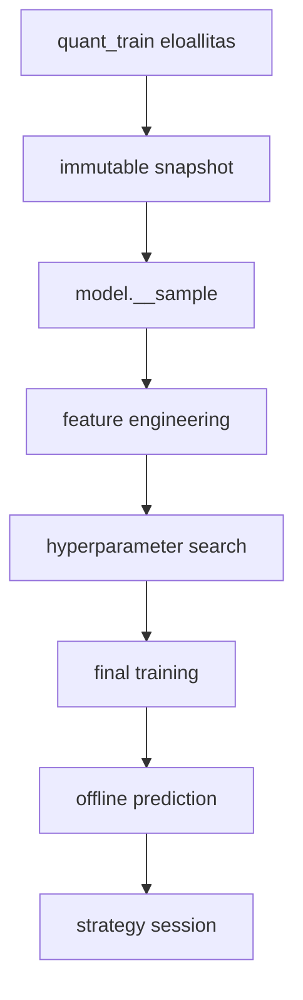

# 5000 - Modelling

A modelling domain celja, hogy a live adatfolyambol reprodukalhato modell-artifactok
es ugyanarra a snapshotra vonatkozo offline predikciok keszuljenek. Az aktiv
folyamat mar nem a regi, kozvetlen `quant_train`-centrikus utvonalra epul, hanem
egy snapshot-alapu, registryvel kovetett pipeline-ra.

## Domain attekintes

A lenyegi valtas az, hogy a reprodukalhatosag horgonya a snapshot lett. A minta,
a feature-szelekcio, a keresesi eredmeny, a vegso modell es az offline predikcio
mind ugyanahhoz a befagyasztott adathalmazhoz kotodik.

## Uzleti es modszertani rationale

A projektben a modellezes nem pusztan score-generalas, hanem ellenorizheto
eloallitas: barmely modellrol vissza kell tudni mondani, melyik snapshotbol
tanult, milyen feature-listat hasznalt, milyen keresesi szabaly alapjan lett
kivalasztva, es milyen teljes snapshot-tartomanyon adott predikciot.

Ezert a domain ket kerdesre ad valaszt:

1. Hogyan lesz a valtozo live adatbol stabil fejlesztesi alap?
2. Hogyan lehet a kutatasi lepest ugy vegigvinni, hogy a strategy es a trading
   mar ugyanarra az adat-szerzodesre tamaszkodjon?

## Alfejezetek

| Fajl | Szerep | Statusz |
|------|--------|---------|
| [5400_sampling.md](5400_sampling.md) | Aktiv sampling metodika: snapshot-native, walk-forward, orankenti mintavalasztas | aktiv |
| [5500_hyper_param_search.md](5500_hyper_param_search.md) | LightGBM hiperparameter-kereses, Top10 Lift objective | aktiv |
| [5600_model_training.md](5600_model_training.md) | Vegso fit, refit-all logika, artifact-szerzodes | aktiv |
| [5700_offline_prediction.md](5700_offline_prediction.md) | Teljes snapshot score-olasa kulon predikcios tablaba | aktiv |
| [5010_sampling_yearly.md](5010_sampling_yearly.md) | Retired yearly/random-week sampling megkozelites | legacy |

## Kereszt-domain elvek

- A snapshot az egyetlen modszertani horgony. Ha a snapshot valtozik, uj modell
  csaladrol beszelunk.
- A feature-szelekcio logikai, nem fizikai. A feature-set azonosito es a
  `selected` lista a leirando dontes, nem egy masolatban letrehozott tabla.
- A keresesi, training es predikcios lepest kulon tartjuk. Ettol lesz a pipeline
  debuggolhato es ujrafuttathato.
- A strategy domain csak olyan modellre epulhet, amely mar vegigment a
  `sample -> feature_engineering -> search -> train -> predict` lanc teljes
  szerzodesen.

## Ismert gyenge pontok

- A `quant_train` tovabbra is fontos upstream staging tabla, de mar nem az aktiv
  modellfogyasztasi felulet. A snapshot az egyetlen reprodukalhatosagi horgony.
- A feature engineering a notebookon belul tovabbra is `quant_train` nevu
  munkatablan fut, de ez mar az adott `snap ⋈ model.__sample` join lokalis
  materializacioja, nem egy teljes idoszeletre vagott altalanos tabla.
- A strategy optimalizacio jelenleg same-window modban tortenik, tehat a strategy
  riportok nem fuggetlen holdout-bizonyitekok.

## Sample-scope döntés és pipeline invariánsok

Az aktív pipeline egyetlen, jól definiált adat-szerződésen alapul: a `snap ⋈ model.__sample`
INNER JOIN az egyetlen érvényes kapu a modell-fejlesztési lépések (FE, search, train) felé.
Az alábbi invariánsok és döntések ennek a módszertani hátterét adják.

### A vs B döntés: miért a sorpontos INNER JOIN, nem az időablakos szűkítés?

| Megközelítés | Mit jelent | Előny | Hátrány | Státusz |
|---|---|---|---|---|
| **A — snap ⋈ model.__sample INNER JOIN** | FE, search, train pontosan azokat a sorokat látja, amelyeket a sampling kiválasztott | Row-exact match: nincs extra vagy hiányzó sor a downstream lépésekben | Explicit JOIN, nem triviális | **Választott** |
| **B — MIN/MAX(open_time) alapú időablak-szűkítés** | A sample időtartományából leolvasott legkorábbi és legkésőbbi időpont alapján az összes percet beereszti | Egyszerűbb SQL | Az óránkénti mintavétel nem konzisztens időablakon belüli sűrűséggel — B minden percet beereszt, ami soha nem volt a sample-ben | Elvetett |

**A lényegi módszertani ok:** a sampling óránként egy determinisztikus percet választ ki. Az adott
óra többi 59 percét szándékosan kihagyjuk. Ha B megközelítéssel `MIN/MAX` időablakot
használnánk, beengednénk ezeket a kihagyott perceket — az FE, a search és a train olyan
sorokat is elemzne, amelyek sosem részei a modell tényleges fejlesztési mintájának.
Ez az I1-I2 invariáns megsértése lenne.

### I1-I7 invariánsok — módszertani szint

Az alábbi invariánsok az aktív pipeline reprodukálhatóságát és integritását biztosítják.
A kód-szintű implementáció részletei a kód-referencia zónában találhatók; itt a módszertani
indoklás kerül középpontba.

| ID | Invariáns neve | Mit garantál | Miért fontos |
|----|---------------|--------------|-------------|
| **I1** | Sample rowcount conservation (FE input) | A FE munkatábla pontosan annyi sort tartalmaz, mint a `model.__sample` | Ha az FE több sort lát, más adatot elemez, mint amire a modell tanul. Ha kevesebbet, a tanítási adatok egy részéhez nem létezik elemzett feature-minőség. |
| **I2** | Sample rowcount conservation (search/train) | A search és train lépés input-sora == `model.__sample` sora | Ellenkező esetben a hyperparameter-döntés és a final fit más adaton születik meg, mint amit a sampling definiált. |
| **I3** | Snapshot immutability | `snap."<snapshot_id>"` tartalma a létrehozás után soha nem változik | Ha a snapshot módosulna két pipeline-lépés között, a FE és a training különböző adatot olvasna — a reprodukálhatóság megtörne. |
| **I4** | Feature-scope konzisztencia | `feature_set.json["selected"]` == `features.json["features"]` == `reg.feature_sets.selected_cols` | A feature-kiválasztás döntése egyszer születik meg (FE lépésben), és azt a search, train és predict lépések változtatás nélkül öröklik. |
| **I5** | fold_id traceability | `model.__sample` tartalmaz `fold_id` (Int8) oszlopot | Nélküle a search nem tud validációs ablakokat definiálni → nem lehet megakadályozni az időbeli szivárgást a CV során. |
| **I6** | target_col rögzítése modellhez | Egy `model_id`-hez pontosan egy `target_name` tartozik | A long és short modellek különböző célváltozót optimalizálnak. Keveredés esetén a modell a téveset tanulja. |
| **I7** | Provenance traceability | `feature_set.json["provenance"]` tartalmaz `snapshot_id`, `sample_table`, `sample_rows`, `joined_rows`, `source_contract` | A pipeline minden lépése visszanyomozható forrásra. Nélküle nem megválaszolható: "ez a modell melyik adatból tanult?" |

### Provenance szerződés: miért szükséges a `source_contract` mező?

A `feature_set.json["provenance"]` blokk legfontosabb mezője a `source_contract: "snap ⋈ model.__sample"`.
Ez nem technikai részlet, hanem **módszertani nyilatkozat**: explicit deklarálja, hogy az FE lépés
a sorpontos INNER JOIN path-ot alkalmazta, nem időablakos szűkítést.

**Miért kell ez?**

- Egy jövőbeli FE futtatás — ha csak a kódra támaszkodna — nem tudná garantálni, hogy az előző
  futtatással azonos scope-ot alkalmazott. A `source_contract` egy olvasható és auditálható jel.
- A `sample_rows == joined_rows` összehasonlítás az I1 invariáns post-hoc verifikációja:
  a mező kitöltésekor ellenőrzött, hogy a materializáció nem vesztett és nem nyert sort.
- A strategy és a trading réteg (deploy-időben) az `artifacts/` mappából olvas. Ha kérdés merül
  fel ("mi volt az FE inputja?"), a provenance blokk egyetlen helyen válaszol.

### Predict step scope aszimmetria: miért a teljes snapshot?

A predict lépés szándékosan **eltér** az I1-I2 által megkövetelt sample-scope alól:
a `model."<model_id>__pred"` a teljes snapshot range összes barjára tartalmaz előrejelzést,
nem csak a sample soraira.

| Kérdés | Válasz |
|--------|--------|
| Miért kell a teljes snapshot range? | A strategy backtest és az offline kiértékelés minden historikus barhoz igényel score-t. Ha csak a sample sorokat score-olnánk, a predikciós idősor lyukas lenne. |
| Nem sérti ez a sample-scope elvét? | Nem. A sample-scope a *fejlesztési* fázisra vonatkozik (FE, search, train). A predict lépés már a *kész, befagyasztott* modellt alkalmazza — ez nem új tanítás, hanem inference. |
| Nem látja-e a modell "jövőbeli" adatot? | Nem. A predict step nem tanít, csak alkalmazza a `model.pkl`-t; a snapshot immutable, és a score-olt adatok mind korábbiak a modell training-cutoff-jánál. |

A predict step ezért a sample-scope és az I1-I2 invariánsok alól **tudatosan kivétel** —
ez a helyes viselkedés, és explicit dokumentált döntés, nem hiányosság.

---

## Validacios elvek

Az alábbi elvek a modellezési pipeline minden futtatására vonatkoznak.

- Minden aktív modellnek visszafejthető legyen a `snapshot_id`, `feature_set_id`
  és a search outputja.
- A sample, a training és a predict step ugyanarra a snapshotra mutasson.
- A modelling dokumentáció ne keverje az aktív és a legacy sampling fogalmakat.
- Az I1-I7 invariánsok teljesülése ellenőrzendő minden pipeline-futtatás után
  (rowcount match, snapshot hash, provenance blokk meglét).

Invariáns-vezérelt validáció részletes módszertani háttere: fenti "Sample-scope döntés
és pipeline invariánsok" szekció. Kód-referencia szintű implementáció:
→ [4100_quant_train.md](../database_and_code_doc/4100_quant_train.md)
